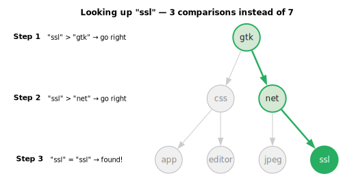
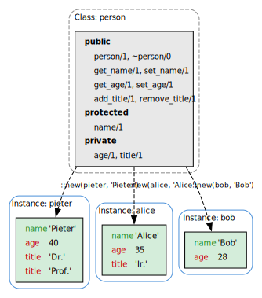
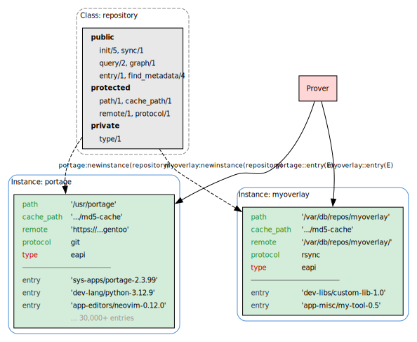

# Introduction

## The growing complexity of software

portage-ng is not a package manager.  It is a **reasoning engine** for
software configuration management at scale.

To understand why this distinction matters, consider operating systems as
examples of complex software systems.  An operating system is assembled from
thousands of interdependent components — libraries, compilers, language
runtimes, desktop environments, system services — each of which evolves
independently.  The challenge of keeping all those components working
together has grown dramatically over the past three decades, and the tools we
use to manage that challenge have had to evolve with it.

### Binary software distribution

In the earliest model — still the dominant one for distributions like
Debian, Red Hat, and Ubuntu — packages arrive as pre-built archives.  The
distribution maintainers compile each package, test it against a fixed set
of other packages, and ship the result.  The package manager's job is
essentially logistics: download the right set of archives and unpack them
into the filesystem.  Order barely matters; as long as every required archive
is present at the end, inter-package linkage is correct and the system
works.

This model is simple and reliable.  Because everyone receives the same
binaries, configurations are easy to reproduce, and commercial software
vendors can build and certify against a known, fixed set of packages.
The trade-off is that the user has little control: configuration choices
are made upstream, and customisation is limited to what the distribution
maintainers decided to provide.

### Source-based systems

Before Gentoo, installing software from source on Linux was a manual undertaking.
Projects like **Linux From Scratch** (started 1999) documented the process
step by step, but every command was the user's responsibility: download,
patch, configure, compile, install — by hand, for every package.

The **FreeBSD Ports** system (Jordan Hubbard, 1994) was the first to
automate source-based package management.  **Gentoo** (originally Enoch,
created by Daniel Robbins in 1999, inspired by FreeBSD Ports) brought this
idea to Linux.  Gentoo 1.0 (March 2002) was the first Linux distribution to
provide fully automated source-based package management as its primary mode
of operation.

In its early days, Gentoo targeted a single platform (IA-32) and the
dependency problem was tractable: the package manager walked the dependency
graph, figured out which packages needed compiling, ordered them, and built
them one by one.  Compiling from source meant binaries were optimised for the
exact hardware — no lowest-common-denominator builds — and the performance
advantage was real.

Tools like **Portage** navigated these dependency
graphs with an imperative, trial-and-error approach: try a combination,
detect conflicts, adjust, and try again.  For a single-platform distribution
with a moderately sized tree, this approach is adequate.

### From packages to knowledge

As Gentoo grew — thousands of packages, a dozen architectures, multiple
operating systems via **Gentoo Prefix** — simple graph traversal was no
longer sufficient.  Each package now has **build-time options** (USE flags)
that interact multiplicatively: different CPUs to target, different compilers
to use, different versions of those compilers, different optional feature
combinations.  The space of valid configurations is not merely large — it
is combinatorially vast, and every point in that space must be internally
consistent.

This is the **metadistribution** concept.  Gentoo does not distribute
binaries; it distributes **knowledge** — recipes (ebuilds) that describe
how to build every component of a system, and configuration parameters (USE
flags, keywords, profiles) that let the user tailor the result.  The word
"package manager" does not do justice to what this entails.  Putting
pre-built archives together is logistics.  Ensuring that thousands of
packages, across multiple platforms, with user-specified feature selections
and hardware constraints, form an internally consistent system — that is
**configuration management**, and it requires more than a graph traversal
algorithm.

Yesterday the system worked; today, after a routine update, it does not —
and the answer is buried somewhere in the interaction of thousands of
constraints across hundreds of packages.  A trial-and-error search loop
can tell you it *failed*, but not *why*.

### From searching to proving

Solving this problem requires more than a better search loop.  It requires
**reasoning** — the ability to derive consequences from rules, to detect
why a configuration is inconsistent, and to explain what must change to make
it consistent again.

portage-ng approaches the problem this way.  Instead of *searching* for a
plan, it *proves* one.  Every build plan portage-ng produces is a formal
proof — a Prolog term that records, for every package, which rule justified
its inclusion and under what constraints.  When no fully valid plan exists,
portage-ng does not give up: it makes explicit assumptions (flag changes,
keyword acceptance, unmasking), proves a plan under those assumptions, and
presents the assumptions as actionable suggestions.  The proof answers not
only "what should I install?" but also "why does this work?" — and when
something breaks, "what changed?"

### Declarative reasoning

This is inherently a task for **declarative reasoning**.  We do not want to
prescribe a fixed sequence of imperative steps; we want to state the rules
of the domain and let a reasoning engine derive the consequences.

Prolog — an **artificial intelligence** language built on exactly this
paradigm — is a natural fit.  You specify *what* solution to produce, not
*how* to produce it.  The runtime — unification, backtracking, and proof
search — figures out the "how."  Consider a trivial example:

```prolog
os(linux).
os(darwin).
```

```prolog
?- os(Choice).
Choice = linux ;
Choice = darwin.
```

Prolog **automatically** enumerates every valid binding for `Choice`.  This
built-in **backtracking** — the ability to systematically explore all
alternatives — is exactly what a configuration engine needs.  Traditional
Portage did not originally have backtracking at all; the retry mechanism it
acquired later is not designed to enumerate alternatives but to iteratively
refine a single solution by accumulating masks across restarts.  In Prolog,
backtracking over alternatives is not a bolt-on feature — it is a primitive
of the language.

The reasoning engine portage-ng implements is not inherently tied to
operating system management.  We have chosen Gentoo because it captures many
of the hardest sub-problems — figuring out the correct USE flag combinations
to satisfy user, system, and hardware constraints simultaneously; resolving
cyclic dependencies; managing co-installable slots — and any solution that
works for Gentoo generalises to simpler domains.  But the same proof-based
architecture could reason about any domain where entities have capabilities,
constraints, and dependencies — from cloud service composition to
event-driven automation to hardware design space exploration.  Gentoo is the
proving ground; the ideas are general.

While source-based configuration management systems like Portage are used by
thousands of developers and organisations, the formal concepts behind them —
constraint propagation, domain narrowing, proof construction — are understood
by only a handful of people.  portage-ng aims to push forward the state of
the art in this area and, by expressing the resolver as a set of logical
rules rather than an opaque imperative algorithm, to make its inner workings
more accessible and easier to reason about.

This chapter explains why Gentoo is the right domain, why Prolog is the
right language, and how portage-ng's proof-based architecture addresses the
problem at a level that imperative package managers cannot reach.


## Why Gentoo?

### The metadistribution concept

Most Linux distributions distribute **binaries** — fixed packages with fixed
configurations, tested together in a release cycle.  Gentoo distributes
**knowledge**: recipes (ebuilds) that describe how to build every component
of a complete system, and configuration parameters (USE flags, keywords,
profiles) that let the user tailor the result to their hardware and
requirements.

This is the **metadistribution** concept.  We no longer distribute the
output of a build process; we distribute the declarative specification of
the build process itself.  The word "package manager" does not do justice to
what this entails.  Putting pre-built packages together is logistics.
Ensuring that a complex, multi-dimensional configuration space is internally
consistent, constructing build plans to realise a chosen configuration, and
executing those plans with the right ordering and parallelism — that is
**configuration management**.

A single Portage tree contains roughly 32,000 ebuilds.  Each ebuild declares:

- **Dependencies** — what it needs at build time, run time, and post-install
- **Use flags** — optional features the user can enable or disable
- **Slots** — multiple versions that can coexist
- **Keywords** — which architectures the package is tested on
- **Use constraints** — restricting valid Use flag combinations

The number of valid configurations is combinatorially enormous.  This is not
a bug — it is the point.  Gentoo's power comes from this configurability.
But it also means that reasoning about Gentoo packages is reasoning about
a large, richly structured constraint space.

### Architectures and keywords

Gentoo was originally built for the IA-32 (x86) architecture.  As
contributors ported it to other platforms — PowerPC, ARM, SPARC, MIPS,
HPPA, and others, often available in 32-bit and 64-bit variants — the
project developed the **keyword** system to track per-architecture
stability.  An ebuild can be marked `amd64` (stable on x86-64), `~arm`
(testing on ARM), or carry no keyword for a given architecture (meaning it
has not been validated there at all).
Keywords turn architecture support into a first-class constraint in the
dependency graph: a package that is stable on one architecture may be
unstable or unavailable on another, and the resolver must respect those
boundaries.

Platforms beyond x86 Linux — such as BSD, Solaris, and others — were
handled as regular Gentoo targets with a different kernel and different
user-space libraries, using the same Portage machinery and ebuild format.
Google's **ChromeOS** is a prominent example of such a different platform
delivered and managed entirely by Portage: ChromiumOS maintains a fork of
Portage alongside Gentoo-derived overlay repositories (`portage-stable` for
unmodified upstream ebuilds, `chromiumos-overlay` for Google-specific
packages), and changes flow back to upstream Gentoo regularly.

The **Gentoo Prefix** project (an outgrowth of the Gentoo for Mac OS X
effort) addressed a different challenge: installation *within* a pre-built
operating system where root binaries cannot be modified.  On platforms like
Mac OS X, Prefix installs Portage and all packages into a user-defined
offset directory rather than the filesystem root, allowing a full
Gentoo-managed software stack to coexist with the host system.

### Real-world adoption

Gentoo's approach to source-based configuration management has been adopted
well beyond the Gentoo community:

- **ChromiumOS / ChromeOS** (Google).  ChromiumOS is the open-source project;
  ChromeOS is Google's proprietary product shipped on Chromebooks.  Both are
  built using Gentoo's Portage, with overlay repositories
  (`portage-stable` for unmodified upstream ebuilds, `chromiumos-overlay` for
  Google-specific packages).  In 2025, Google confirmed that ChromeOS and
  Android are merging into a unified platform (codenamed "Aluminium") for
  2026, with Android's kernel as the foundation and ChromeOS's desktop
  interface layered on top.

- **Container Linux** (CoreOS, later Flatcar).  CoreOS Container Linux — a
  lightweight, container-optimized operating system designed for cloud
  infrastructure — was built on Gentoo foundations, using Portage and ebuilds
  for its build system.  After CoreOS was discontinued in 2020, **Flatcar
  Container Linux** continued the Gentoo-based lineage and is deployed at
  scale by organisations including Adobe (18,000+ nodes), Equinix, and
  numerous managed Kubernetes providers.

These adoptions are not cosmetic.  ChromeOS and Flatcar use the same ebuild
format, the same Portage dependency resolver, and the same overlay
architecture as upstream Gentoo.  The fact that this machinery scales from a
single developer's workstation to tens of thousands of production nodes is
evidence that Gentoo represents state-of-the-art practice in large-scale
software configuration management.

### Reasoning about software at scale

When you ask "can I install Firefox with Wayland support on this machine?",
you are really asking: "does there exist a consistent assignment of package
versions, USE flags, and slot choices across my entire dependency graph such
that all constraints are satisfied?"  That is a **satisfiability problem**
over a structured domain.

portage-ng treats the Portage tree as what it truly is: a **declarative
knowledge base**.  Ebuilds are not build scripts to execute — they are
propositions with preconditions.  Dependencies are not edges in a graph to
traverse — they are logical implications to prove.  Configuration choices are
not switches to flip — they are constraints to satisfy.

This shift in perspective — from "searching for a working set of packages"
to "proving that a consistent configuration exists" — is what makes
portage-ng fundamentally different from Portage, Paludis, and pkgcore —
the three existing package managers that operate on the same ebuild base.


## A Prolog primer

If you have never used Prolog, this section gives you enough to follow the
rest of the book.  If you already know Prolog, skip to
[Why Prolog?](#why-prolog).

### Facts and rules

Prolog programs are built from **facts** and **rules**.  A fact states
something that is true:

```prolog
requires(browser, graphics).
requires(browser, networking).
requires(graphics, fonts).
```

This says: a browser requires graphics and networking; graphics requires
fonts.  Each line is a fact — something the system knows to be true.

A **rule** says something is true *if* certain conditions hold:

```prolog
needs(X, Y) :- requires(X, Y).
needs(X, Y) :- requires(X, Z), needs(Z, Y).
```

Read `:-` as "if."  The first clause says: X needs Y if X directly requires
Y.  The second says: X needs Y if X requires some intermediate Z, and Z in
turn needs Y.  Together, these two lines define transitive dependency — if
the browser requires graphics and graphics requires fonts, then the browser
needs fonts.

### Queries and unification

You ask Prolog questions by posing **queries**.  Prolog answers by finding
values that make the query true:

```prolog
?- needs(browser, What).
What = graphics ;
What = networking ;
What = fonts.
```

Prolog found everything the browser transitively needs.  It did this through
**unification** — matching the variable `What` against terms in the database
— and **backtracking** — systematically trying every possibility.

Unification is more powerful than pattern matching.  Two terms unify if there
exists a substitution that makes them identical:

```prolog
?- package(Name, stable) = package(editor, Status).
Name = editor, Status = stable.
```

Prolog figured out that `Name` must be `editor` and `Status` must be
`stable` for both sides to match.  This works in both directions — Prolog
does not distinguish between "input" and "output" arguments.

### Backtracking

When a Prolog query has multiple solutions, the runtime explores them
through **backtracking**.  Consider:

```prolog
color(red).
color(green).
color(blue).

?- color(X).
X = red ;
X = green ;
X = blue.
```

Each `;` triggers backtracking: Prolog undoes its last choice and tries
the next alternative.  This search is built into the language — you do not
write a search loop.

### Compound terms

Prolog terms can be nested, forming structured data without defining classes
or schemas.  For example, a package entry might look like:

```prolog
package(editor, version(2, 4, 1), [unicode, spellcheck]).
```

This single term captures a package name, a structured version, and a list
of enabled features.  Because Prolog comparison (`compare/3`) works
structurally on compound terms, two versions can be compared directly —
no custom comparator needed.  portage-ng uses compound terms extensively to
represent versions, dependencies, and proof entries.

### Lists and association lists

Prolog lists are linked lists built from `[Head|Tail]`:

```prolog
?- [a, b, c] = [H|T].
H = a, T = [b, c].
```

Looking up a value in a plain list requires walking it from head to tail —
O(n) in the worst case.  When a proof tree contains thousands of entries,
this becomes a bottleneck.

SWI-Prolog provides **association lists** (AVL trees) via `library(assoc)`
as an efficient alternative.  An AVL tree is a self-balancing binary search
tree: keys are kept in order, and the tree is rebalanced after every
insertion so that no branch is more than one level deeper than its sibling.

To find a key, we do not scan every element.  Instead, we compare the
target with the current node and follow the appropriate branch — left if the
target is smaller, right if it is larger.  The following diagram shows how
looking up "ssl" in a tree of seven entries requires only three comparisons:



Because the tree stays balanced, every lookup follows a single path from
root to leaf.  The length of that path is at most log₂(n) — with 10,000
entries, an AVL lookup visits at most 14 nodes instead of scanning all
10,000.

portage-ng uses association lists extensively — for the proof, the model,
the trigger set, and the constraint store:

```prolog
?- empty_assoc(E),
   put_assoc(editor, E, installed, A1),
   put_assoc(browser, A1, pending, A2),
   get_assoc(editor, A2, Status).
Status = installed.
```

All operations (`get_assoc`, `put_assoc`) are O(log n), which makes them
practical for the data structures at the heart of the prover.

### Definite Clause Grammars

When portage-ng reads a package's dependency specification, it needs to
parse structured text like `>=dev-libs/openssl-1.1:0=` into Prolog terms
the prover can reason about.  In most languages, writing a parser means
writing imperative code — loops, state machines, error handling.  In Prolog,
you can write the grammar itself as a program.

A **DCG** (Definite Clause Grammar) lets you describe what valid input looks
like, declaratively.  Prolog takes care of matching the input against the
grammar rules.  For example, a simple grammar for a greeting:

```prolog
greeting --> [hello], name.
name --> [world].
name --> [prolog].
```

This reads naturally: "a greeting is the word `hello` followed by a name;
a name is either `world` or `prolog`."  To check whether a sequence matches:

```prolog
?- phrase(greeting, [hello, world]).
true.

?- phrase(greeting, [hello, cat]).
false.
```

The grammar *is* the parser — there is no separate parsing step.  portage-ng
uses DCGs to parse the **EAPI** (Ebuild API) dependency specification
language — EAPI is the versioned interface that defines the syntax and
semantics of Gentoo's ebuild format, including version ranges, Use
conditionals, slot operators, and choice groups.  The result is a parser
that reads like a specification of the language it accepts, making it easier
to verify, extend, and maintain.

### Meta-programming

One of Prolog's most distinctive features is that programs and data are made
of the same material: **terms**.  A rule like `requires(browser, graphics)`
is not just an instruction — it is a data structure that a program can
inspect, build, and pass around.  This blurs the line between "the program"
and "the data it operates on" in a way that is natural in Prolog but
awkward in most other languages.

Why does this matter for portage-ng?  Because the prover does not just
compute a plan — it builds a **proof** that explains why the plan is
correct.  As the prover works, it constructs a term that records every
decision:

```prolog
proof(browser, [
  rule(requires(browser, graphics), [
    proof(graphics, [
      rule(requires(graphics, fonts), [
        proof(fonts, [fact])
      ])
    ])
  ])
]).
```

This proof term says: "the browser is in the plan because it requires
graphics, which is in the plan because it requires fonts, which is a
base fact."  The proof is not a side effect or a log — it is a first-class
Prolog term that can be queried, compared, and transformed like any other
data.

The same principle applies to assumptions.  When the prover cannot satisfy
a dependency without, say, accepting a testing keyword, it records that
assumption as a term inside the proof:

```prolog
assumed(accept_keywords('~amd64', graphics))
```

At the end, portage-ng can walk the proof, collect all assumptions, and
present them to the user as actionable suggestions — precisely because
assumptions are data, not scattered side effects.

This capability is called **reification**: turning the process of reasoning
into data that can itself be reasoned about.  It is what makes the "every
plan is a proof" architecture natural in Prolog.


## Why Prolog?

Now that you have seen the basics, here is why Prolog is not just a possible
implementation language but the *right* one for building a reasoning engine
for software configuration management.

### The primitives match the problem

A reasoning engine for configuration management needs a small set of core
operations.  In Prolog, these operations are built-in primitives rather than
library code:

| **Reasoning need** | **Prolog primitive** |
|:---|:---|
| Configuration rules | Horn clauses |
| Structured data | Compound terms |
| Search with backtracking | Built-in backward chaining with backtracking |
| Constraint propagation | Unification and association lists |
| Specification grammar | Definite Clause Grammars |
| Proof construction | Terms as data (reification) |
| Meta-programming | Runtime assertion and introspection |

Imperative package managers must re-implement all of these.  Portage's
`depgraph.py` implements its own retry loop with mask accumulation.
Paludis's `decider.cc` implements its own constraint accumulator with
exception-driven restart.  Both re-invent mechanisms that Prolog provides
as proven primitives.  By relying on these primitives, the codebase becomes
easier to read and understand — developers can focus fully on declaring
domain knowledge rather than maintaining search and backtracking machinery.

### Meta-level reasoning

Beyond the primitives, Prolog enables **meta-level reasoning** — the ability
to reason about the reasoning process itself.  For a configuration
management engine, this is the decisive advantage.

**Reifying assumptions.**  When the prover cannot satisfy a dependency, it
does not throw an error.  It records an assumption as a first-class term in
the proof tree.  The assumption carries structured metadata: why it was made,
what alternatives were tried, and what the user can do about it.  This is
natural in Prolog because proofs are data.

Consider what happens when a package requires a keyword that is not accepted.
An imperative resolver would either fail or silently accept the keyword.
portage-ng records:

```prolog
rule(assumed(portage://dev-libs/foo-1.0:merge), [])
```

This assumption appears in the proof, flows through the planner, and is
presented to the user as: "I assumed dev-libs/foo-1.0 could be merged.
To make this work, I will add it for you to package.accept_keywords."

**Inspecting proof trees.**  The explainer module queries the proof AVL to
answer "why is this package in the plan?" without re-running the resolver.
In an imperative resolver, this would require instrumenting the search loop
with logging and replaying it.

**Learning from failures.**  When a proof attempt fails, the prover extracts
a learned constraint — a narrowed version domain — from the failure and
carries it into the next attempt.  This is analogous to CDCL (Conflict-Driven
Clause Learning) in SAT solvers, but expressed as Prolog term manipulation
rather than boolean clause generation.

### Declarative vs. imperative

The difference is not just stylistic.  A declarative specification of
configuration rules is:

- **Auditable** — the rules can be read as logical statements
- **Testable** — individual rules can be queried in isolation
- **Extensible** — adding a new dependency type means adding clauses, not
  modifying control flow

In portage-ng, the entire EAPI specification — hundreds of pages of the
PMS (Package Manager Specification, the formal document that defines how
Gentoo ebuilds, dependencies, USE flags, slots, and all related metadata
must be interpreted) — is captured in a set of DCG grammar rules and
Prolog clauses.  When EAPI 9
added new features, the implementation required adding new grammar rules
and clauses.  The reasoning engine — prover, planner, and scheduler — did
not change at all, because it is domain-agnostic.

### Beyond pure Prolog

Prolog's strengths — backtracking, unification, reification — provide the
foundation, but building a large-scale reasoning engine also requires
structure that pure Prolog does not offer out of the box.  portage-ng
extends standard Prolog with two mechanisms: **feature terms** for carrying
structured metadata through proofs, and **contexts** for organising code
into encapsulated, independently stateful components.


### Feature logic and feature terms

In classical logic programming, a term is either an atom, a variable, or a
compound.  That is enough for simple reasoning, but when the prover needs to
carry *configuration alongside identity* — "this package, with these USE
flags, in this slot, at this proof depth" — a flat compound quickly becomes
unwieldy.  Feature logic, originally developed by Hassan Aït-Kaci and others
for computational linguistics, offers a cleaner model: a **feature term** is
a structured record of named attributes (features) whose values may
themselves be feature terms.  Two feature terms can be **unified** (merged)
non-destructively, combining their information while checking for
consistency.

Andreas Zeller applied feature logic directly to software configuration
management, showing that features and feature unification provide a natural
formalism for describing and merging software configurations — capturing
version selections, build options, and platform constraints as feature terms
rather than ad-hoc data structures.  portage-ng builds on this insight:
USE flags, slot constraints, version domains, and proof context are all
represented as feature terms that the prover unifies as it expands the
dependency graph.

portage-ng uses the `?{}` notation to attach a feature term to any literal.
The syntax reads as "this literal, *qualified by* these features":

```prolog
portage://app-editors/neovim-0.12.0:run?{[]}
```

Here the feature term `{[]}` is empty — no additional constraints beyond the
literal itself.  As the prover expands dependencies and resolves USE flags,
the feature term accumulates information:

```prolog
portage://app-editors/neovim-0.12.0:run?{[nvimpager, naf(test)]}
```

The feature term `{[nvimpager, naf(test)]}` records that the `nvimpager` USE
flag is enabled and `test` is disabled (`naf` stands for "negation as
failure" — the standard logic-programming notation for default negation).

Feature unification is the operation that merges two feature terms.  When the
prover encounters the same package from two different dependency paths, each
carrying its own feature term, unification combines them:

- **Plain items** (like USE flags) are collected by union.
- **Constrained sets** `{L}` use intersection semantics — both paths must agree.
- **Keyed values** (`feature:value` pairs) are unified recursively.
- If a term and its negation (`naf(X)` vs. `X`) both appear, unification
  **fails** — this signals a genuine conflict in the dependency graph.

This mechanism is domain-agnostic: the unifier (`Source/Logic/unify.pl`) does
not mention USE flags, slots, or ebuilds.  It operates on abstract feature
terms.  The Gentoo domain layer maps USE flags, slot constraints, and version
domains onto feature terms; the unifier simply merges them.  A domain hook
(`feature_unification:val_hook/3`) allows domain-specific value types (e.g.
version domain intersection) to participate in unification without modifying
the core.

The result is that every literal in a proof carries a complete, machine-readable
description of its resolved configuration.  The planner and printer can read
this directly — there is no need to re-derive "which USE flags were active"
after the fact.


### Contextual object-oriented programming

Prolog operates under the **closed-world assumption**: what cannot be
derived from the program is considered false.  In practice, this means that
reasoning about a predicate requires visibility of *all* its clauses —
the program is treated as a complete description of the world.  For a
small program this is manageable, but in a system with tens of thousands
of packages, dozens of repositories, and overlapping configurations, the
"world" becomes very large.  Not all of it is relevant to every question.

Context-based reasoning addresses this directly: it partitions the closed
world into **scoped contexts**, each carrying only the facts and rules that
are relevant to a particular component.  When reasoning about a repository,
only that repository's entries, configuration, and constraints are in scope.
The closed-world assumption still holds — but within a well-defined boundary,
making reasoning both tractable and modular.

Standard Prolog module systems offer some namespacing, but they were
designed for library organisation, not for modelling independent entities
that each carry their own state, rules, and encapsulation boundaries.
We need a way for each component to have its own context — its own facts,
its own rules — with explicit declarations of what is public interface
and what is private implementation.  Different repositories and different
configurations must be able to coexist without interfering with each
other's reasoning.

In the object-oriented world, this problem was solved long ago with
encapsulation and access control.  The challenge is bringing those
organisational benefits to Prolog without sacrificing its declarative nature.
The rules inside a context must remain ordinary logical clauses — directly
translatable into traditional logic — while the context system provides the
structure around them.

portage-ng needed object-oriented style programming — classes,
instances, encapsulation, access control — but at **runtime**, because
repositories and configurations are discovered and instantiated at
startup, not known at compile time.  No existing Prolog library provided
this.  **Logtalk**, the best-known approach to object-oriented logic
programming, works by compile-time translation: source files are
transformed into plain Prolog before execution.  That model does not
fit a system that creates and composes objects dynamically.

So portage-ng implements its own runtime object system called **context**
(implemented in `context.pl`).  The syntax is deliberately Logtalk-like
— `::-` for method clauses, `::` for message sends, `dpublic`,
`dprotected`, `dprivate` for access control — but the underlying
mechanism is entirely different: contexts are created, cloned, and
composed at runtime through Prolog’s own assert/retract machinery.
There is no compilation step and no source-to-source transformation.

To illustrate, here is a simplified example of a `person` context:

```prolog
:- module(person, []).
:- class.

:- dpublic([person/1, '~person'/0]).
:- dpublic([get_name/1, set_name/1]).
:- dpublic([get_age/1, set_age/1]).
:- dpublic([add_title/1, remove_title/1]).
:- dprivate(age/1).
:- dprivate(title/1).
:- dprotected(name/1).

person(Name) ::-
  :set_name(Name).

'~person' ::-
  :this(Context),
  write('Person destructor - '), write(Context), nl.

get_name(Name) ::-
  ::name(Name).

set_name(Name) ::-
  <=name(Name).

set_age(Age) ::-
  <=age(Age).

add_title(Title) ::-
  <+title(Title).

remove_title(Title) ::-
  <-title(Title).

age(Age) ::-
  number(Age), Age > 0.
```

Several things are worth noting.  The `:- class` directive declares that
this module defines a context class.  The `dpublic`, `dprotected`, and
`dprivate` directives specify access control — just like in classical OO,
public predicates can be called by anyone, protected predicates only by the
class and its descendants, and private predicates only within the class
itself.  The constructor `person/1` initialises the instance by setting its
name; the destructor `~person` is called when the instance is destroyed.
The `::-` operator (instead of Prolog's standard `:-`) marks instance
methods: their clauses are guarded at runtime so that each instance operates
on its own state.  The `::` prefix reads instance data, `<=` assigns it
(replacing any previous value), `<+` adds a fact to the instance, and `<-`
removes one — as shown by `add_title` and `remove_title`, which allow a
person to accumulate multiple titles.  The `:` prefix calls other methods
on the same instance.

Using this class is straightforward:

```prolog
?- pieter:newinstance(person).
true.

?- pieter:person('Pieter').
true.

?- pieter:set_age(40).
true.

?- pieter:add_title('Dr.').
true.

?- pieter:add_title('Prof.').
true.

?- pieter:get_age(Age).
Age = 40.

?- pieter:get_title(Title).
Title = 'Dr.' ;
Title = 'Prof.'.
```

The `newinstance` call creates an instance named `pieter` from the
`person` class, and the constructor is invoked with `pieter:person('Pieter')`.
From that point on, `pieter` is a live context with its own state.
Setting the age and adding titles modifies that instance's private data.
Querying titles backtracks over all titles that were added — this is
Prolog's backtracking working naturally within the context system.



Each instance carries its own state: `pieter` has two titles and age 40,
`alice` has one title and age 35, `bob` has no titles and age 28.  The
class defines the shape; each instance fills it independently.

In portage-ng, repositories are context objects: each has a name, a set of
entries, and operations like `sync`, `graph`, and `query` that are dispatched
through the context.  The prover does not need to know which repository it
is reasoning about — it receives a context and operates through it.



The `repository` class defines the interface — `init`, `sync`, `entry`,
`query` — while each instance holds its own path, protocol, and entries.
The prover queries `portage:entry(E)` and `myoverlay:entry(E)` through
the same module-qualified call; the context system dispatches each call
to the right instance's private data.

This approach brings encapsulation, polymorphism, and modularity to Prolog
while preserving its declarative core.  The rules inside a context are
ordinary Prolog clauses; the context system simply controls visibility and
dispatches calls to the right instance.  The full design is covered in
chapters 19 and 20.


### Feature logic meets contextual logic

There is a natural synergy between feature logic and contextual logic
programming that is worth noting.  A context — with its named attributes,
access control levels, and instance-specific state — can be viewed as a
special kind of feature term: a structured record of features (name, age,
title, path, protocol, ...) augmented with meta-level annotations
(public, protected, private) that control which features are visible to
which parts of the program.  Conversely, feature unification can be seen
as a restricted form of context composition: merging two feature terms is
analogous to combining two contexts, with consistency checking playing the
role of access control.

This perspective suggests that feature logic and contextual logic
programming are two views of the same underlying formalism — one
emphasising data (feature terms as structured records) and the other
emphasising behaviour (contexts as encapsulated reasoning units).  A
unified framework that captures both would be a natural extension: feature
terms with access-controlled attributes, or contexts whose state is
described and merged via feature unification.  This remains an open area
for further exploration.


### Pengines: contexts over the network

SWI-Prolog provides **Pengines** (Prolog Engines) — lightweight, sandboxed
Prolog instances that can be created, queried, and destroyed over HTTP.
Each Pengine is an isolated reasoning environment with its own clause
store, running inside a host server process.  Clients on remote machines
can create a Pengine, send it a query, and receive results — all over a
standard HTTPS connection.

The connection to contextual logic programming is direct: a Pengine is,
in essence, a **remote context**.  Just as a local context encapsulates
its own state and exposes a public interface, a Pengine encapsulates a
Prolog environment and exposes it over the network.  The access control
that contexts provide locally (public, protected, private) is mirrored by
the Pengine sandbox, which restricts which predicates the remote client
may call.

portage-ng uses Pengines in its server mode.  The server hosts the
knowledge base and exposes it through a Pengine application: clients and
workers create Pengines on the server, submit proving goals, and receive
plan results — all without needing a local copy of the knowledge base.
From the client's perspective, the interaction looks like a local Prolog
query; the network transport is transparent.  This is what makes
client–server mode practical for embedded and resource-constrained
devices: the full reasoning context lives on the server, and the client
merely drives it.


## The "every plan is a proof" philosophy

These ideas come together in portage-ng's central insight: a build plan
should not be the output of a search algorithm that happens to terminate.
It should be a **proof object** — a term that records, for every package,
which rule justified its inclusion and under what constraints.

This gives three properties that traditional resolvers lack:

1. **Completeness.**  If a valid plan exists, the prover finds it.  If no
   valid plan exists, the prover completes with explicit assumptions that
   document exactly where the specification is unsatisfiable.

2. **Explainability.**  Every package in the plan can be traced back through
   the proof tree to the user's original target.  "Why is this package here?"
   is answered by inspecting the proof, not by re-running the resolver.

3. **Reproducibility.**  The proof is a first-class Prolog term.  Given the
   same Portage tree, VDB, and configuration, the same proof is produced
   every time.


## How portage-ng relates to other resolvers

portage-ng is not a rewrite of Portage in Prolog.  It is a fundamentally
different approach to the same problem:

| | **Portage** | **Paludis** | **pkgcore** | **portage-ng** |
|:---|:---|:---|:---|:---|
| **Language** | Python | C++ | Python | SWI-Prolog |
| **Model** | Greedy graph + retry | Constraint accumulator + restart | Same as Portage | Inductive proof search |
| **Conflicts** | Retries with mask accumulation | Restarts with fresh state | Same as Portage | Iterative refinement with learned domains |
| **Completeness** | Sometimes fails | May exhaust restarts | Sometimes fails | Always produces a plan |
| **Guarantees** | None | None | None | Every plan is a proof |

For a detailed comparison of the reasoning models, see
[Chapter 21: Resolver Comparison](21-doc-resolver-comparison.md).


## A brief history

The author's involvement with Gentoo began in 2002 as the founder of the
first architecture port — PowerPC.  That work contributed to the
keyword system described above and to expanding the range of platforms where
Gentoo could run.  In 2003, a formal top-level
management structure was implemented for the Gentoo project
([GLEP 4](https://www.gentoo.org/glep/glep-0004.html)).  Under this
structure, the author served as a senior manager for Gentoo with both strategic and
operational responsibility for three areas: Gentoo on alternative operating
systems and LiveCD technology, developer tools, and package manager research
(Portage).  That
experience — porting across architectures, managing the resulting
configuration complexity, and researching the limits of Portage's imperative
resolver — motivated the portage-ng project.

portage-ng began in 2005 as an experiment in applying logic programming to
software configuration management.  The initial question was simple: could
Prolog's built-in search and backtracking replace the hand-written solver in
Portage?

The answer turned out to be deeper than expected.  Prolog did not just
replace the solver — it changed what was possible.  The ability to reify
proofs meant build plans became inspectable objects.  The ability to record
assumptions meant the resolver never had to give up.  The ability to parse
grammars with DCGs meant the EAPI specification could be expressed directly
as code.

Over two decades of development, portage-ng has evolved
from a proof-of-concept into a full-featured configuration management
front-end with PMS 9 / EAPI 9 compliance, distributed proving, LLM-assisted
plan explanation, and measured correctness against Portage across the entire
Gentoo tree.


## Further reading

- [Chapter 2: Installation and Quick Start](02-doc-installation.md) — getting
  portage-ng running on your machine
- [Chapter 4: Architecture Overview](04-doc-architecture.md) — how the six
  pipeline stages fit together
- [Chapter 8: The Prover](08-doc-prover.md) — the inductive proof engine in
  detail
- [Chapter 21: Resolver Comparison](21-doc-resolver-comparison.md) — deep dive
  into how portage-ng compares with Portage, Paludis, and pkgcore