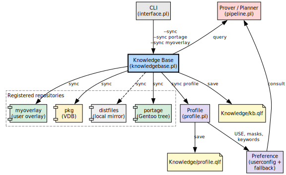
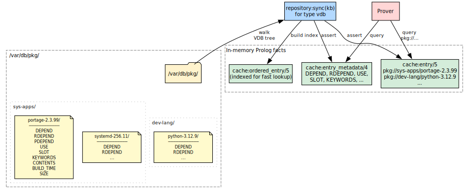
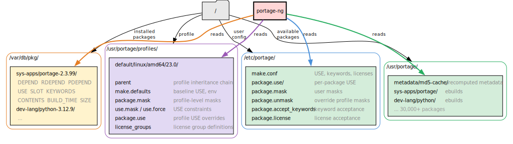

# Configuration

Dependency resolution only makes sense in *your* environment: which profile you use, which USE flags you set, which packages are already on disk, and which extra trees you layered on top of Gentoo. portage-ng is designed so you do not pay a “migration tax” to express any of that. It reads the same files and databases as traditional Portage.

Configuration, in this chapter’s sense, is the act of **telling portage-ng where your machine keeps that truth** (paths, repositories, profile strategy) and **which Gentoo-side files to honour**—so the prover plans against the world you actually run, not a generic default.

This chapter starts with the central configuration file (`config.pl`), then shows how to register repositories and sync them into the knowledge base, and finally covers the `/etc/portage/` files that control policy (USE flags, masks, keywords).

## The configuration file

The central configuration file is `Source/config.pl`.  It is a plain Prolog source file — every setting is a Prolog fact or rule that you can read, query, or override.  The file is organised into logical sections; the most important ones for getting started are summarised below.

### General

| **Setting** | **Default** | **Purpose** |
|:---|:---|:---|
| `config:name/1` | `'portage-ng-dev'` | Program name shown in banners and logs. |
| `config:hostname/1` | (auto-detected) | Current hostname, used to select per-machine configuration. |
| `config:installation_dir/1` | (from Prolog flag) | Root of the portage-ng source tree.  The knowledge base, certificates, and config files are resolved relative to this path. |
| `config:number_of_cpus/1` | (auto-detected) | Parallelism level for parsing, proving, and building. |
| `config:verbosity/1` | `debug` | Verbosity level for runtime messages. |

### Repository and metadata

| **Setting** | **Default** | **Purpose** |
|:---|:---|:---|
| `config:trust_metadata/1` | `true` | When `true`, trust the repository-shipped md5-cache.  When `false`, regenerate cache entries locally for every ebuild — expensive, but useful for overlay development. |
| `config:write_metadata/1` | `true` | Write on-disk cache entries for locally changed or new ebuilds during sync. |

### Gentoo profile

| **Setting** | **Default** | **Purpose** |
|:---|:---|:---|
| `config:gentoo_profile/1` | `'default/linux/amd64/23.0/...'` | The Gentoo profile path relative to the Portage tree's `profiles/` directory.  This must match the profile symlink on your Gentoo system. |

### Profile loading strategy

| **Setting** | **Default** | **Purpose** |
|:---|:---|:---|
| `config:profile_loading/2` | `standalone → live` | Controls whether profile data is parsed from the Portage tree on every startup (`live`) or loaded from a pre-serialized cache (`cached`).  Set per mode: standalone, daemon, worker, client, server. |

See [Profile loading strategy](#profile-loading-strategy) for details on generating and using the profile cache.

### Paths

| **Setting** | **Purpose** |
|:---|:---|
| `config:portage_confdir/1` | Path to the `/etc/portage` directory (or a development copy).  Determines where `make.conf`, `package.use`, `package.mask`, etc. are read from.  Comment out to use built-in fallback defaults. |
| `config:pkg_directory/2` | Per-hostname path to the VDB directory (`/var/db/pkg` on a standard Gentoo system). |
| `config:world_file/1` | Path to the world set file (auto-resolved from hostname). |
| `config:graph_directory/2` | Per-hostname output directory for generated dependency graphs and `.merge` files. |
| `config:build_root/1` | Root directory for build work (equivalent to Portage's `PORTAGE_TMPDIR`). |
| `config:build_log_dir/1` | Directory for per-package build logs. |

### Machine selection

| **Setting** | **Purpose** |
|:---|:---|
| `config:systemconfig/1` | Resolves the machine-specific configuration file.  Looks for `Source/Config/<hostname>.local.pl`; falls back to `Source/Config/default.pl` if not found. |

The machine config file is where repositories are created and registered — covered in the next section.

### Proving

| **Setting** | **Default** | **Purpose** |
|:---|:---|:---|
| `config:time_limit/1` | `300` (seconds) | Maximum time for a single proof/plan computation before aborting. |
| `config:proving_target/1` | `run` | Proof depth: `install` for compile-time dependencies only, `run` to include runtime dependencies. |
| `config:reprove_max_retries/1` | `20` | Maximum iterative learn-and-restart retries when the prover encounters conflicts. |
| `config:avoid_reinstall/1` | `false` | When `true`, verify already-installed packages instead of re-merging them. |

### Output

| **Setting** | **Default** | **Purpose** |
|:---|:---|:---|
| `config:default_printing_style/1` | `'fancy'` | Plan output style: `short`, `column`, or `fancy` (tree-structured with Unicode box drawing). |
| `config:color_output/0` | asserted | ANSI colour in terminal output.  Retract to disable. |
| `config:color_palette/1` | `full` | Use flag colouring: `easy` (classic Portage red/blue) or `full` (reason-based, showing where each flag came from). |

### Network

| **Setting** | **Default** | **Purpose** |
|:---|:---|:---|
| `config:server_host/1` | `'mac-pro.local'` | Server hostname for client-server mode. |
| `config:server_port/1` | `4000` | HTTPS port for the Pengine server. |
| `config:bonjour_service/1` | `'_portage-ng._tcp.'` | mDNS service name for automatic server/worker discovery. |

### LLM integration (optional)

LLM integration is entirely optional.  If you do not need `--explain`, `--chat`, or semantic search, the LLM modules can be removed from the load graph without affecting core functionality (proving, planning, building).

| **Setting** | **Default** | **Purpose** |
|:---|:---|:---|
| `config:llm_default/1` | `claude` | Default LLM service for `--explain` and `--chat`. |
| `config:llm_model/2` | (per service) | Model version for each LLM provider (ChatGPT, Claude, Gemini, Ollama, etc.). |
| `config:llm_use_tools/1` | `true` | Whether the LLM may execute Prolog code locally during a conversation. |

Most settings have sensible defaults.  For a typical Gentoo system, the main items to configure are `config:gentoo_profile/1`, `config:portage_confdir/1`, and the repository definitions in the machine config file.

## Configuring repositories

Not every literal in a proof refers to the same backing store. portage-ng models **several repository kinds** so the resolver can combine “what exists upstream”, “what is already installed”, and “what I added locally” without conflating them:

| **Name** | **Role** |
|:---|:---|
| `portage` | The main Gentoo tree, backed by md5-cache — the canonical source of buildable versions. |
| `pkg` | Installed packages (the VDB under `/var/db/pkg/`).  Ground truth for what is already on the machine. |
| `overlay` | Additional ebuild trees (user overlays, testing repos, local layers), each with their own cache and sync rules. |

Each repository is a named **OO instance** created with a directive like:

```prolog
:- portage:newinstance(repository).
```

The name before `:newinstance` is the name you choose for the repository — `portage` here, but it could be anything: `:- myoverlay:newinstance(repository).` would create a repository called `myoverlay`.  Each instance is specialised with a location, cache path, remote URL, protocol, and type.  This uses the same **context-based OO** machinery introduced in Chapter 1 (`Source/Logic/context.pl`): a repository is an object that responds to `sync`, `find_metadata`, `find_vdb_entry`, and so on, not a loose bag of paths.

**Multiple repositories coexist in one proof.** If you registered both `portage` and `myoverlay`, a dependency chain can span both: a `portage://` literal may pull in a `myoverlay://` literal when only the overlay carries a needed version.  Installed packages participate too — a `pkg://` literal satisfies a runtime dependency without planning a fresh merge.  Keeping repositories separate avoids conflating “what is available upstream”, “what I added locally”, and “what is already installed”, while still allowing the prover to relate them during resolution.

Machine files in `Source/Config/` decide which of these instances exist on your host; see [Machine configuration](#machine-configuration).

## Machine configuration

Each machine has a configuration file under `Source/Config/` that creates and registers repository instances.  portage-ng looks for `Source/Config/<hostname>.local.pl` first; if not found, it falls back to `Source/Config/default.pl`.

A machine config file creates one or more repositories using `newinstance`, initialises each with paths and a sync protocol, and registers it with the knowledge base.

The five arguments to `init` are:

1. **Local path** — where the repository lives on disk.
2. **Cache path** — the md5-cache directory inside the repository.
3. **Remote URL** — the upstream to sync from.
4. **Protocol** — how to sync: `git`, `rsync`, or `http` (tarball download).
5. **Type** — the repository format: `eapi` for standard Gentoo ebuild trees.

The examples below show the supported options.

**Portage tree via git** (the most common setup):

```prolog
:- portage:newinstance(repository).
:- portage:init('/usr/portage',
                '/usr/portage/metadata/md5-cache',
                'https://github.com/gentoo-mirror/gentoo',
                'git', 'eapi').
:- kb:register(portage).
```

**Portage tree via rsync:**

```prolog
:- portage:newinstance(repository).
:- portage:init('/usr/portage',
                '/usr/portage/metadata/md5-cache',
                'rsync://rsync.gentoo.org/gentoo-portage',
                'rsync', 'eapi').
:- kb:register(portage).
```

**Portage tree via HTTP snapshot:**

```prolog
:- portage:newinstance(repository).
:- portage:init('/usr/portage',
                '/usr/portage/metadata/md5-cache',
                'http://distfiles.gentoo.org/releases/snapshots/current/portage-latest.tar.bz2',
                'http', 'eapi').
:- kb:register(portage).
```

**User overlay** (a second ebuild tree layered on top):

```prolog
:- myoverlay:newinstance(repository).
:- myoverlay:init('/var/db/repos/myoverlay',
                  '/var/db/repos/myoverlay/metadata/md5-cache',
                  '/var/db/repos/myoverlay/',
                  'rsync', 'eapi').
:- kb:register(myoverlay).
```

**Local distfiles directory:**

```prolog
:- distfiles:newinstance(repository).
:- distfiles:init('/usr/portage/distfiles',
                  '', '', 'local', 'distfiles').
:- kb:register(distfiles).
```

Multiple repositories can be registered in the same file.  During proving, the resolver queries all registered repositories and distinguishes them by their `portage://`, `pkg://`, or overlay prefix.


## Syncing the tree

portage-ng does not crawl ebuild directories on every pretend merge. At runtime it works from a **compiled Prolog knowledge base** built from the same **md5-cache** files Portage uses: precomputed metadata blobs (dependencies, slots, USE defaults, and so on) produced by sourcing each ebuild through bash and extracting its declared variables — a process traditionally driven by Gentoo’s `egencache`, which writes the results under the repository’s cache directory. Treat the Portage tree, for resolver purposes, as **a directory of cache files** plus ebuilds; the cache is what makes bulk queries feasible.

```bash
portage-ng --sync
```

`--sync` is the umbrella operation that brings that picture up to date: it syncs registered repositories (via git, rsync, or snapshot download), regenerates on-disk metadata where configured, **reloads** md5-cache into dynamic Prolog facts (according to the structure defined in `cache.pl`), and **persists** the result to disk so subsequent runs start near-instantaneously.

```bash
portage-ng --regen
```

`--regen` (alias `--metadata`) addresses a narrower problem: **refresh the on-disk md5-cache** without performing a network sync.  portage-ng can generate the md5-cache entirely on its own — it does not need traditional Portage or `egencache` for this step.  Each ebuild is sourced through bash and its metadata extracted in incremental, parallel passes (see `repository:sync(metadata)` and `config:trust_metadata/1` in the source).  Traditional Portage is only needed for the actual *building* of packages, since portage-ng’s current focus is on the reasoning and planning side.  Note that `--regen` is not a substitute for loading facts into Prolog: after regenerating the cache, run **`--sync`** again so `Knowledge/kb.qlf` matches the updated on-disk cache.

You can also sync a single repository by name:

```bash
portage-ng --sync myoverlay
```

This syncs only the `myoverlay` repository (and saves the knowledge base afterwards).  Useful when you have changed an overlay but the main Gentoo tree is still up to date.

### Repositories

In portage-ng's architecture, all repositories are registered with a central **knowledge base** (`knowledgebase.pl`).  The command-line interface talks to the knowledge base, which delegates sync operations to each registered repository.  After syncing the repositories, the knowledge base also triggers a **profile sync** — this reads the Gentoo profile directory (the chain of `make.defaults`, `package.mask`, `use.mask`, etc. that define your system's baseline policy) and the `/etc/portage/` user configuration files, loading them into `preference` facts that the prover consults during resolution.



The result is two serialised cache files:

- **`Knowledge/kb.qlf`** — all repository and cache facts (ebuilds, metadata, manifests).
- **`Knowledge/profile.qlf`** — all profile-derived data (USE terms, masks, per-package USE, license groups).

See [Profile loading strategy](#profile-loading-strategy) for details on live vs. cached profile loading.

### Installed packages

To reason about what is already on the machine, portage-ng needs to know which packages have been installed.  Portage records this in the **VDB** (Var DataBase), a directory tree at `/var/db/pkg/` with one subdirectory per installed `category/package-version`.  Each subdirectory contains metadata files that capture the state at install time: dependency declarations (`DEPEND`, `RDEPEND`, `PDEPEND`), the active `USE` flags, `SLOT`, `KEYWORDS`, compiler flags, a file manifest (`CONTENTS`), and bookkeeping fields like `BUILD_TIME` and `SIZE`.



When `--sync` runs, the knowledge base syncs the `pkg` repository by walking the VDB tree and loading each installed package into the same in-memory fact structure used for available ebuilds.  From that point on, the prover queries installed and available packages through the same interface — the only difference is the prefix: `pkg://` for installed packages, `portage://` for available ones.

This uniform representation means that during resolution, an already-installed package can satisfy a dependency directly without planning a fresh merge.  In the plan output, these appear as `[nomerge]` — the prover verified the dependency is met by what is already on disk.

## Gentoo configuration

Gentoo users already curate policy in `/etc/portage/`: USE overrides, masks, licences, and keywords. portage-ng **reuses that investment** — it reads Gentoo’s standard `/etc/portage/` configuration files, making it a drop-in replacement for dependency resolution and plan computation from a *policy* perspective.



The diagram shows the four on-disk sources portage-ng consults: user configuration under `/etc/portage/`, the profile chain under the Portage tree's `profiles/` directory, the installed-package database (VDB) under `/var/db/pkg/`, and the Portage tree itself with its ebuilds and md5-cache.

### Supported files

portage-ng recognises the following standard Gentoo configuration files.  Set `config:portage_confdir/1` in `Source/config.pl` to point at your `/etc/portage` directory (or use the bundled templates under `Source/Config/Gentoo/` during development).

| **File** | **Purpose** |
|:-----|:--------|
| `make.conf` | Global environment variables (USE flags, keywords, licenses, etc.). |
| `package.use` | Per-package USE flag overrides. |
| `package.mask` | User package masks. |
| `package.unmask` | Overrides profile-level masks. |
| `package.accept_keywords` | Per-package keyword acceptance. |
| `package.license` | Per-package license acceptance. |

All files are read from the directory set by `config:portage_confdir/1` (typically `/etc/portage/`).

These files use standard Gentoo syntax, so existing `/etc/portage/` directories work without modification.

### File format

All files follow standard Gentoo syntax:

- Lines starting with `#` are comments
- Empty lines are ignored
- Inline `#` comments are stripped

#### make.conf

Bash-style `KEY="value"` assignments. Parsed by the same engine that reads
profile `make.defaults` files (`profile:make_defaults_kv/2`).

```bash
USE="X alsa dbus -systemd"
ACCEPT_KEYWORDS="~amd64"
VIDEO_CARDS="intel"
```

#### package.use / package.accept_keywords / package.license

One entry per line: a package atom followed by space-separated values.

```
# package.use
app-editors/vim        -X
>=sys-libs/gdbm-1.26   berkdb

# package.accept_keywords
=sys-apps/portage-3.0  ~amd64
dev-util/pkgdev        **

# package.license
app-text/calibre       BSD
```

#### package.mask / package.unmask

One package atom per line (simple `cat/pkg` or versioned like `>=cat/pkg-1.0`).

```
sys-apps/systemd
>=dev-lang/python-3.13
```

### Directory layout

All `package.*` files support both single-file and directory layouts, matching
Portage's convention:

```
/etc/portage/package.use           ← single file
/etc/portage/package.use/          ← directory
/etc/portage/package.use/custom    ← files read in sorted order
/etc/portage/package.use/gaming
```

When the path is a directory, all non-hidden files in it are read in sorted
(lexicographic) order.

### Template files

For development without a real Gentoo system, portage-ng ships template configuration files in `Source/Config/Gentoo/`:

```
Source/Config/Gentoo/
  ├── make.conf
  ├── package.use
  ├── package.mask
  ├── package.unmask
  ├── package.accept_keywords
  └── package.license
```

These contain commented examples that mirror a typical Gentoo setup.  On a real Gentoo system, point `config:portage_confdir/1` directly at `/etc/portage` instead.

## Precedence

When the same setting appears in more than one place, portage-ng resolves it by checking sources from most specific to most general.  The first match wins.  For environment-like settings such as use flags, keywords, licenses, etc., the lookup order is:

1. **Command-line environment variables** — values passed on the command line override everything else.
2. **make.conf** — your `/etc/portage/make.conf` settings come next.
3. **Configuration templates** — defaults provided by the portage-ng configuration templates (under `Source/Config/Gentoo/`).  These serve as a development baseline when no real `/etc/portage/` is configured.
4. **Built-in defaults** — hard-coded baseline values when nothing else is specified.

Package masks and per-package USE overrides follow a similar layering.  Gentoo's profile tree is applied first (the chain of `package.mask`, `package.use`, `use.mask`, and `use.force` files that define baseline policy for your chosen profile).  Your `/etc/portage/` files are applied on top, so they can override profile-level decisions.  Finally, fallback defaults fill in anything left unspecified.

In practice this means your `/etc/portage/` customisations always take priority over profile defaults, and anything you pass on the command line takes priority over both.

## Profile loading strategy

Profile data (USE flags, masks, per-package USE, license groups) can be loaded in two ways each time portage-ng starts:

- **Live** — the Gentoo profile tree is parsed from disk on every startup.  This is the most accurate option because it always reflects the latest state of the profile, but it takes a moment longer to start.
- **Cached** — profile data is loaded from a pre-serialized cache file (`Knowledge/profile.qlf`).  This makes startup near-instantaneous, but the cache must be regenerated (via `--sync`) whenever the profile changes.

The strategy is set per operating mode in `config.pl`.  portage-ng supports several modes of operation (standalone, daemon, worker, client, server — see [Chapter 14: Command-Line Interface](14-doc-cli.md) for details).  Each mode can use a different loading strategy:

```prolog
config:profile_loading(standalone, live).
config:profile_loading(daemon,     cached).
config:profile_loading(worker,     cached).
config:profile_loading(client,     live).
config:profile_loading(server,     cached).
```

If the cached strategy is set but `Knowledge/profile.qlf` does not exist yet, portage-ng falls back to live loading automatically.

### Generating the profile cache

The `--sync` command generates `Knowledge/profile.qlf` automatically:

```bash
portage-ng --sync
```

After syncing all repositories, portage-ng walks the profile tree once and serializes all profile-derived data to disk.  Subsequent runs that use the `cached` strategy load this file instead of re-parsing the profile tree.

### What gets cached

The profile cache captures the following data so it does not need to be re-derived from the profile tree on each startup:

| **Data** | **Source files** |
|:-----|:------------|
| USE flag defaults | `make.defaults` along the profile chain |
| USE masks and forced flags | `use.mask`, `use.force` |
| Package masks | `package.mask`, `package.unmask` |
| Per-package USE overrides | `package.use` |
| Per-package USE masks and forced flags | `package.use.mask`, `package.use.force` |
| License groups | `license_groups` |

## World sets

portage-ng maintains world sets — the list of packages explicitly requested
by the user — under `Source/Knowledge/Sets/world/`.  Each machine can have
its own `.local` world set file.  The `@world` target resolves to all
packages in the active world set.  The format is the same as Gentoo's
`/var/lib/portage/world`, so you can point portage-ng at your Gentoo
system's world file and use Portage and portage-ng side by side.

World set management is handled through the `set.pl` module, which supports
`world(Atom):register` and `world(Atom):unregister` proof literals to
add/remove packages during `--merge` operations.

After you change world membership or sync new tree data, rely on the same **sync workflow** described above: a standalone **`--sync`** refreshes `Knowledge/kb.qlf` (and the profile cache) so resolution sees an up-to-date union of tree, VDB, and world-related facts.


## Further reading

- [Chapter 2: Installation and Quick Start](02-doc-installation.md) — prerequisites
  and first run
- [Chapter 6: Knowledge Base and Cache](06-doc-knowledgebase.md) — how the Portage
  tree is loaded into Prolog facts
- [Chapter 14: Command-Line Interface](14-doc-cli.md) — CLI options that interact
  with configuration
