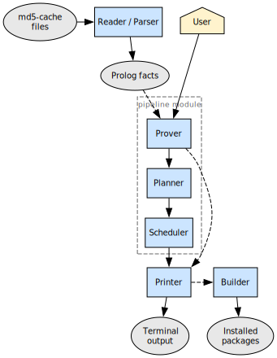
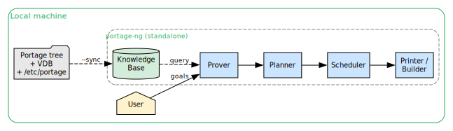
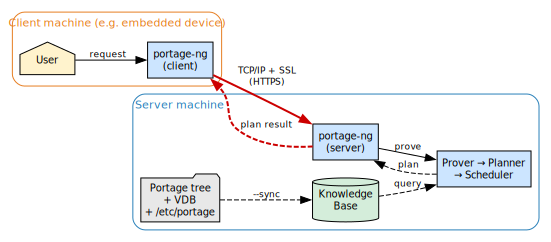
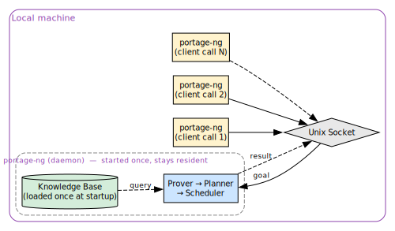
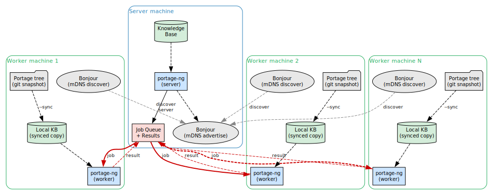
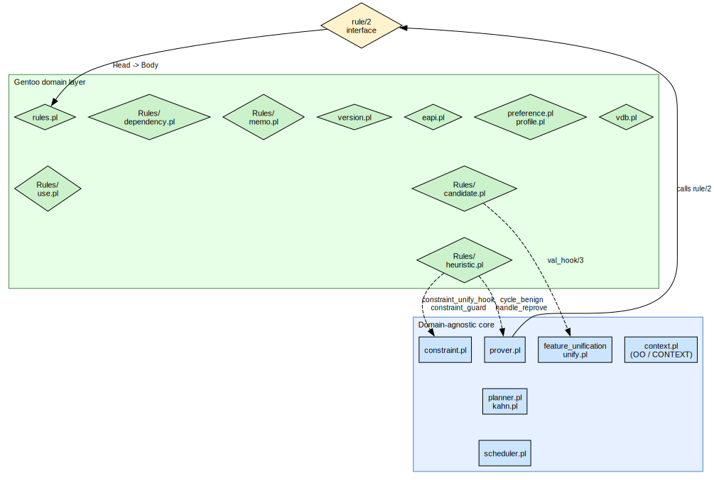
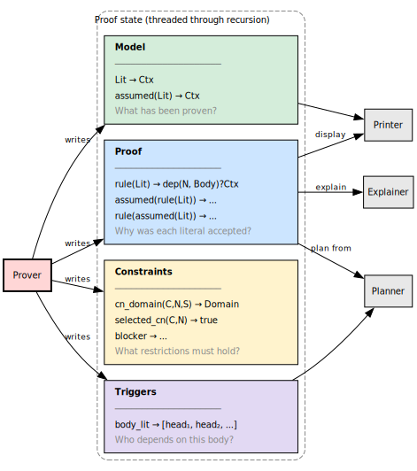

# Architecture Overview

Reasoning about software configurations is not a single algorithm you “run once.” It is a chain of transformations: turn repository facts into a logical problem, search for a proof that explains *why* each step is needed, turn that proof into an ordered plan, and finally render or execute it. portage-ng is structured as a **pipeline** because that sequence is the natural shape of the work. Each stage has a clean role—parse facts, prove a plan, schedule it, print (or build) it—and can be characterized in isolation: the reader produces a fixed vocabulary of literals; the prover produces a justified partial order of dependencies; the planner and scheduler refine that into something a human or a build system can follow. Treating the system as a pipeline is therefore a **design decision**: it keeps stages testable, replaceable, and easier to reason about than a monolith where parsing, search, ordering, and output are tangled together.

## The pipeline

portage-ng processes a user request through a linear pipeline of six stages:



```
reader/parser  →  prover  →  planner  →  scheduler  →  printer  →  builder
                  └──────── pipeline ────────┘
```

The prover produces four AVL trees — **Proof**, **Model**,
**Constraints**, and **Triggers** — that flow through the rest of the
pipeline.  Together they capture *why* each literal was accepted, *what*
is known, *what restrictions* must hold, and *who depends on whom*.
Section [Data structures](#data-structures) describes each one in
detail.

The prover, planner, and scheduler together form the `pipeline` module.
The standard entry point is:

```prolog
pipeline:prove_plan(Goals, Proof, Model, Plan, Triggers)
```

| **Stage** | **Module** | **Input** | **Output** |
|:---|:---|:---|:---|
| **Reader / Parser** | `reader.pl`, `parser.pl`, `eapi.pl` | Ebuild md5-cache files | Prolog facts (`cache:entry/5`) |
| **Prover** | `prover.pl` | Goal literals (from user) | Proof, Model, Constraints, Triggers |
| **Planner** | `planner.pl`, `kahn.pl` | Proof, Triggers | Plan + Remainder |
| **Scheduler** | `scheduler.pl` | Plan, Remainder | Plan (with SCC merge-sets) |
| **Printer** | `printer.pl`, `Printer/` | Proof, Model, Plan | Terminal output, `.merge` files |
| **Builder** | `builder.pl`, `Builder/` | Plan | Ebuild phase execution |


## Operating modes

portage-ng can run in several modes, each tailored to a different deployment scenario.  The mode determines which modules are loaded, how the knowledge base is accessed, and whether proving happens locally or is distributed across machines.  The mode is selected with `--mode` on the command line (e.g. `portage-ng --mode server`).  When no mode is specified, standalone is used.


### Standalone

The default and most common mode.  A single process on a single machine loads the full knowledge base, runs the complete pipeline (prover, planner, scheduler, printer, builder), and produces results locally.  This is what you use for day-to-day `--pretend`, `--merge`, `--shell`, and `--sync`.



Everything happens in one process: the Portage tree, VDB, and `/etc/portage/` configuration are synced into the knowledge base, and the user’s goal literals are proven, planned, and printed — all on the same machine.


### Client and server

In client–server mode, the reasoning happens on a powerful server while a lightweight client submits requests and displays results.  The client and server communicate over TCP/IP with SSL encryption (HTTPS), so they can run on different machines — potentially on different networks.



The server hosts the knowledge base and runs the full pipeline.  The client needs only the thin slice of printing and pipeline glue required to render output.  This makes client–server mode ideal for **embedded systems** and resource-constrained devices: the client binary is small, uses minimal memory, and delegates all proving to the server.  Queries return in milliseconds because the knowledge base is already loaded and indexed on the server side.


### Daemon / IPC

Daemon mode is similar to standalone, but the process stays resident and listens on a Unix socket for commands from local processes.  Both the daemon and its clients run on the **same machine**.



The key advantage is **startup performance**.  In standalone mode, every invocation loads the full knowledge base from disk — tens of thousands of Prolog facts — before it can answer a single query.  In daemon mode, the knowledge base is loaded **once** when the daemon starts and stays in memory.  Subsequent queries arrive over the Unix socket and are answered in **milliseconds**, because there is no parsing, no qcompile loading, no JIT indexing warmup — just a direct query against the already-loaded, already-indexed knowledge base.  This makes daemon mode well suited for interactive tooling, editor integrations, and scripts that issue many small queries in quick succession.


### Workers

Worker mode enables **distributed proving** across multiple machines.  A central server advertises itself via **Bonjour** (mDNS/DNS-SD), and workers on the local network automatically discover it without manual configuration.



Each worker machine maintains its own local copy of the Portage tree (typically via a **git snapshot**) and runs `--sync` locally to build its own knowledge base.  This ensures all workers reason against the same set of ebuilds — tree synchronisation is a prerequisite for consistent results across the cluster.

Once a worker discovers the server, it polls the job queue for proving tasks: the server breaks a large proof (e.g. `@world`) into independent sub-goals, distributes them to available workers, and collects the results.  Each worker runs the full pipeline locally (prover, planner, scheduler), so proving scales horizontally — adding more worker machines reduces wall-clock time for large proof sets.

See [Chapter 14: Command-Line Interface](14-doc-cli.md) for the full mode reference and [Chapter 17: Distributed Proving](17-doc-distributed.md) for TLS certificate setup and cluster configuration.


## Module load order

Each mode loads only the modules it needs.  This keeps startup time, memory footprint, and failure modes appropriate to the deployment:

The load order is defined in `Source/loader.pl`.  Each operating mode loads
a different subset of modules:

```
load_common_modules        — SWI-Prolog libraries, OO context, config, OS,
                             interface, EAPI, reader, subprocess, bonjour,
                             feature unification, daemon

load_standalone_modules    — Full pipeline: KB (cache, repository, query),
                             Gentoo domain (version, rules, ebuild, VDB,
                             preference), prover, planner, scheduler,
                             printer, builder, grapher, writer, test

load_server_modules        — HTTP server, Pengines, sandbox

load_client_modules        — HTTP/socket client, subset of printer/pipeline

load_worker_modules        — Same pipeline as standalone + client + cluster

load_llm_modules           — LLM provider backends, explain, semantic search
```


## Domain-agnostic core vs Gentoo-specific rules

Traditional Portage couples the resolver tightly to Gentoo semantics: USE flags, slots, profiles, and cache layout are not optional details—they are woven through the same code paths as the search strategy. That makes it hard to test “the resolver” without dragging the entire domain along, and hard to experiment with alternative rule sets or other package ecosystems.

portage-ng deliberately **separates** a domain-agnostic core from a Gentoo-specific rules layer. The prover does not know what a USE flag *is*. It sees abstract literals and Horn-style rules; expanding a goal means calling a single hook-shaped interface and continuing the search. The same engine could, in principle, reason about RPM packages, Nix derivations, or Cargo crates—you would supply different `rule/2` implementations and a different knowledge base, not a different prover. That separation is intentional: it isolates *how we search* from *what Gentoo means*, so the core can be exercised and compared without re-implementing Portage wholesale. Packages, USE flags, and slots never appear as primitives in the core; they are interpreted entirely inside the rules layer:



The **`rule/2` interface** is the contract between the domain-agnostic core and the domain-specific layer. Everything Gentoo-specific—consulting the knowledge base, evaluating USE conditionals, resolving candidates, emitting constraint terms—lives on the far side of that boundary.

```prolog
rules:rule(Head, Body)
```

The prover calls `rule/2` to expand a literal into its dependencies.  The
rules module implements this by consulting the knowledge base, evaluating
USE conditionals, resolving candidates, and emitting constraint terms.

This separation means the same reasoning engine could be applied to a
different domain by supplying a different set of rules.


## Data structures



During proof search, the prover must answer four kinds of question at once: *why* was this literal accepted, *what* is already known, *what restrictions* must remain consistent across branches, and *who depends on whom* when context or assumptions change. Four balanced trees (AVL maps via `library(assoc)`) hold exactly those roles. Together they capture the **complete state** of a proof attempt: the prover threads them through recursive expansion without relying on a soup of unrelated global mutable flags for “current model” or “current explanation.”

- **Proof** — Records *why* each literal was proven: the justification (which rule instance and body linked the head). Without it, you cannot explain the plan or reconstruct the dependency argument for the user.
- **Model** — Records *what* has been proven: the current state of knowledge (each literal and its proof-term context). This is the structure that memoizes success: the same literal is not re-proved from scratch along every path.
- **Constraints** — Records *restrictions* that must hold: version domains, slot locks, blockers, and similar invariants. They cross-cut the proof tree; they are not local to a single rule application.
- **Triggers** — Records *which heads depend on which bodies*—a reverse-dependency index. When a context changes or delayed work fires, the prover uses triggers to find “who cares” about that body without scanning the entire proof.

The prover maintains these four structures during proof construction:

| **Structure** | **Key** | **Value** | **Purpose** |
|:---|:---|:---|:---|
| **Proof** | `rule(Lit)` or `assumed(rule(Lit))` | `dep(N, Body)` | Which rule and body justified each literal; `N` is the dependency count |
| **Model** | `Lit` or `assumed(Lit)` | proven | Every literal that has been established |
| **Constraints** | e.g. `cn_domain(dev-libs, openssl, 0)` | `version_domain(...)` | Accumulated invariants: version domains, slot locks (`slot(3)`), blockers |
| **Triggers** | body literal | `[head, ...]` | Reverse-dependency index: which heads depend on this body literal |

The Proof and Model structures use different key schemes to distinguish normal
proofs from assumptions:

- `rule(Lit)` — normally proven literal
- `assumed(rule(Lit))` — prover cycle-break assumption
- `rule(assumed(Lit))` — domain assumption (dependency cannot be satisfied)

See [Chapter 5: Proof Literals](05-doc-proof-literals.md) for the literal
format and [Chapter 9: Assumptions](09-doc-prover-assumptions.md) for the
assumption taxonomy.


## Architecture diagram

The following page shows the full system architecture in landscape orientation, covering all layers from external inputs through the knowledge base, prover, planner, and output pipeline.

```{=typst}
#page(flipped: true, margin: (left: 15mm, right: 15mm, top: 20mm, bottom: 20mm))[
  #set text(size: 9pt)
  #align(center + horizon)[
    #text(font: "Helvetica Neue", size: 14pt, weight: "bold")[portage-ng: Full System Architecture]
    #v(8pt)
    #image("Diagrams/04-architecture-full.svg", width: 100%, height: auto, fit: "contain")
  ]
]
```


## Further reading

- [Chapter 5: Proof Literals](05-doc-proof-literals.md) — the
  `Repo://Entry:Action?{Context}` term format
- [Chapter 8: The Prover](08-doc-prover.md) — inductive proof search in detail
- [Chapter 12: Planning and Scheduling](12-doc-planning.md) — wave planning and
  SCC decomposition
