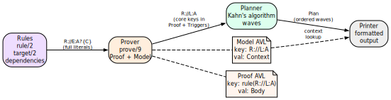

# Proof Literals

## The universal literal format

Every term that flows through the portage-ng pipeline — from rules to prover to planner to printer — uses the same universal format:

```
Repo://Entry:Action?{Context}
```

Each component answers a question that arises at a different stage of the pipeline:

- **`Repo`** — *where* does this fact come from?  The **rules** consult different repositories (the Portage tree, the VDB, an overlay) and the repository prefix travels with the literal so the prover never confuses an available package with an installed one.

- **`Entry`** — *what* package version is meant?  When the rules expand a dependency, they select a concrete cache entry (`'category/name-version'`).  This identifier is the key the **prover** uses to look up and store proof work — two dependency paths that resolve to the same entry share the same proof node.

- **`Action`** — *how* should the pipeline treat this entry?  The rules assign an action (`:install`, `:run`, `:download`, `:update`, ...) that tells the **planner** which phase of work this literal represents and how to order it relative to others.

- **`Context`** — *why* and *under what conditions* was this literal introduced?  As the prover expands the dependency graph, each literal accumulates a feature-term context: which parent introduced it (`self`), which USE flags are required (`build_with_use`), ordering constraints (`after`), slot locks, and so on.  At join points where two dependency paths reach the same literal, the prover **merges** their contexts via feature unification.  The **printer** reads the final context to display USE flags, slot information, and assumption reasons.

Traditional resolvers scatter this information across separate side structures.  portage-ng packs it into the literal itself, making every term **self-describing**: you can inspect a single literal and know its repository, version, phase, and full provenance without consulting external tables.


## Operator precedences

The literal format is defined by three infix operators declared in
`Source/Logic/context.pl`. In SWI-Prolog, **higher** precedence means the
operator becomes the **principal functor** at that level of the term — i.e. it
sits **higher** in the parse tree. The ordering `://` (603) **>** `?` (602)
**>** `:` (601) was chosen so that the structure lines up with everyday use:
you scope by **repository** first, then attach the **context list** to the
**ebuild core** (`Entry:Action`), with **entry** and **action** paired at the
innermost level. That makes the common cases — “everything in `portage`”, or
“this `category/name-version` with this phase” — parse in the way you read
them. The `?{Context}` annotation is intentionally the outer wrapper around the
core (after `://`) because **context is what changes most often during proof
search**; the repository and entry/action spine stay stable while USE,
ordering, and constraint features are merged and refined.

| **Operator** | **Precedence** | **Associativity** | **Parses as** |
| :-- | :-- | :-- | :-- |
| `://` | 603 | xfx | `Repo :// Rest` |
| `?` | 602 | xfx | `Core ? {Context}` |
| `:` | 601 | xfx | `Entry : Action` |

Because `://` has the highest precedence, a full literal parses as:

```
Repo :// ((Entry : Action) ? {Context})
```

That is: repository scopes the whole term; the ebuild core is `Entry : Action`;
the context list attaches to that core.


## `Repo` — the repository

The leftmost component identifies which registered repository the literal
belongs to. It is an atom — the same atom used when registering the repository
with the knowledge base:

```prolog
:- portage:newinstance(repository).
:- kb:register(portage).
```

Common repository atoms:

| **Atom** | **Meaning** |
| :-- | :-- |
| `portage` | The main Gentoo Portage tree |
| `pkg` | The VDB (installed packages database) |
| `overlay` | A user or test overlay |

Literals from different repositories can coexist in the same proof. For
example, a `portage://...` literal might depend on a `pkg://...` literal when
an installed package satisfies a dependency.


## `Entry` — the cache entry

The middle component is the cache entry identifier — a quoted atom in the
format `'category/name-version'`:

```
'sys-apps/portage-3.0.77-r3'
'dev-lang/python-3.13.2'
```

This atom maps directly to the second argument of `cache:entry/5`:

```prolog
cache:entry(portage, 'sys-apps/portage-3.0.77-r3', 'sys-apps', 'portage',
            version([3,0,77],'',...)).
```

The category, name, and version are also available as separate fields in the
cache, but the combined atom serves as the unique key for lookup.


## `Action` — the phase

The component after the entry (inside the `Entry : Action` pair) specifies
what operation the literal represents. Actions fall into three categories:

### Ebuild actions

These apply to `Repo://Entry` literals:

| **Action** | **Meaning** |
| :-- | :-- |
| `run` | Full installation + runtime availability |
| `install` | Build and install (DEPEND + BDEPEND + RDEPEND) |
| `download` | Fetch source archives |
| `fetchonly` | Fetch only, do not build |
| `reinstall` | Reinstall an already-installed package |
| `update` | Update to a newer version |
| `downgrade` | Downgrade to an older version |
| `upgrade` | Upgrade (used in VDB context) |
| `depclean` | Remove an unneeded package |
| `uninstall` | Uninstall a package |

### Dependency and validation actions

Before the prover can expand a package's full dependency tree, it first needs
to answer two questions: *which dependencies are actually active* given the
package's USE flags, and *is the USE configuration itself consistent*? These
questions are answered in two dedicated phases — `:config` and `:validate` —
that run **before** the main `:install` / `:run` expansion.

#### The `:config` phase — computing the dependency model

When portage-ng resolves a package, it does not immediately try to prove every
dependency listed in the ebuild's metadata. Instead, it first builds a
**dependency model**: a stable snapshot of which dependencies are active under
the current USE flag configuration.

An ebuild's metadata contains conditional dependencies guarded by USE flags.
For example, `dev-lang/python` might declare:

```
RDEPEND="ssl? ( dev-libs/openssl )
         readline? ( sys-libs/readline )
         !readline? ( sys-libs/libedit )"
```

The `:config` phase evaluates each dependency term against the effective USE
flags and retains only the **active** dependencies.  In the example above,
if `ssl` is enabled and `readline` is disabled, the model will contain
`dev-libs/openssl` and `sys-libs/libedit` — the `sys-libs/readline`
dependency is dropped because its USE guard is not satisfied.  Self-references
(a package listing itself as a dependency) are silently skipped.

When a choice group or constraint forces a decision, the prover may also
**assume** a flag — for instance, if an `exactly_one_of` group requires at
least one member to be enabled and none currently is, the prover picks the
most likely candidate and records a domain assumption so the user is informed.

The result is a **model** whose keys are the surviving dependency terms —
the ones that actually need resolving.

For choice groups (OR dependencies), the `:config` phase picks one viable
alternative:

```
RDEPEND="|| ( dev-db/postgresql dev-db/mariadb dev-db/sqlite )"
```

becomes a `choice_group(Deps):config?{Context}` literal. The rules try each
alternative, preferring already-installed packages, and commit to one choice.
The chosen dependency enters the model; the others are discarded. This means
that by the time the main proof begins, every OR group has been resolved to a
single concrete dependency.

| **Action** | **Literal head** | **Meaning** |
| :-- | :-- | :-- |
| `config` | grouped dependency | Resolve a dependency group under USE flags |
| `config` | package dependency | Check a single dependency |
| `config` | choice group | Pick one alternative from an OR group |
| `config` | USE conditional | Evaluate a USE-guarded block |

#### The `:validate` phase — checking REQUIRED_USE consistency

Ebuilds can declare constraints on which USE flag combinations are valid. For
example:

```
REQUIRED_USE="^^ ( python_targets_python3_12 python_targets_python3_13 )"
```

This says "exactly one Python target must be selected." The `^^` operator
translates to an `exactly_one_of_group(...)` term. Before expanding the
package's dependencies, portage-ng wraps each REQUIRED_USE constraint as a
`:validate` literal:

```prolog
exactly_one_of_group([required(python_targets_python3_12),
                      required(python_targets_python3_13)]):validate?{[
  self(portage://'dev-lang/python-3.13.2')
]}
```

The rules check whether the effective USE flags for the package (identified by
the `self(...)` context tag) satisfy the constraint. For `exactly_one_of`, the
check counts how many of the listed flags are enabled and verifies the count
is exactly one. If the constraint is violated, the rules emit a domain
assumption recording the conflict:

```prolog
assumed(conflict(required_use, exactly_one_of_group(Deps)))
```

The full set of REQUIRED_USE operators:

| **Operator** | **Group term** | **Constraint** |
| :-- | :-- | :-- |
| `^^` | `exactly_one_of_group(Deps)` | Exactly one flag enabled |
| any-of | `any_of_group(Deps)` | At least one flag enabled |
| `??` | `at_most_one_of_group(Deps)` | At most one flag enabled |
| (none) | `use_conditional_group(...)` | Conditional: if A then B |

Each of these operators is wrapped as a `:validate` literal and checked
against the package's effective USE flags:

| **Action** | **Literal head** | **Meaning** |
| :-- | :-- | :-- |
| `validate` | `exactly_one_of_group(...)` | Check `^^` constraint |
| `validate` | `any_of_group(...)` | Check any-of constraint |
| `validate` | `at_most_one_of_group(...)` | Check `??` constraint |

### Non-ebuild literal heads

Some literals do not follow the `Repo://Entry` pattern:

| **Literal** | **Meaning** |
| :-- | :-- |
| `world(Atom):register` | Add a package to the @world set |
| `world(Atom):unregister` | Remove a package from the @world set |
| `target(Query, Arg):run` | Top-level target resolution |
| `target(Query, Arg):fetchonly` | Top-level fetch-only target |
| `target(Query, Arg):uninstall` | Top-level uninstall target |


## `Context` — the feature-term list

The context is a Prolog list wrapped in `{}` and attached via the `?` operator.
It carries per-literal metadata that records provenance, ordering,
constraints, and USE requirements:

```prolog
portage://'dev-lang/python-3.13.2':install?{[
  self(portage://'sys-apps/portage-3.0.77-r3'),
  build_with_use:use_state([ssl, threads], []),
  after(portage://'sys-apps/portage-3.0.77-r3':install)
]}
```

Reading this literal: "install `dev-lang/python-3.13.2` from the portage
repository, because `sys-apps/portage` needs it (`self`), with USE flags `ssl`
and `threads` enabled (`build_with_use`), and schedule it after the
installation of `sys-apps/portage` (`after`)."

The context list is **not** an unstructured bag of annotations. It is the
proof-side counterpart of **feature terms** in the sense used by Zeller-style
feature logic (see [Chapter 20: Context Terms](20-doc-context-terms.md)): a
structured collection of features that can be **merged** when two dependency
paths describe the same package under different conditions. When two paths
reach the same literal with different USE requirements or other features, the
prover does not arbitrarily pick one path’s context — it **combines** them
using feature term unification (`sampler:ctx_union/3`), which relies on the same
feature machinery as the rest of the context subsystem. That is why context
lives in a dedicated suffix of the literal: it is the part that must stay
open to **merge** and **refine** as the proof graph grows.

### `self` — who introduced this dependency

Every dependency in an ebuild comes from somewhere. The `self(Repo://Entry)`
tag records *which package* introduced this literal as a dependency. When the
rules expand a package’s dependency list, they stamp every child literal with
the parent’s identity:

```prolog
portage://'dev-libs/openssl-3.4.1':install?{[
  self(portage://'dev-lang/python-3.13.2')
]}
```

This says "openssl is here because python depends on it." The `self` tag
serves three purposes:

1. **Provenance tracking.** The printer can show *why* a package appears in
   the plan — who pulled it in.

2. **USE flag resolution.** When checking whether a USE flag is enabled for a
   dependency, the rules look up the effective USE flags of the ebuild
   identified by `self`. This is how the `:validate` phase works: the
   `self` tag tells the REQUIRED_USE checker which package’s USE
   configuration to consult.

3. **Self-dependency detection.** When a package lists itself as a dependency
   (which happens in practice), the rules recognise this by comparing the
   dependency target to the `self` entry, and skip circular resolution.

At most one `self` tag is present per context. When a literal is stamped, any
previous `self` is replaced — the immediate parent is what matters.

### `build_with_use` — requirements imposed by parent

Gentoo dependency atoms can carry *bracketed USE requirements*: conditions
that must hold on the dependency target. For example, in `sys-apps/portage`’s
metadata:

```
RDEPEND="dev-lang/python[ssl,threads]"
```

The brackets `[ssl,threads]` mean "I need python, and it must be built with
the `ssl` and `threads` USE flags enabled." The rules translate this into a
`build_with_use` context tag:

```prolog
portage://'dev-lang/python-3.13.2':install?{[
  build_with_use:use_state([ssl, threads], [])
]}
```

The `use_state(Enabled, Disabled)` term lists which flags must be on and which
must be off. Negative requirements like `[-test]` appear in the disabled list:

```prolog
build_with_use:use_state([], [test])
```

When two dependency paths reach the same package with different USE
requirements, the prover merges them via feature unification. If portage
requires `python[ssl]` and another package requires `python[xml]`, the merged
context becomes:

```prolog
build_with_use:use_state([ssl, xml], [])
```

If two paths disagree — one requires `[debug]` and another requires
`[-debug]` — the unification detects the conflict and the constraint system
handles it (potentially triggering a reprove with different candidate
selection).

The `build_with_use` tag is distinct from the package’s own USE flags. A
package’s USE flags are determined by profile, user configuration, and
defaults. The `build_with_use` tag captures what *other packages demand of
this package*. The printer reads both to display the final USE flag set,
marking flags that were pulled in by dependency requirements.

### `after` — ordering constraints

The planner needs to know the order in which actions should be scheduled. The
`after(Literal)` tag expresses a hard ordering constraint: "this literal must
come after the specified literal in the final plan."

```prolog
portage://'dev-lang/python-3.13.2':download?{[
  after(portage://'sys-apps/portage-3.0.77-r3':install)
]}
```

Ordering constraints arise naturally from the dependency structure. When
package A depends on package B, the rules add `after(B:install)` to A’s
download and dependency contexts. This ensures that B is installed before A
starts building.

The `after` tag **propagates**: when it is set on a literal, it is also
injected into that literal’s own children. If A must come after B, then A’s
dependencies also implicitly come after B. This transitive propagation ensures
that entire subtrees are correctly ordered.

For cases where ordering should *not* propagate, the `after_only` variant
exists. This is used primarily for PDEPEND (post-dependencies): a package’s
post-dependencies must come after the package itself, but the
post-dependency’s own children should not inherit that ordering constraint.

```prolog
after_only(portage://'app-editors/neovim-0.12.0':run)
```

The planner reads both `after` and `after_only` from every literal’s context
to build the dependency edges that drive Kahn’s topological sort.

### Summary of context tags

| **Tag** | **Purpose** |
| :-- | :-- |
| `self(Repo://Entry)` | The parent ebuild that introduced this dependency |
| `build_with_use:use_state(En, Dis)` | USE flags that must be enabled/disabled on this package |
| `after(Literal)` | Must come after this literal; propagates to children |
| `after_only(Literal)` | Must come after this literal; does not propagate |
| `slot(C, N, Ss):{Candidate}` | Slot lock from `:=` sub-slot rebuild semantics |
| `replaces(pkg://Entry)` | Which installed package this action replaces |
| `assumption_reason(Reason)` | Why a domain assumption was made |
| `suggestion(Type, Detail)` | Actionable suggestion (keyword, unmask, use change) |
| `constraint(cn_domain(C,N):{D})` | Inline version domain constraint |
| `onlydeps_target` | Marks a literal as an `--onlydeps` target |
| `world_atom(Atom)` | Planning marker for @world set membership |

Contexts are merged at join points via feature term unification, which uses
Zeller-inspired feature unification. See
[Chapter 20: Context Terms](20-doc-context-terms.md) for full details.


## Canonical decomposition

The prover stores literals in assoc/AVL structures keyed by a **stable**
identity. That creates a design tension: during proof search, the **context**
is constantly enriched — new `build_with_use` features appear, ordering
constraints are propagated, slot locks and learned domains are attached — but
the **underlying package and phase** (repository, cache entry, action) are
still the same logical goal. If the full term including context were used as
the key, every refinement would look like a **new** node: you would get
duplicate entries for “the same” install step, incoherent merging, and broken
sharing of proof work.

**Canonical decomposition** fixes that by splitting each literal into a
**core** used for identity (`R://L:A`) and a **context list** carried as
associated data. Two encounters of the same core with different contexts
collide on the same key; the prover then **merges** contexts (via
feature term unification) instead of forking duplicate keys.

Two predicates handle decomposition:

### `prover:canon_literal/3`

Strips the context from a literal, returning the core key and context
separately:

```prolog
canon_literal(R://(L:A),            R://L:A, {}).
canon_literal(R://(L:A?{Ctx}),      R://L:A, Ctx).
canon_literal(R://(L:A)?{Ctx},      R://L:A, Ctx).
canon_literal(R://(L:A?{C1})?{C2},  R://L:A, Merged).
```

The core `R://L:A` is used as the key in the Model AVL. The context is stored
as the value.

### `prover:canon_rule/3`

Similarly decomposes a rule head, producing a context-free key for the Proof
AVL.

This decomposition ensures that when a literal is re-encountered with a
different context, the prover can find the existing proof entry and merge the
contexts rather than creating a duplicate.


## How literals flow through the pipeline



1. **Rules** produce literals. The `target/2` rule resolves a user query to a
   `Repo://Entry:run?{Context}` literal. Dependency rules produce further
   literals with appropriate actions and contexts.

2. **Prover** stores the core literal (`R://L:A`) as the key in the Model AVL
   and the context as the value. The Proof AVL uses `rule(R://L:A)` as the
   key, with the rule body and context as the value.

3. **Planner** extracts rule heads from the Proof AVL, using `canon_literal/3`
   to get core literals. Kahn's algorithm schedules these into concurrent
   waves based on dependency edges.

4. **Printer** reads the Plan (a list of waves), looks up each literal in the
   Model AVL to recover its context, and formats the output.


## Worked example

Tracing `target('sys-apps/portage'):run?{[]}` through the pipeline:

```
1. User runs: portage-ng --pretend sys-apps/portage

2. Interface creates goal literal:
   [target('sys-apps'-'portage', []):run?{[]}]

3. Interface invokes the prover with this goal.

4. Prover uses rules to expand target/2:
   rule(target('sys-apps'-'portage', []):run?{[]},
        [portage://'sys-apps/portage-3.0.77-r3':run?{[]}])

5. Prover uses rules to expand :run:
   rule(portage://'sys-apps/portage-3.0.77-r3':run?{[]},
        [portage://'sys-apps/portage-3.0.77-r3':install?{[]},
         ...RDEPEND literals...])

6. Prover uses rules to expand :install:
   rule(portage://'sys-apps/portage-3.0.77-r3':install?{[]},
        [portage://'sys-apps/portage-3.0.77-r3':download?{[]},
         ...DEPEND/BDEPEND literals with self/1, build_with_use, after...])

7. Prover stores each proven literal in the Model AVL:
   Key: portage://'sys-apps/portage-3.0.77-r3':run
   Val: [] (context)

8. Planner places :download in wave 1, :install in wave 2, :run in wave 3

9. Printer outputs:
   [1] portage://sys-apps/portage-3.0.77-r3  download
   [2] portage://sys-apps/portage-3.0.77-r3  install
   [3] portage://sys-apps/portage-3.0.77-r3  run
```


## Further reading

- [Chapter 8: The Prover](08-doc-prover.md) — how the prover uses these
  literals
- [Chapter 11: Rules and Domain Logic](11-doc-rules.md) — how rules produce
  literals
- [Chapter 20: Context Terms](20-doc-context-terms.md) — deep dive into context
  semantics and feature unification
