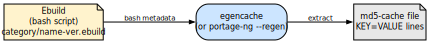
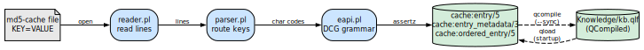

# Knowledge Base and Cache

## From ebuild to fact: the metadata pipeline

Every package in Gentoo begins life as an **ebuild**: a bash script in the
Portage tree that declares metadata (dependencies, USE flags, slot, license,
and more). Portage-ng does not run those scripts. Instead, it consumes a
pre-digested form of the same information.

**`egencache`** (or portage-ng’s **`--regen`**) walks the tree and turns
ebuilds into **md5-cache** files: flat key–value text blobs that summarize
each ebuild’s metadata. Portage-ng’s reader and parser then loads those
files, runs their contents through the **EAPI DCG grammar** (see
[Chapter 7](07-doc-eapi-grammar.md)), and **asserts** `cache:entry/5` (and
related) facts into the in-memory knowledge base. For fast startup, those
facts are **qcompiled** into `Knowledge/kb.qlf`, so the next session reloads
binary bytecode instead of reparsing thousands of text files.

That end-to-end path — ebuild → cache generation → md5-cache → grammar →
Prolog facts → QLF — is the **metadata pipeline**. It is deliberate:
portage-ng never executes bash for package metadata; it works **entirely
from metadata** that has already been extracted and normalized.



Once the md5-cache files exist on disk, portage-ng's reader parses each
one through the EAPI grammar and asserts the resulting terms as Prolog
facts:



The knowledge base is the in-memory representation of the Gentoo Portage
tree at the end of that pipeline. It stores every ebuild’s metadata as
Prolog facts that can be queried in sub-millisecond time.


## The cache data structure

The core data structure is `cache:entry/5`, a dynamic predicate with one
fact per ebuild:

```prolog
cache:entry(Repository, Id, Category, Name, Version).
```

| **Argument** | **Example** | **Meaning** |
| :-- | :-- | :-- |
| `Repository` | `portage` | Registered repository atom |
| `Id` | `'sys-apps/portage-3.0.77-r3'` | Full category/name-version string |
| `Category` | `'sys-apps'` | Package category |
| `Name` | `'portage'` | Package name |
| `Version` | `version([3,0,77],'',...)` | Parsed version as `version/7` term |

Additional cache predicates store per-ebuild metadata:

| **Predicate** | **Content** |
| :-- | :-- |
| `cache:entry_metadata/3` | EAPI, SLOT, KEYWORDS, LICENSE, etc. |
| `cache:ordered_entry/5` | Entries ordered by version (for candidate selection) |
| `cache:provides/3` | Virtual package mappings |


## Why this cache design?

The shape of `cache:entry/5` is not arbitrary; it matches how Prolog and
the prover actually use the data.

**Indexing and lookup.** Prolog’s strength is pattern matching on structured
terms. `cache:entry/5` is arranged so that **first-argument indexing** on
`Repository` and **third- and fourth-argument** access on `Category` and
`Name` align with the most common query shapes: “in this repo, what entries
exist for this category/name?”

**Versions as terms.** The version is stored as a **`version/7` compound
term** so that **standard `compare/3`** on the term gives correct version
ordering **without any runtime conversion** to another representation. The
prover and rules can treat versions as ordinary Prolog data.

**Splitting metadata.** Rich fields (EAPI, SLOT, KEYWORDS, LICENSE, …) live
in **`cache:entry_metadata/3`** rather than bloating every `entry/5` fact.
That keeps the **hot path** — finding candidates by repository, category,
and name — **lightweight**, while still allowing full metadata when needed.

**Pre-sorted candidates and version preference.**
**`cache:ordered_entry/5`** holds entries **pre-sorted by version
(newest first)** for candidate selection.  Building that structure once
at load or regen time **avoids repeated sorting during proof search**,
where the same name may be considered many times under different
contexts.

The ordering is more than an optimisation — it encodes **preference**.
Prolog iterates over `ordered_entry/5` clauses in assertion order, so
the newest version is tried first.  When the prover searches for a
candidate that satisfies a dependency, it encounters the highest
version before any older alternative.  If that candidate passes all
constraint guards, it is selected without ever considering older
versions.  If it fails (wrong slot, masked, REQUIRED_USE violation),
Prolog's backtracking moves to the next clause — the next-highest
version — automatically.

This design has a formal counterpart in **ordered logic programs** as
studied by Vermeir and Van Nieuwenborgh ("Preferred Answer Sets for
Ordered Logic Programs," JELIA 2002).  In their framework, when
multiple rules can derive conflicting conclusions, a **partial order
over rules** determines which one prevails.  In portage-ng the
"rules" are candidate versions for a given category/name, and the
partial order is the version comparison: newer versions have higher
priority.  Prolog's clause order directly implements this priority — no
separate preference layer or scoring function is needed.  The result
is that the prover naturally gravitates toward the newest compatible
version, which matches Gentoo's standard policy, while still falling
back to older versions when constraints demand it.

See [Chapter 21: Resolver Comparison](21-doc-resolver-comparison.md)
for more on Vermeir's ordered logic and its role alongside Zeller's
feature logic and CDCL-style conflict learning.


## Repositories and the knowledge base registry

Repositories are not just atoms: they are **objects** in the OO context
system (`Source/Logic/context.pl`). Each repository has its own **identity**,
**paths**, **sync method**, and **cache** partition. The **context** machinery
provides **instance creation** (`newinstance`), **method dispatch**, and
**visibility guards**, so different repository kinds can share an interface
while differing in behavior — for example, `portage:sync` and
`overlay:sync` can implement sync differently behind the same method.

Repositories are registered via that OO context system. Each repository
is an instance of the `repository` class:

```prolog
:- portage:newinstance(repository).
:- kb:register(portage).
```

The knowledge base module (`knowledgebase.pl`) maintains a registry of
all loaded repositories. **`kb:register/1`** records which repositories are
**active** so the rest of the system can iterate or dispatch over them.
Multiple repositories can be registered simultaneously — for example, the
main Portage tree (`portage`), the VDB of installed packages (`pkg`), and
user overlays (`overlay`).

Each repository instance manages its own cache facts. The `repository`
class provides methods for syncing, loading, and querying:

```prolog
portage:sync.          % Sync from remote
portage:read.          % Read md5-cache into Prolog facts
portage:search(Query). % Search entries
```


## Syncing and cache regeneration

**`--sync`** performs a full repository synchronization.  It is the
“wide” end of the metadata pipeline: it brings the tree up to date,
then materializes fresh cache facts and QLF artifacts.

1. Fetches the latest Portage tree (via git, rsync, or HTTP)
2. Reads md5-cache files via the EAPI grammar into cache predicates
3. Generates `Knowledge/kb.qlf` (qcompiled facts for fast reload)
4. Generates `Knowledge/profile.qlf` (serialized profile data)

**`--regen`** regenerates the md5-cache incrementally.  It replaces
`egencache`: only changed or new ebuilds are re-parsed, and
regeneration runs in parallel across available cores.


## Compiling knowledge

On subsequent startups, portage-ng loads `Knowledge/kb.qlf` instead of
re-parsing the entire md5-cache directory. `qcompile` files are a
SWI-Prolog binary format that loads an order of magnitude faster than
parsing text files. That step closes the pipeline opened by ebuilds and
md5-cache: the **authoritative** working set for proving is the compiled
fact base, not the shell sources.

The raw Prolog facts are also available as `Knowledge/kb.raw` for
debugging.


## Query layer

The cache facts described above — `cache:ordered_entry/5`,
`cache:entry_metadata/4`, and friends — are ground relational tuples:
a flat, indexed collection of facts that describes the known world.
In database terminology, this is an **extensional database** (EDB).
The query module (`Source/Knowledge/query.pl`) adds an **intensional**
layer on top: it defines high-level query predicates that are compiled
down to direct lookups over the base relations.

This architecture is closely related to **Datalog**, the declarative
query language that sits at the intersection of logic programming and
relational databases.  In Datalog, ground facts form the base relations
and rules define derived views; queries are conjunctive queries over
those relations, with guaranteed termination.  portage-ng’s query layer
follows the same pattern: list queries compile into conjunctions of
cache lookups (conjunctive queries), every variable is grounded through
the EDB (the Datalog safety property), and the query layer itself
always terminates.  Where the system goes beyond strict Datalog is in
its use of compound terms (`version/7`, `slot/1`) rather than flat
constants, and in the model queries that invoke the prover — at which
point we leave the Datalog fragment and enter full recursive Prolog
reasoning.

Rather than interpreting queries at runtime through a generic search
function, portage-ng uses SWI-Prolog’s **`goal_expansion/2`** — a
compile-time macro facility that acts as a Datalog-style query
compiler — to rewrite high-level query goals into **direct** calls
to indexed cache predicates before the program even runs.

### Goal expansion by example

Consider a rule that needs to find all ebuilds named `neovim`:

```prolog
query:search(name(neovim), Repository://Entry).
```

At load time, `goal_expansion/2` rewrites this into:

```prolog
cache:ordered_entry(Repository, Entry, _, neovim, _).
```

The high-level `search` call disappears entirely. What remains is a direct
call to the indexed cache predicate, where SWI-Prolog’s first-argument
indexing on `Repository` and fourth-argument indexing on `Name` make the
lookup near-instantaneous. No dispatching, no interpretation — just a
pattern match against the fact base.

A conjunctive query expands into a conjunction of cache calls:

```prolog
query:search([name(neovim), category('app-editors')], R://E).
```

becomes:

```prolog
cache:ordered_entry(R, E, 'app-editors', neovim, _).
```

The payoff shows up at scale: **sub-millisecond** query behavior across
**tens of thousands** of entries (on the order of 32,000+ in a typical
Portage tree), because the hot queries are specialised at compile time.

### `query:search` — the main query predicate

`query:search/2` is the primary interface for querying the knowledge base.
Its first argument describes what to search for; its second argument binds the
matching `Repository://Entry`:

```prolog
query:search(name(neovim), R://E).
query:search([category('dev-libs'), name(openssl)], R://E).
query:search(description(D), portage://'app-editors/neovim-0.12.0').
```

The following search terms are supported:

| **Search term** | **Matches** |
| :-- | :-- |
| `name(Name)` | Package name |
| `category(Cat)` | Package category |
| `entry(Id)` | Full entry atom (`'category/name-version'`) |
| `repository(Repo)` | Repository atom |
| `version(Ver)` | Exact version term |
| `slot(Slot)` | Slot value |
| `subslot(Sub)` | Sub-slot value |
| `keyword(KW)` | Architecture keyword |
| `description(D)` | Package description |
| `eapi(E)` | EAPI version |
| `license(L)` | License |
| `homepage(H)` | Homepage URL |
| `maintainer(M)` | Package maintainer |
| `eclass(E)` | Inherited eclass |
| `iuse(Flag)` | USE flag declared in IUSE |
| `masked(true/false)` | Whether the package is masked |

Search terms can be combined as a list for conjunctive queries. The
`all(...)` wrapper collects all matching values, and `latest(...)` returns
only the first (highest-version) match.

### `query:select` — version and metadata comparison

For queries that need comparison operators (not just equality), portage-ng
uses a `select(Key, Comparator, Value)` term inside `search`:

```prolog
query:search(select(version, greaterequal, Ver), R://E).
query:search(select(slot, equal, '3'), R://E).
query:search(select(keyword, wildcard, 'amd*'), R://E).
```

For version comparisons, the `select` clauses expand at compile time into
direct `cache:ordered_entry` lookups combined with `eapi:version_compare/3`:

| **Comparator** | **Meaning** |
| :-- | :-- |
| `equal` | Exact version match |
| `smaller` | Version strictly less than |
| `greater` | Version strictly greater than |
| `smallerequal` | Less than or equal |
| `greaterequal` | Greater than or equal |
| `notequal` | Not equal |
| `wildcard` | Wildcard match (e.g. `3.0*`) |
| `tilde` | Fuzzy matching (same base version, any revision) |

For non-version keys, `select` falls through to `cache:entry_metadata/4`
lookups with the appropriate comparison. This keeps the version hot path
— which is exercised thousands of times during candidate selection —
fully indexed and compiled.


## Further reading

- [Chapter 7: The EAPI Grammar](07-doc-eapi-grammar.md) — how md5-cache files
  are parsed into cache predicates
- [Chapter 3: Configuration](03-doc-gentoo.md) — repository path setup
- [Chapter 8: The Prover](08-doc-prover.md) — how the prover queries the
  knowledge base
