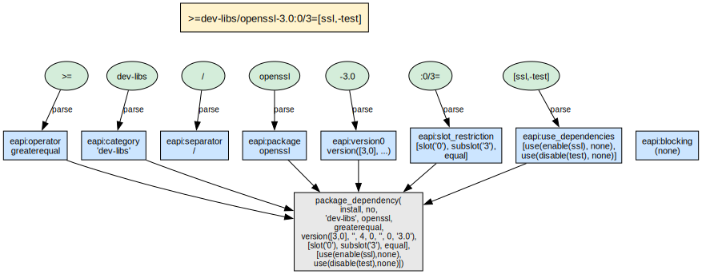

# The EAPI Grammar

The Gentoo **Package Manager Specification** (PMS) defines a dependency language
that is easy to underestimate on first reading. A single atom can carry a
version comparator, a category and package name, a Gentoo version string, slot
and sub-slot operators, USE restrictions, and—wrapped around lists of atoms—USE
conditionals, choice groups, and blockers. Traditional Portage implements this
surface syntax with an ad hoc parser written in Python.

portage-ng uses Prolog’s built-in **Definite Clause Grammar** (DCG)
notation to encode the same language directly
(`Source/Domain/Gentoo/eapi.pl`).  The insight is simple: PMS dependency
syntax *is* a grammar, so it should be expressed as one.  DCG rules
describe that grammar directly; the parser is the grammar, not a separate
layer that tries to stay in sync with a prose spec.
What PMS says and what the executable parser accepts are one artifact—the rules
in `eapi.pl`—rather than a specification document drifting away from a pile of
regexes and special cases.

The grammar fully implements PMS 9 / EAPI 9.


## What gets parsed

The EAPI grammar is exercised whenever md5-cache metadata is loaded. Each file
under the Portage tree’s `metadata/md5-cache/` directory holds **one ebuild’s**
worth of metadata as a flat list of lines, each line a single `KEY=VALUE` pair
(PMS 9, §14.3). A typical fragment looks like this:

```
BDEPEND=>=dev-build/cmake-3.16
DEFINED_PHASES=compile configure install prepare test
DEPEND=dev-libs/openssl:= dev-libs/libffi:=
EAPI=8
IUSE=debug doc test
KEYWORDS=~amd64 ~arm64
RDEPEND=dev-libs/openssl:= >=dev-lang/python-3.10[ssl,threads]
REQUIRED_USE=|| ( python_targets_python3_11 python_targets_python3_12 )
SLOT=0
```

The DCG is responsible for turning the *values* of dependency-related keys into
structured terms: dependency strings (`DEPEND`, `BDEPEND`, `RDEPEND`,
`PDEPEND`, `IDEPEND`), USE-conditional groups, version operators, slot
operators, USE dependencies, and `REQUIRED_USE` constraints. Other keys (`EAPI`,
`SLOT`, `KEYWORDS`, `DESCRIPTION`, …) use smaller, dedicated value rules in the
same module—still DCG-driven, but without the full dependency expression
machinery.


## A worked example: one dependency atom

Consider a single atom as it might appear in `RDEPEND` or `DEPEND`:

`>=dev-libs/openssl-3.0:0/3=[ssl,-test]`



The core DCG rule for a package atom is `eapi:package_dependency/3` in
`eapi.pl`. Conceptually it composes the way PMS §8.3 suggests reading the text:
optional blocker, optional comparator, `category/package`, optional version,
optional slot restriction, optional USE dependency list, with a small helper to
merge “`=` + wildcard” into the dedicated `wildcard` operator:

```prolog
eapi:package_dependency(T, _R://_E, Output) -->
  eapi:blocking(B),                                      % optional
  eapi:operator(O),                                      % optional
  eapi:category(C), eapi:separator, !, eapi:package(P),  % required
  eapi:version0(V, W),                                   % optional
  eapi:slot_restriction(S),                              % optional
  eapi:use_dependencies(U),                              % optional
  { eapi:select_operator(O, W, Op),
    Output = package_dependency(T, B, C, P, Op, V, S, U) }.
```

### Matching each piece

1. **`blocking`** — No `!` or `!!` prefix, so this clause leaves the blocking
   marker as “none” (`no` in the concrete term).
2. **`operator`** — The leading `>=` matches the `greaterequal` operator.
3. **`category`, `/`, `package`** — Consumes `dev-libs`, the slash, and
   `openssl`.
4. **`version0`** — After the hyphen, parses `3.0` into a `version/7` term (and
   records that there is no `=*`-style wildcard suffix on this atom).
5. **`slot_restriction`** — The `:0/3=` fragment becomes a list describing the
   main slot, sub-slot, and trailing `=` (rebuild-on-slot change semantics).
6. **`use_dependencies`** — Bracket contents parse as a comma-separated list:
   `ssl` as an enable requirement, `-test` as a disable requirement.
7. **`select_operator`** — With no wildcard, the final operator remains
   `greaterequal`.

### Intermediate state and difference lists

Operationally, each DCG goal is expanded into an ordinary Prolog predicate with
two extra arguments: the **current suffix** of the input code list and the
**remaining suffix** after the rule succeeds. That is the standard DCG
**difference-list** threading: parsing advances by shortening the difference
between “input seen so far” and “still to read.”

You can read the parse as a sequence of **remaining input** snapshots (conceptual, not a separate data structure the code prints):

| **After this part succeeds** | **Remaining input (conceptually)** |
| :--- | :--- |
| (start) | `>=dev-libs/openssl-3.0:0/3=[ssl,-test]` |
| `operator` | `dev-libs/openssl-3.0:0/3=[ssl,-test]` |
| `category` + `/` + `package` | `-3.0:0/3=[ssl,-test]` |
| `version0` | `:0/3=[ssl,-test]` |
| `slot_restriction` | `[ssl,-test]` |
| `use_dependencies` | (empty — parse succeeds) |

Calling `phrase(Rule, Codes)` wraps that pattern: it requires the rule to
consume all of `Codes` (or you supply an explicit remainder). There is no
hand-maintained cursor variable in application code—the DCG expansion supplies
it.

### Final term

For the install-time dependency role (`package_d` in the grammar), parsing the
string above yields a `package_dependency/8` term of this shape (as produced by
the running grammar; minor formatting may vary):

```prolog
package_dependency(
  install,
  no,
  'dev-libs',
  openssl,
  greaterequal,
  version([3, 0], '', 4, 0, '', 0, '3.0'),
  [slot('0'), subslot('3'), equal],
  [use(enable(ssl), none), use(disable(test), none)])
```

The first argument (`install` / `run` / `compile`) records *which* PMS
dependency class is being parsed (`DEPEND` vs `RDEPEND` vs `BDEPEND`), so the
same DCG surface syntax feeds slightly different typing in the abstract
syntax.


## Why DCG instead of regex or ad hoc code?

The dependency language defined by PMS is recursive: USE
conditionals contain dependency lists, which themselves contain atoms,
which may carry nested USE restrictions.  A regex or hand-coded string
scanner can handle flat patterns, but recursive structure calls for a
recursive formalism.  Prolog’s DCG notation is exactly that formalism,
and it brings several practical advantages.

**Composition.** The package-atom rule is assembled from small,
self-contained nonterminals — `blocking`, `operator`, `category`,
`separator`, `package`, `version0`, `slot_restriction`, and
`use_dependencies` — each of which can be understood and tested in
isolation:

`dep_atom --> blocking, operator, category, '/', package, version_suffix, slot_suffix, use_deps.`

**Local testing.** Every nonterminal is an ordinary Prolog predicate,
so you can call `phrase/2` on a single rule without loading the cache
or the full pipeline.

**Free recursion.** USE conditionals and nested choice groups use the
same mechanism as every other rule: `eapi:dependencies//3` recurses
through lists of `eapi:dependency//3` alternatives, so nested
`flag? ( … )` structures need no separate stack machine.

**Failure locality.** When parsing fails, the failure occurs at a
named nonterminal — a clear indication of which part of the input was
unexpected, rather than a terse “pattern did not match” from a regex
engine.

**Graceful evolution.** New PMS features tend to introduce new
alternatives or new rules (additional operators, value forms, EAPI-9
extensions), not a rewrite of central control flow.  Adding a rule to
a DCG is a one-clause change; the equivalent in a Python parser is
typically a new branch in an `if eapi >= …` ladder spread across
several functions.


## DCG grammar design

The grammar is implemented in `Source/Domain/Gentoo/eapi.pl` as a set of DCG
rules. DCGs are a natural fit for dependency specifications because:

- Dependency atoms have recursive structure (USE conditionals nest).
- The grammar is context-free at the level PMS defines.
- DCG rules compose as Prolog predicates, so the parser **constructs** Prolog
  terms while it reads text.

### Dependency atoms

The table below summarizes how the surface syntax maps into fields of the
abstract atom (illustrated with the same running example):

| **Component** | **Example** | **Parsed as** |
| :--- | :--- | :--- |
| Version operator | `>=` | Comparator atom (e.g. `greaterequal`) |
| Category | `dev-libs` | Atom |
| Name | `openssl` | Atom |
| Version | `3.0` | `version/7` term |
| Slot operator | `:0/3=` | Slot + sub-slot + rebuild flag |
| USE deps | `[ssl,-test]` | Enable/disable (and related) wrappers |

### USE conditionals

USE-conditional dependency groups use the syntax:

```
flag? ( deps... )      — include deps if flag is enabled
!flag? ( deps... )     — include deps if flag is disabled
```

These are parsed into conditional terms that the rules layer evaluates against
the USE model during proof construction.

### Choice groups

PMS defines three choice operators for REQUIRED_USE and dependency specs:

- **`||` (any-of)** — `|| ( a b c )` — at least one of the listed items must be satisfied
- **`^^` (exactly-one-of)** — `^^ ( a b c )` — exactly one must be satisfied
- **`??` (at-most-one-of)** — `?? ( a b c )` — at most one may be satisfied


## Reader/parser pipeline

Loading md5-cache is a small pipeline with clear separation of concerns.

The **repository** side (`Source/Knowledge/repository.pl`) knows where the cache
lives: under each tree’s `metadata/md5-cache/` directory, with one file per
`category/package-version` entry (`repository:get_cache_file/2` resolves entry
→ path). Sync and incremental updates decide *which* entries need work; for
each entry that must be read, the repository opens the flat cache file.

**`Source/Pipeline/reader.pl`** does one job: given a path (or stream), it reads
the file line by line into a list of strings—each string is still a raw
`KEY=VALUE` line, unchanged.

**`Source/Pipeline/parser.pl`** walks that list. For each line it converts the
string to character codes and runs `phrase(eapi:keyvalue(metadata, …), Codes)`.
That single DCG entry point dispatches on the key: dependency keys delegate to
the full dependency grammar (`DEPEND`, `BDEPEND`, `RDEPEND`, `PDEPEND`,
`IDEPEND`, `REQUIRED_USE`, …); non-dependency keys use lighter value rules
(`EAPI`, `SLOT`, `KEYWORDS`, `IUSE`, …).

So the data flow is:

```
md5-cache files  →  reader.pl (lines)  →  parser.pl  →  eapi.pl (DCG)  →  cache predicates
```

1. **`reader.pl`** reads each md5-cache file into a list of lines (one
   key/value pair per line).

2. **`parser.pl`** parses every line through `eapi:keyvalue/3`, which routes
   values to the appropriate DCG subtree.

3. **`eapi.pl`** builds structured Prolog terms (e.g. `depend(D)`,
   `rdepend(D)`, `slot(S)`, `eapi(E)`).

4. The results are asserted as `cache:entry/5` and related predicates,
   populating the knowledge base.

The reader supports incremental loading — only new or changed files need to be
re-parsed when using `--regen`.


## Parsed output

After parsing, each ebuild is represented by a set of cache predicates. The
dependency model for an ebuild is a list of `package_dependency/8` terms:

```prolog
package_dependency(DepType, Blocking, Category, Name, Operator, Version,
                   SlotInfo, UseInfo)
```

These terms are consumed by the rules layer during proof construction. The EAPI
grammar handles all PMS 9 / EAPI 9 constructs:

- Version operators: `=`, `>=`, `<=`, `>`, `<`, `~`, `=*` (wildcard)
- Slot operators: `:SLOT`, `:SLOT/SUBSLOT`, `:*`, `:=`
- USE dependencies: `[flag]`, `[-flag]`, `[flag=]`, `[!flag=]`,
  `[flag(+)]`, `[flag(-)]`
- Blockers: `!cat/pkg` (weak), `!!cat/pkg` (strong)
- All-of groups (implicit conjunction)
- Any-of groups (`|| ( ... )`)
- USE conditionals (`flag? ( ... )`, `!flag? ( ... )`)


## Further reading

- [Chapter 6: Knowledge Base and Cache](06-doc-knowledgebase.md) — how parsed
  data is stored
- [Chapter 11: Rules and Domain Logic](11-doc-rules.md) — how dependency terms
  are consumed during proof construction
- [Chapter 22: Dependency Ordering](22-doc-dependency-ordering.md) — PMS
  dependency type semantics
