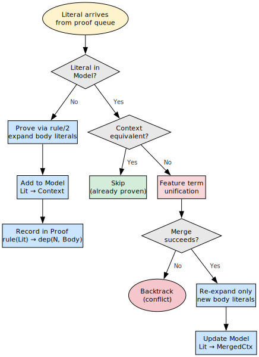
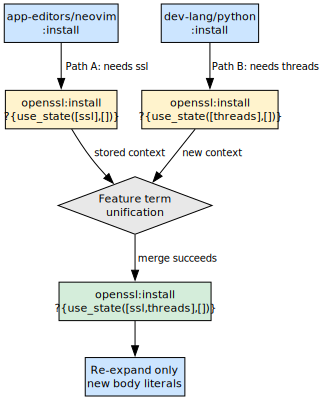
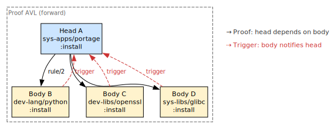
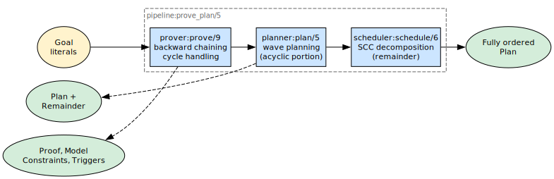
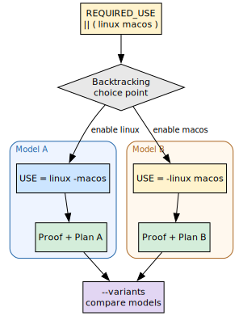

# The Prover

## Domain independence

The central design insight is easy to miss because portage-ng is *about* Gentoo
packages: **the prover does not know what a “package” is.**  It works only with
abstract literals and rules (Logic).  That is deliberate.  It means the reasoning core
can be exercised and tested without importing the whole Portage domain, and the
same engine could — in principle — prove goals in any domain that encodes its
constraints as Horn-style expansions behind a single hook.

The prover’s only contract with the outside world is this: **given a literal,
`rules:rule/2` (or the configured `rule/2` delegate) returns a body — a list of
sub-literals that must hold for the head to hold.**  Everything that makes
Gentoo “Gentoo” — USE flags, slots, version domains, PDEPEND side effects — lives
in the rule layer and in proof-term annotations (`?{Context}`), not in the
prover’s control flow.  The prover walks literals; the domain explains what each
literal means.

That separation is what keeps the implementation in `Source/Pipeline/prover.pl`
readable: backward chaining, cycle handling, context merging, and bookkeeping —
not emerge policy.

The prover is the core reasoning engine of portage-ng.  Given a list of target
literals, it constructs a formal proof that all dependencies can be satisfied —
or completes with explicit assumptions documenting exactly where the dependency
specification is unsatisfiable.


## Why AVL trees?

The prover maintains its main state in **four AVL trees** from
`library(assoc)` (Proof, Model, Constraints, and Triggers — see the module
header in `prover.pl`).  Plain hash tables would win on raw point lookups, but
assoc trees buy a property that matters more here: they are **persistent**
(functional).  Each `put_assoc/4` produces a *new* tree and leaves the previous
one intact.

In Prolog, that lines up with **backtracking**.  When the prover must undo a
choice, variable bindings revert and the “old” assoc values bound in earlier
choice points are still the right snapshots.  A mutable hash map would need an
explicit save/restore discipline on every failure — the sort of manual
undo-stack work traditional Portage does in places, with corresponding risk of
subtle inconsistency.  Here, the data structures and Prolog’s search rule stay
aligned.

Complexity is **O(log n)** per update and lookup.  For on the order of tens of
thousands of literals, that is a small constant number of comparisons (roughly
fifteen for 32,000 entries) — more than fast enough compared with the cost of
calling into domain rules and unification.


## Inductive proof search

The prover performs inductive proof search via backward chaining.  For each literal in the
proof queue:

1. **Check the model.** If the literal is already proven (present in the Model
   AVL), merge contexts via feature term unification and continue.

2. **Check the cycle stack.** If the literal is currently being proved (on the
   stack), handle the cycle:
   - If `heuristic:cycle_benign/1` succeeds, treat it as already proven
     (benign cycle — no assumption recorded).
   - Otherwise, record a cycle-break assumption (`assumed(rule(Lit))` in Proof,
     `assumed(Lit)` in Model).

3. **Expand via `rule/2`.** Call `rules:rule(Lit, Body)` to get the rule body —
   the list of sub-literals that must be proven to justify `Lit`.

4. **Record in Proof.** Store `rule(Lit) → dep(N, Body)?Ctx` in the Proof AVL,
   where `N` is the dependency count.

5. **Record in Model.** Store `Lit → Ctx` in the Model AVL.

6. **Update Triggers.** For each body literal, add `Lit` to its trigger list in
   the Triggers AVL.

7. **Recurse.** Add the body literals to the proof queue and continue.

Steps 1 and 6 are where **prescient proving** and the **reverse-dependency
index** connect; the sections below unpack those ideas.


## Proof term structure

The Proof AVL maps rule keys to structured values:

```prolog
rule(Lit) → dep(DepCount, Body)?Ctx
```

| **Field** | **Meaning** |
| :--- | :--- |
| `rule(Lit)` | The literal that was proven |
| `DepCount` | Number of dependencies (body length) |
| `Body` | List of body literals |
| `Ctx` | Context under which the literal was proven |

The dependency count is stored alongside the body because it is used
by downstream stages without having to recompute it.  The planner
uses it to determine the **fan-out** of each node when building topological
waves: a literal with many dependencies is heavier to schedule than one
with few.  The printer uses it to produce indentation and step counts
in the plan output.  Storing the count once, at proof time, avoids
repeated `length/2` calls over the same body list during planning and
printing.

Special keys:
- `assumed(rule(Lit))` with `dep(-1, Body)?Ctx` — prover cycle-break
- `rule(assumed(Lit))` with `dep(0, [])?Ctx` — domain assumption

### Concrete Proof AVL entry

The literal itself is still just a term the prover passes through; the `portage://`
prefix and atom naming are domain choices.  A representative Proof entry after
expanding an install goal might look like this (body shortened):

```prolog
rule(portage://'sys-apps/portage-3.0.77-r3':install)
  → dep(5,
        [ portage://'dev-lang/python-3.12.3':install,
          portage://'sys-libs/glibc-2.40-r5':install,
          … ])?{[ self(portage://'sys-apps/portage-3.0.77-r3'),
                … ]}
```

So the Proof AVL answers: **which rule instance was used**, **how many
dependencies** it had, **what the body literals are**, and **under which
`?{Context}` list** that expansion was valid.  The exact features inside `?{…}`
are documented in [Chapter 5: Proof Literals](05-doc-proof-literals.md); the
prover treats them as data merged by feature term unification, not as special cases.


## Model construction



The Model AVL records every proven literal with its context.  It serves two
purposes:

1. **Memoization.** When a literal is encountered again, the prover checks the
   model first.  If found, it merges the new context with the existing one via
   feature term unification rather than re-proving the literal (when the incoming context is
   not already equivalent to the stored one — see below).

2. **Plan generation.** The planner reads the model to determine which literals
   are in the proof and what contexts they carry.

A lightweight variant, `prove_model`, skips Proof and Triggers bookkeeping for
internal query-side model construction where only the model is needed.

### Concrete Model AVL entry

Model entries are simpler: **literal → context** under which it was last
committed to the proof.

```prolog
portage://'dev-libs/openssl-3.3.2':install
  → [ build_with_use:use_state([ssl], []),
      … ]
```

Multiple features can accumulate in that list as different dependency paths
impose different requirements; the merge semantics are defined by the domain’s
feature term unification (`sampler:ctx_union/3`).

### Re-encountering a literal: feature term unification

When the queue delivers the same `Lit` again with a **new** `?{Context}`:

1. The prover finds `Lit` in the Model AVL (with stored context `OldCtx`).
2. If the new context is semantically the same as the stored one (`prover:proven/3`),
   nothing more is done — no second expansion.
3. Otherwise it merges contexts via feature term unification (`sampler:ctx_union/3`).  If the merge fails (e.g. conflicting
   USE enable/disable sets), the goal fails and ordinary Prolog backtracking
   retracts the choice that led to the clash.
4. If the merge succeeds, the prover may **re-call `rule/2`** on a canonical
   literal carrying `MergedCtx`, **subtract** the previously proven body from the
   new body, and prove only the **difference** — updating Proof, Model, and
   Triggers incrementally and storing `Lit → MergedCtx` in the Model.

So “seen before” does not mean “frozen forever”; it means **accumulate
constraints and re-expand only what new information demands.**


## Prescient proving



When a literal is re-encountered with a changed context (e.g. new USE
requirements from a different dependency path), the prover merges contexts via
feature-unification and re-expands only the difference.  This is called
**prescient proving** because knowledge about constraints imposed later in the
proof is incorporated into earlier decisions **without** unwinding the whole
branch and starting the literal from scratch.

### Walkthrough: two paths into `dev-libs/openssl`

Imagine two dependency paths that both need `dev-libs/openssl:install`:

- Path A pulls it in with **USE `ssl`** required in the build set.
- Path B pulls it in with **USE `threads`** required.

**Without** prescient-style merging, a naive story would be: prove openssl once
under path A’s context; later, when path B arrives with incompatible or extra
requirements, discover that the earlier proof was too weak and **backtrack far
enough to re-prove** openssl under a wider or corrected context — repeating work
and thrashing the search.

**With** prescient proving, the second encounter does not throw away the first.
The prover merges the proof-term contexts:

```
First encounter:   openssl:install ?{use_state([ssl],       [])}
Second encounter:  openssl:install ?{use_state([threads],   [])}
After unification: openssl:install ?{use_state([ssl,threads],[])}
```

The merged context commits openssl to satisfying **both** paths at
once.  The prover then checks whether this wider context is still
consistent with every constraint the rules attach to that literal —
profile masks, `REQUIRED_USE`, version domains, and so on.

- If the check **succeeds**, no full re-proof is needed.  The prover
  re-expands the rule under the merged context and proves only the
  **new** body literals that the wider context introduces beyond what
  was already established.
- If the check **fails** (for example, contradictory flags — a USE
  flag required both enabled and disabled), the merge is rejected and
  the prover **backtracks** to try another candidate.

That is the sense in which the prover is “prescient”: **later
requirements are folded into the context of an earlier proof step**
through merging and targeted re-expansion, rather than discovering the
conflict only after committing to a too-narrow past choice.


## Triggers and the reverse-dependency index



The Triggers AVL is the piece that makes prescient updates
**addressable**: it records, for each body literal, **which rule heads
depend on it**.

### Construction

When the prover proves head literal **A** with body **[B, C, D]**, it
extends the Triggers AVL with three reverse edges:

```
Proof (forward):     rule(A) → dep(3, [B, C, D])

Triggers (reverse):  B → [A, …]
                     C → [A, …]
                     D → [A, …]
```

In general, for a rule `rule(H, Body)` where `Body = [L₁, L₂, …, Lₙ]`,
the operation `add_triggers/4` inserts:

> For each Lᵢ ∈ Body: &ensp; Triggers[Lᵢ] := [H | Triggers[Lᵢ]]

Each time a rule is recorded or re-recorded (including after a
prescient merge), these reverse edges are extended so the index stays
consistent with the current bodies.

### Concrete example

Suppose the prover establishes:

```
rule(sys-apps/portage:install) → dep(3, [dev-lang/python:install,
                                          dev-libs/openssl:install,
                                          sys-libs/glibc:install])
```

The Triggers AVL then contains:

```
dev-lang/python:install  → [sys-apps/portage:install, …]
dev-libs/openssl:install → [sys-apps/portage:install, …]
sys-libs/glibc:install   → [sys-apps/portage:install, …]
```

If openssl’s context later changes (prescient merge adds a new USE
flag), the prover can look up `Triggers[dev-libs/openssl:install]` in
O(log n) time and immediately find that `sys-apps/portage:install`
needs to be revisited.

### Forward vs reverse lookup

The Proof and Triggers AVLs are **duals** of each other:

| **Direction** | **AVL** | **Lookup** | **Answers** |
| :-- | :-- | :-- | :-- |
| Forward | Proof | `rule(H) → dep(N, Body)` | What does H depend on? |
| Reverse | Triggers | `L → [H₁, H₂, …]` | Who depends on L? |

Together they form a **bidirectional dependency graph**: Proof walks
forward from heads to bodies; Triggers walks backward from bodies to
heads.

### Downstream use

Later phases — planners, schedulers, diagnostics — use Triggers to
answer **“if this literal moves, what else moves?”** in logarithmic
time per lookup.  Without these reverse edges, nothing in the pipeline
could enumerate which install heads depended on a given dependency
literal, and the graph carried out of proving would be incomplete for
anything that walks dependencies backwards.


## Entry rules and `prove_plan/5`



The standard pipeline entry point is `prove_plan/5`, which chains
three stages:

```prolog
pipeline:prove_plan(Goals, ProofAVL, ModelAVL, Plan, TriggersAVL)
```

1. `prover:prove/9` — constructs Proof, Model, Constraints, and Triggers
2. `planner:plan/5` — wave planning for the acyclic portion
3. `scheduler:schedule/6` — SCC/merge-set scheduling for the remainder

The prover is wrapped in `with_reprove_state` which saves and restores the
learned constraint store across reprove retries.  Inside that,
`prove_with_retries` catches `prover_reprove` exceptions and restarts up to
`reprove_max_retries` times (default 3).

See [Chapter 9: Assumptions and Constraint Learning](09-doc-prover-assumptions.md)
for the reprove mechanism in detail.


## Multiple stable models



The prover can produce different solutions (stable models) of the USE flag
configuration space.  Using Prolog's built-in backtracking, different valid
configurations of the same target can be explored and compared.

For example, a `REQUIRED_USE="|| ( linux macos )"` constraint yields two stable
models:

```
Model A:  USE="linux -macos"     Model B:  USE="-linux macos"
```

The `--variants` CLI option enables this mode, running the prover with different
USE flag configurations via `variant:use_override` and
`variant:branch_prefer`.


## Proof obligations

After a literal is proven, the prover queries the domain for additional proof
obligations via `heuristic:proof_obligation/4`.  This lets the domain inject
derived obligations — extra literals to be appended to the proof queue —
without the prover understanding domain-specific semantics.

PDEPEND dependencies are handled this way: they are discovered only after a
literal is resolved and are injected as proof obligations via
`rules:literal_hook/4`.


## Further reading

- [Chapter 9: Assumptions and Constraint Learning](09-doc-prover-assumptions.md) —
  the reprove mechanism and constraint learning
- [Chapter 5: Proof Literals](05-doc-proof-literals.md) — the literal format
- [Chapter 11: Rules and Domain Logic](11-doc-rules.md) — how `rule/2` works
- [Chapter 4: Architecture Overview](04-doc-architecture.md) — the full pipeline
