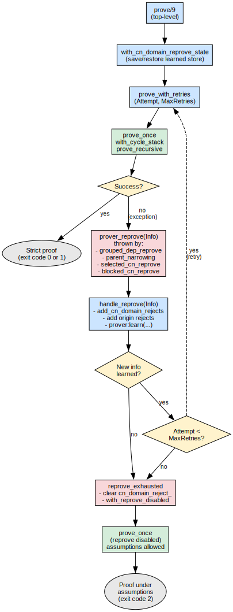
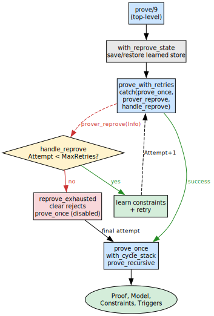
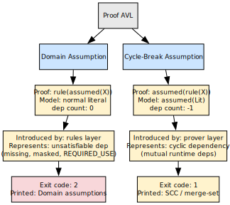
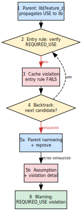
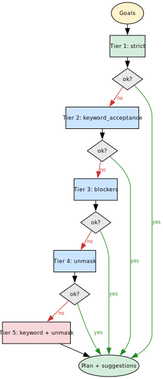

# Assumptions and Constraint Learning

## Always a proof, never a dead end

Most dependency resolvers stop when they cannot satisfy a constraint: no
solution, no plan, and often little more than a terse error.  portage-ng
takes a different stance.  **It does not give up.**  When every
above-board alternative has been exhausted, the prover records an
**assumption** — effectively: “I am proceeding *as if* this dependency
could be satisfied” — and continues building the proof.

The outcome is **always** a complete plan.  Either the proof is **strict**
(no assumptions), or it is a proof **under assumptions**, with the
unresolved fragments called out explicitly.  Assumptions are not
treated as opaque failures; they are **proposals**.  They tell you which
pieces of configuration or tree state would need to change for the same
reasoning chain to become a strict proof.  This is the same habit of mind
as in mathematics: *“Assuming the Riemann hypothesis, we can prove …”* —
the argument is valid *conditional* on the assumptions; make them true,
and the condition disappears.

The sections below walk through a concrete missing-dependency example,
then explain how suggestion tags turn assumptions into actionable hints.
After that, the chapter documents the same mechanisms in technical
detail: assumption taxonomy, reprove loop, REQUIRED_USE flow, entry
rules, constraint guards, progressive relaxation, assumption printing,
and the analogy to conflict-driven clause learning.

## Worked assumption example: missing `dev-libs/foo`

Suppose the user runs:

```text
portage-ng --pretend some-package
```

and some package in the graph depends on **`dev-libs/foo`**, which has **no
ebuild** in any repository the knowledge base knows about.

**What the prover does**

1. The **grouped package dependency** rule tries to prove the dependency
   by enumerating candidates for category `dev-libs` and name `foo`.
2. **Search returns no entries** — there is nothing to install, so every
   candidate path fails.
3. After **backtracking** exhausts those paths, the **fallback chain**
   runs (parent narrowing, reprove with learned domains, and so on, as
   documented below).  None of that invents a missing package.
4. The domain layer finally takes the **assumption path**: it builds a
   condition whose head is `assumed(grouped_package_dependency(…))`, tags
   the proof-term context with a reason (and optional suggestions), and
   the catch-all rule `rule(assumed(_), [])` lets the prover close that
   branch of the proof.

**What appears in the Proof AVL**

The proof tree stores a **domain assumption** with a key of the form
`rule(assumed(Lit))`, where `Lit` is the grouped-dependency literal.  For
example (category and name as atoms, dependency list abbreviated):

```prolog
rule(assumed(grouped_package_dependency('dev-libs', 'foo', …):config?{Ctx}))
    → dep(0, [])?Ctx
```

The exact `Action` (`:config`, `:install`, `:run`, …) depends on which
phase of the grouped dependency is being proved; the important invariant
is the **`rule(assumed(...))`** proof key (see [Assumption Taxonomy](#assumption-taxonomy)).

**What the user sees in the plan output**

The printer classifies this as a non-existent dependency and emits a
**Domain assumptions** block, along the lines of:

```text
Domain assumptions: dev-libs/foo (non-existent)
```

**Exit code**

When any **domain** assumption is present, the CLI exit code is **`2`**
(cycle-break-only assumptions alone yield **`1`**; a fully strict proof
yields **`0`**).

**How to read it**

The message is intentionally operational: **to resolve this assumption,
ensure `dev-libs/foo` is available in your repository** (overlay,
third-party tree, or corrected package name).  The plan is still a
single coherent merge order; the assumption marks the gap between what the
prover can justify from facts and what you must supply from outside.

## Assumptions as actionable proposals

Many assumptions carry **`suggestion(Type, Detail)`** (and related) tags
in the literal’s **`?{Context}`** list.  These encode **configuration
changes** that would move the proof toward strictness — often the same
changes the **progressive relaxation** tiers simulate when you widen
`assuming/1` flags.

Typical shapes in the codebase include:

| **Tag (representative)** | **User-facing intent** |
|:---------------------|:-------------------|
| `suggestion(keyword, '~amd64')` | Accept the unstable keyword — e.g. add to **`package.accept_keywords`** (in sources: `suggestion(accept_keyword, '~amd64')`) |
| `suggestion(unmask, …)` | Unmask the package — e.g. **`package.unmask`** (`Repo://Entry` when known) |
| `suggestion(use, …)` | Adjust USE flags — e.g. **`package.use`** (in sources: `suggestion(use_change, Repo://Entry, Changes)`) |

When you run in modes that **apply** suggestions (see the builder’s
`execute_suggestion/…` hooks), those changes are **already reflected in
the plan**; your job is to **review and approve** them in your real
`/etc/portage` layout, or to treat the tags as a checklist for manual
edits.  [Progressive Relaxation](#progressive-relaxation) ties the same
ideas to the `assuming` tiers (`keyword_acceptance`, blockers, `unmask`).

## Overview



The portage-ng prover builds a formal proof that a set of target packages
can be installed.  The proof is an AVL tree mapping literals to their
justifications.  When part of the dependency graph cannot be satisfied,
the prover records *assumptions* — lightweight markers that let the proof
complete while flagging the unresolved fragment for the user.

Two fundamentally different kinds of assumptions exist, and a bounded
reprove mechanism allows the prover to retry the proof with accumulated
knowledge before resorting to assumptions.



## Data Structures

The prover maintains four AVL trees during proof construction:

| **AVL** | **Key → Value** | **Purpose** |
| :----------- | :------------------------------------ | :----------------------------------- |
| Proof     | `rule(Lit)` → `dep(N, Body)?Ctx`   | Which rule justified Lit          |
| Model     | `Lit` → `Ctx`                      | Every proven literal + context    |
| Constraints | constraint key → value           | Accumulated constraint terms      |
| Triggers  | `BodyLit` → `[HeadLit, …]`        | Reverse-dependency index          |

## Assumption Taxonomy



The two kinds of assumptions are stored differently in the Proof and
Model trees.  Confusing them leads to wrong statistics, wrong plan
output, or missed warnings.

### Domain Assumptions (`rule(assumed(X))`)

Introduced by the **rules layer** when a dependency cannot be satisfied
— for example, a package that does not exist in the tree, or a
REQUIRED_USE violation that makes every candidate invalid.

**How they are created:**

The `grouped_package_dependency` rule exhausts all candidates (via
Prolog backtracking), then the fallback chain (parent narrowing →
reprove → assumption), and finally emits:

```prolog
Conditions = [assumed(grouped_package_dependency(C,N,Deps):Action?{Ctx})]
```

The `assumed(X)` literal in the body is proved by the catch-all rule:

```prolog
rule(assumed(_), []) :- !.
```

This stores `rule(assumed(X))` in the Proof tree.

**Where they appear:**
- Proof: `rule(assumed(X))` → `dep(0, [])?Ctx`
- Model: the enclosing literal's entry (normal)
- Plan: rendered as "verify" steps + "Domain assumptions" warning block

### Prover Cycle-Break Assumptions (`assumed(rule(X))`)

Introduced by the **prover** when it detects a cycle during proof
search.  If a literal is already on the cycle stack (currently being
proved), the prover cannot recurse further without diverging.  Instead,
it records a cycle-break:

```prolog
put_assoc(assumed(rule(Lit)), Proof, dep(-1, OldBody)?Ctx, Proof1),
put_assoc(assumed(Lit), Model, Ctx, NewModel)
```

**Where they appear:**
- Proof: `assumed(rule(Lit))` → `dep(-1, Body)?Ctx`
- Model: `assumed(Lit)` → `Ctx`
- Plan: SCC / merge-set scheduling; cycle explanation via `cycle:*`

### Summary Table

| **Property** | **Domain Assumption** | **Prover Cycle-Break** |
| :------------------------ | :---------------------------- | :---------------------------- |
| Proof key              | `rule(assumed(X))`         | `assumed(rule(X))`         |
| Model key              | (normal literal)           | `assumed(Lit)`             |
| dep count              | 0                          | -1                         |
| Introduced by          | rules layer                | prover layer               |
| Represents             | unsatisfiable dependency   | cyclic dependency          |
| Printed as             | "Domain assumptions"       | cycle break (SCC)          |
| Exit code contribution | 2                          | 1                          |

## Reprove Mechanism

When a conflict is detected during proof search, the domain layer does
not simply fail — it records what went wrong and requests a retry with
refined knowledge.

### Triggering Reprove

Several predicates can throw `prover_reprove(Info)`:

| **Source** | **When** |
| :--------------------------------- | :--------------------------------------------- |
| `maybe_request_grouped_dep_reprove` | Effective domain conflicts with selected CN; domain inconsistent; version/slot constraints present |
| `maybe_learn_parent_narrowing`  | Parent introduced a dep that made (C,N) unsatisfiable; learns to exclude parent version |
| `selected_cn_unique_or_reprove` | CN-domain constraint conflicts with already-selected candidate (constraint guard) |
| `selected_cn_not_blocked_or_reprove` | Blocker detected via blocked source snapshot |

Each throws `prover_reprove(cn_domain(C, N, RejectDomain, Candidates, Reasons))`.

### Handling Reprove

When `prove_with_retries` catches a `prover_reprove(Info)` exception,
it delegates to `heuristic:handle_reprove/2`, which proceeds in three
steps:

1. **Record what went wrong.**  The handler extracts the conflicting
   category, name, domain, and candidate list from `Info` and adds
   them to a reject set (`memo:cn_domain_reject_`).  If the conflict
   was introduced by a specific parent, that origin is also recorded
   so the prover avoids the same path on the next attempt.

2. **Decide whether to retry.**  If new information was actually
   learned (`Added = true`) and the attempt count is still below
   `reprove_max_retries`, the handler restarts the proof from scratch
   by calling `prove_with_retries` with an incremented attempt
   counter.  The learned rejects carry over, so the prover will not
   repeat the same conflict.

3. **Give up gracefully.**  If nothing new was learned, or the retry
   budget is exhausted, the handler calls `reprove_exhausted`, which
   **clears** the reject set so the final attempt runs unbiased.  It
   then invokes `prove_once` with reprove **disabled** — no further
   `prover_reprove` exceptions can be thrown, so the proof completes
   with assumptions where necessary.

### Learned Constraint Store

The `prover:learn/3` and `prover:learned/2` predicates maintain a
key-value store that **persists across reprove retries** within the same
top-level `prove/9` invocation.  This is distinct from the reject set
(which accumulates and is cleared on exhaustion).

The domain uses learned constraints for:

- **Candidate narrowing** — `grouped_dep_effective_domain` intersects
  the local+context domain with any learned domain.
- **Conflict learning** — constraint guards learn the domain when a
  conflict is detected.
- **Parent narrowing** — `maybe_learn_parent_narrowing` learns to
  exclude the parent version when a child dep cannot be satisfied.

### Retry Budget

`reprove_max_retries` defaults to 20 (configurable via
`config:reprove_max_retries/1`).  The final attempt runs with reprove
disabled so the proof can complete with assumptions if necessary.

## Use model violation flow

When a parent package forces USE flags on a dependency via bracketed USE
deps (e.g. `cat/pkg[feature]`), and the dependency's `REQUIRED_USE`
forbids that flag combination, the REQUIRED_USE violation mechanism
ensures the prover explores alternatives before assuming.

### Step-by-step flow

{width=42%}

The diagram above shows the six stages the prover walks through when
a parent forces a USE flag that violates a dependency's REQUIRED_USE.
Each step is explained below.

**Step 1 — USE propagation.**
The parent atom `cat/app` depends on `cat/lib[feature_z]`.
The bracketed flag is carried forward as a `build_with_use` context
annotation, so every candidate version of `lib` will be evaluated with
`feature_z` enabled.

**Step 2 — Entry rule verification.**
When `lib`'s `:install` (or `:run`) entry rule fires, it computes the
full USE model and calls `use:verify_required_use_with_bwu` to check
whether the resulting flag set satisfies `lib`'s `REQUIRED_USE`
expression.

**Step 3 — Fail, not assume.**
If verification fails (e.g. `lib` declares `REQUIRED_USE=!feature_z`),
the entry rule caches a structured violation description via
`memo:requse_violation_/3` and then **fails**.  It does *not* produce an
assumption, because doing so would hide the failure from the candidate
selection logic and bypass the entire reprove mechanism.

**Step 4 — Candidate backtracking.**
The failure propagates back to `grouped_package_dependency`, which tries
the next candidate version of `lib`.  A different version may have a
different `REQUIRED_USE` that does not conflict with `feature_z`.

**Step 5a — Parent narrowing + reprove.**
When all candidates are exhausted, the fallback chain activates.
`maybe_learn_parent_narrowing` learns to exclude the current parent
version (`app-1.0`) and throws `prover_reprove`, giving the prover a
chance to retry with a different parent that may not force `feature_z`.

**Step 5b — Assumption with violation detail.**
After all reprove retries are exhausted, the prover falls through to the
assumption path.  `explanation:assumption_reason_for_grouped_dep`
retrieves the cached `requse_violation_` info and enriches the
assumption context with a `required_use_violation(...)` tag.

**Step 6 — Warning output.**
The printer recognises the enriched context and emits a structured
REQUIRED_USE violation warning, showing which flags were forced, what
expression they violate, and which parent triggered the conflict.

### Memo cache

The violation info is cached via `memo:requse_violation_/3` (thread-local,
survives backtracking since `assertz` is side-effecting).  It is:
- **Asserted** in the entry rule before failing
- **Consumed** in the `grouped_package_dependency` assumption path
  (retracted after enriching the context)
- **Cleared** by `memo:clear_caches/0` at the start of each proof run

## Entry rule structure

Every `:install` and `:run` entry rule follows the same layered
structure.  Understanding this structure is important because it
explains *when* the prover fails, *when* it assumes, and *why* the
distinction matters.

**Gate checks.**
The rule begins with a deterministic cut (`!`) — there is exactly one
entry-rule clause per literal form, so Prolog must not search for
alternatives at this level.  Candidate alternatives are provided one
level up by `grouped_package_dependency`.  After the cut, three quick
gate checks run in order:

1. **Mask gate** — if the ebuild is masked and the `unmask` relaxation
   tier is not active, the rule fails immediately.
2. **Keyword gate** — if no accepted keyword exists and
   `keyword_acceptance` is not active, the rule fails.
3. **Already-installed short-circuit** — if the package is already
   installed (and `--emptytree` was not requested), the rule succeeds
   with an empty condition list.  Nothing further needs to be proved.

**USE model verification.**
When none of the gates apply, the rule queries the ebuild's metadata
and computes the full USE model (combining profile defaults,
user overrides, and `build_with_use` annotations from the parent).
It then checks the result against the ebuild's `REQUIRED_USE`
expression.  If the check fails, the violation is cached
(`memo:requse_violation_/3`) and the rule fails — *not* assumes — so
that backtracking can explore other candidate versions (see section
9.8.1).

**Dependency model construction.**
If the USE model passes, the rule builds the dependency model:
it looks up cached or freshly computed dependency lists, orders them,
and returns the full condition list (selected CN, constraints,
download literal, dependency literals, etc.).

If the dependency model itself cannot be built — for example because
every branch of an `any_of_group` is filtered out — the rule produces
a domain assumption tagged with `issue_with_model`.  This is
deliberately an assumption rather than a failure, because the problem
is intrinsic to the ebuild metadata, not something that trying a
different candidate version would resolve.

## Constraint guards and reprove integration

Every time the prover unifies a new constraint term into the proof, it
calls `rules:constraint_guard(Key, Constraints)` to verify that the
constraint is consistent with what has already been proved.  The guard
has three possible outcomes:

- **Succeed silently** — the constraint is compatible and the proof
  continues normally.
- **Fail** — the constraint conflicts with the current proof state.
  Prolog's built-in backtracking explores an alternative within the
  same proof attempt (e.g. a different candidate version).
- **Throw `prover_reprove(...)`** — the conflict cannot be resolved by
  simple backtracking.  The prover catches the exception, records a
  learned constraint, and restarts the proof from scratch with the new
  knowledge (see section 9.7).

Three specialised guards in `candidate.pl` cover the most common
conflict types:

- **`selected_cn_unique_or_reprove`** checks that the selected
  category/name pair is consistent with prior selections.  If two
  dependency paths select different versions of the same package in the
  same slot, this guard detects the inconsistency and triggers a
  reprove with a narrowed domain.
- **`selected_cn_not_blocked_or_reprove`** enforces blocker
  constraints.  When a package is blocked by another package that has
  already been selected, this guard triggers a reprove so the prover
  can learn to avoid the blocked combination.
- **`maybe_request_cn_domain_reprove`** handles remaining domain
  inconsistencies.  If the selected version falls outside the
  intersection of all accumulated version domains, the guard learns
  the correct domain and triggers a reprove.

The constraint guards above operate within a single proof attempt.
But what happens when the entire proof cannot succeed under strict
constraints?  Rather than immediately falling through to assumptions,
the pipeline offers one more tool: progressive relaxation.

## Progressive Relaxation



Not every dependency graph can be satisfied under the strictest
interpretation of the repository metadata.  A package may exist only
with an unstable keyword, or be masked by the profile, or conflict with
an already-installed blocker.  Rather than giving up at the first such
obstacle, the pipeline applies **progressive relaxation**: it re-runs
the entire proof under successively weaker constraints until a complete
plan emerges.

The mechanism lives in `pipeline:prove_plan_with_fallback/6`.  Each
tier wraps the prover call inside `prover:assuming/2`, which sets a
dynamic flag that the domain rules consult at decision points.

| **Tier** | **`assuming` flag** | **What is relaxed** |
|:-----|:----------------|:----------------|
| 1 (strict) | none | All masks, keywords, and blockers enforced |
| 2 | `keyword_acceptance` | Unstable keywords (`~amd64`) accepted |
| 3 | `blockers` | Blocker constraints downgraded to warnings |
| 4 | `unmask` | Masked packages unmasked |
| 5 | `keyword_acceptance` + `unmask` | Both relaxations combined (last resort) |

The tiers are tried in order via Prolog's committed-choice
if-then-else (`->` / `;`) — the first tier that succeeds commits
and returns a `FallbackUsed` tag (`false`, `keyword_acceptance`,
`blockers`, `unmask`, or `keyword_unmask`).

The same 5-tier fallback chain is shared by two canonical entry
points in the pipeline module:

- `prove_plan_with_fallback/5` — full pipeline (prove + plan + schedule),
  used by production paths (`--pretend`, `--graph`, `--build`).
- `prove_with_fallback/4` — prover only (no plan/schedule), used by
  layered tests (`prover:test`, `planner:test`, `scheduler:test`)
  and `--bugs`.  Each test layer adds its own stages on top.

### How `assuming/2` works

`prover:assuming(Flag, Goal)` stores a dynamic flag
(`prover_assuming_<Flag>`) for the duration of `Goal`, using
`setup_call_cleanup` to guarantee cleanup even on exceptions.  Domain
predicates test this flag with the zero-argument
`prover:assuming(Flag)`:

- **`candidate:eligible/1`** — when `keyword_acceptance` is active,
  candidates with any keyword are accepted; when `unmask` is active,
  masked candidates pass.
- **`candidate:accepted_keyword_candidate/7`** — two fallback clauses
  widen the candidate pool: one for unstable keywords, one for masked
  packages.
- **`candidate:assume_blockers/0`** — returns `true` when blocker
  constraints should become warnings instead of hard failures.

### Suggestion tags

When a relaxation flag is active and a candidate is admitted under that
relaxation, the domain tags the literal's context with a
**`suggestion/2`** term that records exactly which configuration change
would eliminate the need for the relaxation:

| **Suggestion tag** | **Meaning** | **Target file** |
|:---------------|:--------|:------------|
| `suggestion(accept_keyword, '~amd64')` | Accept the unstable keyword | `package.accept_keywords` |
| `suggestion(unmask, R://E)` | Unmask the package | `package.unmask` |
| `suggestion(use_change, R://E, Changes)` | Adjust USE flags | `package.use` |

These tags flow through the proof into the plan output.  In builder
mode, `builder:dispatch_suggestions/1` can apply the suggestions
automatically (writing to `/etc/portage/package.*` files); in pretend
mode, they appear as actionable hints in the plan output.

### Formal guarantee

Each tier still produces a **complete proof** — the plan is always
coherent and fully ordered.  The relaxation only widens the candidate
pool; it does not skip proof obligations or bypass constraint guards.
The suggestion tags make it possible to **trace back** every relaxation
to a concrete configuration change, so the weaker proof can be
strengthened incrementally.

Once the proof is complete — whether strict or under assumptions —
the results must be communicated to the user.  The assumption printing
pipeline inspects the Proof AVL and translates each assumption into a
classified, actionable message.

## Assumption printing pipeline

After the proof is complete, the printer walks the Proof AVL and
collects every entry that represents an assumption.  Assumptions fall
into two families, and the printer handles them differently.

**Domain assumptions** are stored under `rule(assumed(X))` keys.  These
represent situations where the prover could not find a real rule and
had to accept the literal on faith.  When the printer encounters one,
it inspects the literal and its context to classify the assumption and
produce a meaningful message:

- **REQUIRED_USE violation** — the context contains a
  `required_use_violation(...)` tag (see section 9.8.1).  The printer
  emits a structured block showing which USE flags were forced, which
  `REQUIRED_USE` expression they violate, and which parent caused the
  conflict.
- **Non-existent dependency** — the literal is a
  `grouped_package_dependency` without context.  This means no
  candidate version exists at all (the category/name is not in the
  repository).
- **Grouped dependency with reason** — the literal is a
  `grouped_package_dependency` with an `assumption_reason` tag in its
  context.  The printer extracts the reason label (e.g. "all candidates
  masked", "blocker conflict") and shows it alongside the dependency.
- **Model unavailable** — the context contains `issue_with_model`.
  The dependency model could not be built (e.g. all `any_of_group`
  branches were filtered).  The printer reports this as a metadata
  problem.
- **Generic** — any domain assumption that does not match the above
  patterns is printed with the raw literal for debugging.

**Cycle-break assumptions** are stored under `assumed(rule(X))` keys.
These mark points where the prover broke a dependency cycle by assuming
a literal that was already being proved.  The printer delegates to
`cycle:print_cycle_explanation`, which reconstructs the cycle path and
explains which packages form the loop.

### Assumption type classification

The classification logic lives in `assumption.pl`.  Given an assumption
literal and its context, it returns a type tag that the warning printer
uses to select the appropriate output format:

| **Pattern** | **Type tag** |
| :--- | :--- |
| Context contains `required_use_violation` | `required_use_violation` |
| `grouped_package_dependency` (no context) | `non_existent_dependency` |
| `grouped_package_dependency` (with context) | Extracted from `assumption_reason` |
| `R://E:install` | `assumed_installed` |
| `R://E:run` | `assumed_running` |
| Blocker literal | `blocker_assumption` |
| Context contains `issue_with_model` | `issue_with_model` |

The combination of learned constraints, constraint guards, and
progressive relaxation is reminiscent of a well-known technique from
the SAT solving world.

## Conflict-driven clause learning connection

The learned constraint store is analogous to CDCL (Conflict-Driven Clause
Learning) in SAT solvers, but expressed as version domains rather than
boolean clauses:

| **CDCL concept** | **portage-ng equivalent** |
| :--- | :--- |
| Conflict analysis | Constraint guard detecting domain inconsistency |
| Learned clause | `prover:learn(cn_domain(C,N,S), NarrowedDomain, _)` |
| Unit propagation | `grouped_dep_effective_domain` applying learned domains |
| Restart | `prover_reprove` catch-and-retry loop |
| Decision level | Reprove attempt number |

The key difference is granularity: CDCL operates on boolean variables,
while portage-ng operates on version domains — structured sets that carry
more information per constraint.


With the proving and output mechanisms described, the following
sections cover practical aspects: a testing checklist to catch
regressions, and a source file map for navigating the codebase.

## Testing learned constraints

When testing changes to the reprove or assumption mechanism, the
following checklist helps catch regressions quickly:

- **Exit code** — the process exit code summarises the proof outcome:
  - `0` — no assumptions at all (clean proof)
  - `1` — only prover cycle-break assumptions
  - `2` — at least one domain assumption (e.g. missing dependency)
- **"Total: N actions"** — this line must appear in the output,
  confirming that the proof completed and a plan was produced.
- **"non-existent" count** — count the lines containing "non-existent"
  to check how many domain assumptions were made.  An unexpected
  increase signals a regression.
- **No "Unknown message"** — the output should not contain "Unknown
  message" or unhandled exception traces.  These indicate an
  assumption type that the printer does not recognise.
- **Runtime** — a single-target proof should complete within a few
  seconds.  A significant increase compared to previous runs suggests
  excessive reprove retries or a learning bug.
- **Test suite** — the overlay and portage test suites
  (`prover:test_stats/1`) should maintain their previous pass rate.
  Any drop indicates that a change has broken handling of a known
  edge case.

## Source File Map

| **File** | **Role** |
| :------ | :------ |
| `Source/Pipeline/prover.pl` | Core proof engine, reprove retry loop, cycle detection, learned store |
| `Source/Domain/Gentoo/rules.pl` | Domain rules: entry rules, grouped deps, `rule(assumed(_),[])` |
| `Source/Domain/Gentoo/Rules/candidate.pl` | Candidate selection, reprove triggers, parent narrowing |
| `Source/Domain/Gentoo/Rules/heuristic.pl` | Reprove state management, reject accumulation |
| `Source/Domain/Gentoo/Rules/memo.pl` | Thread-local caches including `requse_violation_/3` |
| `Source/Domain/Gentoo/Rules/use.pl` | `verify_required_use_with_bwu`, `describe_required_use_violation` |
| `Source/Pipeline/Prover/explanation.pl` | `assumption_reason_for_grouped_dep` diagnosis |
| `Source/Pipeline/Prover/explainer.pl` | `term_ctx/2`, "why" queries |
| `Source/Pipeline/Printer/Plan/assumption.pl` | Assumption type classification |
| `Source/Pipeline/Printer/Plan/warning.pl` | Assumption detail rendering |


## Further reading

- [Chapter 8: The Prover](08-doc-prover.md) — the proof search algorithm
- [Chapter 10: Version Domains](10-doc-version-domains.md) — domain operations
  used by constraint learning
- [Chapter 11: Rules and Domain Logic](11-doc-rules.md) — entry rules, fallback
  chains, and REQUIRED_USE handling
- [Chapter 21: Resolver Comparison](21-doc-resolver-comparison.md) — Zeller,
  Vermeir, and CDCL foundations
