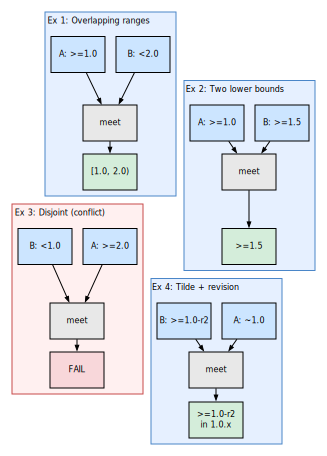
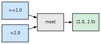
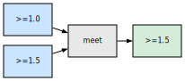
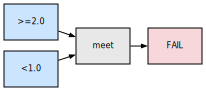
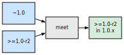
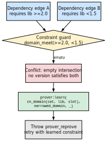
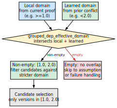

# Version Domains

Version domains are the mechanism by which portage-ng reasons about version
constraints. Every version comparison, every dependency operator (`>=`,
`<=`, `~`, `=*`), and every learned constraint is expressed as an operation
on version domains.

## Why version domains matter

Picture two packages that both pull in `dev-libs/openssl`, but with different
requirements. Package A depends on `>=dev-libs/openssl-3.0`: any OpenSSL from
3.0 upward is acceptable on that path. Package B depends on
`<dev-libs/openssl-3.2`: only versions strictly below 3.2 are acceptable
there. If both constraints apply to the same install, you are not looking for
a single magic number first — you are asking which versions lie in the overlap
of two sets. Versions that satisfy both are exactly those in **3.0 ≤ v < 3.2**:
the half-open interval **[3.0, 3.2)**.

That overlap is the **intersection** (in domain terms, the **meet**) of two
version domains. Version domains represent **sets** of acceptable versions;
combining constraints from different dependency paths means intersecting those
sets until you obtain the tightest description still compatible with
everything seen so far. The rest of this chapter spells out how those sets are
stored, compared, and merged in code.


## Version representation

Versions are stored as `version/7` compound terms:

```prolog
version(NumsNorm, Alpha, SuffixRank, SuffixNum, SuffixRest, Rev, Full)
```

| **Field** | **Example** | **Meaning** |
| :--- | :--- | :--- |
| `NumsNorm` | `[3,0,77]` | Normalized numeric components |
| `Alpha` | `''` or `'a'` | Alpha suffix (empty atom if none) |
| `SuffixRank` | `4` | Numeric rank of version suffix (`_alpha`=1, `_beta`=2, `_pre`=3, `_rc`=4, (none)=5, `_p`=6) |
| `SuffixNum` | `0` | Suffix number (e.g. `3` in `_rc3`) |
| `SuffixRest` | `''` | Additional suffix components |
| `Rev` | `3` | Revision number (from `-r3`) |
| `Full` | `'3.0.77-r3'` | Original version string |

Empty or absent versions use the atom `version_none`.


## Version comparison

Versions are compared using Prolog's standard `compare/3` directly on the
compound term. No runtime key conversion is needed — the `version/7`
structure is designed so that standard term ordering produces correct PMS
version ordering:

```prolog
compare(Order, version([3,0,77],...), version([3,1,0],...))
% Order = (<)
```

This works because:
- `NumsNorm` is a list of integers (lexicographic list comparison)
- `SuffixRank` maps suffixes to integers in PMS order
- `Rev` is a plain integer


## Version domain model

A version domain represents a set of acceptable versions for a package.
It is stored as:

```prolog
version_domain(Slots, Bounds)
```

| **Field** | **Type** | **Meaning** |
| :--- | :--- | :--- |
| `Slots` | list or `any` | Acceptable slots (or `any` for unconstrained) |
| `Bounds` | structured term | Version bounds (upper, lower, exact, wildcard) |

The `none` atom represents an unconstrained domain (all versions accepted).


## Domain operations

### Domain meet (intersection)

{width=70%}

When two dependency paths impose different version constraints on the same
package, the domains are intersected:

```prolog
version_domain:domain_meet(Domain1, Domain2, Intersection)
```

The intersection computes the tightest bounds that satisfy both constraints.
If the intersection is empty (no version satisfies both), the goal fails:
there is no `Intersection` term that stays consistent with the combined
bounds (and related checks such as slot compatibility).

### Worked examples (meet in practice)

The following sketches use dependency-style wording; internally each side
becomes a `version_domain/2` (or `none`) whose bounds are merged by
`domain_meet/3`. Intuitively, **meet = AND** over acceptable versions.

**Example 1 — overlapping range.**

{width=35%}

Lower bound `>=1.0` and upper bound `<2.0` describe the half-open interval
**[1.0, 2.0)**.  The meet is that interval: every version that satisfies both
operators is exactly a version at least 1.0 and strictly below 2.0.

**Example 2 — two lower bounds.**

{width=35%}

`>=1.0` meets `>=1.5`.  The stricter requirement wins: the intersection is
**`>=1.5`**.  Anything below 1.5 was already ruled out by the second constraint.

**Example 3 — disjoint constraints (conflict).**

{width=35%}

`>=2.0` meets `<1.0`.  No version can be simultaneously at least 2.0 and below
1.0.  `domain_meet/3` **fails**: the normalised domain is empty, and the prover
must treat this as an unsatisfiable combined requirement.

**Example 4 — tilde vs revision-aware lower bound.**

{width=35%}

`~1.0` (in PMS terms: same main version as `1.0`, any revision) restricts
candidates to the **1.0** line.  Meeting that with `>=1.0-r2` keeps you on that
line but drops revisions below `-r2`: the effective set is **`>=1.0-r2` within
the 1.0.x family**, not a broader branch of the package.

In all cases, when the meet succeeds, candidate selection and consistency
checks use the **narrower** domain; when it fails, there is no shared non-empty
set of versions to choose from.

### Consistency check

```prolog
version_domain:domain_consistent(Domain)
```

Verifies that a domain is non-empty — that at least one version in the
repository satisfies the bounds.


## Feature logic intuition

In Zeller-style **feature logic**, a *feature* describes a set of objects that
share certain properties — not necessarily a single object, but a
well-bounded *set* described by those properties. A **version domain** is the
same idea at the version level: it is a feature whose extension is the set of
versions that satisfy given slot and bound constraints (above a threshold,
below a threshold, exact match, tilde range, wildcard prefix, and so on).

**Feature unification** — meeting two features so that an object must satisfy
both — corresponds directly to **domain intersection**. This is not merely a
pedagogical analogy: portage-ng wires version domains into the generic
unification hook in `feature_unification:val_hook/3`, so that merging domain
values follows the same meet operation as `version_domain:domain_meet/3`.

A practical consequence is **monotonic narrowing**: along a resolution path,
domains only become *tighter* (fewer acceptable versions), never wider, unless
explicitly reset by a broader reprove strategy. Each successful refinement
shrinks the search space; that is why successive reprove attempts can be viewed
as making measurable progress toward either a concrete choice or a clear
conflict.


## Learned domain narrowing

The prover's learned constraint store uses version domains to carry
narrowed version information across reprove retries.  Each learned
constraint is keyed by a category–name–slot triple:

```prolog
cn_domain(Category, Name, Slot)
```

### Conflict detection and learning

When two dependency edges impose incompatible version requirements on
the same package, the constraint guard detects an empty intersection
and records a narrowed domain for future attempts.

{width=45%}

The guard calls `domain_meet/3` on the two incoming domains.  When the
result is empty (no version satisfies both), the guard stores the
narrowed domain via `prover:learn/3` and throws `prover_reprove` to
restart the proof with this new knowledge.

### Applying learned domains on reprove

On the next reprove attempt, `grouped_dep_effective_domain` intersects
the learned domain with the local domain coming from the current proof
context, *before* candidate selection begins.

{width=50%}

If the intersection is **non-empty**, candidates are filtered against
the stricter combined domain — avoiding the same dead-end choice that
caused the previous conflict.  If the intersection is **empty**, there
is no compatible overlap left: the prover can skip directly to
assumption or failure handling instead of selecting candidates from an
empty domain.

Chapter 9 walks through the reprove and learning mechanics in full;
Chapter 11 ties domains into rule evaluation and candidate generation.

### Connection to feature logic

This mechanism is inspired by Zeller's feature logic: version sets are
identified by feature terms and refined by incrementally narrowing the
set until each component resolves to a single version.  Each successful
`learn` call tightens the feature, and each `grouped_dep_effective_domain`
call applies the accumulated tightening — a direct realisation of
monotonic domain narrowing.


## Version operators

The EAPI grammar supports the following version operators, each producing
a different domain constraint:

| **Operator** | **Syntax** | **Domain meaning** |
| :--- | :--- | :--- |
| `>=` | `>=cat/pkg-1.0` | Lower bound: version >= 1.0 |
| `<=` | `<=cat/pkg-2.0` | Upper bound: version <= 2.0 |
| `>` | `>cat/pkg-1.0` | Strict lower bound |
| `<` | `<cat/pkg-2.0` | Strict upper bound |
| `=` | `=cat/pkg-1.0` | Exact version match |
| `~` | `~cat/pkg-1.0` | Version match ignoring revision (any `-rN`) |
| `=*` | `=cat/pkg-1*` | Wildcard: any version starting with `1` |


## Further reading

- [Chapter 9: Assumptions and Constraint Learning](09-doc-prover-assumptions.md) —
  how domains interact with the reprove mechanism
- [Chapter 11: Rules and Domain Logic](11-doc-rules.md) — how version domains
  feed into candidate selection
- [Chapter 21: Resolver Comparison](21-doc-resolver-comparison.md) — Zeller's
  feature logic and CDCL connections
