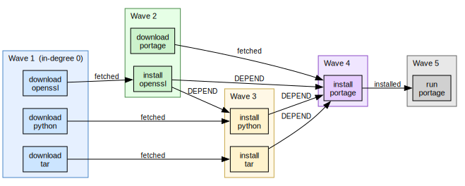
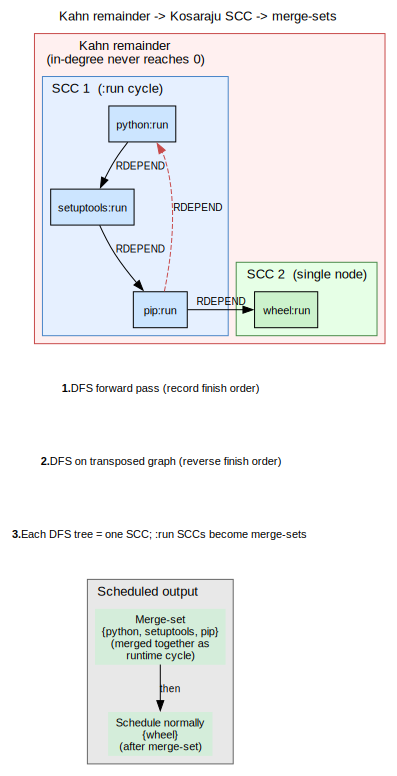

# Planning and Scheduling

## Why parallel planning?

Traditional package managers (Portage, apt, and similar) typically expose a
**sequential** plan to the user: install *A*, then *B*, then *C*.  Even when
the underlying resolver knows that *B* does not depend on *A*, the presented
order is often a single linear timeline.

portage-ng takes a different stance: it produces **parallel** plans from the
start.  Wave 1 might download *A*, *B*, and *C* concurrently; wave 2 might
install *A* while *D* is still downloading; wave 3 might install *B* and *C*
together, and so on.  This is **not** a post-processing optimization layered
on top of a linear schedule.  Parallelism is computed **during** planning, as
a natural consequence of Kahn’s topological sort: at each step, every literal
whose prerequisites are satisfied is eligible at once, and that set is exactly
one parallel wave.

On a multi-core machine with fast I/O, overlapping work this way can
dramatically reduce wall-clock time compared to a strictly sequential narrative.

Planning is also at the **action** level, not the package level.  The same
logical package may appear as separate literals for download, install, run,
and so on.  Those actions can therefore land in different waves: one package
can still be downloading while another is already installing, whenever the
dependency graph allows it.

After the prover completes, the proof must be converted into an executable
plan — an ordered sequence of actions with maximal parallelism.  This is
done in two stages: wave planning for the acyclic portion, and SCC
scheduling for any cyclic remainder.


## Dependency types and scheduling

Gentoo’s dependency classes do not all impose the same ordering strength.
The rules layer records that distinction in **proof-term context** (`?{…}` on
each literal): dependency edges and ordering hints are derived from markers
such as `after/1` and `after_only/1`.  The planner turns those into edges in
its dependency graph (including ordering-only constraints where appropriate).

Roughly:

- **DEPEND** and **BDEPEND** — build-time dependencies.  They must be
  satisfied before the build can start, so they contribute **hard ordering**:
  the consumer’s build-related actions wait on the resolved dependencies.

- **RDEPEND** — runtime dependencies.  They must be satisfied before the
  package can be *used* at runtime.  The ordering is **looser** than pure
  build ordering: the prover and feature-term layer can represent this with
  `after_only/1` so that runtime ordering is enforced where needed without
  treating every runtime edge like a build blocker.

- **PDEPEND** — post-install dependencies.  They are resolved **after** the
  main proof pass (via hooks in the rules layer).  That late binding can
  introduce or surface **cycles** that wave planning alone cannot schedule;
  those literals become **remainder** work for the SCC scheduler.

- **IDEPEND** — install-time dependencies (EAPI 8+).  They constrain ordering
  around the install phase specifically, again flowing through the same
  context and planner machinery as the other classes.

For the exact mapping from PMS ordering to internal edges and constraints, see
[Chapter 22: Dependency Ordering](22-doc-dependency-ordering.md).  The
implementation detail lives in the rules and `featureterm` helpers: `after/1`
propagates as a real dependency relation, while `after_only/1` can be lowered
to ordering constraints (for example `constraint(order_after(…))`) that the
planner respects without overstating build-time blocking.


## Wave planning (Kahn's algorithm)



The planner (`Source/Pipeline/planner.pl`) uses Kahn's algorithm to
produce a topological ordering of the proof graph with parallelism
computed from the start.

### Why Kahn's algorithm?

Kahn’s algorithm is simple, correct for DAGs, and **naturally** exposes
parallelism.  At each iteration it collects every node whose **in-degree**
has dropped to zero — that set is precisely the set of actions that may run
**concurrently** at that stage.  No second pass is required to “discover”
parallel groups.

A common alternative is a **DFS-based** topological sort.  That yields a
**single** linear ordering (one valid sequence), but it does **not** identify
which steps are independent: you get *a* order, not *all* maximal parallel
layers.  For a build planner that wants explicit waves, Kahn’s layer-by-layer
behavior is the better fit.

### How it works

1. **Build dependency counts.** For each rule in the Proof AVL, count how
   many of its body literals are "real" dependencies (not already installed,
   not assumed).

2. **Initialize the ready queue.** Literals with zero dependencies form the
   first wave — they can be executed immediately.

3. **Process waves.** For each wave:
   - Remove all ready literals from the graph.
   - Decrement dependency counts for all heads that depended on them.
   - Literals whose count reaches zero join the next wave.

4. **Repeat** until no more literals can be scheduled.

The result is a list of waves, where all literals within a wave can be
executed concurrently:

```
Wave 1: [download(A), download(B), download(C)]
Wave 2: [install(A), download(D)]
Wave 3: [install(B), install(C)]
Wave 4: [install(D), run(A)]
```

### Parallelism

Actions within a wave are independent and can run in parallel.  The planner
computes the maximum parallelism at each wave, enabling the printer to show
concurrent execution groups and the builder to schedule actual parallel
builds.

### Remainder

Literals that are part of cycles cannot be scheduled by Kahn's algorithm
(their dependency counts never reach zero).  These are returned as the
**remainder** for the scheduler to handle.


## SCC decomposition (Kosaraju)

### From planner remainder to scheduler

The wave planner (section 12.3) processes the acyclic portion of the
proof graph and produces a parallel plan.  But not every literal can
be scheduled this way.  When the dependency graph contains cycles —
for example, Python depends on setuptools at runtime, and setuptools
depends on Python — Kahn's algorithm can never reduce their in-degree
to zero: they keep waiting for each other.  These unscheduled literals
are returned as the **remainder**.

The scheduler (`Source/Pipeline/scheduler.pl`) picks up where the
planner left off.  Its job is to decompose the remainder into groups
of mutually dependent literals and decide how to handle each group.
The tool it uses for this is **strongly connected component (SCC)
decomposition**.

### What is a strongly connected component?

A **strongly connected component** is a maximal set of nodes in a
directed graph where every node can reach every other node by
following directed edges.  In dependency terms, an SCC is a group of
packages that all depend on each other, directly or indirectly —
a dependency cycle.

A single-node SCC (a node with no self-loop) simply means that node
is not part of any cycle and can be scheduled on its own.  A
multi-node SCC is a genuine cycle that must be handled as a group.

### Why Kosaraju?

The two best-known algorithms for SCC decomposition are **Tarjan's
algorithm** and **Kosaraju's algorithm**.  Both run in linear time
(O(V + E)), so performance is not the deciding factor.  The choice
comes down to implementation characteristics:

- **Tarjan's algorithm** uses a single DFS pass with an explicit
  stack and "lowlink" bookkeeping.  It is compact but harder to
  implement correctly — the lowlink update rules are subtle, and a
  small mistake can silently produce wrong components.
- **Kosaraju's algorithm** uses two straightforward DFS passes: one
  on the original graph to compute a finish order, and one on the
  transposed graph (edges reversed) to extract SCCs.  Each pass is a
  plain DFS with no extra bookkeeping beyond a visited set.

portage-ng uses Kosaraju because its two-pass structure is easier to
verify, easier to debug, and maps naturally to Prolog's
depth-first search: each pass is a standard recursive traversal with
no mutable lowlink state.  The transposed graph is cheap to build
since the dependency edges are already stored as Prolog facts.

### How the scheduler works



The scheduler uses Kosaraju's algorithm in four steps:

1. **Build the dependency graph** from the remainder rules — the
   literals the planner could not schedule and the edges between them.
2. **First DFS pass** — traverse the original graph depth-first,
   recording the order in which nodes finish (all children explored).
3. **Second DFS pass** — traverse the **transposed** graph (all edges
   reversed) in reverse finish order.  Each DFS tree discovered in
   this pass is one SCC.
4. **Classify each SCC:**
   - **Single-node SCCs** are scheduled directly as regular plan
     entries.
   - **Multi-node SCCs** are examined for merge-set eligibility (see
     below).

### Merge-sets

When a multi-node SCC consists entirely of `:run` (runtime) edges,
the scheduler produces a **merge-set** — a group of packages that
must be treated as available together.  This matches how Gentoo's PMS
handles runtime dependency cycles: the packages are merged as a
group, and the cycle is not considered an ordering error.

The merge-set appears in the plan as a special group entry.  The
printer renders it with a cycle explanation so the user can see which
packages form the loop and why they are grouped together.

## Plan output

The final plan is a list of entries, each annotated with:

- **Wave number** — which parallel wave it belongs to
- **Action** — download, install, run, etc.
- **Literal** — the full `Repo://Entry:Action?{Context}` term
- **Group** — for merge-sets, which SCC group it belongs to

The plan is consumed by the printer for terminal output and by the builder
for execution.


## Further reading

- [Chapter 8: The Prover](08-doc-prover.md) — how the Proof AVL is constructed
- [Chapter 13: Output and Visualization](13-doc-output.md) — how the plan is
  rendered
- [Chapter 15: Building and Execution](15-doc-building.md) — how the plan is
  executed
- [Chapter 22: Dependency Ordering](22-doc-dependency-ordering.md) — PMS
  ordering semantics
