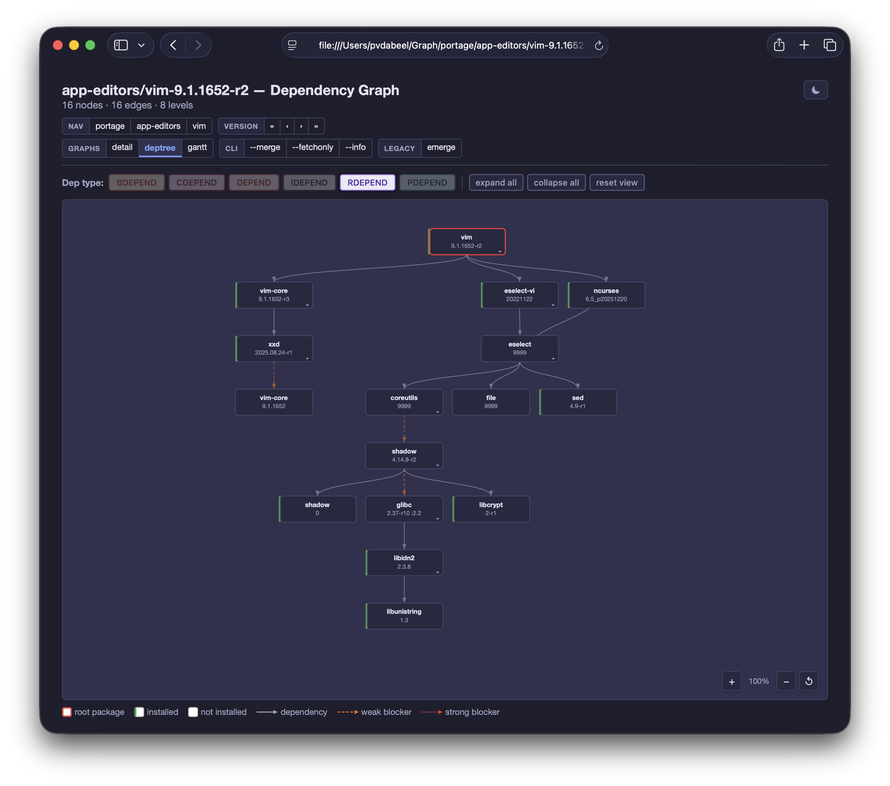
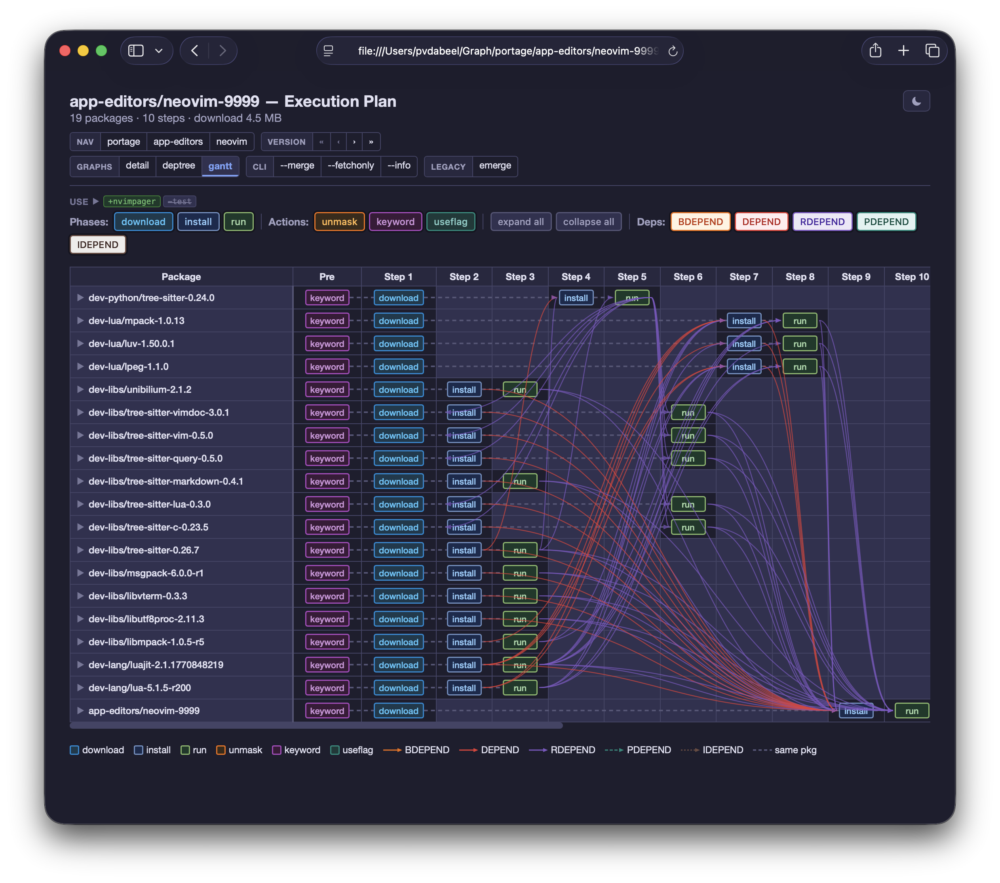

# Output and Visualization

After the prover completes and the planner produces a parallel plan,
the next step is to present the result to the user.  This happens
before any building — even a `--pretend` run produces the full plan
output.  portage-ng offers several output formats: a colour-coded
terminal plan, `.merge` files for regression testing, interactive SVG
dependency graphs, Gantt charts, and structured reports.


## Terminal plan display

The most common output is the terminal plan, which resembles
`emerge -vp` but adds parallel wave information and richer detail.
The printer (`Source/Pipeline/printer.pl`) orchestrates the display,
delegating to submodules under `Source/Pipeline/Printer/`.

### Merge list

The plan is rendered as a merge list.  Each line represents one
action, printed as a numbered step with a coloured **action bubble**
and the full package atom.

A typical plan fragment looks like this:

```
 └─step 01─┤ install  portage://dev-libs/expat-2.6.4
             │ install  portage://dev-libs/libxml2-2.13.5

 └─step 02─┤ install  portage://dev-lang/python-3.12.3
             │ run      portage://dev-lang/python-3.12.3
             │ confirm  portage://dev-lang/python-3.12.3

 └─step 03─┤ update   portage://sys-apps/portage-3.0.77-r3
             │          (replaces portage-3.0.65)
             │ download https://.../portage-3.0.77-r3.tar.xz

 └─step 04─┤ verify   dev-python/tree-sitter
             │          (non-existent, assumed installed)
```

Actions within the same step can run concurrently — the step number
is the wave.  Each line shows:

- **Step number** — which parallel wave this action belongs to.
- **Action bubble** — a full word indicating the operation:
  - `install` — new install
  - `update` — version upgrade (shows the replaced version)
  - `downgrade` — version downgrade (shows the replaced version)
  - `reinstall` — reinstall of the same version
  - `run` — runtime dependency check
  - `confirm` — verify that a running dependency is available
  - `download` — fetch source from a mirror
  - `fetchonly` — fetch only, do not build
  - `verify` — assumed dependency that needs manual verification
- **Package atom** — repository, category, name, and version (e.g.
  `portage://dev-libs/openssl-3.1.4`).
- **Annotations** — contextual notes such as `(replaces ...)` for
  upgrades/downgrades, `(~amd64)` for keyword-accepted packages,
  `(USE modified)` for USE flag changes, or `(non-existent, assumed
  installed)` for unresolvable dependencies.

Target packages — the ones you explicitly asked to prove — appear in
**bold green** with a green action bubble.  Non-target dependencies
use cyan text.  Assumed or unresolvable dependencies use yellow or
red bubbles to draw attention.

### Printing styles

portage-ng supports two printing styles, selectable via
`config:printing_style/1`:

- **Bubble style** (default) — a compact visual layout where each
  action line includes colour-coded indicators and right-edge
  annotations.
- **Column style** — a tabular layout that aligns version, slot, USE,
  and repository information in fixed columns for easy scanning.

### Pre-action steps

Before the merge list, the printer can show **pre-action steps** —
configuration changes that the plan assumes have been applied.  These
correspond to the `suggestion` tags from the prover (see
[Chapter 9](09-doc-prover-assumptions.md)):

- **Accept keyword** — packages that need `~arch` keyword acceptance.
- **Unmask** — packages that need unmasking.
- **USE changes** — flag changes needed in `package.use`.

Each pre-action step shows the exact line you would add to the
corresponding `/etc/portage/package.*` file.

### Summary line

At the bottom, a summary line shows the total number of actions
(new installs, upgrades, reinstalls, etc.) and the predicted
download and disk space usage.


## Assumption and warning output

After the merge list, the printer shows any assumptions the prover
had to make.  These are grouped into two categories:

**Domain assumptions** are situations where the prover could not find
a real solution and had to accept a literal on faith.  Each
assumption is printed with:

- The package or dependency that could not be satisfied.
- A classification label (e.g. "non-existent dependency",
  "REQUIRED_USE violation", "model unavailable").
- An actionable suggestion showing how to resolve the issue.

**Cycle breaks** are points where the prover broke a dependency cycle.
Each cycle break shows the cycle path (which packages form the loop)
and an explanation of why the cycle was broken rather than treated as
benign.

The assumption type classification is handled by
`Printer/Plan/assumption.pl`, and the detailed rendering by
`Printer/Plan/warning.pl`.  For a full description of the assumption
taxonomy, see [Chapter 9](09-doc-prover-assumptions.md).


## Writing module

The writer (`Source/Application/Output/writer.pl`) generates `.merge`
files — one per target package — containing the portage-ng plan
output in a format comparable to `emerge -vp` output.  These files
are stored in the graph directory configured by
`config:graph_directory/2`.

`.merge` files serve two purposes:

- **Regression testing** — by comparing `.merge` files against
  `.emerge` files (the corresponding `emerge -vp` output for the same
  target), the compare tooling can detect regressions in dependency
  resolution accuracy.  See
  [Chapter 23](23-doc-testing.md) for the comparison workflow.
- **Offline review** — the files provide a persistent record of what
  portage-ng would do for each target, without needing to rerun the
  resolver.


## Dependency graph generation

The grapher (`Source/Application/Output/grapher.pl`) produces
interactive SVG dependency graphs that let you visually explore the
dependency tree for a target.

The generation process has three stages:

1. **Edge extraction** — the proof is traversed to collect all
   dependency edges (which package depends on which, and through what
   action).
2. **DOT generation** — a `.dot` file is written with nodes
   representing packages and edges representing dependencies.  Nodes
   are colour-coded by action type and annotated with version and slot
   information.
3. **SVG rendering** — the `dot` command (Graphviz) renders the DOT
   file into an SVG.  For large graphs, platform-specific scripts
   under `Source/Application/System/Scripts/` can run multiple
   renderings in parallel.

Graph generation is triggered by the `--graph` CLI flag.  The
resulting SVGs include interactive navigation (zoom, pan, node
highlighting) via a built-in JavaScript theme (`navtheme` module).

The screenshot below shows a dependency tree for `app-editors/vim`.
The root package appears at the top with its dependencies fanning out
below.  Nodes are colour-coded: the red-bordered root, grey nodes
for already-installed packages, and white nodes for packages that
need to be merged.  The toolbar at the top allows filtering by
dependency type (BDEPEND, DEPEND, RDEPEND, etc.) and switching
between graph views.

{width=85%}

The **detail view** shows a single package with its full metadata —
USE flags (with conditionals), candidate versions, installed status,
and dependency atoms.  This view is useful for understanding exactly
which candidates are available and how USE conditionals affect the
dependency tree.

{width=85%}

### Graph submodules

| **Module** | **Purpose** |
| :--- | :--- |
| `dot` | Graphviz DOT file generation with colour and layout |
| `deptree` | Hierarchical dependency tree visualisation |
| `detail` | Detailed single-package view with all metadata |
| `gantt` | Gantt chart rendering (see below) |
| `terminal` | Terminal-based ASCII graph rendering |
| `navtheme` | JavaScript navigation theme for interactive SVGs |


## Gantt charts

The `gantt` module produces Gantt charts that visualise the parallel
build schedule computed by the planner.  Each horizontal bar
represents a package, positioned on a timeline according to its wave
assignment and estimated build duration.

The chart makes the parallelism visible: packages in the same wave
appear side by side, and you can see how downloads, installs, and
runtime checks overlap across waves.  When build time estimates are
available (from VDB sizes or `emerge.log` history), the bar lengths
reflect predicted durations.

The screenshot below shows the execution plan for
`app-editors/neovim`.  Each row is a package; colour-coded blocks
show download (blue), install (green), and run (light green) phases
across ten steps.  Dependency edges are drawn as coloured curves
linking the phases — red for DEPEND, blue for BDEPEND, green for
RDEPEND — making it easy to see which packages gate others and where
parallelism is exploited.

{width=95%}


## Report generation

The report module (`Source/Application/Output/Report/report.pl`)
generates structured reports for analysis, typically as JSON files.
Reports can include:

- **Plan summaries** — total actions, waves, parallelism metrics.
- **Assumption breakdowns** — counts and details of domain
  assumptions, cycle breaks, and blocker conflicts.
- **Performance statistics** — proof time, plan time, cache hit
  rates, reprove retry counts.
- **Comparison data** — structured output used by the compare
  tooling (`Reports/Scripts/compare-merge-emerge.py`) to compare
  portage-ng plans against emerge output.


## Printer submodules

The printer pipeline is split across focused submodules:

| **Module** | **File** | **Responsibility** |
| :--- | :--- | :--- |
| `plan` | `Printer/Plan/plan.pl` | Plan rendering (waves, actions, USE flags) |
| `assumption` | `Printer/Plan/assumption.pl` | Assumption classification and display |
| `cycle` | `Printer/Plan/cycle.pl` | Cycle explanation rendering |
| `warning` | `Printer/Plan/warning.pl` | Assumption detail and warning blocks |
| `timing` | `Printer/Plan/timing.pl` | Build time display |
| `index` | `Printer/index.pl` | Package index display |
| `info` | `Printer/info.pl` | Package info display |
| `stats` | `Printer/stats.pl` | Statistics display |
| `state` | `Printer/state.pl` | State tracking during printing |
| `news` | `Printer/News/news.pl` | Gentoo news item display |


## Further reading

- [Chapter 12: Planning and Scheduling](12-doc-planning.md) — how
  waves and parallelism are computed
- [Chapter 14: Command-Line Interface](14-doc-cli.md) — `--graph`,
  `--verbose`, `--quiet`, and other output flags
- [Chapter 15: Building and Execution](15-doc-output.md) — how the
  plan is executed
- [Chapter 23: Testing and Regression](23-doc-testing.md) — how
  `.merge` files are used for regression testing
