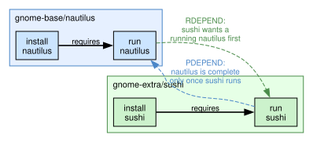
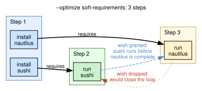
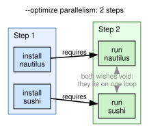
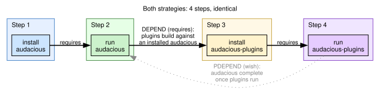
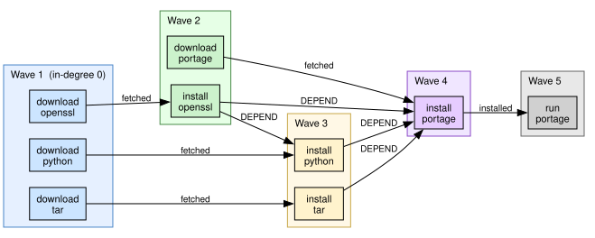

# Ordering: Plans as Proofs

## Why parallel planning?

Traditional package managers (Portage, apt, and similar) typically expose a
**sequential** plan to the user: install *A*, then *B*, then *C*.  Even when
the underlying resolver knows that *B* does not depend on *A*, the presented
order is often a single linear timeline.

portage-ng takes a different stance: it produces **parallel** plans from the
start.  Wave 1 might download *A*, *B*, and *C* concurrently; wave 2 might
install *A* while *D* is still downloading; wave 3 might install *B* and *C*
together, and so on.  This is **not** a post-processing optimization layered
on top of a linear schedule.  Parallelism falls out of the ordering proofs
themselves: two actions may share a wave exactly when neither one's
availability proof depends on the other.

On a multi-core machine with fast I/O, overlapping work this way can
dramatically reduce wall-clock time compared to a strictly sequential narrative.

Planning is also at the **action** level, not the package level.  The same
logical package may appear as separate literals for download, install, run,
and so on.  Those actions can therefore land in different waves: one package
can still be downloading while another is already installing, whenever the
dependency graph allows it.


## From proof to plan: a second proving pass

The prover (Chapter 8) answers a question about the **final world**: does a
consistent solution exist — which packages, which versions, which USE flags?
Its output is a proof, and every fact in that proof carries a justification.

But a proof is not a plan.  To execute anything, the actions must be ordered
in time.  Earlier versions of portage-ng produced that ordering with
procedural graph algorithms (Kahn's topological sort for the acyclic
portion, Kosaraju SCC decomposition for cycles).  The machinery worked, but
its answers came with no justification: a package landed in wave 7 because
"the algorithm said so", and diagnosing a mis-ordered plan meant archaeology
across several procedural passes.

The ordering engine (`Source/Pipeline/orderer.pl`) gives the *when* the same
treatment as the *what*: **it runs the same prover core a second time**.

- **Pass 1** proves a solution exists.  It is the existing prover with the
  existing domain rules, completely unchanged.  All *choice* lives here —
  versions, USE flags, OR-group selection.
- **Pass 2** constructs an ordering of that solution.  The prover core is
  re-entered over a small set of generic **planning laws**, with the pass-1
  proof and the installed system (VDB) as its facts.  Its output is a
  second proof object in which every placement is justified.

The pass-2 proof reads the way a Linux From Scratch book reads: *fontconfig
can be built at step 8 because python-3.14.6 is already installed; the new
python is built at step 12*.  A plan is no longer certified by empirical
testing of an algorithm's output — the plan **is** a proof.


## The planning laws

Pass 2 needs only a handful of generic laws.  They are the `rule/2`
clauses of the `ordering` module (`ordering.pl`, alongside the Gentoo
bindings) and own no Gentoo vocabulary at all:

```prolog
% A step can be placed once everything it requires is available:
rule(scheduled(H), Conds) :-
  ordering:step(H),
  findall(available(H, D), ordering:requires(H, D), Conds).

% A requirement is available when an earlier plan step provides it, or —
% failing that — when the world as it stands already provides it, or —
% failing that too — by recording the bootstrap failure as a negative
% domain assumption instead of failing the pass:
rule(available(H, D), Body) :-
  (   ordering:step(D),
      \+ prover:currently_proving(scheduled(D))
  ->  Body = [scheduled(D)]
  ;   ordering:world(H, D)
  ->  Body = []
  ;   Body = [assumed(unreachable(H, D))]
  ).

rule(assumed(unreachable(_, _)), []).
```

Three literals make up the entire pass-2 language:

- **`scheduled(H)`** — step *H* can be placed; its proof is the placement
  justification.
- **`available(H, D)`** — hard requirement *D* of step *H* is satisfiable
  in time: by an earlier plan step, or by the installed world.
- **`assumed(unreachable(H, D))`** — a **negative domain assumption**: no
  plan step and no installed package can provide *D* for *H*.  This is the
  genuine bootstrap boundary, reported honestly instead of papered over.

The consumer *H* appears in the availability literal on purpose: whether a
requirement can be bridged by the installed world depends on the consumer's
position in the derivation (cycle membership), so availability proofs are
never shared across consumers.  `scheduled/1` proofs are
position-independent and memoize globally through the prover's proven fast
path — each step is scheduled once, no matter how many consumers cite it.


## The Gentoo bindings

The laws ask three questions they cannot answer themselves: what is a step,
what does a step require, and what does the world already provide.  One
domain file — `Source/Domain/Gentoo/Rules/ordering.pl` — answers them by reading
the pass-1 proof and the VDB:

| Binding | Question answered | Source |
| :--- | :--- | :--- |
| `step/1` | What are the plan's steps? | Pass-1 proof rule heads |
| `requires/2` | What must exist before a step? | Build-time deps (DEPEND/BDEPEND) in the step's pass-1 rule body, including a planned same-CN merge when the grouped `:install` is keep-installed, and the runtime providers of a `virtual/*` package being merged |
| `prefers/2` | What would we like earlier, without insisting? | Runtime deps (RDEPEND), PDEPEND completion, ordering hints |
| `world/2` | What does the system already provide? | VDB (installed packages) |

This is the same split that keeps Gentoo semantics out of the prover core:
the laws are the engine, the bindings are microcode loaded from disk.  An
ordering quirk in the tree becomes a rule edit in `ordering.pl`, never
engine surgery in `orderer.pl`.

The orderer hands the `ordering` rule module directly to the generic
prover (`prover:prove_once(ordering, ...)`), so the prover core itself
needs no knowledge of which pass it is running — it just expands
whatever rule set it was given.


## Dependency types and ordering strength

Gentoo's dependency classes do not all impose the same ordering strength.
The bindings translate each class into either a hard requirement or a soft
preference:

- **DEPEND** and **BDEPEND** — build-time dependencies.  They must be
  satisfied before the build can start, so they become **`requires/2`**
  edges: the consumer's `scheduled/1` proof waits on them.  A keep-installed
  grouped `:install` is a wave-1 leaf (empty body: the installed copy
  still matches the version constraint).  When a merge of the same
  category-name is *also* planned — typically a subslot rebuild — the
  binding aliases the group onto that planned action so the consumer
  cannot share a wave with the rebuild and configure against the stale
  install (perl 5.42→5.44 / `Syntax-Keyword-Try` before
  `XS-Parse-Keyword`).  Assumed grouped deps stay a preference
  (portage-ng#95); this alias is the hard edge for the keep-installed
  path.  Blocker groups never alias: `!dev-ml/findlib` in ocaml's
  BDEPEND names a package that must be *absent*, so it must not make
  ocaml wait for the planned findlib merge — that closed a hard cycle
  with findlib's own DEPEND on ocaml and left findlib configuring
  before ocaml was on `PATH` (portage-ng#119).

- **RDEPEND** — runtime dependencies.  They must be satisfied before the
  package is *used*, not before it is built.  They become **`prefers/2`**
  edges — wishes, honored when they lie on no loop (see "Preferences:
  wishes, not promises" below for the two `--optimize` strategies), never
  allowed to force a world bridge or an unreachable assumption.  One
  exception, the
  **virtual collapse** (portage-ng#119): a `virtual/*` package has no
  build and installs no files, so a DEPEND/BDEPEND on it means the
  consumer needs the virtual's RDEPEND providers at build time — Portage
  collapses a GLEP 37 virtual's runtime deps onto the consumer with the
  consumer's dep priority.  The pass-1 `:install` body of the virtual
  already names those providers as grouped `:run` heads; for a virtual
  being merged they are **`requires/2`** edges, so `dev-ruby/typeprof`
  waits for `dev-ruby/rubygems` through `virtual/rubygems` instead of
  co-waving with the empty virtual (the orderer-era recurrence of
  portage-ng#18).  A preference would not do: it competes on equal
  footing with the PDEPEND completion pull of ruby's post-install group
  (which contains the virtual itself) and loses by processing order.

- **PDEPEND** — post-install dependencies.  They are resolved inside the
  pass-1 proof (via `heuristic:proof_obligation/4`, see Chapter 8) and create no proof
  edge.  The bindings add a **completion preference**: a consumer of a
  PDEPEND provider prefers to wait for the provider's post-install group,
  matching emerge's behaviour (portage-ng#18).  The preference is dropped
  for consumers inside the provider's own PDEPEND cycle (portage-ng#19).

- **IDEPEND** — install-time dependencies (EAPI 8+).  They constrain
  ordering around the install phase and flow through the same context
  machinery as DEPEND.

For the exact mapping from PMS ordering semantics to internal edges, see
[Chapter 24: Dependency Ordering](24-doc-dependency-ordering.md).


## Cycles: citing the installed world

Dependency cycles are where the rule-based engine differs most visibly from
its predecessor.  Consider the classic loop: python depends on tk at build
time when built with `tk` support, tk depends on fontconfig, and fontconfig
needs python to build.


When pass 2 proves `scheduled(fontconfig:install)` and reaches the
requirement on python, the first clause of the availability law — "an
earlier plan step provides it" — is refused: the guard
`\+ prover:currently_proving(scheduled(D))` detects that python's own
scheduling proof is still open on the derivation stack, i.e. citing it
would close a loop.  The law falls through to the next question: does the
*world as it stands* provide python?

- **If an older python is installed**, `world/2` answers yes, and the proof
  records a **citation of the VDB entry**: *fontconfig is buildable now
  because python-3.14.6 is already installed*.  This is exactly how Linux
  From Scratch reasons about its temporary toolchain — a fact about the
  present system, not a heuristic about graphs.

- **If nothing bridges the loop** (a bare system bootstrapping from
  nothing), the plan reports an honest `unreachable` assumption — the
  genuine bootstrap boundary — instead of an arbitrary cut.

Note what disappeared: there is no SCC decomposition, no merge-set
post-pass, no progressive edge relaxation.  A cycle is not a special case
to be repaired after the fact; it is simply the situation in which the
first clause of a law fails and the next one is consulted.

The pass-1 prover still records its own **cycle-break assumptions**
(Chapter 9) — those concern the existence proof.  Pass-2 world citations
and `unreachable` assumptions concern the *ordering* and appear in the
plan's assumption report separately.


## Preferences: wishes, not promises

A preference is not a promise.  Runtime-ish edges are collected separately
from hard requirements and are folded into the plan **after** the hard
structure is fixed; they can delay a step, never pull it earlier than its
hard requirements allow.  Whatever happens to the preferences, the hard
structure — every build-time dependency merged before the package that
needs it — is satisfied by every plan portage-ng prints.

The bindings currently derive preferences from six sources:

1. **RDEPEND groups** — a package prefers its runtime providers earlier.
2. **`order_after` hints** — ordering-only constraints recorded in proof
   context by the rules layer (see Chapter 5).
3. **`schedule_after` hints** (portage-ng#89) — plain anchoring for
   sub-slot ABI rebuilds: the rebuild alone goes after its changed
   provider.  Unlike `order_after`, these are *not* indexed as a PDEPEND
   completion group, so the provider's other consumers do not wait for
   the rebuilds (which would serialize the plan).
4. **PDEPEND completion** (portage-ng#18/#19) — consumers of a PDEPEND
   provider prefer the provider's post-install group first.
5. **Configure closure** (portage-ng#21) — an `:install` action prefers
   the runtime providers of its `:run` sibling, so packages whose
   configure phase probes runtime tools are ordered correctly.
6. **Assumed-dep aliases** (portage-ng#95) — when a grouped dependency
   degraded to a domain assumption in pass 1 but a concrete action for
   the same package *is* planned, the consumer prefers that action.

Wishes can contradict each other.  Two packages that each name the other
as a runtime dependency both wish to go second; a package whose PDEPEND
group in turn depends on it wishes to be "complete" only after something
that wishes to come after it.  No order grants every wish in such a loop,
so *some* wish has to go — and there are two reasonable policies for
choosing which.  They are selected on the command line with
`--optimize`.


### A loop of wishes: Nautilus and Sushi

GNOME's file manager `gnome-base/nautilus`, built with `USE=previewer`,
declares a PDEPEND on `gnome-extra/sushi`, the quick-look previewer: the
file manager is only *complete* once Sushi is in place.  Sushi in turn
declares an RDEPEND on Nautilus: it wants a running file manager before
it is merged.  Neither package needs the other to *build*; both edges are
wishes.



Solid arrows are hard requirements (a package runs only once it is
installed); dashed arrows are the two wishes.  Follow the dashed arrows
and you walk in a circle: `run nautilus` wants to come after `run sushi`,
which wants to come after `run nautilus`.


### `--optimize soft-requirements`: grant as many wishes as possible

Under this strategy every wish is handed to the wave projection, which
accepts them one by one and keeps each exactly when it closes no cycle
against the hard edges and the wishes already accepted.  In the loop
above the first wish it meets is granted; the second would close the loop
and is dropped — silently and safely, matching how Portage treats
runtime cycles as freely orderable.



The plan is three steps long: both installs, then Sushi's run, then
Nautilus' run.  One of the two wishes has been honored; which one depends
on the order in which the projection happened to visit them.  Larger
loops pay more: with *n* packages wishing in a circle, the projection
keeps *n − 1* wishes and lines the members up one per step — a staircase
of single-package steps in the Gantt chart.  The listing is close to the
linear order traditional `emerge` prints, which is what this strategy is
for: a familiar-looking plan, and the most individual runtime orderings
honored.


### `--optimize parallelism` (default): a wish on a loop is void

Under the default strategy the decision is made in the rules, before the
projection sees anything.  A wish from H for D is void when H and D are
*mutually reachable* — each depends on the other, directly or through
other steps, counting hard requirements and wishes alike.  Inside such a
loop no order is better than another (there is nothing for the wishes to
agree on), so all of them are void and only the hard requirements shape
the plan; wishes between packages that are *not* on a common loop are
kept, every one of them.



The same two packages now take two steps: both installs side by side,
then both runs side by side.  For a loop of *n* packages the saving is
proportionally larger — the 22-package runtime loop under
`app-xemacs/xemacs-devel` planned as 47 steps under `soft-requirements`
and as 19 under `parallelism`; `dev-ruby/dalli`'s gem loop went from 85
to 21.  Because a wish is void or kept on the basis of the graph alone,
the outcome does not depend on visiting order, and the set of wishes
that reaches the projection is acyclic by construction: the projection
becomes a pure evaluator and its cycle branch is never taken.

The cost is the wish itself.  On the Nautilus/Sushi loop the
`soft-requirements` plan did get Sushi in before Nautilus was declared
complete; the `parallelism` plan makes no such attempt.  For runtime
dependencies this is harmless — the files are on disk either way, and
nothing in the loop is *built* against anything else in it — but it is a
real difference, which is why both strategies exist.


### Hard requirements are never traded away

Not every loop is made of wishes.  `media-sound/audacious` PDEPENDs on
`media-plugins/audacious-plugins` (a wish: the player is complete once
its plugins are in), while the plugins DEPEND on the player (a hard
requirement: they are built against it).



Here there is nothing to choose.  The hard edge forces the player before
the plugins under both strategies; the PDEPEND wish is the only edge that
could give way, and it does — void under `parallelism`, dropped under
`soft-requirements` — for the same reason: it points back along a path
the hard edge already fixed.  The plans are identical.  The strategies
differ only where a loop consists of wishes alone.

Two consequences follow for anyone comparing plans across strategies:

- **Plans never break.**  The hard requirements are the same edges under
  both strategies; `parallelism` only ever withholds wishes.  Every step
  in a `parallelism` plan is buildable when its wave is reached.
- **Loops are read off the declared edges.**  Mutual reachability is
  computed over `requires` ∪ raw preferences *before* pass 2 bridges any
  hard cycle through the installed world (previous section).  A wish
  that sits on a hard cycle the world later bridges is therefore void
  too; the hard edges of that cycle are still enforced.

Where the two strategies live in the code: the raw wishes are
`ordering:prefers0/2`; `ordering:prefers/2` hands them on unchanged under
`soft-requirements` and filters them through `ordering:same_component/2`
under `parallelism`.  The mutual-reachability classes come from a
generic, domain-free library predicate (`components:classes/3` in
`Source/Logic/components.pl`), built once per ordering pass over all plan
steps and looked up by the rule — the ordering rules still contain no
graph algorithm, and the cost is linear in the size of the plan.

Within a wave, actions are finally reordered by **merge-order bias**: the
actions other packages wait on most (highest reference count in the
Triggers AVL) are listed first, so the builder starts the most-blocking
work as early as possible.


## Wave projection and plan output

The wave-list plan is a **projection** over the pass-2 proofs — an
evaluator, not a decider.  Every ordering decision was already made (and
justified) during the proving pass; the projection merely assigns wave
numbers by reading availability proofs:

- a step whose requirements are all world-bridged or assumption-bridged
  can start in wave 1;
- a step that cites earlier plan steps lands one wave after the last of
  them;
- accepted preferences raise a step's wave further, never lower it.



The output contract is unchanged from earlier releases: a list of waves,
each containing full-format pass-1 rule terms.  All actions within a wave
are independent and can run concurrently.  The printer renders the waves
as numbered steps (Chapter 14); the builder executes them with real
parallelism (Chapter 16).  Neither consumer knows or cares that the waves
are now backed by proofs.

The plan is annotated per entry with:

- **Wave number** — which parallel wave it belongs to
- **Action** — download, install, run, etc.
- **Literal** — the full `Repo://Entry:Action?{Context}` term


## The same laws order uninstalls

Depclean's uninstall order is the same three laws proved over a different
set of bindings (`Source/Domain/Gentoo/Rules/unmerging.pl`).  A step is
the `:unmerge` of a removable package; what a step *requires* is the
release of every claim on it — each removable consumer must be unmerged
first; and the *world* provides nothing, because an installed consumer's
claim is a present fact in the VDB — there is no "already provided"
escape like merge ordering has.

Cyclic claim chains fall through the same `currently_proving` guard and
surface as **retained-claim assumptions**: the report names exactly which
package still depends on which at its unmerge point, instead of a bare
"cycle detected" flag.  The wave projection is reused unchanged, and the
flattened waves are the uninstall order (consumers first, dependencies
last).  Kahn's topological sort — the last procedural survivor of the
pre-proof planner — was retired with this pass.

One binding detail is load-bearing: the claim index reads the VDB
dependency models through the query layer, whose inlined model
construction dispatches through the *active* rule module.  The index is
therefore prepared eagerly, before the unmerge prove scopes the rule
module to `unmerging` (see `unmerging:with_unmerge_pass/2`).


## Further reading

- [Chapter 8: The Prover](08-doc-prover.md) — how the Proof AVL is constructed
- [Chapter 9: Prover Assumptions](09-doc-prover-assumptions.md) — pass-1
  cycle breaking
- [Chapter 11: Rules and Domain Logic](11-doc-rules.md) — how rule modules
  plug into the prover
- [Chapter 12: Resolution — Configuration as Proofs](12-doc-resolution.md) —
  pass 1: the configuration being ordered
- [Chapter 14: Output and Visualization](14-doc-output.md) — how the plan is
  rendered
- [Chapter 16: Building and Execution](16-doc-building.md) — how the plan is
  executed
- [Chapter 24: Dependency Ordering](24-doc-dependency-ordering.md) — PMS
  ordering semantics
