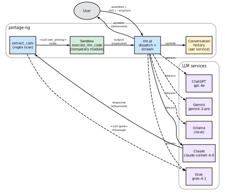
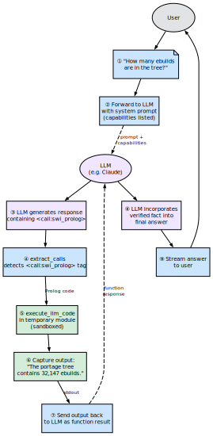
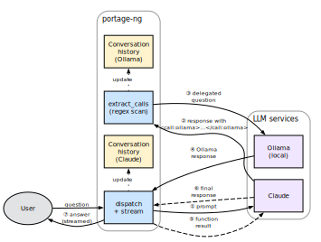
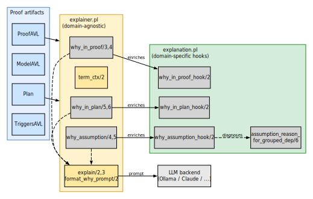

# Semantic Search and LLM Integration

portage-ng integrates with large language models for two purposes:
**semantic search** over the knowledge base using vector embeddings, and
**plan explanation** using natural-language generation.


## Semantic search

The semantic search module (`Source/Application/Llm/semantic.pl`) enables
natural-language queries over the package knowledge base.

### How it works

1. Package descriptions are converted to vector embeddings via Ollama's
   embedding API (default endpoint: `http://localhost:11434`).
2. Embeddings are stored in an in-memory index.
3. At query time, the search query is embedded and compared against all
   package embeddings using cosine similarity.
4. Results are ranked by similarity score.

### Usage

```bash
# Natural-language search
portage-ng --search "text editor with syntax highlighting"

# Find packages similar to a known package
portage-ng --similar app-editors/neovim
```

On Apple Silicon, Ollama leverages the GPU and Neural Engine for
accelerated embedding computation.

### Prerequisites

Semantic search requires:
- A running Ollama instance
- A loaded embedding model (configured via `config:embedding_model/1`)


## LLM-assisted plan explanation

The `--explain` / `--llm` flags send proof artifacts to an LLM for
human-readable interpretation of build plans and assumptions.

### Provider backends

portage-ng supports multiple LLM providers, each implemented as a separate
module in `Source/Application/Llm/`:

| **Module** | **Provider** | **Notes** |
| :--- | :--- | :--- |
| `ollama.pl` | Ollama | Local inference; also provides embeddings |
| `claude.pl` | Anthropic Claude | Requires API key |
| `chatgpt.pl` | OpenAI ChatGPT | Requires API key |
| `gemini.pl` | Google Gemini | Requires API key |
| `grok.pl` | xAI Grok | Requires API key |

The default provider is set via `config:llm_default/1`.  API keys and
endpoints are configured in `Source/config.pl` or via
`Source/Config/Private/` template files.


## Calling LLMs

portage-ng offers three ways to interact with an LLM.

### Interactive chat (`--llm`)

The `--llm` flag opens an interactive chat session with the default
(or a named) LLM service.  The session maintains conversation history,
so follow-up questions have context:

```bash
# Chat with the default LLM (configured in config.pl)
portage-ng --llm

# Chat with a specific service
portage-ng --llm claude
portage-ng --llm ollama
```

Inside the session, the LLM streams its response word by word to the
terminal.  Type `quit` or `exit` to leave.

### Plan explanation (`--explain`)

The `--explain` flag resolves a target first, then feeds the full
build plan to the LLM as structured context.  The user can then ask
questions about the plan in a conversational loop:

```bash
# Explain a build plan interactively
portage-ng --pretend --explain dev-libs/openssl

# Single-shot question
portage-ng --pretend --explain "Why is zlib in the plan?" dev-libs/openssl
```

The plan context includes targets, every package with its action type
and USE flags, dependency chains traced back to the root, and any
assumptions the prover made.  The LLM sees the full picture and can
answer questions like "why is this package included?", "what would
happen if I disabled this USE flag?", or "which assumptions were
made?"

### Programmatic access

From the Prolog shell, any LLM can be called directly:

```prolog
% Call a specific service
claude("Explain what dev-libs/openssl does", Response).
ollama("What is a USE flag?", Response).
grok("Compare DEPEND and RDEPEND", Response).

% Or use the generic dispatcher
explainer:call_llm(claude, "Your question here", Response).
```

Each service maintains its own conversation history, so subsequent
calls build on previous context.


## Code execution in the sandbox

One of portage-ng's most distinctive LLM features is that an LLM can
**execute Prolog code** inside the running system and receive the
output.  This turns the LLM from a passive question-answerer into an
active investigator that can query the knowledge base, inspect proof
artifacts, and verify its own answers.

{width=80%}

### How it works

When an LLM responds, portage-ng scans the response for XML-style
call tags.  Two kinds are recognized:

- **`<call:swi_prolog>` ... `</call:swi_prolog>`** — the enclosed
  Prolog code is executed in a temporary, sandboxed module.  The
  output (both standard output and error) is captured and sent back
  to the LLM as a function response.
- **`<call:claude>` / `<call:grok>` / etc.** — the enclosed message
  is forwarded to another LLM service, and that service's response
  is sent back.  This allows LLMs to consult each other.

The LLM is informed of these capabilities through a system prompt
assembled from `config:llm_capability/2` clauses.  The prompt
explains the available tags and how to use them, without the user
needing to know about the mechanism.

### Sandbox safety

Code execution is sandboxed by default (`config:llm_sandboxed_execution(true)`).
The code runs in a temporary module created by SWI-Prolog's
`in_temporary_module/3`, with `sandboxed(true)` ensuring that only
safe predicates are accessible.  The module is destroyed after
execution.  This means the LLM can:

- Query the knowledge base (`cache:ordered_entry/5`, `query:search/2`)
- Inspect proof artifacts if they are in scope
- Perform computations and formatting
- Write output that gets captured and returned

But it **cannot** modify the file system, execute shell commands, or
alter the running system's state.

### Example interaction

The diagram below traces a single round trip.  The user asks a
question; portage-ng forwards it (with a system prompt listing the
available capabilities) to the LLM.  The LLM responds with embedded
Prolog code wrapped in a `<call:swi_prolog>` tag.  portage-ng
detects the tag, executes the code in a sandboxed temporary module,
captures the output, and sends it back to the LLM as a function
result.  The LLM then incorporates the verified fact into its final
answer, which is streamed back to the user.

{width=50%}

Concretely, a user asks "How many ebuilds are in the tree?"  The
LLM responds with:

```
<call:swi_prolog>
:- aggregate_all(count, cache:ordered_entry(portage, _, _, _, _), N),
   format('The portage tree contains ~w ebuilds.~n', [N]).
</call:swi_prolog>
```

portage-ng executes this code, captures the output ("The portage
tree contains 32,147 ebuilds."), and sends it back to the LLM.  The
LLM then incorporates this verified fact into its final answer to
the user.

### Inter-LLM communication

The same tag mechanism allows LLMs to delegate questions to each
other.  The diagram below shows the flow: the primary LLM (Claude
in this example) embeds a `<call:ollama>` tag in its response.
portage-ng detects the tag, forwards the enclosed message to Ollama,
collects Ollama's response, and sends it back to Claude as a
function result.  Claude then weaves both perspectives into its
final answer.

{width=75%}

For example, a Claude session might embed
`<call:ollama>Summarize this dependency chain</call:ollama>` to get
a local model's perspective, or `<call:grok>What is the latest
version of openssl?</call:grok>` to cross-check information.  Each
delegated call maintains the target service's own conversation
history.


## Suggestions and explanations

Beyond answering questions, the LLM integration supports two
practical workflows: **plan explanation** and **failure diagnosis**.

### Plan explanation

When `--explain` is active, portage-ng assembles a structured context
from the proof artifacts that includes:

- **Targets** — the packages the user requested
- **Plan entries** — every package in the merge plan with its step
  number, action type (install/run/download), USE flags (with
  annotations for user-set, profile-forced, and resolver-changed
  flags), slot information, and dependency chain
- **Reverse dependency paths** — for each package, the chain of
  dependencies tracing back to the root target ("zlib is needed by
  openssl, which is needed by python, which is the target")
- **Assumptions** — any domain assumptions or cycle breaks, with
  classified reasons (missing package, masked, keyword-filtered,
  slot mismatch, version conflict)

This context allows the LLM to give precise, grounded answers rather
than generic advice.  When a user asks "why is zlib in the plan?",
the LLM can point to the exact dependency chain rather than guessing.

### Failure diagnosis

When the resolver cannot satisfy a dependency, it records an
`assumption_reason` in the proof context.  The explainer's
`assumption_reason_for_grouped_dep/6` predicate diagnoses the failure
by progressively filtering candidates through existence checks, mask
checks, slot restrictions, version constraints, and keyword
acceptance.  The classified reason (e.g. `missing`, `masked`,
`keyword_filtered`, `version_conflict`) is attached to the
assumption and included in the LLM context.

When the `--llm` flag is combined with a failing target, portage-ng
sends a specialized diagnostic prompt (`config:llm_support/1`) to the
LLM, providing the failure details and asking for help identifying the
correct package atom or diagnosing the issue.


## Explainer architecture

{width=90%}

The explainer is split into two modules with clearly separated
responsibilities.

### `explainer.pl` — domain-agnostic introspection

This module answers "why" questions by inspecting the proof artifacts
(ProofAVL, ModelAVL, Plan, TriggersAVL) without knowing anything
about Gentoo or Portage.  It provides three families of queries:

- **`why_in_proof/3,4`** — given a literal, look it up in the
  ProofAVL and report how it was proved: via a normal rule, a domain
  assumption, or a prover cycle-break.  Returns the body literals and
  the proof-term context.
- **`why_in_plan/5,6`** — given a literal and a plan, locate it in
  the wave schedule and trace a reverse-dependency path (via
  TriggersAVL) back to a root target.  The result explains *why* this
  package is in the plan (e.g. "required by X, which is required by
  the target Y").
- **`why_assumption/4,5`** — given an assumption key, classify it
  (domain assumption, cycle-break, or model-only) and extract any
  `assumption_reason` tags from the context.

The utility predicate **`term_ctx/2`** extracts the `?{Ctx}` context
list from any literal-shaped term.  This is how the explainer accesses
the structured tags (USE state, slot info, suggestions, assumption
reasons) attached to each literal during the proof.

### `explanation.pl` — domain-specific hooks

This module provides **enrichment hooks** that inject Gentoo-specific
context into the generic Why terms produced by `explainer.pl`.  The
hooks are multifile predicates, so the domain layer plugs into the
generic layer without modifying it:

- **`why_in_proof_hook/2`** — if the proof context contains domain
  reasons (masking info, keyword filtering, slot constraints), it
  appends a `domain_reasons(Reasons)` tag to the Why term.
- **`why_in_plan_hook/2`** — reserved for future plan-level Gentoo
  annotations (currently identity).
- **`why_assumption_hook/2`** — enriches assumption Why terms with
  domain reasons extracted from the assumption’s context.

The module also provides **`assumption_reason_for_grouped_dep/6`**,
which diagnoses *why* a grouped dependency resolution failed.  It
inspects the candidate pool and classifies the failure (missing
package, all candidates masked, keyword-filtered, slot mismatch,
version conflict, etc.).  This diagnosis is cached and feeds the
`assumption_reason` tags that appear in the proof context.

### LLM dispatch

Both modules produce structured Prolog terms.  When the user wants a
human-readable explanation, the `explain/2,3` predicates in
`explainer.pl` convert the structured Why term into a text prompt via
`format_why_prompt/2` (which uses `term_to_atom/2` and prepends a
system preamble), then dispatch it to an LLM backend via
`call_llm/3`.  The LLM backend is configurable
(`config:llm_default/1`) and can be Ollama, Claude, or any other
service that implements the expected interface.

A separate, richer LLM path exists in `explain.pl`
(`Source/Application/Llm/explain.pl`), which builds a multi-section
text context from the entire plan (targets, actions, USE flags,
assumptions) and sends it as a conversational prompt.  This is used
by `--explain` and the interactive `explain_plan_interactive/5` mode,
where the user can ask follow-up questions about the plan.

## Query families

Three families of queries are supported:

- **why_in_proof**: given a literal, find how it was proven (normal rule,
  domain assumption, or prover cycle-break) and extract its body/deps.
- **why_in_plan**: given a literal and a plan, locate it in the wave-plan
  and trace a reverse-dependency path (via TriggersAVL) back to a root.
- **why_assumption**: given an assumption key, classify it (domain vs
  cycle-break vs model-only) and extract any reason tags.


## Usage

All predicates are called with the `explainer:` module prefix.


### Step 1: Obtain proof artifacts

Run the pipeline to get the proof, model, plan, and triggers:

```prolog
Goals = [portage://'dev-libs'-'openssl':run?{[]}],
pipeline:prove_plan_with_fallback(Goals, ProofAVL, ModelAVL, Plan, TriggersAVL).
```

Or from a `--shell` session after loading a repository:

```prolog
pipeline:prove_plan_with_fallback([portage://'dev-libs'-'openssl':run?{[]}],
                                  Proof, Model, Plan, Triggers).
```


### Step 2: Ask "why" questions

**Why is a package in the proof?**

```prolog
Target = portage://'dev-libs'-'libffi':install,
explainer:why_in_proof(ProofAVL, Target, Why).
% Why = why_in_proof(
%          portage://'dev-libs'-'libffi':install,
%          proof_key(rule(portage://'dev-libs'-'libffi':install)),
%          depcount(3),
%          body([portage://'sys-devel'-'gcc':install, ...]),
%          ctx([...]),
%          domain_reasons([...]))      % <-- added by explanation hook
```

**Why is a package in the plan?**

```prolog
Proposal = [portage://'dev-libs'-'openssl':run?{[]}],
explainer:why_in_plan(Proposal, Plan, ProofAVL, TriggersAVL,
                      portage://'sys-libs'-'zlib':install, Why).
% Why = why_in_plan(
%          portage://'sys-libs'-'zlib':install,
%          location(step(1), portage://'sys-libs'-'zlib'-'1.3.1':install?{...}),
%          required_by(path([portage://'sys-libs'-'zlib':install,
%                           portage://'dev-libs'-'openssl':install,
%                           portage://'dev-libs'-'openssl':run])))
```

**Why is something assumed?**

```prolog
Key = assumed(portage://'dev-foo'-'bar':install),
explainer:why_assumption(ModelAVL, ProofAVL, Key, Type, Why).
% Type = domain,
% Why  = why_assumption(
%          assumed(portage://'dev-foo'-'bar':install),
%          type(domain),
%          term(portage://'dev-foo'-'bar':install?{[assumption_reason(missing)]}),
%          reason(missing),
%          domain_reasons([...]))      % <-- added by explanation hook
```


### Step 3 (optional): Get a human-readable explanation via LLM

```prolog
explainer:why_in_proof(ProofAVL, Target, Why),
explainer:explain(claude, Why, Response).
% Response = "openssl requires libffi as a build dependency because..."

% Or use the default LLM (from config:llm_default/1):
explainer:explain(Why, Response).
```

Available LLM services: claude, grok, chatgpt, gemini, ollama.
The default is set via `config:llm_default/1`. See `config.pl` for API keys,
models, and endpoints.


## Assumption diagnosis (explanation.pl)

`explanation:assumption_reason_for_grouped_dep/6` is called on the fallback
path when no candidate satisfies all constraints. It progressively filters
candidates through:

1. Existence check → `missing`
2. Self-hosting restriction → `installed_required`
3. Mask check → `masked`
4. Slot restriction → `slot_unsatisfied`
5. Version constraints → `version_no_candidate(O,V)` / `version_conflict`
6. ACCEPT_KEYWORDS → `keyword_filtered`
7. Fallback → `unsatisfied_constraints`

**Example:**

```prolog
explanation:assumption_reason_for_grouped_dep(
  install,                                      % Action
  'dev-libs', 'missing-pkg',                    % Category, Name
  [package_dependency(install,no,'dev-libs','missing-pkg',
                      none,version_none,[],[])],
  [self(portage://'app-misc'-'foo'-'1.0')],     % Context
  Reason).
% Reason = missing
```


## Hook mechanism

The explainer module calls `explanation:why_*_hook(Why0, Why)` after building
its generic Why term. If the hook succeeds, the enriched Why replaces the
generic one. Each hook extracts `domain_reason(cn_domain(C, N, Tags))` tags
from the proof context and appends them as `domain_reasons(Reasons)`.

The hooks are called automatically — no direct invocation needed.


## Further reading

- [Chapter 9: Assumptions and Constraint Learning](09-doc-prover-assumptions.md) —
  assumption taxonomy that the explainer queries
- [Chapter 8: The Prover](08-doc-prover.md) — proof artifacts consumed by
  the explainer
- [Chapter 14: Command-Line Interface](14-doc-cli.md) — `--search`, `--similar`,
  `--explain` flags
