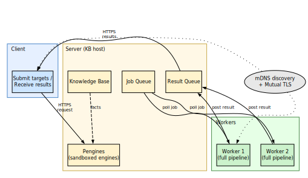
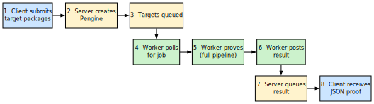
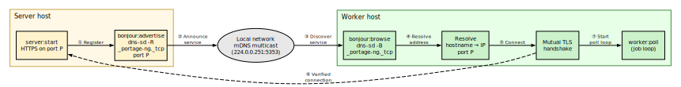
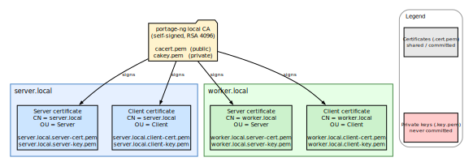
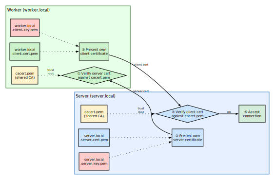

# Distributed Proving

For testing purposes, the full Gentoo tree must be walked through the
resolver — tens of thousands of ebuilds — and even on capable hardware
that adds up.  On a single machine, `prover:test_stats(portage)` typically
finishes proving every single ebuild in **under a minute** on a twenty-eight-core workstation — fast
enough for day-to-day development, but not the only shape the problem
takes.

What if you want the full tree proved **faster** than one box allows, or
you want to drive resolution from a **thin client** that does not carry
the whole knowledge base?  portage-ng answers with a **client–server–worker**
architecture: a **server** holds the Portage knowledge base and hands out
proof jobs; **workers** pull work, run the proving pipeline, and push
results back; **clients** submit targets and collect outcomes over the
network.  The sections below explain how that stack is wired, how
discovery and TLS secure it, and how the same repository abstractions work
whether you run standalone, on the server, or on a worker.


## Architecture

{width=85%}

The diagram above shows the three roles.  The **server** is the
central hub: it holds the in-memory knowledge base, exposes an HTTP
interface via Pengines (described below), and multiplexes proof jobs
across workers through a job queue and result queue.

**Workers** are symmetric compute nodes.  Each worker carries its own
copy of the knowledge base and runs the full proving pipeline
locally.  You can add as many workers as you need — they scale
horizontally, and the server distributes work evenly.

The **client** submits target packages and collects results.  It does
not need the knowledge base itself; it talks to the server over HTTPS
and receives completed proofs as JSON.

### Interaction flow

{width=85%}

The numbered steps show how a proof request travels through the
system:

**Steps 1-3 (client to server).** The client sends a target package
(e.g. `sys-apps/portage`) to the server over HTTPS.  The server
creates a Pengine (a sandboxed Prolog engine) to handle the request
and adds the target to its job queue.

**Steps 4-6 (worker loop).** Workers continuously poll the job queue
for work.  When a worker picks up a job, it runs the full proving
pipeline locally — proof search, planning, and scheduling — using its
own copy of the knowledge base.  When the proof is complete, the
worker posts the result back to the server.

**Steps 7-8 (results back to client).** The server stores the
completed proof in its result queue.  The client retrieves the result
as a JSON document over HTTPS.

### Server (`Source/Application/Mode/server.pl`)

The server is the central coordination point.  It runs an HTTP server
backed by SWI-Prolog's Pengines library and manages four things: the
knowledge base (the full Portage tree loaded in memory), a job queue
of proof targets waiting to be processed, a result queue of completed
proofs, and the Pengine sandbox that controls what remote callers can
execute.

### Worker (`Source/Application/Mode/worker.pl`)

Each worker is an independent OS process with its own Prolog VM.  On
startup it loads the knowledge base, then enters a poll loop: it asks
the server for the next job, runs the full pipeline (prove, plan,
schedule), and posts the result back.  Workers are stateless between
jobs, so you can add or remove them at any time without affecting
other workers or the server.

### Client (`Source/Application/Mode/client.pl`)

The client is a thin request layer.  It does not carry the knowledge
base — it simply submits target packages to the server and collects
the completed proofs.  This makes it suitable for lightweight
machines or scripts that want to drive resolution remotely.

### Cluster orchestration (`Source/Application/Mode/cluster.pl`)

The cluster module sits above the individual roles and provides
high-level orchestration: distributing a batch of targets across
available workers, collecting results as they arrive, and handling
failures (retrying jobs that a worker did not complete).


## Pengines: Prolog as a network service

Pengines ("Prolog engines as a web service") is a library that ships
with SWI-Prolog.  It turns Prolog query execution into an
HTTP-friendly protocol, and portage-ng uses it as the communication
layer between clients and the server.

When a client sends a proof request, the server does not run the
query in its main thread.  Instead, it creates a **Pengine** — a
fresh, isolated Prolog engine dedicated to that interaction.  The
Pengine can read the shared knowledge base (the Portage tree loaded
in the server process), but it runs inside a **sandbox** that
prevents it from modifying the knowledge base or calling dangerous
predicates.  Remote callers cannot reshape the server's state.

Answers are streamed back as JSON over HTTP.  This means a client
does not need to be a full Prolog application — any language that
can make HTTP requests and parse JSON can drive proof search.  From
the outside, portage-ng looks like an ordinary web service that
happens to do dependency resolution internally.


## Repository state across modes

An important design question for distributed proving is: how does
each mode access the Portage tree?  The answer is portage-ng's
object-oriented context system (see
[Chapter 19](19-doc-contextual-logic-programming.md)).  Each
repository is an instance created through that system, and methods
like `portage:read` populate the cache facts.

In **server mode**, repository instances live in the shared server
process.  All Pengine threads see the same instances and the same
loaded knowledge — one tree in memory, many sandboxes reading it.

In **worker mode**, each worker is a separate OS process with its own
Prolog VM.  It creates its own repository instances and loads its own
copy of the knowledge base.  Nothing is shared with the server's
address space.

The benefit is that the call sites are identical everywhere: the same
`portage:read` call appears in standalone, server, and worker code.
The object system dispatches to the right backing store depending on
the mode, so distributed proving does not require a separate set of
data-loading predicates.


## mDNS/Bonjour discovery

Workers and servers discover each other automatically via
**mDNS/Bonjour** service advertisement, so there is no need to
hand-configure IP addresses.

{width=95%}

The discovery protocol has three steps:

1. **Register** — when the server starts, it advertises a
   `_portage-ng._tcp` service on the local network, making its
   hostname and port visible to any device on the same link.
2. **Browse** — workers browse for that service type and
   automatically receive the server's address and port.
3. **Connect** — a connection is established from the discovery
   data, with no manual configuration required.

This is the same zero-configuration networking mechanism used by
AirPrint, AirPlay, and many other network services.

### Platform support

On **macOS**, the `dns-sd` command ships with the system.  The
`bonjour.pl` module uses `dns-sd -R` to register the service and
`dns-sd -B` to browse for peers.

On **Linux**, the same `dns-sd` command is available through
**Avahi** (typically in the `avahi-utils` package).  The `bonjour`
module hides the platform difference behind a single Prolog interface
(`subprocess:dns_sd/...`), so the rest of portage-ng does not need to
know which implementation is in use.

After discovery, all traffic is encrypted and mutually authenticated
via TLS (see the following sections).

## Sandbox and security

Because Pengines allow remote Prolog execution, the server must
control what clients can do.  The sandbox module
(`Source/Application/Security/sandbox.pl`) enforces a whitelist: only
predicates explicitly registered as safe via `sandbox:safe_primitive/1`
and `sandbox:safe_meta/2` can be called remotely.  Everything else is
blocked.

A separate sanitise module (`Source/Application/Security/sanitize.pl`)
validates the structure of incoming queries before they reach the
sandbox, rejecting malformed or unexpected input early.


## TLS certificates

All communication between server, workers, and clients is encrypted
and mutually authenticated using TLS.  Mutual authentication means
that **both sides** present a certificate during the handshake —
the server proves its identity to the client, and the client proves
its identity to the server.  This prevents unauthorized nodes from
joining the cluster.

### Certificate hierarchy

portage-ng uses a private Certificate Authority (CA) that acts as
the trust root for the entire cluster.  Every host-specific
certificate is signed by this CA, so any node holding the CA's
public certificate can verify any other node's identity.

{width=80%}

The CA is a self-signed RSA 4096-bit certificate valid for 10 years
(`CERT_DAYS=3650`).  Each host receives two certificates signed by
the CA:

- A **server certificate** — presented when the host runs in
  `--mode server`.  The Common Name (CN) is set to the hostname and
  the Organizational Unit (OU) to "Server".
- A **client certificate** — presented when the host connects to a
  server as a worker or client.  The CN is the local hostname and
  the OU is "Client".

Both certificates use RSA 2048-bit keys and SHA-256 signatures.

### File layout

All certificate files live under the `Certificates/` directory at
the project root.  The table below shows which files are tracked in
git (public certificates) and which are excluded (private keys):

| **File** | **Tracked** | **Description** |
| :--- | :---: | :--- |
| `cacert.pem` | Yes | CA public certificate (shared trust root) |
| `cakey.pem` | No | CA private key (never distributed) |
| `<host>.server-cert.pem` | Yes | Server certificate for `<host>` |
| `<host>.server-key.pem` | No | Server private key |
| `<host>.client-cert.pem` | Yes | Client certificate for `<host>` |
| `<host>.client-key.pem` | No | Client private key |
| `passwordfile` | Yes | HTTP digest authentication passwords |

Private keys and the CA serial file are excluded via `.gitignore`.
The public certificates are committed so that nodes can verify each
other without manual file copying — only the shared `cacert.pem`
needs to be distributed out-of-band.

### Mutual TLS handshake

When a worker or client connects to the server, a mutual TLS
handshake takes place.  Both sides verify the other's certificate
against the shared CA before any data is exchanged.

{width=80%}

The handshake proceeds in five steps:

1. The **server** presents its server certificate
   (`server.local.server-cert.pem`), signed by the CA.
2. The **worker** verifies this certificate against its local copy
   of `cacert.pem`.  If verification fails (wrong CA, expired, CN
   mismatch), the connection is refused.
3. The **worker** presents its client certificate
   (`worker.local.client-cert.pem`), also signed by the same CA.
4. The **server** verifies this certificate against its own
   `cacert.pem`.  This step is what makes the authentication
   *mutual* — the server confirms the worker is a legitimate cluster
   member, not just any TLS client.
5. Both sides accept the connection and begin encrypted
   communication.

On the server side, the TLS context is configured in
`server:start_server` with `peer_cert(true)` to require client
certificates, and `cacerts([file(CaCert)])` to set the trust
anchor.  On the client/worker side, `client:rpc_execute`
configures the same CA and presents the local client certificate.

An additional layer of security is provided by **HTTP digest
authentication** (`passwordfile`), so even a node with a valid
certificate must also know the correct username and password.

### How certificates are resolved at runtime

Certificate paths are computed at runtime by `config:certificate/2`
and `config:certificate/3`.  Given a certificate name like
`server-cert.pem`, the predicate prepends the installation
directory and `Certificates/` to form the full path.  For
host-specific certificates, the hostname is prepended to the
filename (e.g. `mac-pro.local.server-cert.pem`).

When TLS files are missing, both `server:require_tls_files/4` and
`client:require_tls_files/4` print an error message listing the
expected file paths and the `make certs` command needed to generate
them.

## Generating certificates

To generate a full set of certificates for a host:

```bash
make certs HOST="$(hostname)"
```

If your hostname includes a `.local` suffix (common on macOS), pass
the full name so it matches `config:hostname/1`:

```bash
make certs HOST="mac-pro.local"
```

This runs `Certificates/Scripts/generate.sh`, which creates three
things:

1. A **self-signed CA** (`cacert.pem` + `cakey.pem`) — created only
   if it does not already exist, so adding a second host reuses the
   same CA.
2. A **server certificate and key** signed by that CA, with the
   hostname embedded as the Common Name (CN).
3. A **client certificate and key** signed by the same CA.

### Checking and renewing

Certificates are valid for 10 years, but the generation script also
supports health checks and renewal:

```bash
make certs-check                # show expiry status for all hosts
make certs-renew                # renew certs expiring within 30 days
```

The `--check` subcommand prints each certificate's expiry date and
flags any that are missing or expiring soon.  The `--renew`
subcommand regenerates only the certificates that need it, reusing
the existing CA and private keys.

## Encrypted two-node cluster: step-by-step

The following walkthrough shows how to set up a minimal cluster with
one server and one worker on a local network.

**Step 1 — Generate certificates on each machine.**

On the server host (e.g. `server.local`):

```bash
make certs HOST="server.local"
```

On the worker host (e.g. `worker.local`):

```bash
make certs HOST="worker.local"
```

Each machine now has its own certificate and key, signed by a
locally created CA.

**Step 2 — Share the trust root.**

By default, each machine creates its own CA.  For mutual
authentication to work, all nodes must trust the same CA.  Copy
`cacert.pem` from the server to the worker (or designate one machine
as the cluster CA and distribute its `cacert.pem` to all nodes).
Each node keeps its own host-specific certificate and key.

**Step 3 — Start the server.**

```text
portage-ng --mode server
```

The server loads the knowledge base and begins listening for
connections.

**Step 4 — Start the worker.**

```text
portage-ng --mode worker
```

The worker loads its own copy of the knowledge base and begins
looking for the server.

**Step 5 — Discovery.**

If mDNS/Bonjour is available on the network, the worker finds the
server automatically via the `_portage-ng._tcp` service
advertisement.  No IP addresses need to be configured.

**Step 6 — Mutual TLS handshake.**

When the worker connects, both sides present certificates signed by
the shared CA.  portage-ng verifies the Common Name and role, so only
nodes with valid credentials can join the cluster.

**Step 7 — Proving.**

The worker polls the server's job queue, runs the full proving
pipeline for each target, and posts results back.  The server
collects completed proofs and makes them available to clients.

## Cluster usage

To run a distributed cluster, every node needs two things:

- A copy of the same `cacert.pem` (the shared trust root).
- Its own host-specific certificate and key pair.

The server is started with `--mode server`, and each worker with
`--mode worker`.  Discovery happens automatically via mDNS/Bonjour,
and TLS ensures that only nodes sharing the same CA can participate.
You can add more workers at any time — they will discover the server
and start picking up jobs immediately.


## Further reading

- [Chapter 2: Installation and Quick Start](02-doc-installation.md) — dns-sd
  and openssl prerequisites
- [Chapter 14: Command-Line Interface](14-doc-cli.md) — `--mode` flags
- [Chapter 4: Architecture Overview](04-doc-architecture.md) — module load
  order for different modes
