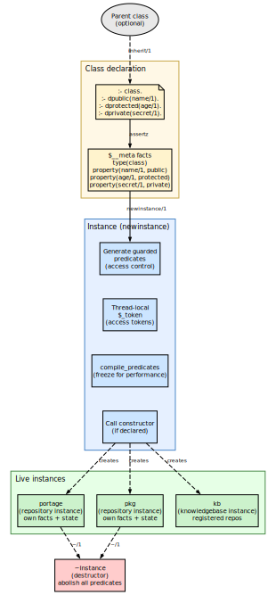
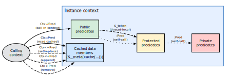
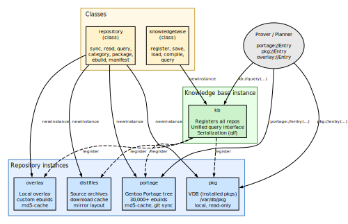

# Contextual Logic Programming

**context** is an object-oriented programming paradigm for Prolog, implemented in
[`Source/Logic/context.pl`](../Source/Logic/context.pl). It provides contexts (namespaces),
classes, and instances with public, protected, and private access control,
multiple inheritance, cloning, and declarative static typing of data members.


## Motivation

Standard Prolog uses a flat global namespace.  As applications grow,
name collisions, uncontrolled access to dynamic predicates, and lack
of modularity become obstacles.  **context** addresses this by
splitting the global namespace into isolated contexts, each with
their own facts and rules.

The key insight is that contexts can be **unified** and can serve as
feature terms describing software configurations — directly
connecting to Zeller's *Unified Versioning through Feature Logic*.
This makes **context** both a software engineering tool and a formal
foundation for reasoning about configurations.

In practical terms, this is how portage-ng can treat a Portage tree,
an overlay, and a VDB as separate objects that share the same
interface but carry independent state — and how dependency contexts
can be merged, intersected, and propagated through the proof tree.


## How it differs from Logtalk

The syntax is comparable to Logtalk, but the approach is
fundamentally different:

| | **Logtalk** | **context** |
| :--- | :--------- | :--------- |
| **Approach** | Compile-time translation to plain Prolog | Runtime generation of guarded predicates |
| **Overhead** | Source-to-source compilation step | No compilation; contexts created dynamically |
| **Thread safety** | Varies by backend | Built-in; tokens are thread-local |
| **Feature unification** | Not supported | Contexts unify as feature terms |

Because **context** works at runtime, contexts can be created,
cloned, and composed dynamically — which portage-ng uses extensively
to represent repositories, ebuilds, and configurations as live
objects.


## Core concepts

### Contexts

A context groups together clauses of a Prolog application.  By
default, clauses are local to their context and invisible to other
contexts unless explicitly exported.  Referencing a context is
enough to create it (creation ex nihilo).

Context rules are evaluated in the context in which they are
defined.  An exception are clauses declared as "transparent", which
inherit their context from the predicate that is calling them — the
same mechanism SWI-Prolog uses for meta-predicates, but applied at
the context level.

### Classes

A class is a special context that declares public, protected, and
private meta-predicates.  These declarations control access at three
levels:

- **Instantiation** — which predicates are copied into the instance
  and how they are guarded.
- **Inheritance** — which predicates are visible to subclasses.
  Private predicates are not inherited; public and protected ones
  are.
- **Invocation** — which predicates external callers may use.
  Only public predicates can be called from outside; protected and
  private predicates throw a `permission_error` if accessed without
  a valid access token.

A class is declared with `:- class.` (or `:- class([Parent1, Parent2])`
for multiple inheritance).  Predicate visibility is declared with
`:- dpublic(name/1).`, `:- dprotected(age/1).`, and
`:- dprivate(secret/1).`

### Instances

Instances are dynamically created from a class via `newinstance/1`.
The creation process has four stages:

1. **Metadata registration** — the instance is marked as
   `type(instance(Parent))` in its `$__meta` store.
2. **Predicate inheritance** — all declared predicates from the
   parent class are copied.  Each predicate is wrapped in a
   **guard** that checks an access token before execution.
3. **Freeze** — the generated predicates are compiled via
   `compile_predicates/1` for optimal performance (no more
   interpretation overhead).
4. **Constructor call** — if the class declares a constructor
   predicate (same name as the class), it is called with the
   arguments passed to `newinstance/1`.

{width=55%}

Each instance is a fully independent Prolog module with its own
dynamic facts.  Multiple instances of the same class coexist
without interference — for example, `portage` and `overlay` are
both instances of the `repository` class, but each carries its own
cached ebuilds, location paths, and sync state.

### Destruction

An instance is destroyed by calling `~Instance`.  The destructor
(if declared) runs first, then all dynamic predicates in the
instance module are abolished.  Static contexts (built-in Prolog
modules) cannot be destroyed — attempting to do so raises a
`permission_error`.

### Access control and thread safety

The access control mechanism uses **thread-local tokens**.  When an
external caller invokes a public predicate on an instance, the
system asserts a `$_token(thread_access)` fact in the instance's
module.  The guarded implementations of protected and private
predicates check for this token:

- **Public** — the token is asserted before the call and retracted
  afterwards (via `call_cleanup`).  Any code called during the
  public predicate's execution can access protected and private
  predicates because the token exists.
- **Protected** — the guard checks that the token exists.  If it
  does (i.e. the call originates from a public predicate on the
  same instance), execution proceeds.  Otherwise, a
  `permission_error` is thrown.
- **Private** — same check as protected.  The difference is
  conceptual: private predicates are not inherited by subclasses,
  while protected ones are.
- **Static** — the call is forwarded to the parent class directly,
  bypassing the instance.

Because the token is `thread_local`, concurrent threads can call
public predicates on the same instance without interfering with
each other's access grants.


## Operators

**context** defines several operators for interacting with contexts.
The diagram below shows how they relate to an instance's internal
structure:

{width=80%}

| **Operator** | **Meaning** |
| :---------- | :--------- |
| `:Pred` | Call `Pred` in the current context (self-call) |
| `::Pred` | Read a cached data member |
| `<=Pred` | Set a data member (evaluate, retract old, assert new) |
| `<+Pred` | Add a data member (evaluate, assert if not exists) |
| `<-Pred` | Remove a data member |
| `Ctx://Pred` | Call `Pred` in a specific context |

### Data members

The `::`, `<=`, `<+`, and `<-` operators implement data-member-like
behaviour.  Under the hood, they work with `$__meta(cache(...))`
facts:

- **`Ctx::Pred`** — looks up `cache(Pred)` in the instance's
  metadata.  If found, calls the predicate (which succeeds
  immediately because the cached value has already been evaluated).
  This is a **read** operation.
- **`Ctx<=Pred`** — evaluates `Pred` in the instance, retracts any
  existing cache for the same functor/arity, and asserts the new
  result.  This is a **write-replace** operation.
- **`Ctx<+Pred`** — evaluates `Pred` and asserts the result as a
  new cache entry without removing existing ones.  This is an
  **append** operation, useful for multi-valued data members.
- **`Ctx<-Pred`** — retracts all cache entries matching `Pred`.
  This is a **delete** operation.

### The `://` operator

The `://` operator is the primary way to call a predicate in
another context.  It is defined simply as
`'://'(Context, Predicate) :- Context:Predicate.`  —  a thin
wrapper that resolves the context module and dispatches the call.
This operator appears throughout portage-ng in forms like
`portage://entry(E)` or `kb://query(Q, R)`.


## Example: a Person class

A complete worked example of a context class — including a
constructor, destructor, public/protected/private members, and
instance creation — is presented in
[Chapter 1, section 1.7](01-doc-introduction.md).  The example
defines a `person` class with name and age accessors, title
management, and demonstrates how instances carry their own state
independently.


## How portage-ng uses context

portage-ng uses **context** throughout its architecture.  The
diagram below shows the two main classes (`repository` and
`knowledgebase`), their instances, and how the prover accesses them.

{width=80%}

### Repository instances

The `repository` class (`Source/Knowledge/repository.pl`) declares
a rich public interface for working with package repositories:
syncing from remote sources, reading metadata, querying entries,
and generating graphs.  Protected members hold configuration
(location, cache path, remote URL, sync protocol).

Each repository on disk becomes a named instance:

- **`portage`** — the main Gentoo Portage tree (30,000+ ebuilds),
  synced via git, with md5-cache metadata.
- **`pkg`** — the VDB (installed packages) at `/var/db/pkg`, a
  local read-only repository.
- **`overlay`** — a local overlay with custom ebuilds.
- **`distfiles`** — the source archive download cache.

Instance creation and configuration happens in the host-specific
config file (e.g. `Source/Config/mac-pro.local.pl`):

```prolog
:- portage:newinstance(repository).
:- portage:init('/Volumes/Storage/Repository/portage-git',
                '/Volumes/Storage/Repository/portage-git/metadata/md5-cache',
                'https://github.com/gentoo/gentoo.git',
                'git', 'portage').

:- pkg:newinstance(repository).
:- pkg:init('/Volumes/Storage/Repository/pkg', '', '', 'local', 'vdb').
```

Because all instances share the same class, the prover does not
need to know whether a dependency comes from the main tree, an
overlay, or the VDB — the same `Repo://entry(E)` call works for
all of them.

### Knowledge base instance

The `knowledgebase` class (`Source/Knowledge/knowledgebase.pl`)
acts as a registry.  Its `register/1` predicate adds repository
instances, and its `query/2` predicate searches across all
registered repositories.  The instance `kb` is created at startup
and populated by the configuration file.

In **client mode**, the knowledge base instance is created with a
hostname and port: `kb:newinstance(knowledgebase(Host, Port))`.
This switches the instance into proxy mode, where queries are
forwarded to the remote server via Pengine RPC — but the calling
code sees the same `kb://query(Q, R)` interface as in standalone
mode.

### Context terms in the prover

Beyond the OOP use, the context system's unification semantics
flow into the prover.  Every literal in the proof tree carries a
context list `?{[...]}` that accumulates constraints as the proof
deepens.  These context terms are merged via feature unification —
the same algebraic operation that the context system uses for its
data members.  This connection is explored in detail in
[Chapter 20: Context Terms and Feature Unification](20-doc-context-terms.md).


## Serialization

Context instances support serialization through the knowledge
base's `save` and `load` predicates.  When `kb://save` is called,
the cached facts from all registered repository instances are
written to a QLC file (`Knowledge/kb.qlf`).  On the next startup,
`kb://load` reads the compiled file back, restoring all repository
instances to their previous state without re-parsing the Portage
tree from disk.  This is what makes portage-ng's startup fast —
the full knowledge base (30,000+ ebuilds with all metadata) loads
from the QLC file in under a second.


## Further reading

- A. Zeller, *Unified Versioning through Feature Logic*, 1997
- [`Source/Logic/context.pl`](../Source/Logic/context.pl) — full implementation
- [`Documentation/Handbook/20-doc-context-terms.md`](20-doc-context-terms.md) — how context
  terms flow through the prover
