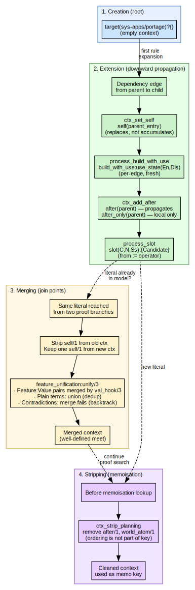
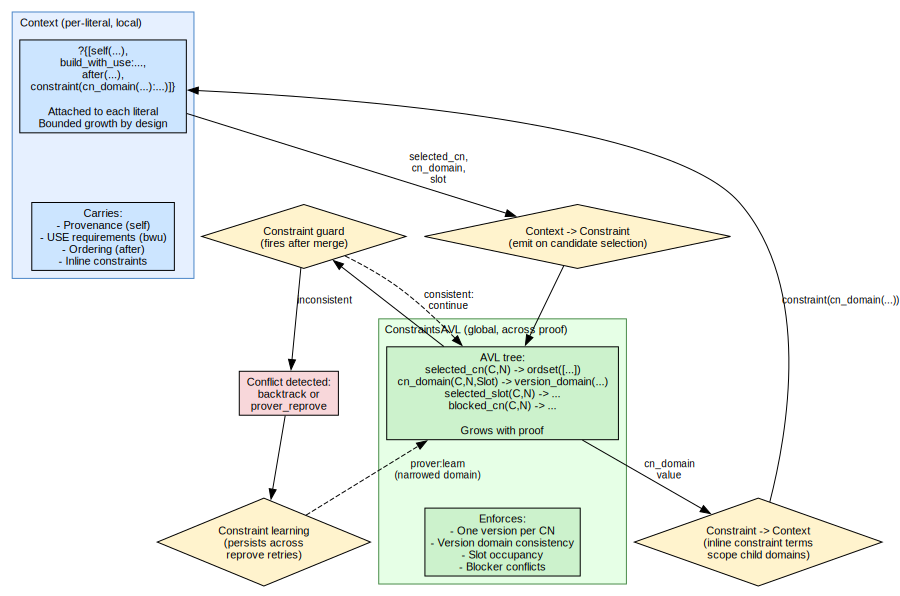
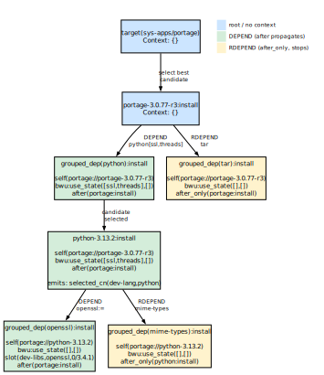

# Context Terms in portage-ng

How contexts are created, propagated, and merged across the dependency graph.

## Overview

Every literal in the prover carries a **context** — a list of tagged terms
that records provenance, ordering, constraints, and USE requirements as the
proof expands through dependencies.  The literal format is:

```
Literal:Action?{Context}
```

Contexts are not opaque blobs; they are structured as **feature-term lists**
and are merged using a Zeller-inspired feature-unification algorithm.  This
gives them lattice semantics: merging two contexts produces a well-defined
meet that preserves all non-contradictory information from both sides.


## Anatomy of a context

A context is a Prolog list.  Each element is either a plain term or a
`Feature:Value` pair.  The distinction matters for merging:

| **Form** | **Example** | **Merge behaviour** |
| :------ | :--------- | :----------------- |
| Plain term | `self(R://E)` | Identity match; duplicates dropped |
| Feature:Value | `bwu:use_state(En,Dis)` | Value-merged by `val_hook/3` |
| Feature:Compound | `slot(C,N,Ss):{...}` | Compound feature key |

For example, `self(portage://sys-apps/portage-3.0.77-r3)` is a plain
term that identifies the parent ebuild.
`build_with_use:use_state([foo],[bar])` is a Feature:Value pair whose
value is merged when two contexts meet.
`slot(sys-apps,portage,0/0):{Candidate}` is a compound feature key
used for sub-slot rebuild tracking.


### Common context tags

The following tags appear most frequently in proof-term contexts.
Each tag is a Prolog term added to the context list during rule
evaluation.

**`self(Repo://Entry)`** — set by `dependency:add_self_to_dep_contexts`.
Identifies the parent ebuild that introduced this dependency edge.

**`build_with_use:use_state(En,Dis)`** — set by
`dependency:process_build_with_use`.  Carries bracketed USE
constraints from the dependency atom (e.g. `dev-libs/foo[bar,-baz]`).

**`slot(C,N,Ss):{Candidate}`** — set by `dependency:process_slot`.
Records a slot lock from `:=` (subslot rebuild) semantics.

**`after(Literal)`** — set by `rules:ctx_add_after`.  Ordering
constraint: this dependency must come after `Literal` in the plan.
Propagates to children.

**`after_only(Literal)`** — set by
`rules:add_after_only_to_dep_contexts`.  Ordering constraint that
does **not** propagate to children.

**`replaces(pkg://Entry)`** — set by install/update rules.  Records
which installed package this action replaces.

**`assumption_reason(Reason)`** — set by the domain assumption
fallback.  Records why a domain assumption was made (e.g. `missing`,
`masked`, `keyword_filtered`).

**`suggestion(Type,Detail)`** — set by the relaxation fallback.
Records an actionable suggestion (e.g. `accept_keyword`, `unmask`,
`use_change`).

**`domain_reason(cn_domain(C,N,Tags))`** — set by
`candidate:add_domain_reason_context`.  Diagnostic tags for version
domain narrowing.

**`constraint(cn_domain(C,N):{Domain})`** — set by the constraint
system.  Carries an inline constraint for domain scoping.


## Context lifecycle



### 1. Creation (root)

At the top level, the prover starts with an empty context (`{}` or `[]`).
The first rule expansion — typically `target/2` → `install` — begins
populating it.

### 2. Extension (downward propagation)

As rules expand dependencies, contexts grow:

```
target(sys-apps/portage)?{}
  └─ install(portage://sys-apps/portage-3.0.77-r3):install?{...}
       ├─ dep(dev-lang/python):install?{self(portage://sys-apps/portage-3.0.77-r3),
       │                                 build_with_use:use_state([ssl,threads],[]),
       │                                 after(install(portage://...))}
       │    └─ dep(dev-libs/openssl):install?{self(portage://dev-lang/python-3.13),
       │                                       build_with_use:use_state([],[]),
       │                                       after(install(portage://dev-lang/python-3.13))}
       └─ dep(app-arch/tar):install?{self(portage://sys-apps/portage-3.0.77-r3),
                                      after(install(portage://...))}
```

Key propagation rules:

- **`self/1`** is set to the current ebuild at each dependency edge.
  It does **not** accumulate — each edge replaces the previous `self`.
- **`build_with_use`** is per-edge: the child gets a fresh `build_with_use`
  from its dep atom, not the parent's `build_with_use`.
- **`after/1`** propagates transitively (children inherit it).
- **`after_only/1`** does **not** propagate (ordering is local to this edge).
- **`assumption_reason`** and **`build_with_use`** are dropped on PDEPEND
  edges (via `ctx_drop_build_with_use_and_assumption_reason`).


### 3. Merging (join points)

When the prover encounters a literal that was already proven with a
different context, it merges the old and new contexts via feature term unification:

```prolog
sampler:ctx_union(OldCtx, NewCtx, MergedCtx)
```

The merge algorithm:

1. **Strip `self/1`** from the old context entirely.
2. **Extract one `self/1`** from the new context (keep it aside).
3. **Unify** the remaining lists via `feature_unification:unify/3`.
4. **Prepend** the extracted `self/1` back onto the result.

This guarantees:
- At most one `self/1` in the merged result (from the new/incoming side).
- Feature:Value pairs with the same key are merged by `val_hook/3`.
- Plain terms present in either side appear in the result (union semantics).


### 4. Stripping for memoisation

Before checking whether a literal has already been proven, planning markers
are stripped so they don't pollute the memoisation key:

```prolog
rules:ctx_strip_planning(Context0, Context)
```

This removes `after/1` and `world_atom/1` — ordering and planning concerns
that should not affect whether a proof is reusable.


## Feature unification in detail

`feature_unification:unify/3` implements a **horizontal unification**
algorithm inspired by Zeller's feature logic:

1. Normalise both terms (`{}` → `[]`).
2. Walk both lists.  For each `Feature:Value` pair in list A, check if
   list B has the same `Feature`.
3. If both sides have `Feature`, merge values via `val/3` (or `val_hook/3`
   for domain-specific merge).
4. If only one side has `Feature`, include it in the result.
5. Plain terms are matched by identity; duplicates are dropped.

### Value merge rules

| **V1** | **V2** | **Result** | **Semantics** |
| :---- | :---- | :-------- | :----------- |
| `{L1}` | `{L2}` | `{Intersection}` | Set intersection (must be non-empty) |
| `[L1]` | `[L2]` | `[Union]` | Sorted union (fails on contradictions) |
| atom `V` | `{L}` | `{V}` if `V ∈ L` | Singleton intersection |
| `V` | `V` | `V` | Identity |

### Domain-specific hooks (`val_hook/3`)

| **Feature** | **Hook in** | **Merge behaviour** |
| :--------- | :--------- | :----------------- |
| `build_with_use` | `use.pl` | `use_state(En1,Dis1)` ⊔ `use_state(En2,Dis2)` = union of enable/disable sets; **fails** if a flag appears in both enable and disable |
| `cn_domain` | `version.pl` | `version_domain` meet (intersection of version bounds); `none` is identity |


## `self/1` — parent provenance

The `self/1` tag identifies **which ebuild introduced this dependency**.
It is critical for:

- **USE evaluation**: `use:effective_use_in_context/3` looks up the USE
  model of the ebuild in `self/1` to evaluate USE conditionals.
- **Blocker source**: `candidate:make_blocker_constraint/5` uses `self/1`
  to determine who is blocking whom.
- **Parent narrowing**: `candidate:maybe_learn_parent_narrowing/4` uses
  `self/1` to learn that the parent version should be excluded when a child
  dependency cannot be satisfied.
- **REQUIRED_USE**: `query:with_required_use_validate/3` annotates REQUIRED_USE
  terms with `:validate?{[self(...)]}` so the prover knows the ebuild context.

### Invariant: at most one `self/1`

Without bounding, `self/1` would stack along dependency chains:

```
[self(A), self(B), self(C), ...]  ← unbounded growth
```

The system prevents this at two levels:

1. **`dependency:ctx_set_self/3`** replaces any existing `self/1` when
   setting a new parent.
2. **Feature term unification** (`ctx_union_raw/3`) strips all `self/1` from the old context and
   keeps only one from the new context.


## `build_with_use` — bracketed USE requirements

When a dependency atom carries USE requirements (e.g.
`dev-lang/python[ssl,threads]`), they are recorded as:

```prolog
build_with_use:use_state([ssl, threads], [])
```

The enable list contains flags that must be ON; the disable list contains
flags that must be OFF.

### Per-edge, not inherited

Each dependency edge computes its own `build_with_use` from the dep atom.
The parent's `build_with_use` is **removed** before computing the child's:

```prolog
dependency:process_build_with_use(MergedUse, ContextDep, NewContext, ...)
```

This prevents a grandparent's USE requirements from leaking to grandchildren.

### Merge semantics

When feature term unification merges two contexts with `build_with_use`, the `val_hook`
in `use.pl` takes the **union** of enable sets and the **union** of disable
sets.  If a flag appears in both enable and disable, the merge **fails**
(contradiction), forcing the prover to backtrack.

### PDEPEND edge

On PDEPEND edges, `build_with_use` is dropped because PDEPEND dependencies
are resolved at runtime, not build time, so build-time USE constraints do
not apply.


## Constraints vs contexts

The proof system uses two complementary mechanisms for carrying
information, and it is easy to confuse them.  **Contexts** are local:
each literal in the proof carries its own context list (`?{...}`),
recording where it came from, what USE flags were requested, and how
it should be ordered.  **Constraints** are global: they live in a
shared ConstraintsAVL that spans the entire proof and track
cross-cutting invariants like "only one version of this package may
be selected" or "this package is blocked by another."

The table below summarises the key differences:



| **Aspect** | **Context** | **Constraint** |
| :-------- | :--------- | :------------ |
| Scope | Per-literal (local) | Global (across proof) |
| Storage | List attached to `?{...}` | AVL in ConstraintsAVL |
| Growth | Bounded by design | Grows with proof |
| Purpose | Provenance, ordering, USE | Version selection, slot locks, blockers |

### How they interact

Although contexts and constraints have different scopes, they are not
isolated — information flows between them in both directions.

**From context to constraint.**  When the rules layer selects a
candidate version for a dependency, it emits constraint terms into the
global ConstraintsAVL.  For example, selecting `dev-libs/openssl-3.1.4`
produces a `selected_cn(dev-libs, openssl)` constraint and a
`cn_domain` constraint recording the version domain.  These global
constraints ensure that if another dependency path also needs
`dev-libs/openssl`, the prover will detect any conflict.

**From constraint to context.**  Sometimes a parent dependency wants
to narrow the version domain for a child before candidate selection
even begins.  It does this by placing an inline constraint term like
`constraint(cn_domain(C,N):{Domain})` directly in the context list.
When the child's rule fires, it reads this term and applies the
domain restriction.

**Constraint guards.**  After each new constraint is merged into the
global store, `rules:constraint_guard/2` fires to check consistency.
The guard verifies that version domains are compatible with selected
candidates, that each slot has at most one selected version, and that
no selected package is blocked by another.

**Constraint learning.**  When a guard detects an inconsistency, it
can record a narrowed domain via `prover:learn/3`.  This learned
constraint persists across reprove retries, preventing the prover
from repeating the same dead-end choice (see
[Chapter 9](09-doc-prover-assumptions.md) and
[Chapter 10](10-doc-version-domains.md)).


## Ordering: `after` vs `after_only`

Both create ordering edges in the plan, but they differ in propagation:

| **Marker** | **Propagates to child deps?** | **Use case** |
| :-------- | :-------------------------- | :---------- |
| `after(Lit)` | Yes | Build deps: the package and all its deps must come after `Lit` |
| `after_only(Lit)` | No | Runtime deps: only this package (not its deps) must come after `Lit` |

### Extraction

```prolog
rules:ctx_take_after_with_mode(Context, After, AfterForDeps, ContextRest)
```

- If `after(X)` → `After = X`, `AfterForDeps = X` (propagate).
- If `after_only(X)` → `After = X`, `AfterForDeps = none` (don't propagate).
- If neither → both `none`.


## Example: full context evolution

The following example traces how context evolves as the prover walks
from a user target (`sys-apps/portage`) through two levels of
dependencies.  The diagram shows the key context tags at each step.

{width=60%}

### Step 1 — Target resolution

The user runs `emerge sys-apps/portage`.  The target rule selects the
best visible candidate (`portage-3.0.77-r3`).  At this point the
context is empty — there is no parent, no USE requirement, and no
ordering constraint.

### Step 2 — Expanding portage's dependencies

The install rule for portage expands its DEPEND and RDEPEND.  Each
dependency atom gets its own context, built from three operations:

- **`add_self_to_dep_contexts`** adds `self(portage://portage-3.0.77-r3)`
  to record that portage is the parent.
- **`process_build_with_use`** translates bracketed USE flags from the
  atom.  For `dev-lang/python[ssl,threads]`, this produces
  `build_with_use:use_state([ssl,threads],[])`.  For `app-arch/tar`
  (no brackets), the USE state is empty.
- **`ctx_add_after`** adds an ordering constraint.  DEPEND atoms get
  `after(portage:install)` (propagates to children).  RDEPEND atoms
  get `after_only(portage:install)` (does not propagate).

### Step 3 — Resolving python

The candidate `python-3.13.2` is selected.  A `selected_cn` constraint
is emitted into the global ConstraintsAVL (not the context).  The
context itself is passed down unchanged from the grouped dependency.

### Step 4 — Expanding python's dependencies

Python's own dependencies get fresh contexts.  Notice how each tag
is rebuilt at this level:

- **`self`** now points to `python-3.13.2`, not to portage.  The
  `self` tag always records the immediate parent, never accumulates.
- **`build_with_use`** is replaced based on the new atom.
  `dev-libs/openssl:=` has no bracketed flags, so the USE state
  becomes empty.
- **`after`** is propagated from the parent (portage's install
  constraint travels down through DEPEND edges).
- **Slot lock** — the `:=` operator on `dev-libs/openssl:=` adds a
  `slot(dev-libs,openssl,0/3.4.1)` tag to the context, recording the
  sub-slot for rebuild tracking.
- **`after_only`** — the RDEPEND on `app-misc/mime-types` gets
  `after_only(python:install)`, which will not propagate to
  mime-types's own children.

### Key observations

- **`self/1`** always points to the immediate parent, never
  accumulates along the chain.
- **`build_with_use`** is replaced at each edge based on the
  dependency atom's bracketed flags.
- **`after/1`** from DEPEND propagates down the tree;
  **`after_only/1`** from RDEPEND does not.
- **Slot locks** (`:=`) add `slot/3` entries to the context.
- **Constraint emissions** (e.g. `selected_cn`) go into the global
  ConstraintsAVL, not into the context.

## Design rationale

### Why feature unification?

Traditional dependency solvers use flat constraint lists or SAT clauses.
portage-ng uses feature-term unification because:

1. **Composability**: Contexts from different proof branches merge
   naturally at join points without ad-hoc conflict resolution.
2. **Bounded growth**: The `self/1` stripping in feature term unification and the
   per-edge `build_with_use` replacement prevent unbounded context growth
   along dependency chains.
3. **Domain extensibility**: New context tags can be added without changing
   the merge infrastructure — just add a `val_hook/3` clause if
   domain-specific merge is needed.
4. **Conflict detection**: The merge fails (backtracks) on contradictions
   (e.g. a flag in both enable and disable), providing natural constraint
   propagation.

### Why separate contexts and constraints?

Contexts are **local** (per-literal, scoped to a proof branch) while
constraints are **global** (shared across the entire proof).  This
separation allows:

- **Contexts** to carry provenance information that should not leak across
  unrelated proof branches.
- **Constraints** to enforce global invariants (e.g. only one version of a
  package can be selected) that must hold across the entire proof.
- **Constraint learning** to persist across reprove retries, narrowing the
  search space incrementally.
