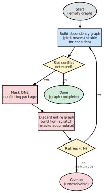
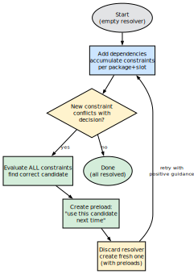
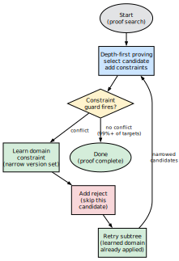

# Dependency Resolver Comparison

## Architecture Overview

All three resolvers solve the same problem: given a set of requested
packages, figure out which concrete versions to install and in what
order.  Where they differ is in how they handle **conflicts** —
situations where the first choice turns out to be wrong.

Each subsection below describes the resolver’s strategy and
illustrates its conflict-resolution loop.

### Portage (Python)

Portage takes the most straightforward approach.  It builds a
dependency graph by walking every dependency and picking the newest
stable candidate for each.  If two packages end up claiming the same
slot, Portage detects the conflict after the graph is already built.

Its recovery strategy is blunt: mask the conflicting package so it
won’t be picked again, throw away the entire graph, and rebuild it
from scratch.  Each retry adds one more mask.  The masks accumulate
across retries, but no other information carries over — the graph
starts clean every time.  Portage allows up to 20 retries by default
(configurable with `--backtrack=N`).

{width=40%}

Because each retry rebuilds everything, this approach is the slowest
of the three.  Complex dependency tangles — like the OCaml Jane Street
ecosystem — can require more than a dozen retries before Portage finds
a consistent graph.

### Paludis (C++)

Paludis is smarter about what it remembers.  Instead of masking wrong
candidates, it identifies the **right** one.  When a new constraint
conflicts with an earlier decision, Paludis evaluates all accumulated
constraints for that package simultaneously and determines which
candidate satisfies them all.

It then records a *preload* — an instruction that says “use this
specific candidate next time.”  The resolver is discarded and a fresh
one is created, but the preloads travel with it.  This means the next
attempt starts with positive guidance rather than just a list of things
to avoid.

{width=40%}

Because Paludis carries forward the right answer instead of just
rejecting the wrong one, it typically needs fewer restarts than
Portage.  However, each restart still creates a brand-new resolver,
so the dependency walk itself is repeated.

### portage-ng (SWI-Prolog)

portage-ng avoids the restart-from-scratch pattern altogether.  It
uses a depth-first proof search: each dependency becomes a proof
obligation, and selecting a candidate adds constraints to a global
store.  Constraint guards monitor the store and fire immediately when
a conflict appears.

When a guard fires, three things happen in sequence:

1. The conflicting domain is **learned** — the version set for that
   package is narrowed to exclude impossible choices.
2. The current candidate is **rejected** so it won’t be tried again.
3. Only the affected **subtree is retried**, with the learned domain
   already in place to guide candidate selection.

{width=40%}

For the vast majority of packages (over 99%), no conflict arises at
all and the proof completes in a single pass.  When conflicts do
occur, the combination of learned domains (positive guidance) and
rejects (negative filtering) resolves them without rebuilding the
entire proof tree.  This makes portage-ng the fastest of the three
resolvers.

## Comparison Table

| **Aspect** | **Portage** | **Paludis** | **portage-ng** |
| :--- | :--- | :--- | :--- |
| Language | Python | C++ | SWI-Prolog |
| Conflict detection | Post-hoc (after graph built) | Incremental (on constraint add) | Incremental (constraint guard) |
| What carries across retries | Masks (negative) | Preloads (positive) | Learned domains (positive) + Rejects (negative) |
| Fresh state each retry? | Yes (new depgraph) | Yes (new Resolver) | Partial (reject set accumulates, learned store accumulates) |
| Finding the right candidate | Brute force (mask+retry) | `_try_to_find_decision_for` with ALL constraints | Domain narrowing (Zeller) + priority resolution (Vermeir) |
| Performance | Slowest (full rebuild) | Fast (targeted restarts) | Fastest (single-pass for most targets) |
| Package-specific code | None | None | None |

## Academic Foundations

### Zeller & Snelting: Feature Logic (ESEC 1995, TOSEM 1997)

"Unified Versioning Through Feature Logic" — version sets are identified by
feature terms and configured by incrementally narrowing the set until each
component resolves to a single version. portage-ng's `version_domain` with
`domain_meet` (intersection) is essentially Zeller's feature term narrowing.
The learned constraint store implements Zeller's feature implication
propagation: constraints discovered in one proof attempt propagate to narrow
version sets in the next attempt.

### Vermeir & Van Nieuwenborgh: Ordered Logic Programs (JELIA 2002)

"Preferred Answer Sets for Ordered Logic Programs" — when rules conflict,
a partial order determines which yields. portage-ng's `find_adjustable_origin`
implements this: when a domain is inconsistent (two bounds that can't be
simultaneously satisfied), the bound from the "adjustable" origin (the
package that already has a learned constraint) is dropped, and the origin
is narrowed further.

### CDCL / PubGrub / SAT-based approaches

Modern package resolvers (libsolv, Resolvo, PubGrub) encode version
constraints as boolean satisfiability problems. portage-ng's approach is
different: it uses proof search with domain narrowing rather than SAT
encoding. The learned constraint store is analogous to CDCL's learned
clauses, but expressed as version domains rather than boolean clauses.
