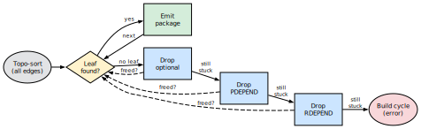
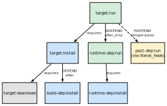
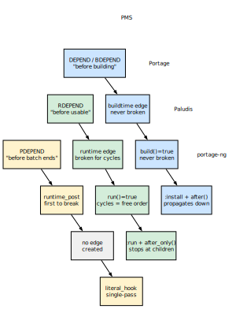
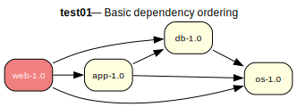
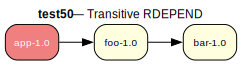
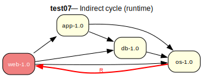
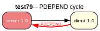

# Dependency Ordering

When a package manager installs several packages at once, the order in
which they are merged matters.  A compiler must be installed before the
packages that need it for building; a shared library must be present
before the programs that link against it can run.  The Gentoo Package
Manager Specification (PMS) defines five dependency types, each with
different ordering strength.  Portage, Paludis, and portage-ng all
interpret these types, but they differ in how strictly they enforce
ordering — especially when cycles make a perfect order impossible.


## Dependency types

The PMS (Chapter 8) groups dependencies into five classes based on
*when* the dependency must be available.

- **DEPEND / BDEPEND** — build-time dependencies.  These must be
  installed and usable before `pkg_setup` runs and throughout the
  `src_*` build phases.  BDEPEND (introduced in EAPI 7) targets the
  build host (CBUILD), while DEPEND targets the target host (CHOST).
  Both create **hard ordering constraints**: the dependency must be
  merged before the dependent can be built.

- **RDEPEND** — runtime dependencies.  These must be installed before
  the package is "treated as usable."  This is a **soft ordering
  constraint**: ideally satisfied before the dependent is merged, but
  the constraint can be relaxed when cycles exist.

- **PDEPEND** — post-dependencies.  These only need to be installed
  "before the package manager finishes the batch."  This is the
  **weakest constraint** — there is no requirement that the
  post-dependency is merged before the dependent.

- **IDEPEND** — install-time dependencies (EAPI 8+).  Needed during
  `pkg_preinst` and `pkg_postinst`.  Treated similarly to runtime
  dependencies for ordering purposes.


## Phase functions and dependency availability

Different ebuild phases have access to different dependency classes:

**Build phases** (`src_unpack` through `src_install`)
:   DEPEND, BDEPEND

**Install phases** (`pkg_preinst`, `pkg_postinst`, `pkg_prerm`, `pkg_postrm`)
:   RDEPEND, IDEPEND

**Configuration** (`pkg_config`)
:   RDEPEND, PDEPEND


## Portage's approach

Portage builds a single dependency graph where every package is a node
and every dependency creates a directed edge.  Each edge carries a
*priority* that records how hard the ordering constraint is:

| **Dependency** | **Priority** | **Breakable?** |
| :--- | :--- | :--- |
| DEPEND / BDEPEND | buildtime (highest) | Never |
| RDEPEND with `:=` slot op | runtime_slot_op | Only when cross-compiling |
| RDEPEND | runtime | Yes, for cycles |
| PDEPEND | runtime_post (lowest) | Yes, first to break |

### Progressive relaxation

When Portage runs its topological sort and cannot find a leaf node (a
package with no unsatisfied dependencies), it progressively drops
weaker edges until a leaf appears.  The relaxation proceeds in four
passes:

{width=85%}

1. **All edges respected** — standard topological sort.
2. **Drop optional edges** — removes edges for optional dependencies.
3. **Drop PDEPEND edges** — the weakest real dependency type is
   discarded.
4. **Drop RDEPEND edges** — runtime edges are relaxed, freeing most
   remaining cycles.

If no leaf is found even after dropping RDEPEND edges, the remaining
cycle involves only build-time dependencies.  This is a hard error —
Portage cannot resolve it and reports the cycle to the user.

### What this means in practice

In the common (acyclic) case, Portage merges all dependencies —
including RDEPEND — before the packages that need them.  When cycles
exist, PDEPEND edges are broken first, then RDEPEND edges.  Build-time
edges are never broken.


## Paludis's approach

Paludis takes a different view.  It builds a Node-Adjacency Graph
(NAG) where edges carry two boolean flags: `build()` for build-time
dependencies and `run()` for runtime dependencies.  Notably, **PDEPEND
creates no edge at all**.  The Paludis source comments explain the
reasoning: most post-dependencies already depend on the thing
requiring them anyway, so adding a backwards edge would just create
unnecessary cycles.

### SCC-based cycle handling

Rather than relaxing edges progressively, Paludis uses Tarjan's
algorithm to find strongly connected components (SCCs) and then
classifies each one:

- **Single-node SCC** — no cycle, scheduled directly.
- **Runtime-only SCC** (no build edges) — ordered arbitrarily.
  Paludis treats runtime-only cycles as having no ordering
  significance at all.
- **Build-dep SCC** — Paludis tries to break the cycle by removing
  edges whose dependencies are already satisfied (`build_all_met` or
  `run_all_met`).  If the SCC is still cyclic after that, it is
  marked as unorderable.

The key insight from Paludis is stronger than Portage's progressive
relaxation: runtime-only cycles are not just *breakable* — they are
*free to order however is convenient*.


## portage-ng's approach

portage-ng models dependencies as a two-phase proof tree.  Each
package has an `:install` action (building) and a `:run` action
(being usable).  The different dependency types map naturally onto
this structure.

### Intra-group dependency ordering

Before proving the dependencies within a single package,
`candidate:dep_priority/2` sorts them by constraint tightness.
Tightly constrained dependencies are proved first so that their
`selected_cn` locks early, preventing greedy conflicts where an
unconstrained sibling picks a version that later clashes.  The
priority ladder (lower = proved first): tight upper bound (1) →
tilde (4) → wildcard (8) → unconstrained (999).  Within each tier,
slot specificity further refines the order.  See
[Chapter 11](11-doc-rules.md) for details.

{width=55%}

- **DEPEND / BDEPEND** create edges to `:install` actions with
  `after()` context tags that propagate down the dependency chain.
  These are hard ordering constraints.
- **RDEPEND** create edges to `:run` actions with `after_only()`
  context tags that stop at the immediate children.  This makes them
  naturally softer.
- **PDEPEND** are handled by `literal_hook` in a single pass during
  proof search, without creating explicit ordering edges.

When cycles appear, the wave planner produces an acyclic plan for the
majority of the graph.  The remaining cyclic portion goes to the
scheduler, which uses Kosaraju's algorithm to find SCCs.  Runtime-only
SCCs are treated as freely orderable (matching Paludis's insight),
while build-dep SCCs require special handling.


## How the three approaches compare

The diagram below traces how each PMS dependency type is implemented
across the three resolvers.  Blue indicates hard (build-time)
constraints, green indicates soft (runtime) constraints, and yellow
indicates the weakest (post-dependency) constraints.

{width=60%}

| **Aspect** | **Portage** | **Paludis** | **portage-ng** |
| :--- | :--- | :--- | :--- |
| DEPEND/BDEPEND | Hard edge, never broken | Hard edge, never broken | `:install` + `after()`, hard |
| RDEPEND | Soft edge, broken for cycles | Soft edge, cycles freely ordered | `:run` + `after_only()`, soft |
| PDEPEND | Weak edge, first to break | No edge at all | `literal_hook`, no edge |
| Cycle strategy | Progressive relaxation | SCC classification | Wave plan + SCC scheduling |
| Build-time cycles | Error / merge group | Relax met edges, then error | SCC merge-set |


## Annex: overlay test cases

portage-ng ships with a synthetic overlay (`Repository/Overlay/`) containing
80 test cases that exercise the resolver in isolation.  Each test uses
tiny packages with carefully crafted dependency relationships, making it
easy to see exactly how the resolvers behave.  The five cases below
illustrate the ordering concepts discussed in this chapter.  For each
case we show the dependency graph, a short description, and the captured
output from both Portage (`emerge -vp`) and portage-ng (`--pretend`).


### Annex A — Basic ordering (test01)

Four packages with a clean dependency chain: `web` depends on `app`,
`db`, and `os`; `app` depends on `db` and `os`; `db` depends on `os`.
No cycles, no special dependency types.

{width=50%}

Both resolvers produce the same order: `os` first (no dependencies),
then `db` and `app` (whose dependencies are now satisfied), and finally
`web`.  portage-ng additionally shows the two-phase `:install` /
`:run` structure and groups downloads into a parallel first step.

**Portage output:**

```
[ebuild  N     ] test01/os-1.0::overlay   0 KiB
[ebuild  N     ] test01/db-1.0::overlay   0 KiB
[ebuild  N     ] test01/app-1.0::overlay  0 KiB
[ebuild  N     ] test01/web-1.0::overlay  0 KiB

Total: 4 packages (4 new)
```

**portage-ng output:**

```
  step  1 | download  overlay://test01/web-1.0
          | download  overlay://test01/os-1.0
          | download  overlay://test01/db-1.0
          | download  overlay://test01/app-1.0

  step  2 | install   overlay://test01/os-1.0
  step  3 | run       overlay://test01/os-1.0
  step  4 | install   overlay://test01/db-1.0
  step  5 | run       overlay://test01/db-1.0
  step  6 | install   overlay://test01/app-1.0
  step  7 | run       overlay://test01/app-1.0
  step  8 | install   overlay://test01/web-1.0
  step  9 | run       overlay://test01/web-1.0

Total: 12 actions (4 downloads, 4 installs, 4 runs)
```


### Annex B — Transitive RDEPEND (test50)

`app` has a compile-time dependency on `foo`, and `foo` has a runtime
dependency on `bar`.  The question is whether `bar` — a transitive
runtime dependency of a build dependency — appears in the merge plan.

{width=40%}

Both resolvers correctly include all three packages.  The ordering is
`bar` first (so `foo` can run), then `foo` (so `app` can build), then
`app`.

**Portage output:**

```
[ebuild  N     ] test50/bar-1.0::overlay  0 KiB
[ebuild  N     ] test50/foo-1.0::overlay  0 KiB
[ebuild  N     ] test50/app-1.0::overlay  0 KiB

Total: 3 packages (3 new)
```

**portage-ng output:**

```
  step  1 | download  overlay://test50/foo-1.0
          | download  overlay://test50/bar-1.0
          | download  overlay://test50/app-1.0

  step  2 | install   overlay://test50/bar-1.0
  step  3 | run       overlay://test50/bar-1.0
  step  4 | install   overlay://test50/foo-1.0
  step  5 | install   overlay://test50/app-1.0
  step  6 | run       overlay://test50/app-1.0

Total: 8 actions (3 downloads, 3 installs, 2 runs)
```


### Annex C — Runtime cycle (test07)

Same four-package graph as Annex A, but `os` adds a **runtime**
dependency back on `web`, creating a cycle.  The back-edge is an
RDEPEND, so both resolvers treat the cycle as benign.

{width=50%}

Portage reports the cycle as a warning but still produces a valid merge
list (using 1 backtrack).  portage-ng classifies it as benign and
produces a clean plan with no assumptions — notice that `web`, `app`,
and `db` are installed in parallel in step 3 because the runtime cycle
makes their relative order irrelevant.

**Portage output:**

```
[ebuild  N     ] test07/web-1.0::overlay  0 KiB
[ebuild  N     ] test07/app-1.0::overlay  0 KiB
[ebuild  N     ] test07/db-1.0::overlay   0 KiB
[ebuild  N     ] test07/os-1.0::overlay   0 KiB

Total: 4 packages (4 new)

 * Error: circular dependencies:
(test07/os-1.0::overlay) depends on
 (test07/web-1.0::overlay) (runtime)
  (test07/os-1.0::overlay) (buildtime)
```

**portage-ng output:**

```
  step  1 | download  overlay://test07/web-1.0
          | download  overlay://test07/os-1.0
          | download  overlay://test07/db-1.0
          | download  overlay://test07/app-1.0

  step  2 | install   overlay://test07/os-1.0
  step  3 | install   overlay://test07/web-1.0
          | install   overlay://test07/app-1.0
          | install   overlay://test07/db-1.0
  step  4 | run       overlay://test07/web-1.0
          | run       overlay://test07/app-1.0
          | run       overlay://test07/db-1.0
  step  5 | run       overlay://test07/os-1.0

Total: 12 actions (4 downloads, 4 installs, 4 runs)
```


### Annex D — PDEPEND (test66)

`app` depends on `lib` (compile-time), and `lib` declares `plugin` as
a PDEPEND.  The plugin should be resolved, but it does not need to be
installed before `lib`.

{width=40%}

Portage merges `plugin` first (it has no hard dependencies), then `lib`,
then `app`.  portage-ng installs `lib` and `plugin` in parallel in
step 2, since PDEPEND creates no ordering constraint between them.  The
plugin's `:run` action comes last, after the main target.

**Portage output:**

```
[ebuild  N     ] test66/plugin-1.0::overlay  0 KiB
[ebuild  N     ] test66/lib-1.0::overlay     0 KiB
[ebuild  N     ] test66/app-1.0::overlay     0 KiB

Total: 3 packages (3 new)
```

**portage-ng output:**

```
  step  1 | download  overlay://test66/plugin-1.0
          | download  overlay://test66/lib-1.0
          | download  overlay://test66/app-1.0

  step  2 | install   overlay://test66/lib-1.0
          | install   overlay://test66/plugin-1.0
  step  3 | run       overlay://test66/lib-1.0
  step  4 | install   overlay://test66/app-1.0
  step  5 | run       overlay://test66/app-1.0
  step  6 | run       overlay://test66/plugin-1.0

Total: 9 actions (3 downloads, 3 installs, 3 runs)
```


### Annex E — PDEPEND cycle (test79)

`server` has an RDEPEND on `client`, and `client` has a PDEPEND back
on `server`.  This creates a cycle, but since PDEPEND creates no
ordering edge, the cycle is naturally broken.

{width=40%}

Portage handles this cleanly — the PDEPEND obligation is already
satisfied because `server` was merged as part of the same batch.
portage-ng's proof obligation mechanism resolves the PDEPEND
in a single pass with no assumptions needed.

**Portage output:**

```
[ebuild  N     ] test79/client-1.0::overlay  0 KiB
[ebuild  N     ] test79/server-1.0::overlay  0 KiB

Total: 2 packages (2 new)
```

**portage-ng output:**

```
  step  1 | download  overlay://test79/server-1.0
          | download  overlay://test79/client-1.0

  step  2 | install   overlay://test79/client-1.0
  step  3 | run       overlay://test79/client-1.0
  step  4 | install   overlay://test79/server-1.0
  step  5 | run       overlay://test79/server-1.0

Total: 6 actions (2 downloads, 2 installs, 2 runs)
```


## References

- PMS Chapter 8: <https://projects.gentoo.org/pms/8/pms.html>
- Portage source: `lib/_emerge/depgraph.py` (method `_serialize_tasks`)
- Portage priorities: `lib/_emerge/DepPriorityNormalRange.py`
- Paludis orderer: `paludis/resolver/orderer.cc`
- Paludis classifier: `paludis/resolver/labels_classifier.cc`
- Full overlay test suite: `Documentation/Tests/README.md` (80 test cases)
