# Test Documentation

Documentation for the 80 overlay test cases exercising the portage-ng resolver.
Each test has a dependency graph, description, and captured output from both
`emerge -vp` and `portage-ng --pretend`.

The overlay repository itself is at [`Repository/Overlay/`](../../Repository/Overlay/).

## Test Matrix

| # | Category | Purpose |
|--:|----------|---------|
| [01](#test01) | Basic | Simple dependency ordering |
| [02](#test02) | Basic | Version selection (2.0 over 1.0) |
| [03](#test03) | Cycle | Self-dependency (compile) |
| [04](#test04) | Cycle | Self-dependency (runtime) |
| [05](#test05) | Cycle | Self-dependency (compile + runtime) |
| [06](#test06) | Cycle | Indirect cycle (compile) |
| [07](#test07) | Cycle | Indirect cycle (runtime) |
| [08](#test08) | Cycle | Indirect cycle (compile + runtime) |
| [09](#test09) | Missing | Non-existent dep (compile) |
| [10](#test10) | Missing | Non-existent dep (runtime) |
| [11](#test11) | Missing | Non-existent dep (compile + runtime) |
| [12](#test12) | Keywords | Stable vs unstable keyword acceptance |
| [13](#test13) | Version | Pinpointed version =pkg-ver |
| [14](#test14) | USE cond | Positive USE conditional lib? ( ) |
| [15](#test15) | USE cond | Negative USE conditional !nolib? ( ) |
| [16](#test16) | Parser | Explicit all-of group ( ) syntax |
| [17](#test17) | Choice | Exactly-one-of ^^ (compile) |
| [18](#test18) | Choice | Exactly-one-of ^^ (runtime) |
| [19](#test19) | Choice | Exactly-one-of ^^ (compile + runtime) |
| [20](#test20) | Choice | Any-of || (compile) |
| [21](#test21) | Choice | Any-of || (runtime) |
| [22](#test22) | Choice | Any-of || (compile + runtime) |
| [23](#test23) | Choice | At-most-one-of ?? (compile) |
| [24](#test24) | Choice | At-most-one-of ?? (runtime) |
| [25](#test25) | Choice | At-most-one-of ?? (compile + runtime) |
| [26](#test26) | Blocker | Strong blocker !! (runtime) + any-of |
| [27](#test27) | Blocker | Weak blocker ! (runtime) + any-of |
| [28](#test28) | Blocker | Strong blocker !! (compile) + any-of |
| [29](#test29) | Blocker | Strong blocker !! (compile+runtime) + any-of |
| [30](#test30) | Blocker | Weak blocker ! (compile) + any-of |
| [31](#test31) | Blocker | Weak blocker ! (compile+runtime) + any-of |
| [32](#test32) | REQUIRED_USE | ^^ with conditional DEPEND |
| [33](#test33) | USE dep | Positive [linux] |
| [34](#test34) | USE dep | Negative [-linux] |
| [35](#test35) | USE dep | Equality [linux=] |
| [36](#test36) | USE dep | Chained equality [linux=] through lib |
| [37](#test37) | USE dep | Inverse equality [!linux=] |
| [38](#test38) | USE dep | Weak conditional [linux?] |
| [39](#test39) | USE dep | Negative weak [-linux?] |
| [40](#test40) | REQUIRED_USE | || on standalone package |
| [41](#test41) | Slot | Explicit slot :1 |
| [42](#test42) | Slot | Wildcard slot :* |
| [43](#test43) | Slot | Slot equality := |
| [44](#test44) | Slot | Sub-slot `:1/A` |
| [45](#test45) | Conflict | Irreconcilable USE conflict via ^^ |
| [46](#test46) | Conflict | Deep diamond USE conflict |
| [47](#test47) | Cycle | Three-way dependency cycle |
| [48](#test48) | Conflict | Slot conflict (same slot, different versions) |
| [49](#test49) | Conflict | USE default (+) vs REQUIRED_USE |
| [50](#test50) | Transitive | Compile dep's RDEPEND must appear |
| [51](#test51) | Conflict | USE dep vs REQUIRED_USE contradiction |
| [52](#test52) | USE merge | Multiple USE flags on shared dep |
| [53](#test53) | USE merge | USE merge + conditional extra dep |
| [54](#test54) | Printer | Expanding USE flags output |
| [55](#test55) | Version | Constraint intersection (direct >3 + <6) |
| [56](#test56) | Version | Constraint intersection via dep chains |
| [57](#test57) | Virtual | Virtual-style ebuild (explicit dep) |
| [58](#test58) | Virtual | PROVIDE-based virtual (XFAIL) **(XFAIL)** |
| [59](#test59) | Regression | Any-of || selection regression (XFAIL) **(XFAIL)** |
| [60](#test60) | Blocker | Versioned soft blocker !<pkg-ver (XFAIL) **(XFAIL)** |
| [61](#test61) | Cycle | Mutual recursion with bracketed USE |
| [62](#test62) | Cycle | Simple mutual cycle (termination) |
| [63](#test63) | Cycle | REQUIRED_USE loop reproducer (openmpi-style) |
| [64](#test64) | Cycle | USE-conditional churn reproducer (openmp-style) |
| [65](#test65) | Installed | build_with_use reinstall semantics |
| [66](#test66) | PDEPEND | Post-merge dependency resolution |
| [67](#test67) | BDEPEND | Build-only dependency (separate from DEPEND) |
| [68](#test68) | Multi-slot | Co-installation of same CN in different slots |
| [69](#test69) | Version | Operator >= (greater-or-equal) |
| [70](#test70) | Version | Operator ~ (revision match) |
| [71](#test71) | Fetchonly | Download-only action |
| [72](#test72) | IDEPEND | Install-time dependency |
| [73](#test73) | Update | Installed old version, newer available (VDB) |
| [74](#test74) | Downgrade | Installed newer, constraint forces older (VDB) |
| [75](#test75) | Reinstall | Installed same version, emptytree (VDB) |
| [76](#test76) | Newuse | Installed with wrong USE, rebuild needed (VDB) |
| [77](#test77) | Depclean | Unused package removal (VDB) |
| [78](#test78) | Onlydeps | Skip target, install deps only |
| [79](#test79) | PDEPEND | PDEPEND cycle (A needs B, B PDEPEND A) |
| [80](#test80) | Version | Operator <= (less-or-equal) |

---

## test01
**Basic** — Simple dependency ordering

This test case checks basic dependency resolution with both compile-time and
runtime dependencies. The prover must correctly order all four packages and
identify opportunities for parallel execution.

**Expected:** The prover should produce a valid plan installing all four packages. Packages with
no unsatisfied dependencies (os-1.0) should come first. Packages that share the
same set of resolved dependencies (app-1.0, db-1.0) can be grouped into a parallel
step. The final step installs web-1.0.

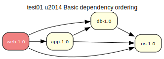

[emerge -vp](test01/emerge-test01.log) | [portage-ng](test01/portage-ng-test01.log) | [description](test01/description.txt)

---

## test02
**Basic** — Version selection (2.0 over 1.0)

This test case checks that the prover selects the latest available version when
multiple versions exist and no version constraints are specified. All dependencies
are unversioned, so the prover should prefer version 2.0 over 1.0 for every
package.

**Expected:** The plan should contain only version 2.0 packages (os-2.0, db-2.0, app-2.0,
web-2.0). No version 1.0 packages should appear. If the proposed plan is not
accepted, the prover should backtrack over available versions, proposing
alternative plans.

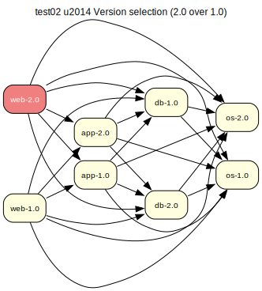

[emerge -vp](test02/emerge-test02.log) | [portage-ng](test02/portage-ng-test02.log) | [description](test02/description.txt)

---

## test03
**Cycle** — Self-dependency (compile)

This test case checks the prover's handling of a direct self-dependency in the
compile-time scope. The 'os-1.0' package lists itself as a compile-time dependency,
creating an immediate cycle. The prover must detect this cycle and take an
assumption to break it.

**Expected:** The prover should take a cycle-break assumption for os-1.0's compile dependency on
itself, yielding a verify step in the proposed plan. The plan should still include
all four packages.

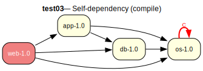

[emerge -vp](test03/emerge-test03.log) | [portage-ng](test03/portage-ng-test03.log) | [description](test03/description.txt)

---

## test04
**Cycle** — Self-dependency (runtime)

This test case is a variation of test03 where the self-dependency is in the runtime
scope (RDEPEND) instead of compile-time. The 'os-1.0' package lists itself as a
runtime dependency.

**Expected:** The prover should take a cycle-break assumption for os-1.0's runtime dependency on
itself, yielding a verify step in the proposed plan. Note that Gentoo emerge is
less strict about runtime self-dependencies and may not report circular
dependencies in this case.

[emerge -vp](test04/emerge-test04.log) | [portage-ng](test04/portage-ng-test04.log) | [description](test04/description.txt)

---

## test05
**Cycle** — Self-dependency (compile + runtime)

This test case combines test03 and test04. The 'os-1.0' package lists itself as
both a compile-time and runtime dependency, creating two self-referential cycles.

**Expected:** The prover should take two cycle-break assumptions: one for the compile-time
self-dependency and one for the runtime self-dependency. Both should yield verify
steps in the proposed plan.

[emerge -vp](test05/emerge-test05.log) | [portage-ng](test05/portage-ng-test05.log) | [description](test05/description.txt)

---

## test06
**Cycle** — Indirect cycle (compile)

This test case checks the prover's handling of an indirect circular dependency in
the compile-time scope. The 'os-1.0' package lists 'web-1.0' as a compile-time
dependency, while 'web-1.0' in turn depends on 'os-1.0', creating a two-node
cycle.

**Expected:** The prover should detect the cycle and take an assumption to break it, yielding a
verify step in the proposed plan. All four packages should still appear in the
final plan.

[emerge -vp](test06/emerge-test06.log) | [portage-ng](test06/portage-ng-test06.log) | [description](test06/description.txt)

---

## test07
**Cycle** — Indirect cycle (runtime)

This test case is a variation of test06 where the indirect circular dependency is
in the runtime scope (RDEPEND). The 'os-1.0' package lists 'web-1.0' as a runtime
dependency, creating a two-node runtime cycle.

**Expected:** The prover should detect the cycle and take an assumption to break it, yielding a
verify step in the proposed plan.

[emerge -vp](test07/emerge-test07.log) | [portage-ng](test07/portage-ng-test07.log) | [description](test07/description.txt)

---

## test08
**Cycle** — Indirect cycle (compile + runtime)

This test case combines test06 and test07. The 'os-1.0' package lists 'web-1.0' as
both a compile-time and runtime dependency, creating two indirect cycles through
the dependency graph.

**Expected:** The prover should detect both cycles and take assumptions to break them, yielding
two verify steps in the proposed plan.

[emerge -vp](test08/emerge-test08.log) | [portage-ng](test08/portage-ng-test08.log) | [description](test08/description.txt)

---

## test09
**Missing** — Non-existent dep (compile)

This test case checks the prover's ability to handle a missing dependency. The 'os-1.0' package depends on 'test09/notexists', which is not a real package available in the repository.

**Expected:** The prover should fail to find a candidate for the 'notexists' package and report that the dependency cannot be satisfied. This should result in a failed proof.

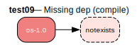

[emerge -vp](test09/emerge-test09.log) | [portage-ng](test09/portage-ng-test09.log) | [description](test09/description.txt)

---

## test10
**Missing** — Non-existent dep (runtime)

This is a variation of test09. It checks for a missing dependency, but this time in the runtime (RDEPEND) scope. The 'os-1.0' package requires 'test10/notexists' to run.

**Expected:** The prover should fail to find the 'notexists' package and report the missing runtime dependency, leading to a failed proof.

[emerge -vp](test10/emerge-test10.log) | [portage-ng](test10/portage-ng-test10.log) | [description](test10/description.txt)

---

## test11
**Missing** — Non-existent dep (compile + runtime)

This test case combines test09 and test10. The 'os-1.0' package has both a compile-time and a runtime dependency on the non-existent 'test11/notexists' package.

**Expected:** The prover should fail because it cannot find the 'notexists' package. It should correctly identify the missing dependency in both scopes.

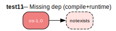

[emerge -vp](test11/emerge-test11.log) | [portage-ng](test11/portage-ng-test11.log) | [description](test11/description.txt)

---

## test12
**Keywords** — Stable vs unstable keyword acceptance

This test case examines the prover's handling of package keywords and stability. The latest (2.0) versions of the packages are marked as unstable. Without a specific configuration to accept these unstable keywords, the package manager should not select them.

**Expected:** Assuming a default configuration that only allows stable packages, the prover should reject the 2.0 versions and instead resolve the dependencies using the stable 1.0 versions. The final proof should be for app-1.0, db-1.0, and os-1.0.

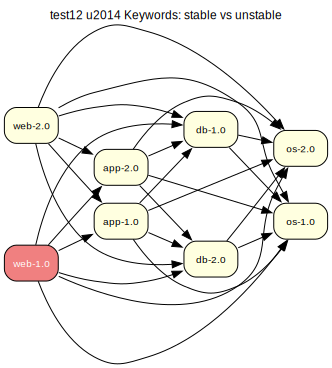

[emerge -vp](test12/emerge-test12.log) | [portage-ng](test12/portage-ng-test12.log) | [description](test12/description.txt)

---

## test13
**Version** — Pinpointed version =pkg-ver

This test case introduces a specific version constraint. The 'app-2.0' package explicitly requires 'db-2.0' (using the '=' operator), even though a 'db-1.0' is also available.

**Expected:** The prover must respect the version constraint. It should select 'db-2.0' and then proceed to resolve the rest of the dependencies, selecting the latest available versions for other packages like 'os-2.0'. The final proof should be for app-2.0, db-2.0, and os-2.0.

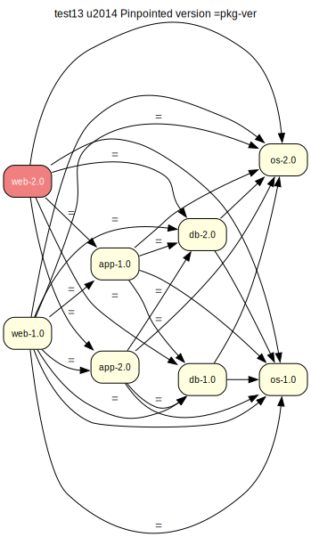

[emerge -vp](test13/emerge-test13.log) | [portage-ng](test13/portage-ng-test13.log) | [description](test13/description.txt)

---

## test14
**USE cond** — Positive USE conditional lib? ( )

This test case evaluates the handling of USE conditional dependencies. The dependency on 'lib-1.0' is only active if the 'lib' USE flag is enabled for the 'app-1.0' package.

**Expected:** - If the user proves 'app-1.0' without enabling the 'lib' flag, the proof should succeed, and 'lib-1.0' should not be included in the dependency graph.
- If the user proves 'app-1.0' and enables the 'lib' flag (e.g., via configuration), the proof should succeed, and 'lib-1.0' should be correctly included and installed.

[emerge -vp](test14/emerge-test14.log) | [portage-ng](test14/portage-ng-test14.log) | [description](test14/description.txt)

---

## test15
**USE cond** — Negative USE conditional !nolib? ( )

This test case is similar to test14 but uses a negative USE conditional. The dependency is triggered by the absence of a USE flag.

**Expected:** - If the 'nolib' flag is enabled for app-1.0, the proof should succeed without pulling in 'lib-1.0'.
- If the 'nolib' flag is not set (i.e., disabled by default), the proof should succeed and correctly include 'lib-1.0' as a dependency.

[emerge -vp](test15/emerge-test15.log) | [portage-ng](test15/portage-ng-test15.log) | [description](test15/description.txt)

---

## test16
**Parser** — Explicit all-of group ( ) syntax

This test case checks the parser's handling of explicit all-of group
parenthesization in dependency specifications. The 'web-1.0' package wraps two of
its runtime dependencies in an explicit all-of group: ( db-1.0 os-1.0 ). In PMS,
this is semantically equivalent to listing them flat (as in test01), but the parser
must correctly handle the parenthesized form without treating it as a choice group.

**Expected:** The prover should successfully resolve the dependencies and generate the same valid
proof as test01. The all-of group should be transparent to the resolver: app-1.0,
db-1.0, and os-1.0 should all appear in the plan in the correct order.

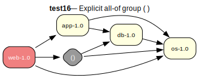

[emerge -vp](test16/emerge-test16.log) | [portage-ng](test16/portage-ng-test16.log) | [description](test16/description.txt)

---

## test17
**Choice** — Exactly-one-of ^^ (compile)

This test case evaluates the prover's handling of an 'exactly-one-of' dependency group (^^). The 'os-1.0' package requires that exactly one of the three OS packages be installed.

**Expected:** The prover should recognize the choice and select one of the available options (e.g., linux-1.0) to satisfy the dependency. Since there are no other constraints, any of the three choices should lead to a valid proof. The final plan will include app-1.0, os-1.0, and one of the three OS packages.

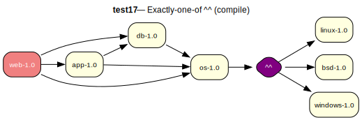

[emerge -vp](test17/emerge-test17.log) | [portage-ng](test17/portage-ng-test17.log) | [description](test17/description.txt)

---

## test18
**Choice** — Exactly-one-of ^^ (runtime)

This test case is a variation of test17, but the 'exactly-one-of' dependency is in the runtime scope (RDEPEND).

**Expected:** The prover should handle the runtime choice group correctly, select one of the OS options, and generate a valid proof.

[emerge -vp](test18/emerge-test18.log) | [portage-ng](test18/portage-ng-test18.log) | [description](test18/description.txt)

---

## test19
**Choice** — Exactly-one-of ^^ (compile + runtime)

This test case combines test17 and test18. The 'os-1.0' package has the same 'exactly-one-of' choice group in both its compile-time and runtime dependencies.

**Expected:** The prover should select a single OS package that satisfies both the compile-time and runtime requirements. For example, if it chooses 'linux-1.0' for the compile dependency, it must also use 'linux-1.0' for the runtime dependency. The proof should be valid.

[emerge -vp](test19/emerge-test19.log) | [portage-ng](test19/portage-ng-test19.log) | [description](test19/description.txt)

---

## test20
**Choice** — Any-of || (compile)

This test case evaluates the prover's handling of an 'any-of' dependency group (||). The 'os-1.0' package requires that at least one of the three OS packages be installed.

**Expected:** The prover should recognize the choice and select one of the available options to satisfy the dependency. Since there are no other constraints, any of the three choices should lead to a valid proof.

[emerge -vp](test20/emerge-test20.log) | [portage-ng](test20/portage-ng-test20.log) | [description](test20/description.txt)

---

## test21
**Choice** — Any-of || (runtime)

This is a variation of test20, with the 'any-of' dependency group in the runtime scope (RDEPEND).

**Expected:** The prover should handle the runtime choice group correctly, select one of the OS options, and generate a valid proof.

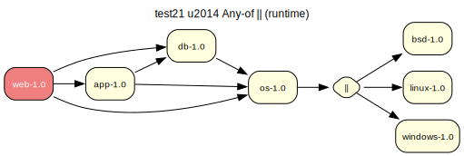

[emerge -vp](test21/emerge-test21.log) | [portage-ng](test21/portage-ng-test21.log) | [description](test21/description.txt)

---

## test22
**Choice** — Any-of || (compile + runtime)

This test case combines test20 and test21. The 'os-1.0' package has the same 'any-of' choice group in both its compile-time and runtime dependencies.

**Expected:** The prover can choose any of the OS packages to satisfy the compile-time dependency and any of the OS packages to satisfy the runtime dependency. They do not have to be the same. The proof should be valid.

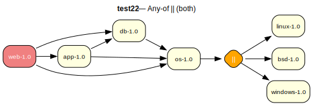

[emerge -vp](test22/emerge-test22.log) | [portage-ng](test22/portage-ng-test22.log) | [description](test22/description.txt)

---

## test23
**Choice** — At-most-one-of ?? (compile)

This test case evaluates the prover's handling of an 'at-most-one-of' dependency group (??). The 'os-1.0' package requires that at most one of the three OS packages be installed. This also means that installing *none* of them is a valid resolution.

**Expected:** The prover should satisfy the dependency by choosing to install nothing from the group, as this is the simplest path. A valid proof should be generated for app-1.0 and os-1.0, without any of the optional OS packages.

[emerge -vp](test23/emerge-test23.log) | [portage-ng](test23/portage-ng-test23.log) | [description](test23/description.txt)

---

## test24
**Choice** — At-most-one-of ?? (runtime)

This is a variation of test23, with the 'at-most-one-of' dependency group in the runtime scope (RDEPEND).

**Expected:** The prover should satisfy the runtime dependency by choosing to install none of the optional OS packages. The proof should be valid.

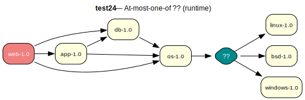

[emerge -vp](test24/emerge-test24.log) | [portage-ng](test24/portage-ng-test24.log) | [description](test24/description.txt)

---

## test25
**Choice** — At-most-one-of ?? (compile + runtime)

This test case combines test23 and test24. The 'os-1.0' package has the same 'at-most-one-of' choice group in both its compile-time and runtime dependencies.

**Expected:** The prover should resolve both dependencies by choosing to install none of the optional packages, as this is the simplest valid solution. The proof should be valid.

[emerge -vp](test25/emerge-test25.log) | [portage-ng](test25/portage-ng-test25.log) | [description](test25/description.txt)

---

## test26
**Blocker** — Strong blocker !! (runtime) + any-of

This test case checks the prover's handling of a strong blocker (!!). The 'app-1.0'
package has a strong runtime blocker against 'windows-1.0'. At the same time,
'os-1.0' has an any-of compile dependency that includes 'windows-1.0' as a choice.
The prover must recognize that selecting 'windows-1.0' for the any-of group would
conflict with the strong blocker on 'app-1.0', and should steer the selection
toward 'linux-1.0' or 'bsd-1.0' instead.

**Expected:** The prover should produce a valid plan that avoids 'windows-1.0'. It should select
either 'linux-1.0' or 'bsd-1.0' to satisfy the any-of group on 'os-1.0', since
'windows-1.0' is strongly blocked by 'app-1.0' in the runtime scope.

[emerge -vp](test26/emerge-test26.log) | [portage-ng](test26/portage-ng-test26.log) | [description](test26/description.txt)

---

## test27
**Blocker** — Weak blocker ! (runtime) + any-of

This test case checks the prover's handling of a weak blocker (!). The 'app-1.0'
package has a weak runtime blocker against 'windows-1.0'. Unlike the strong blocker
in test26, a weak blocker is advisory: it signals that 'windows-1.0' should be
uninstalled if already present, but does not absolutely forbid its co-existence.
The any-of group on 'os-1.0' still includes 'windows-1.0' as a candidate.

**Expected:** The prover should produce a valid plan. The weak blocker is recorded as a domain
assumption. The any-of group resolution may or may not select 'windows-1.0',
depending on blocker handling strategy.

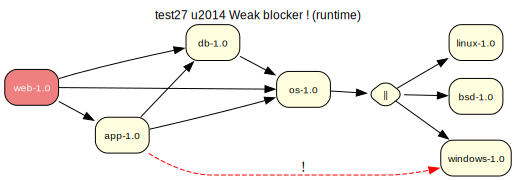

[emerge -vp](test27/emerge-test27.log) | [portage-ng](test27/portage-ng-test27.log) | [description](test27/description.txt)

---

## test28
**Blocker** — Strong blocker !! (compile) + any-of

This test case is a variation of test26 where the strong blocker (!!) is in the
compile-time scope (DEPEND) rather than the runtime scope (RDEPEND). The 'app-1.0'
package strongly blocks 'windows-1.0' at compile time, while 'os-1.0' has an
any-of compile dependency that includes 'windows-1.0'.

**Expected:** The prover should produce a valid plan that avoids 'windows-1.0'. It should select
either 'linux-1.0' or 'bsd-1.0' to satisfy the any-of group on 'os-1.0', since
'windows-1.0' is strongly blocked by 'app-1.0' in the compile scope.

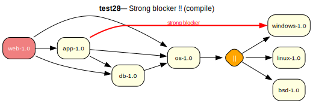

[emerge -vp](test28/emerge-test28.log) | [portage-ng](test28/portage-ng-test28.log) | [description](test28/description.txt)

---

## test29
**Blocker** — Strong blocker !! (compile+runtime) + any-of

This test case combines test26 and test28. The 'app-1.0' package has a strong
blocker (!!) against 'windows-1.0' in both the compile-time (DEPEND) and runtime
(RDEPEND) scopes. The any-of group on 'os-1.0' still includes 'windows-1.0'.

**Expected:** The prover should produce a valid plan that avoids 'windows-1.0'. It should select
either 'linux-1.0' or 'bsd-1.0' for the any-of group, since 'windows-1.0' is
strongly blocked in both scopes.

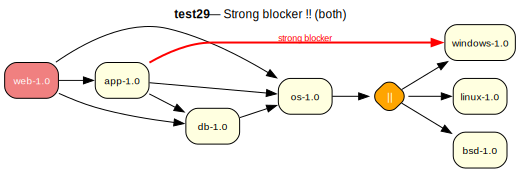

[emerge -vp](test29/emerge-test29.log) | [portage-ng](test29/portage-ng-test29.log) | [description](test29/description.txt)

---

## test30
**Blocker** — Weak blocker ! (compile) + any-of

This test case is a variation of test27 where the weak blocker (!) is in the
compile-time scope (DEPEND) rather than the runtime scope (RDEPEND). The 'app-1.0'
package weakly blocks 'windows-1.0' at compile time, while 'os-1.0' has an any-of
compile dependency that includes 'windows-1.0'.

**Expected:** The prover should produce a valid plan. The weak blocker is recorded as a domain
assumption. The any-of group resolution may or may not select 'windows-1.0',
depending on blocker handling strategy.

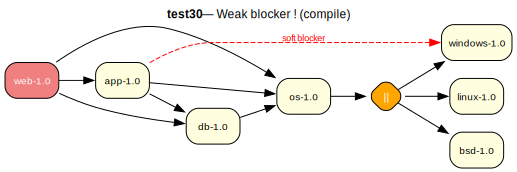

[emerge -vp](test30/emerge-test30.log) | [portage-ng](test30/portage-ng-test30.log) | [description](test30/description.txt)

---

## test31
**Blocker** — Weak blocker ! (compile+runtime) + any-of

This test case combines test27 and test30. The 'app-1.0' package has a weak
blocker (!) against 'windows-1.0' in both the compile-time (DEPEND) and runtime
(RDEPEND) scopes. The any-of group on 'os-1.0' still includes 'windows-1.0'.

**Expected:** The prover should produce a valid plan. The weak blockers are recorded as domain
assumptions. The any-of group resolution may or may not select 'windows-1.0',
depending on blocker handling strategy.

[emerge -vp](test31/emerge-test31.log) | [portage-ng](test31/portage-ng-test31.log) | [description](test31/description.txt)

---

## test32
**REQUIRED_USE** — ^^ with conditional DEPEND

This test case examines the interplay between REQUIRED_USE and conditional dependencies. The 'os-1.0' package must have exactly one of 'linux' or 'darwin' enabled. The choice of which flag is enabled will then trigger the corresponding dependency.

**Expected:** The prover should satisfy the REQUIRED_USE by making a choice. For example, it might enable the 'linux' flag. This action should then trigger the conditional dependency, pulling 'linux-1.0' into the installation plan. A valid proof will include os-1.0 and either linux-1.0 or darwin-1.0.

[emerge -vp](test32/emerge-test32.log) | [portage-ng](test32/portage-ng-test32.log) | [description](test32/description.txt)

---

## test33
**USE dep** — Positive [linux]

This test case examines a direct USE dependency. The 'app-1.0' package requires that 'os-1.0' be built with the 'linux' USE flag enabled.

**Expected:** The prover should identify the USE requirement and enable the 'linux' flag for 'os-1.0' when resolving its dependencies. The final proof should be valid and show that 'os-1.0' is built with USE="linux".

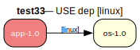

[emerge -vp](test33/emerge-test33.log) | [portage-ng](test33/portage-ng-test33.log) | [description](test33/description.txt)

---

## test34
**USE dep** — Negative [-linux]

This test case is the inverse of test33. It checks the handling of a negative USE dependency. The 'app-1.0' package requires that 'os-1.0' be built with the 'linux' USE flag disabled.

**Expected:** The prover must ensure the 'linux' flag is disabled for 'os-1.0'. The proof should be valid, showing that 'os-1.0' is built with USE="-linux".

[emerge -vp](test34/emerge-test34.log) | [portage-ng](test34/portage-ng-test34.log) | [description](test34/description.txt)

---

## test35
**USE dep** — Equality [linux=]

This test case checks the handling of conditional USE propagation. The dependency `os[linux=]` means that if 'app-1.0' is built with USE="linux", then 'os-1.0' must also be built with USE="linux". If 'app-1.0' is built with USE="-linux", then 'os-1.0' must be built with USE="-linux".

**Expected:** - If 'app-1.0' is proven with USE="linux", the prover should enforce USE="linux" on 'os-1.0'.
- If 'app-1.0' is proven with USE="-linux" (or it's disabled by default), the prover should enforce USE="-linux" on 'os-1.0'.
In both cases, the proof should be valid.

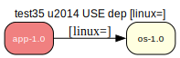

[emerge -vp](test35/emerge-test35.log) | [portage-ng](test35/portage-ng-test35.log) | [description](test35/description.txt)

---

## test36
**USE dep** — Chained equality [linux=] through lib

This test case examines the prover's ability to propagate a conditional USE flag requirement down a dependency chain. The USE="linux" setting on 'app-1.0' should flow down to 'lib-1.0', which in turn should flow down to 'os-1.0'.

**Expected:** If 'app-1.0' is proven with USE="linux", the prover should enforce USE="linux" on both 'lib-1.0' and 'os-1.0'. Conversely, if 'app-1.0' has USE="-linux", that requirement should also propagate down the chain. The proof should be valid in both scenarios.

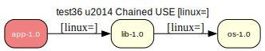

[emerge -vp](test36/emerge-test36.log) | [portage-ng](test36/portage-ng-test36.log) | [description](test36/description.txt)

---

## test37
**USE dep** — Inverse equality [!linux=]

This test case checks the handling of an inverse conditional USE dependency. The dependency `os[!linux=]` means that the 'linux' flag on 'os-1.0' must be the inverse of the setting on 'app-1.0'.

**Expected:** - If 'app-1.0' is proven with USE="linux", the prover must enforce USE="-linux" on 'os-1.0'.
- If 'app-1.0' is proven with USE="-linux", the prover must enforce USE="linux" on 'os-1.0'.
The proof should be valid in both scenarios.

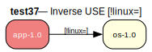

[emerge -vp](test37/emerge-test37.log) | [portage-ng](test37/portage-ng-test37.log) | [description](test37/description.txt)

---

## test38
**USE dep** — Weak conditional [linux?]

This test case checks the handling of a weak USE dependency. The dependency `os[linux?]` means that 'os-1.0' will have the 'linux' flag enabled *only if* 'app-1.0' also has the 'linux' flag enabled. It does not force the flag to be enabled on 'app-1.0'.

**Expected:** - If 'app-1.0' is proven with USE="linux", the prover should enforce USE="linux" on 'os-1.0'.
- If 'app-1.0' is proven with USE="-linux", the 'linux' flag on 'os-1.0' is not constrained by this dependency and can be either on or off (defaulting to off).
The proof should be valid in both scenarios.

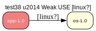

[emerge -vp](test38/emerge-test38.log) | [portage-ng](test38/portage-ng-test38.log) | [description](test38/description.txt)

---

## test39
**USE dep** — Negative weak [-linux?]

This test case checks the handling of a negative weak USE dependency. The dependency `os[-linux?]` means that 'os-1.0' will have the 'linux' flag disabled *only if* 'app-1.0' also has the 'linux' flag disabled.

**Expected:** - If 'app-1.0' is proven with USE="-linux", the prover should enforce USE="-linux" on 'os-1.0'.
- If 'app-1.0' is proven with USE="linux", the 'linux' flag on 'os-1.0' is not constrained by this dependency.
The proof should be valid in both scenarios.

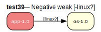

[emerge -vp](test39/emerge-test39.log) | [portage-ng](test39/portage-ng-test39.log) | [description](test39/description.txt)

---

## test40
**REQUIRED_USE** — || on standalone package

This test case checks the prover's ability to handle a REQUIRED_USE 'any-of' (||) constraint on a standalone package. To install 'os-1.0', the user or the configuration must ensure that at least one of the 'linux' or 'darwin' USE flags is enabled.

**Expected:** - If the prover is run for 'os-1.0' and the configuration provides either USE="linux" or USE="darwin", the proof should be valid.
- If no configuration is provided, the prover should make a choice and enable one of the flags to satisfy the constraint, resulting in a valid proof.
- If the configuration explicitly disables both (e.g., USE="-linux -darwin"), the proof should fail.

[emerge -vp](test40/emerge-test40.log) | [portage-ng](test40/portage-ng-test40.log) | [description](test40/description.txt)

---

## test41
**Slot** — Explicit slot :1

This test case checks the prover's ability to resolve dependencies based on slotting. 'app-1.0' requires a version of 'lib' that is in slot "1". Even though 'lib-2.0' is a higher version, it is in a different slot and therefore not a candidate.

**Expected:** The prover should correctly select 'lib-1.0' to satisfy the slot dependency, ignoring the newer 'lib-2.0'. The proof should be valid.

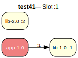

[emerge -vp](test41/emerge-test41.log) | [portage-ng](test41/portage-ng-test41.log) | [description](test41/description.txt)

---

## test42
**Slot** — Wildcard slot :*

This test case checks the prover's behavior with a wildcard slot dependency. 'app-1.0' requires 'lib', but it doesn't care which slot is used.

**Expected:** Given the choice between two valid slots, the prover should follow the default behavior of picking the latest version, which is 'lib-2.0' in slot "2". The proof should be valid.

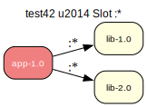

[emerge -vp](test42/emerge-test42.log) | [portage-ng](test42/portage-ng-test42.log) | [description](test42/description.txt)

---

## test43
**Slot** — Slot equality :=

This test case examines the slot equality operator (:=). 'app-1.0' depends on 'lib' at compile time. The prover will choose the latest version, 'lib-2.0'. The runtime dependency then requires that the same slot ('2') be used.

**Expected:** The prover should first resolve the compile dependency to 'lib-2.0'. Then, when resolving the runtime dependency, it must choose a package from the same slot, which is 'lib-2.0'. The proof should be valid.

[emerge -vp](test43/emerge-test43.log) | [portage-ng](test43/portage-ng-test43.log) | [description](test43/description.txt)

---

## test44
**Slot** — Sub-slot :1/A

This test case checks the prover's ability to resolve dependencies based on sub-slots. 'app-1.0' requires a version of 'lib' in slot "1" and sub-slot "A".

**Expected:** The prover should correctly select 'lib-1.0' to satisfy the sub-slot dependency. It should ignore 'lib-1.1' (wrong sub-slot) and 'lib-2.0' (wrong slot). The proof should be valid.

[emerge -vp](test44/emerge-test44.log) | [portage-ng](test44/portage-ng-test44.log) | [description](test44/description.txt)

---

## test45
**Conflict** — Irreconcilable USE conflict via ^^

This test case checks the prover's ability to detect a direct and irreconcilable USE flag conflict. The 'os' package has a REQUIRED_USE constraint of "^^ ( linux darwin )", meaning exactly one of those USE flags must be enabled. However, the dependency graph requires both to be enabled simultaneously to satisfy liba and libb.

**Expected:** The prover should correctly identify the conflict and fail to produce a valid installation proof. There is no possible configuration of USE flags that can satisfy these dependencies.

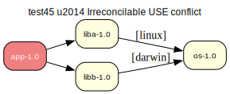

[emerge -vp](test45/emerge-test45.log) | [portage-ng](test45/portage-ng-test45.log) | [description](test45/description.txt)

---

## test46
**Conflict** — Deep diamond USE conflict

This test case is designed to assess the prover's ability to detect a USE flag conflict that is hidden several layers deep in the dependency graph. The two main dependency branches ('liba' and 'libb') converge on 'core-utils' with contradictory requirements for the 'feature_x' USE flag.

**Expected:** The prover must trace the entire dependency tree and identify that 'core-utils' is required with both 'feature_x' enabled and disabled simultaneously. As this is a logical contradiction, the prover should fail to produce a valid installation proof.

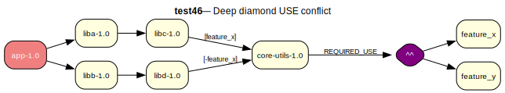

[emerge -vp](test46/emerge-test46.log) | [portage-ng](test46/portage-ng-test46.log) | [description](test46/description.txt)

---

## test47
**Cycle** — Three-way dependency cycle

This test case presents a more complex, three-way circular dependency. The client needs the docs to build, the docs need the server to run, and the server needs the client to run. This creates a loop that cannot be resolved.

**Expected:** The prover should be able to trace the dependency chain through all three packages and identify the circular dependency, causing the proof to fail.

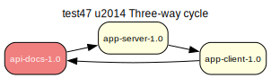

[emerge -vp](test47/emerge-test47.log) | [portage-ng](test47/portage-ng-test47.log) | [description](test47/description.txt)

---

## test48
**Conflict** — Slot conflict (same slot, different versions)

This test case checks the prover's ability to detect a slotting conflict. The two main dependencies, 'libgraphics' and 'libphysics', require different versions of 'libmatrix' to be installed into the same slot ('1'). A package slot can only be occupied by one version at a time.

**Expected:** The prover should identify that the dependencies for 'app-1.0' lead to a request to install two different packages ('libmatrix-1.0' and 'libmatrix-1.1') into the same slot. This is an impossible condition, so the prover must fail to find a valid proof.

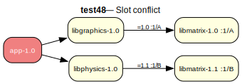

[emerge -vp](test48/emerge-test48.log) | [portage-ng](test48/portage-ng-test48.log) | [description](test48/description.txt)

---

## test49
**Conflict** — USE default (+) vs REQUIRED_USE

This test case checks the prover's ability to handle a conflict between a "soft" USE flag suggestion from a dependency and a "hard" REQUIRED_USE constraint in the target package. The `(+)` syntax is a default and should be overridden by the stricter `REQUIRED_USE`.

**Expected:** The prover should recognize that the dependency from 'app-1.0' attempts to enable a USE flag that is explicitly forbidden by 'libhelper-1.0'. The hard constraint of REQUIRED_USE must take precedence, leading to an unresolvable conflict. The prover should fail to find a valid proof.

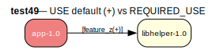

[emerge -vp](test49/emerge-test49.log) | [portage-ng](test49/portage-ng-test49.log) | [description](test49/description.txt)

---

## test50
**Transitive** — Compile dep's RDEPEND must appear

This test case examines the prover's handling of transitive dependencies, specifically how a runtime dependency of a compile-time dependency is treated. 'app-1.0' needs 'foo-1.0' to build. 'foo-1.0' itself needs 'bar-1.0' to run.

**Expected:** When proving for 'app-1.0', the prover should correctly identify that both 'foo-1.0' and 'bar-1.0' need to be installed. The proof should be valid, and the installation plan should include all three packages in the correct order (bar, foo, app).

[emerge -vp](test50/emerge-test50.log) | [portage-ng](test50/portage-ng-test50.log) | [description](test50/description.txt)

---

## test51
**Conflict** — USE dep vs REQUIRED_USE contradiction

This test case presents a direct and unsolvable conflict between a dependency's USE requirement and the target package's REQUIRED_USE. 'app-1.0' needs 'os-1.0' with the 'linux' flag, but 'os-1.0' explicitly forbids that flag from being enabled.

**Expected:** The prover should immediately detect the contradiction between the USE dependency and the REQUIRED_USE constraint and fail to produce a valid proof.

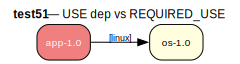

[emerge -vp](test51/emerge-test51.log) | [portage-ng](test51/portage-ng-test51.log) | [description](test51/description.txt)

---

## test52
**USE merge** — Multiple USE flags on shared dep

The prover will first prove os-1.0 through the liba path. This means os-1.0 will have 'threads' enabled. Later prover needs to enable 'hardened' through the libb path. The prover should be able to produce a proof with just one os install, for both 'threads' and 'hardeded'. This should also be reflected in the download for os-1.0

**Expected:** The prover should correctly identify the need for building os-1.0 only once with the two use flags.

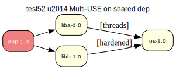

[emerge -vp](test52/emerge-test52.log) | [portage-ng](test52/portage-ng-test52.log) | [description](test52/description.txt)

---

## test53
**USE merge** — USE merge + conditional extra dep

The prover will first prove os-1.0 through the liba path. This means os-1.0 will have 'threads' enabled. Later prover needs to enable 'hardened' through the libb path. The prover should be able to produce a proof with just one os install, for both 'threads' and 'hardeded'. This should also be reflected in the download for os-1.0. Introducing 'hardened' on the already proven os-1.0 should pull in a new dependency on libhardened-1.0

**Expected:** The prover should correctly identify the need for building os-1.0 only once with the two use flags, and the libhardened-1.0 dependency

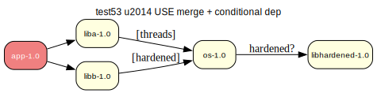

[emerge -vp](test53/emerge-test53.log) | [portage-ng](test53/portage-ng-test53.log) | [description](test53/description.txt)

---

## test54
**Printer** — Expanding USE flags output

Expanding use flags output

**Expected:** The printer should succesfully split up the different expanding use

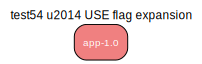

[emerge -vp](test54/emerge-test54.log) | [portage-ng](test54/portage-ng-test54.log) | [description](test54/description.txt)

---

## test55
**Version** — Constraint intersection (direct >3 + <6)

Multiple requirements should be combined. Only one version should be selected

**Expected:** The constraints on the lib versions should be combined. Only one version should be selected.

[emerge -vp](test55/emerge-test55.log) | [portage-ng](test55/portage-ng-test55.log) | [description](test55/description.txt)

---

## test56
**Version** — Constraint intersection via dep chains

Multiple requirements should be combined. Only one version should be selected

**Expected:** The constraints on the lib versions should be combined. Only one version should be selected, since there is only one slot to fill.

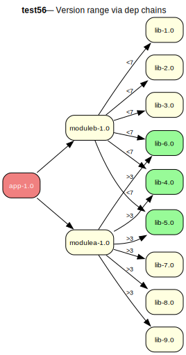

[emerge -vp](test56/emerge-test56.log) | [portage-ng](test56/portage-ng-test56.log) | [description](test56/description.txt)

---

## test57
**Virtual** — Virtual-style ebuild (explicit dep)

This test case validates that dependencies of a virtual-style ebuild are traversed
and that its provider package is included in the proof/model. The 'virtualsdk-1.0'
ebuild acts as a virtual by depending on 'linux-1.0' as its concrete provider.

**Expected:** When proving web-1.0, the plan/model should include linux-1.0 (via
virtualsdk-1.0). The full chain os -> virtualsdk -> linux should be resolved.

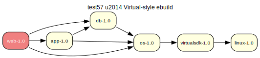

[emerge -vp](test57/emerge-test57.log) | [portage-ng](test57/portage-ng-test57.log) | [description](test57/description.txt)

---

## test58
**Virtual** — PROVIDE-based virtual (XFAIL)

> **XFAIL** — expected to fail.

This test case checks PROVIDE-based virtual satisfaction. The 'linux-1.0' package
claims to provide 'virtualsdk', which is not available as a standalone ebuild. The
resolver must recognize that 'linux-1.0' satisfies the virtual dependency through
its PROVIDE declaration. This is a deprecated PMS mechanism but still appears in
the wild.

**Expected:** Currently expected to fail (XFAIL) until PROVIDE/provider resolution is
implemented. Eventually, proving web-1.0 should pull in linux-1.0 to satisfy the
test58/virtualsdk dependency.

[emerge -vp](test58/emerge-test58.log) | [portage-ng](test58/portage-ng-test58.log) | [description](test58/description.txt)

---

## test59
**Regression** — Any-of || selection regression (XFAIL)

> **XFAIL** — expected to fail.

This is an XFAIL regression test for a known bug where the any-of group (||) does
not force the solver to select at least one alternative. Structurally similar to
test21 (any-of in RDEPEND), but this test uses different package names and exists
specifically to track the regression where any-of members can all be dropped from
the model.

**Expected:** Currently expected to fail (XFAIL): the solver does not force selecting one
alternative from the any-of group. When the bug is fixed, the model should contain
either data_fast-1.0 or data_best-1.0.

[emerge -vp](test59/emerge-test59.log) | [portage-ng](test59/portage-ng-test59.log) | [description](test59/description.txt)

---

## test60
**Blocker** — Versioned soft blocker !<pkg-ver (XFAIL)

> **XFAIL** — expected to fail.

This test case checks the handling of versioned soft blockers (!<pkg-version). The
'app-1.0' package blocks any version of 'windows' less than 2.0. The any-of group
on 'os-1.0' offers both windows-1.0 and windows-2.0 as choices. The solver should
avoid windows-1.0 because it falls within the blocker's version range.

**Expected:** Currently expected to fail (XFAIL): the versioned blocker is handled via
assumptions rather than by steering the version choice. When fixed, the solver
should select windows-2.0 and avoid windows-1.0.

[emerge -vp](test60/emerge-test60.log) | [portage-ng](test60/portage-ng-test60.log) | [description](test60/description.txt)

---

## test61
**Cycle** — Mutual recursion with bracketed USE

This test case checks termination and cycle handling when bracketed USE
dependencies ([foo]) are present in a mutual recursion. The 'a' and 'b' packages
each require the other with a specific USE flag. The prover must ensure that the
build_with_use context does not grow unbounded as it traverses the cycle.

**Expected:** The solver should terminate quickly, either by cycle breaking or by producing a
finite plan. It must not spin or backtrack indefinitely due to accumulating USE
context.

[emerge -vp](test61/emerge-test61.log) | [portage-ng](test61/portage-ng-test61.log) | [description](test61/description.txt)

---

## test62
**Cycle** — Simple mutual cycle (termination)

This test case is a prover termination regression test for simple mutual dependency
cycles without blockers, slots, or USE flags. It checks whether per-goal context
growth (e.g. accumulating self() markers or slot information) can defeat cycle
detection and cause backtracking until timeout.

**Expected:** The prover should terminate quickly with a finite model/plan, or fail fast. It must
not spin or backtrack indefinitely. A cycle-break assumption is expected.

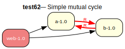

[emerge -vp](test62/emerge-test62.log) | [portage-ng](test62/portage-ng-test62.log) | [description](test62/description.txt)

---

## test63
**Cycle** — REQUIRED_USE loop reproducer (openmpi-style)

This test case reproduces the prover timeout trace seen in portage for packages
that pull sys-cluster/openmpi, where proving hits a sequence of
use_conditional_group/4 items for mutually exclusive flags. It is a tiny
overlay-only reproducer intended to isolate backtracking/timeout behaviour without
involving the full portage tree.

**Expected:** The prover should complete without timing out. The plan should include app-1.0 and
openmpi-4.1.6-r1 with a valid REQUIRED_USE configuration.

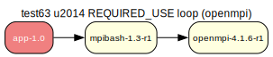

[emerge -vp](test63/emerge-test63.log) | [portage-ng](test63/portage-ng-test63.log) | [description](test63/description.txt)

---

## test64
**Cycle** — USE-conditional churn reproducer (openmp-style)

This test case reproduces the small backtracking/churn pattern observed for
llvm-runtimes/openmp in a tiny overlay-only setup. The real openmp metadata
includes IUSE flags, USE-gated dependencies, and REQUIRED_USE groups that can
cause excessive proof retries.

**Expected:** The prover should complete without timing out. A valid plan should be produced that
respects all REQUIRED_USE constraints and USE-conditional dependencies.

[emerge -vp](test64/emerge-test64.log) | [portage-ng](test64/portage-ng-test64.log) | [description](test64/description.txt)

---

## test65
**Installed** — build_with_use reinstall semantics

This test case is a regression test for rules:installed_entry_satisfies_build_with_use/2.
It ensures that an installed VDB entry cannot be treated as satisfying a dependency
if incoming build_with_use requires a flag that the installed package was not built
with. The test uses an always-false flag requirement (__portage_ng_test_flag__)
against an arbitrary installed package.

**Expected:** The test validation checks that the rule correctly identifies unsatisfied
build_with_use requirements on installed packages. The prover should find that no
installed entry satisfies the synthetic flag requirement, and the rule should
produce non-empty conditions.

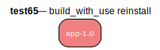

[emerge -vp](test65/emerge-test65.log) | [portage-ng](test65/portage-ng-test65.log) | [description](test65/description.txt)

---

## test66
**PDEPEND** — Post-merge dependency resolution

This test case checks the prover's handling of PDEPEND (post-merge dependencies).
The 'lib-1.0' package declares 'plugin-1.0' as a PDEPEND, meaning plugin-1.0
should be resolved after lib-1.0's installation, not as a prerequisite.

**Expected:** All three packages should appear in the proof/plan. The plugin-1.0 package should
be ordered after lib-1.0's install step via the PDEPEND proof obligation mechanism.

[emerge -vp](test66/emerge-test66.log) | [portage-ng](test66/portage-ng-test66.log) | [description](test66/description.txt)

---

## test67
**BDEPEND** — Build-only dependency (separate from DEPEND)

This test case checks the prover's handling of BDEPEND (build dependencies). The
'app-1.0' package requires 'toolchain-1.0' only for building (BDEPEND), separate
from its runtime dependency on 'lib-1.0'. BDEPEND is resolved alongside DEPEND
for the install phase.

**Expected:** All three packages should appear in the proof. The toolchain-1.0 should be
resolved as a build dependency of app-1.0, while lib-1.0 is resolved as a runtime
dependency.

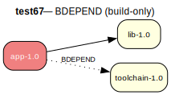

[emerge -vp](test67/emerge-test67.log) | [portage-ng](test67/portage-ng-test67.log) | [description](test67/description.txt)

---

## test68
**Multi-slot** — Co-installation of same CN in different slots

This test case checks the prover's ability to resolve dependencies on multiple
slots of the same package simultaneously. The 'app-1.0' package requires both
slot 1 and slot 2 of 'lib', which correspond to different versions. Both must
appear in the plan since different slots can coexist.

**Expected:** Both lib-1.0 (slot 1) and lib-2.0 (slot 2) should appear in the proof. The prover
should recognize that different slots are independent installation targets and
include both in the plan.

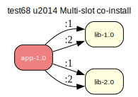

[emerge -vp](test68/emerge-test68.log) | [portage-ng](test68/portage-ng-test68.log) | [description](test68/description.txt)

---

## test69
**Version** — Operator >= (greater-or-equal)

This test case checks the prover's handling of the >= (greater-or-equal) version
operator. The 'app-1.0' package requires lib version 3.0 or higher. Versions 1.0
and 2.0 should be excluded; versions 3.0, 4.0, and 5.0 are valid candidates.

**Expected:** The prover should select the latest valid version, lib-5.0, to satisfy the
dependency. Versions 1.0 and 2.0 should not appear in the proof.

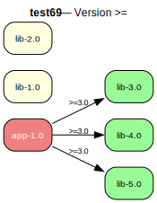

[emerge -vp](test69/emerge-test69.log) | [portage-ng](test69/portage-ng-test69.log) | [description](test69/description.txt)

---

## test70
**Version** — Operator ~ (revision match)

This test case checks the prover's handling of the ~ (revision match) version
operator. The dependency ~lib-2.0 should match lib-2.0 and lib-2.0-r1 (any
revision of the 2.0 base version) but NOT lib-3.0 (different base version).

**Expected:** The prover should select lib-2.0-r1 (the latest matching revision of 2.0). 
lib-3.0 should not be considered a valid candidate for this dependency.

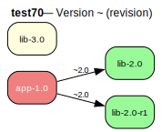

[emerge -vp](test70/emerge-test70.log) | [portage-ng](test70/portage-ng-test70.log) | [description](test70/description.txt)

---

## test71
**Fetchonly** — Download-only action

This test case checks the prover's handling of the fetchonly action. The dependency
structure is identical to test01, but the entry point uses :fetchonly instead of
:run. In fetchonly mode, only download actions should be produced, with no
install/run steps.

**Expected:** All four packages should appear in the proof with download/fetchonly actions. No
install or run steps should be produced in the plan.

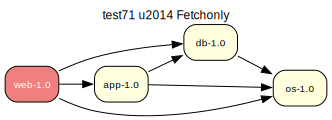

[emerge -vp](test71/emerge-test71.log) | [portage-ng](test71/portage-ng-test71.log) | [description](test71/description.txt)

---

## test72
**IDEPEND** — Install-time dependency

This test case checks the prover's handling of IDEPEND (install-time dependencies).
IDEPEND is an EAPI 8 feature that specifies packages needed at install time on the
target system (as opposed to BDEPEND which is for the build system). The 'app-1.0'
package requires 'installer-1.0' at install time.

**Expected:** Both packages should appear in the proof. The installer-1.0 should be resolved as
an install-time dependency and be available before app-1.0's install phase.

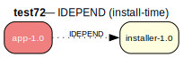

[emerge -vp](test72/emerge-test72.log) | [portage-ng](test72/portage-ng-test72.log) | [description](test72/description.txt)

---

## test73
**Update** — Installed old version, newer available (VDB)

This test case checks the prover's update path. When lib-1.0 is already installed
and lib-2.0 is available, the prover should detect that an update is possible and
trigger the :update action instead of :install. This requires VDB simulation to
mark lib-1.0 as installed.

**Expected:** The prover should select lib-2.0 as an update replacing the installed lib-1.0. The
plan should show an update action for lib, not a fresh install.

[emerge -vp](test73/emerge-test73.log) | [portage-ng](test73/portage-ng-test73.log) | [description](test73/description.txt)

---

## test74
**Downgrade** — Installed newer, constraint forces older (VDB)

This test case checks the prover's downgrade path. When lib-2.0 is installed but
app-1.0 requires exactly lib-1.0 (via the = operator), the prover should detect
that a downgrade is needed. The same-slot installed version is newer than the
required version.

**Expected:** The prover should select lib-1.0 as a downgrade replacing the installed lib-2.0.
The plan should show a downgrade action for lib.

[emerge -vp](test74/emerge-test74.log) | [portage-ng](test74/portage-ng-test74.log) | [description](test74/description.txt)

---

## test75
**Reinstall** — Installed same version, emptytree (VDB)

This test case checks the prover's behavior when the --emptytree flag is active.
Even though os-1.0 is already installed, the emptytree flag should force the
prover to re-prove it rather than skipping it as satisfied. This exercises the
reinstall path.

**Expected:** With emptytree behavior, os-1.0 should appear in the proof despite being installed.
The plan should include a reinstall or fresh install action for os-1.0.

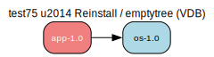

[emerge -vp](test75/emerge-test75.log) | [portage-ng](test75/portage-ng-test75.log) | [description](test75/description.txt)

---

## test76
**Newuse** — Installed with wrong USE, rebuild needed (VDB)

This test case checks the prover's newuse rebuild behavior. The installed os-1.0
was built without the 'linux' USE flag, but app-1.0 requires os[linux]. The prover
should detect that the installed version does not satisfy the incoming
build_with_use requirement and trigger a rebuild.

**Expected:** The prover should detect that os-1.0 needs to be rebuilt with USE="linux" enabled.
The plan should include a rebuild action for os-1.0.

[emerge -vp](test76/emerge-test76.log) | [portage-ng](test76/portage-ng-test76.log) | [description](test76/description.txt)

---

## test77
**Depclean** — Unused package removal (VDB)

This test case checks the depclean action. When run with :depclean, the prover
should traverse the installed dependency graph starting from world targets and
identify packages that are not reachable. The 'orphan-1.0' package is installed
but nothing depends on it, making it a candidate for removal.

**Expected:** The depclean analysis should identify orphan-1.0 as removable since it has no
reverse dependencies in the installed package graph. app-1.0 and os-1.0 should
be retained.

[emerge -vp](test77/emerge-test77.log) | [portage-ng](test77/portage-ng-test77.log) | [description](test77/description.txt)

---

## test78
**Onlydeps** — Skip target, install deps only

This test case checks the --onlydeps behavior. When the entry point target
(web-1.0) is proven with the onlydeps_target context flag, the target package
itself should not appear in the install plan, but all of its dependencies should
still be resolved and included.

**Expected:** The dependencies (app-1.0, db-1.0, os-1.0) should appear in the proof and plan.
The target package web-1.0 should be excluded from the install actions, though it
may still appear in the proof for dependency traversal purposes.

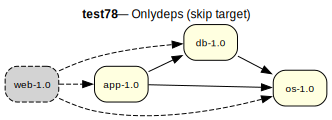

[emerge -vp](test78/emerge-test78.log) | [portage-ng](test78/portage-ng-test78.log) | [description](test78/description.txt)

---

## test79
**PDEPEND** — PDEPEND cycle (A needs B, B PDEPEND A)

This test case checks the handling of cycles involving PDEPEND. The server needs
the client at runtime, and the client has a PDEPEND back on the server. Since
PDEPEND is resolved post-install (via proof obligations), this cycle should be
naturally broken by the ordering: server installs first, then client, then the
PDEPEND obligation for server is already satisfied.

**Expected:** Both packages should appear in the proof without infinite loops. The PDEPEND cycle
should be handled gracefully by the proof obligation mechanism, not treated as a
hard circular dependency requiring assumptions.

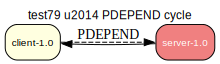

[emerge -vp](test79/emerge-test79.log) | [portage-ng](test79/portage-ng-test79.log) | [description](test79/description.txt)

---

## test80
**Version** — Operator <= (less-or-equal)

This test case checks the prover's handling of the <= (less-or-equal) version
operator. The 'app-1.0' package requires lib version 3.0 or lower. Versions 4.0
and 5.0 should be excluded; versions 1.0, 2.0, and 3.0 are valid candidates.

**Expected:** The prover should select the latest valid version, lib-3.0, to satisfy the
dependency. Versions 4.0 and 5.0 should not be considered valid candidates.

[emerge -vp](test80/emerge-test80.log) | [portage-ng](test80/portage-ng-test80.log) | [description](test80/description.txt)

---
