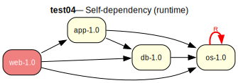

# test04 — Self-dependency (runtime)

**Category:** Cycle

This test case is a variation of test03 where the self-dependency is in the runtime
scope (RDEPEND) instead of compile-time. The 'os-1.0' package lists itself as a
runtime dependency.

**Expected:** The prover should take a cycle-break assumption for os-1.0's runtime dependency on
itself, yielding a verify step in the proposed plan. Note that Gentoo emerge is
less strict about runtime self-dependencies and may not report circular
dependencies in this case.

**Output:** [emerge -vp](emerge-test04.log) | [portage-ng](portage-ng-test04.log)