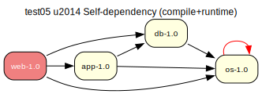

# test05 — Self-dependency (compile + runtime)

**Category:** Cycle

This test case combines test03 and test04. The 'os-1.0' package lists itself as
both a compile-time and runtime dependency, creating two self-referential cycles.

**Expected:** The prover should take two cycle-break assumptions: one for the compile-time
self-dependency and one for the runtime self-dependency. Both should yield verify
steps in the proposed plan.



<details>
<summary><b>emerge</b></summary>

```
These are the packages that would be merged, in order:

Calculating dependencies  ... done!
Dependency resolution took 1.21 s (backtrack: 1/20).


[ebuild  N     ] test05/web-1.0::overlay  0 KiB
[ebuild  N     ]  test05/app-1.0::overlay  0 KiB
[ebuild  N     ]   test05/db-1.0::overlay  0 KiB
[ebuild  N     ]    test05/os-1.0::overlay  0 KiB

Total: 4 packages (4 new), Size of downloads: 0 KiB

 * Error: circular dependencies:

(test05/os-1.0:0/0::overlay, ebuild scheduled for merge) depends on
 (test05/os-1.0:0/0::overlay, ebuild scheduled for merge) (buildtime)

 * Note that circular dependencies can often be avoided by temporarily
 * disabling USE flags that trigger optional dependencies.
```

</details>

<details>
<summary><b>portage-ng</b></summary>

```
>>> Emerging : overlay://test05/web-1.0:run?{[]}

These are the packages that would be merged, in order:

Calculating dependencies... done!

 └─step  1─┤ verify  test05/os (assumed installed) 
             │ download  overlay://test05/web-1.0
             │ download  overlay://test05/os-1.0
             │ download  overlay://test05/db-1.0
             │ download  overlay://test05/app-1.0

 └─step  2─┤ install   overlay://test05/os-1.0

 └─step  3─┤ install   overlay://test05/db-1.0

 └─step  4─┤ run       overlay://test05/db-1.0

 └─step  5─┤ install   overlay://test05/app-1.0

 └─step  6─┤ run       overlay://test05/app-1.0

 └─step  7─┤ install   overlay://test05/web-1.0

 └─step  8─┤ run     overlay://test05/web-1.0

Total: 11 actions (4 downloads, 4 installs, 3 runs), grouped into 8 steps.
       0.00 Kb to be downloaded.


>>> Cycle breaks (prover)

  grouped_package_dependency(no,test05,os,[package_dependency(install,no,test05,os,none,version_none,[],[])]):install
```

</details>