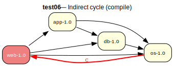

# test06 — Indirect cycle (compile)

**Category:** Cycle

This test case checks the prover's handling of an indirect circular dependency in
the compile-time scope. The 'os-1.0' package lists 'web-1.0' as a compile-time
dependency, while 'web-1.0' in turn depends on 'os-1.0', creating a two-node
cycle.

**Expected:** The prover should detect the cycle and take an assumption to break it, yielding a
verify step in the proposed plan. All four packages should still appear in the
final plan.

**Output:** [emerge -vp](emerge-test06.log) | [portage-ng](portage-ng-test06.log)