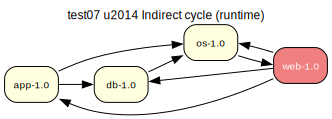

# test07 — Indirect cycle (runtime)

**Category:** Cycle

This test case is a variation of test06 where the indirect circular dependency is
in the runtime scope (RDEPEND). The 'os-1.0' package lists 'web-1.0' as a runtime
dependency, creating a two-node runtime cycle.

**Expected:** The prover should detect the cycle and take an assumption to break it, yielding a
verify step in the proposed plan.



<details>
<summary><b>emerge</b></summary>

```
These are the packages that would be merged, in order:

Calculating dependencies  ... done!
Dependency resolution took 1.19 s (backtrack: 1/20).


[ebuild  N     ] test07/web-1.0::overlay  0 KiB
[ebuild  N     ]  test07/app-1.0::overlay  0 KiB
[ebuild  N     ]   test07/db-1.0::overlay  0 KiB
[ebuild  N     ]    test07/os-1.0::overlay  0 KiB

Total: 4 packages (4 new), Size of downloads: 0 KiB

 * Error: circular dependencies:

(test07/os-1.0:0/0::overlay, ebuild scheduled for merge) depends on
 (test07/web-1.0:0/0::overlay, ebuild scheduled for merge) (runtime)
  (test07/os-1.0:0/0::overlay, ebuild scheduled for merge) (buildtime)

 * Note that circular dependencies can often be avoided by temporarily
 * disabling USE flags that trigger optional dependencies.
```

</details>

<details>
<summary><b>portage-ng</b></summary>

```
>>> Emerging : overlay://test07/web-1.0:run?{[]}

These are the packages that would be merged, in order:

Calculating dependencies... done!

 └─step  1─┤ download  overlay://test07/web-1.0
             │ download  overlay://test07/os-1.0
             │ download  overlay://test07/db-1.0
             │ download  overlay://test07/app-1.0

 └─step  2─┤ install   overlay://test07/os-1.0

 └─step  3─┤ install   overlay://test07/web-1.0
             │ install   overlay://test07/app-1.0
             │ install   overlay://test07/db-1.0
             │ run     overlay://test07/web-1.0
             │ run       overlay://test07/app-1.0
             │ run       overlay://test07/db-1.0
             │ run       overlay://test07/os-1.0

Total: 12 actions (4 downloads, 4 installs, 4 runs), grouped into 3 steps.
       0.00 Kb to be downloaded.


```

</details>