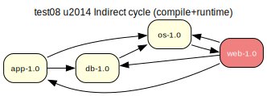

# test08 — Indirect cycle (compile + runtime)

**Category:** Cycle

This test case combines test06 and test07. The 'os-1.0' package lists 'web-1.0' as
both a compile-time and runtime dependency, creating two indirect cycles through
the dependency graph.

**Expected:** The prover should detect both cycles and take assumptions to break them, yielding
two verify steps in the proposed plan.

**Output:** [emerge -vp](test08-emerge.log) | [portage-ng](test08-portage-ng.log)