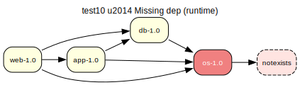

# test10 — Non-existent dep (runtime)

**Category:** Missing

This is a variation of test09. It checks for a missing dependency, but this time in the runtime (RDEPEND) scope. The 'os-1.0' package requires 'test10/notexists' to run.

**Expected:** The prover should fail to find the 'notexists' package and report the missing runtime dependency, leading to a failed proof.



<details>
<summary><b>emerge -vp</b></summary>

```
These are the packages that would be merged, in order:

Calculating dependencies  ... done!
Dependency resolution took 1.23 s (backtrack: 1/20).


emerge: there are no ebuilds to satisfy "test10/notexists".
(dependency required by "test10/os-1.0::overlay" [ebuild])
(dependency required by "test10/os" [argument])
```

</details>

<details>
<summary><b>portage-ng</b></summary>

```
>>> Emerging : overlay://test10/os-1.0:run?{[]}

These are the packages that would be merged, in order:

Calculating dependencies... done!

 └─step  1─┤ verify  test10/notexists (non-existent, assumed running)
             │ download  overlay://test10/os-1.0

 └─step  2─┤ install   overlay://test10/os-1.0

 └─step  3─┤ run     overlay://test10/os-1.0

Total: 3 actions (1 download, 1 install, 1 run), grouped into 3 steps.
       0.00 Kb to be downloaded.


Error The proof for your build plan contains domain assumptions. Please verify:


>>> Domain assumptions

- Missing run dependency: 
  test10/notexists

  required by: overlay://test10/os-1.0


>>> Bug report drafts (Gentoo Bugzilla)

---
Summary: overlay://test10/os-1.0: missing dependency on test10/notexists

Affected package: overlay://test10/os-1.0
Dependency: test10/notexists
Phases: [run]

Unsatisfiable constraint(s):
  test10/notexists-

Observed:
  portage-ng reports no available candidate satisfies the above constraint(s).

Potential fix (suggestion):
  Review dependency metadata in overlay://test10/os-1.0; constraint set: [constraint(none,,[])].


```

</details>