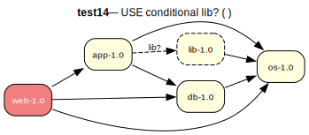

# test14 — Positive USE conditional lib? ( )

**Category:** USE cond

This test case evaluates the handling of USE conditional dependencies. The dependency on 'lib-1.0' is only active if the 'lib' USE flag is enabled for the 'app-1.0' package.

**Expected:** - If the user proves 'app-1.0' without enabling the 'lib' flag, the proof should succeed, and 'lib-1.0' should not be included in the dependency graph.
- If the user proves 'app-1.0' and enables the 'lib' flag (e.g., via configuration), the proof should succeed, and 'lib-1.0' should be correctly included and installed.



<details>
<summary><b>emerge -vp</b></summary>

```
These are the packages that would be merged, in order:

Calculating dependencies  ... done!
Dependency resolution took 0.91 s (backtrack: 0/20).

[ebuild  N     ] test14/os-1.0::overlay  0 KiB
[ebuild  N     ] test14/db-1.0::overlay  0 KiB
[ebuild  N     ] test14/app-1.0::overlay  USE="-lib" 0 KiB
[ebuild  N     ] test14/web-1.0::overlay  0 KiB

Total: 4 packages (4 new), Size of downloads: 0 KiB
```

</details>

<details>
<summary><b>portage-ng</b></summary>

```
>>> Emerging : overlay://test14/web-1.0:run?{[]}

These are the packages that would be merged, in order:

Calculating dependencies... done!

 └─step  1─┤ download  overlay://test14/web-1.0
             │ download  overlay://test14/os-1.0
             │ download  overlay://test14/db-1.0
             │ download  overlay://test14/app-1.0

 └─step  2─┤ install   overlay://test14/os-1.0

 └─step  3─┤ run       overlay://test14/os-1.0

 └─step  4─┤ install   overlay://test14/db-1.0

 └─step  5─┤ run       overlay://test14/db-1.0

 └─step  6─┤ install   overlay://test14/app-1.0
             │           └─ conf ─┤ USE = "-lib"

 └─step  7─┤ run       overlay://test14/app-1.0

 └─step  8─┤ install   overlay://test14/web-1.0

 └─step  9─┤ run     overlay://test14/web-1.0

Total: 12 actions (4 downloads, 4 installs, 4 runs), grouped into 9 steps.
       0.00 Kb to be downloaded.
```

</details>