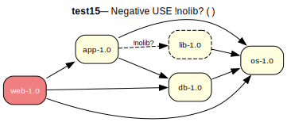

# test15 — Negative USE conditional !nolib? ( )

**Category:** USE cond

This test case is similar to test14 but uses a negative USE conditional. The dependency is triggered by the absence of a USE flag.

**Expected:** - If the 'nolib' flag is enabled for app-1.0, the proof should succeed without pulling in 'lib-1.0'.
- If the 'nolib' flag is not set (i.e., disabled by default), the proof should succeed and correctly include 'lib-1.0' as a dependency.



<details>
<summary><b>emerge</b></summary>

```
These are the packages that would be merged, in order:

Calculating dependencies  ... done!
Dependency resolution took 0.75 s (backtrack: 0/20).

[ebuild  N     ] test15/os-1.0::overlay  0 KiB
[ebuild  N     ] test15/db-1.0::overlay  0 KiB
[ebuild  N     ] test15/lib-1.0::overlay  0 KiB
[ebuild  N     ] test15/app-1.0::overlay  USE="-nolib" 0 KiB
[ebuild  N     ] test15/web-1.0::overlay  0 KiB

Total: 5 packages (5 new), Size of downloads: 0 KiB
```

</details>

<details>
<summary><b>portage-ng</b></summary>

```

>>> Emerging : overlay://test15/web-1.0:run?{[]}

These are the packages that would be merged, in order:

Calculating dependencies... done!

 └─step  1─┤ download  overlay://test15/web-1.0
             │ download  overlay://test15/os-1.0
             │ download  overlay://test15/lib-1.0
             │ download  overlay://test15/db-1.0
             │ download  overlay://test15/app-1.0

 └─step  2─┤ install   overlay://test15/os-1.0

 └─step  3─┤ run       overlay://test15/os-1.0

 └─step  4─┤ install   overlay://test15/db-1.0
             │ install   overlay://test15/lib-1.0

 └─step  5─┤ run       overlay://test15/db-1.0

 └─step  6─┤ install   overlay://test15/app-1.0
             │           └─ conf ─┤ USE = "-nolib"

 └─step  7─┤ run       overlay://test15/app-1.0

 └─step  8─┤ install   overlay://test15/web-1.0

 └─step  9─┤ run     overlay://test15/web-1.0

Total: 14 actions (5 downloads, 5 installs, 4 runs), grouped into 9 steps.
       0.00 Kb to be downloaded.
```

</details>