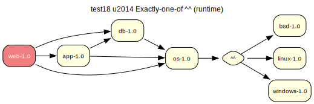

# test18 — Exactly-one-of ^^ (runtime)

**Category:** Choice

This test case is a variation of test17, but the 'exactly-one-of' dependency is in the runtime scope (RDEPEND).

**Expected:** The prover should handle the runtime choice group correctly, select one of the OS options, and generate a valid proof.



<details>
<summary><b>emerge -vp</b></summary>

```
These are the packages that would be merged, in order:

Calculating dependencies  ... done!
Dependency resolution took 1.35 s (backtrack: 1/20).


!!! All ebuilds that could satisfy "test18/os" have been masked.
!!! One of the following masked packages is required to complete your request:
- test18/os-1.0::overlay (masked by: invalid: RDEPEND: Invalid atom (^^), token 1)

(dependency required by "test18/web-1.0::overlay" [ebuild])
(dependency required by "test18/web" [argument])
For more information, see the MASKED PACKAGES section in the emerge
man page or refer to the Gentoo Handbook.
```

</details>

<details>
<summary><b>portage-ng</b></summary>

```
>>> Emerging : overlay://test18/web-1.0:run?{[]}

These are the packages that would be merged, in order:

Calculating dependencies... done!

 └─step  1─┤ verify  test18/os (unsatisfied constraints, assumed running)
             │ verify  test18/os (unsatisfied constraints, assumed installed)
             │ verify  test18/db (unsatisfied constraints, assumed running)
             │ verify  test18/app (unsatisfied constraints, assumed running)
             │ download  overlay://test18/web-1.0

 └─step  2─┤ install   overlay://test18/web-1.0

 └─step  3─┤ run     overlay://test18/web-1.0

Total: 3 actions (1 download, 1 install, 1 run), grouped into 3 steps.
       0.00 Kb to be downloaded.


Error The proof for your build plan contains domain assumptions. Please verify:


>>> Domain assumptions

- Unsatisfied constraints for run dependency: 
  test18/app

  required by: overlay://test18/web-1.0

- Unsatisfied constraints for run dependency: 
  test18/db

  required by: overlay://test18/web-1.0

- Unsatisfied constraints for install dependency: 
  test18/os

  required by: overlay://test18/web-1.0

- Unsatisfied constraints for run dependency: 
  test18/os

  required by: overlay://test18/web-1.0


>>> Bug report drafts (Gentoo Bugzilla)

---
Summary: overlay://test18/web-1.0: unsatisfied_constraints dependency on test18/app

Affected package: overlay://test18/web-1.0
Dependency: test18/app
Phases: [run]

Unsatisfiable constraint(s):
  test18/app-

Observed:
  portage-ng reports no available candidate satisfies the above constraint(s).
  Available versions in repo set (sample, first 1 of 1): [1.0]

Potential fix (suggestion):
  Review dependency metadata in overlay://test18/web-1.0; constraint set: [constraint(none,,[])].

---
Summary: overlay://test18/web-1.0: unsatisfied_constraints dependency on test18/db

Affected package: overlay://test18/web-1.0
Dependency: test18/db
Phases: [run]

Unsatisfiable constraint(s):
  test18/db-

Observed:
  portage-ng reports no available candidate satisfies the above constraint(s).
  Available versions in repo set (sample, first 1 of 1): [1.0]

Potential fix (suggestion):
  Review dependency metadata in overlay://test18/web-1.0; constraint set: [constraint(none,,[])].

---
Summary: overlay://test18/web-1.0: unsatisfied_constraints dependency on test18/os

Affected package: overlay://test18/web-1.0
Dependency: test18/os
Phases: [install,run]

Unsatisfiable constraint(s):
  test18/os-

Observed:
  portage-ng reports no available candidate satisfies the above constraint(s).
  Available versions in repo set (sample, first 1 of 1): [1.0]

Potential fix (suggestion):
  Review dependency metadata in overlay://test18/web-1.0; constraint set: [constraint(none,,[])].


```

</details>