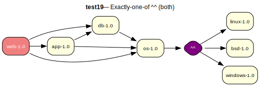

# test19 — Exactly-one-of ^^ (compile + runtime)

**Category:** Choice

This test case combines test17 and test18. The 'os-1.0' package has the same 'exactly-one-of' choice group in both its compile-time and runtime dependencies.

**Expected:** The prover should select a single OS package that satisfies both the compile-time and runtime requirements. For example, if it chooses 'linux-1.0' for the compile dependency, it must also use 'linux-1.0' for the runtime dependency. The proof should be valid.



<details>
<summary><b>emerge</b></summary>

```
These are the packages that would be merged, in order:

Calculating dependencies  ... done!
Dependency resolution took 1.36 s (backtrack: 1/20).


!!! All ebuilds that could satisfy "test19/os" have been masked.
!!! One of the following masked packages is required to complete your request:
- test19/os-1.0::overlay (masked by: invalid: DEPEND: Invalid atom (^^), token 1, invalid: RDEPEND: Invalid atom (^^), token 1)

(dependency required by "test19/web-1.0::overlay" [ebuild])
(dependency required by "test19/web" [argument])
For more information, see the MASKED PACKAGES section in the emerge
man page or refer to the Gentoo Handbook.
```

</details>

<details>
<summary><b>portage-ng</b></summary>

```
>>> Emerging : overlay://test19/web-1.0:run?{[]}

These are the packages that would be merged, in order:

Calculating dependencies... done!

 └─step  1─┤ verify  test19/os (unsatisfied constraints, assumed running)
             │ verify  test19/os (unsatisfied constraints, assumed installed)
             │ verify  test19/db (unsatisfied constraints, assumed running)
             │ verify  test19/app (unsatisfied constraints, assumed running)
             │ download  overlay://test19/web-1.0

 └─step  2─┤ install   overlay://test19/web-1.0

 └─step  3─┤ run     overlay://test19/web-1.0

Total: 3 actions (1 download, 1 install, 1 run), grouped into 3 steps.
       0.00 Kb to be downloaded.


Error The proof for your build plan contains domain assumptions. Please verify:


>>> Domain assumptions

- Unsatisfied constraints for run dependency: 
  test19/app

  required by: overlay://test19/web-1.0

- Unsatisfied constraints for run dependency: 
  test19/db

  required by: overlay://test19/web-1.0

- Unsatisfied constraints for install dependency: 
  test19/os

  required by: overlay://test19/web-1.0

- Unsatisfied constraints for run dependency: 
  test19/os

  required by: overlay://test19/web-1.0


>>> Bug report drafts (Gentoo Bugzilla)

---
Summary: overlay://test19/web-1.0: unsatisfied_constraints dependency on test19/app

Affected package: overlay://test19/web-1.0
Dependency: test19/app
Phases: [run]

Unsatisfiable constraint(s):
  test19/app-

Observed:
  portage-ng reports no available candidate satisfies the above constraint(s).
  Available versions in repo set (sample, first 1 of 1): [1.0]

Potential fix (suggestion):
  Review dependency metadata in overlay://test19/web-1.0; constraint set: [constraint(none,,[])].

---
Summary: overlay://test19/web-1.0: unsatisfied_constraints dependency on test19/db

Affected package: overlay://test19/web-1.0
Dependency: test19/db
Phases: [run]

Unsatisfiable constraint(s):
  test19/db-

Observed:
  portage-ng reports no available candidate satisfies the above constraint(s).
  Available versions in repo set (sample, first 1 of 1): [1.0]

Potential fix (suggestion):
  Review dependency metadata in overlay://test19/web-1.0; constraint set: [constraint(none,,[])].

---
Summary: overlay://test19/web-1.0: unsatisfied_constraints dependency on test19/os

Affected package: overlay://test19/web-1.0
Dependency: test19/os
Phases: [install,run]

Unsatisfiable constraint(s):
  test19/os-

Observed:
  portage-ng reports no available candidate satisfies the above constraint(s).
  Available versions in repo set (sample, first 1 of 1): [1.0]

Potential fix (suggestion):
  Review dependency metadata in overlay://test19/web-1.0; constraint set: [constraint(none,,[])].


```

</details>