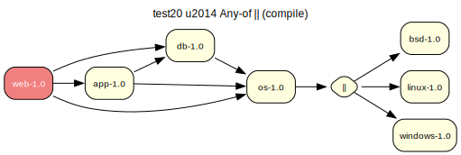

# test20 — Any-of || (compile)

**Category:** Choice

This test case evaluates the prover's handling of an 'any-of' dependency group (||). The 'os-1.0' package requires that at least one of the three OS packages be installed.

**Expected:** The prover should recognize the choice and select one of the available options to satisfy the dependency. Since there are no other constraints, any of the three choices should lead to a valid proof.



<details>
<summary><b>emerge</b></summary>

```
These are the packages that would be merged, in order:

Calculating dependencies  ... done!
Dependency resolution took 0.74 s (backtrack: 0/20).

[ebuild  N     ] test20/linux-1.0::overlay  0 KiB
[ebuild  N     ] test20/os-1.0::overlay  0 KiB
[ebuild  N     ] test20/db-1.0::overlay  0 KiB
[ebuild  N     ] test20/app-1.0::overlay  0 KiB
[ebuild  N     ] test20/web-1.0::overlay  0 KiB

Total: 5 packages (5 new), Size of downloads: 0 KiB
```

</details>

<details>
<summary><b>portage-ng</b></summary>

```
>>> Emerging : overlay://test20/web-1.0:run?{[]}

These are the packages that would be merged, in order:

Calculating dependencies... done!

 └─step  1─┤ download  overlay://test20/web-1.0
             │ download  overlay://test20/os-1.0
             │ download  overlay://test20/linux-1.0
             │ download  overlay://test20/db-1.0
             │ download  overlay://test20/app-1.0

 └─step  2─┤ install   overlay://test20/os-1.0
             │ install   overlay://test20/linux-1.0

 └─step  3─┤ run       overlay://test20/os-1.0

 └─step  4─┤ install   overlay://test20/db-1.0

 └─step  5─┤ run       overlay://test20/db-1.0

 └─step  6─┤ install   overlay://test20/app-1.0

 └─step  7─┤ run       overlay://test20/app-1.0

 └─step  8─┤ install   overlay://test20/web-1.0

 └─step  9─┤ run     overlay://test20/web-1.0

Total: 14 actions (5 downloads, 5 installs, 4 runs), grouped into 9 steps.
       0.00 Kb to be downloaded.
```

</details>