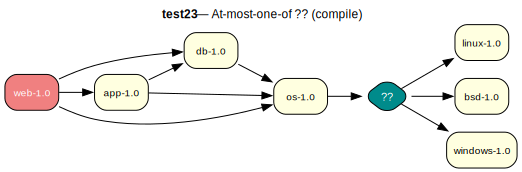

# test23 — At-most-one-of ?? (compile)

**Category:** Choice

This test case evaluates the prover's handling of an 'at-most-one-of' dependency group (??). The 'os-1.0' package requires that at most one of the three OS packages be installed. This also means that installing *none* of them is a valid resolution.

**Expected:** The prover should satisfy the dependency by choosing to install nothing from the group, as this is the simplest path. A valid proof should be generated for app-1.0 and os-1.0, without any of the optional OS packages.

**Output:** [emerge -vp](emerge-test23.log) | [portage-ng](portage-ng-test23.log)