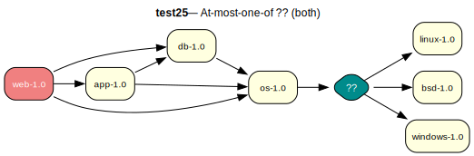

# test25 — At-most-one-of ?? (compile + runtime)

**Category:** Choice

This test case combines test23 and test24. The 'os-1.0' package has the same 'at-most-one-of' choice group in both its compile-time and runtime dependencies.

**Expected:** The prover should resolve both dependencies by choosing to install none of the optional packages, as this is the simplest valid solution. The proof should be valid.

**Output:** [emerge -vp](emerge-test25.log) | [portage-ng](portage-ng-test25.log)