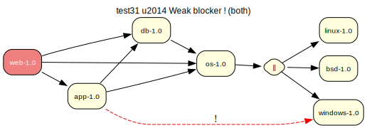

# test31 — Weak blocker ! (compile+runtime) + any-of

**Category:** Blocker

This test case combines test27 and test30. The 'app-1.0' package has a weak
blocker (!) against 'windows-1.0' in both the compile-time (DEPEND) and runtime
(RDEPEND) scopes. The any-of group on 'os-1.0' still includes 'windows-1.0'.

**Expected:** The prover should produce a valid plan. The weak blockers are recorded as domain
assumptions. The any-of group resolution may or may not select 'windows-1.0',
depending on blocker handling strategy.



<details>
<summary><b>emerge</b></summary>

```
These are the packages that would be merged, in order:

Calculating dependencies  ... done!
Dependency resolution took 0.74 s (backtrack: 0/20).

[ebuild  N     ] test31/linux-1.0::overlay  0 KiB
[ebuild  N     ] test31/os-1.0::overlay  0 KiB
[ebuild  N     ] test31/db-1.0::overlay  0 KiB
[ebuild  N     ] test31/app-1.0::overlay  0 KiB
[ebuild  N     ] test31/web-1.0::overlay  0 KiB

Total: 5 packages (5 new), Size of downloads: 0 KiB
```

</details>

<details>
<summary><b>portage-ng</b></summary>

```
>>> Emerging : overlay://test31/web-1.0:run?{[]}

These are the packages that would be merged, in order:

Calculating dependencies... done!

 └─step  1─┤ download  overlay://test31/web-1.0
             │ download  overlay://test31/os-1.0
             │ download  overlay://test31/linux-1.0
             │ download  overlay://test31/db-1.0
             │ download  overlay://test31/app-1.0

 └─step  2─┤ install   overlay://test31/os-1.0
             │ install   overlay://test31/linux-1.0

 └─step  3─┤ run       overlay://test31/os-1.0

 └─step  4─┤ install   overlay://test31/db-1.0

 └─step  5─┤ run       overlay://test31/db-1.0

 └─step  6─┤ install   overlay://test31/app-1.0

 └─step  7─┤ run       overlay://test31/app-1.0

 └─step  8─┤ install   overlay://test31/web-1.0

 └─step  9─┤ run     overlay://test31/web-1.0

Total: 14 actions (5 downloads, 5 installs, 4 runs), grouped into 9 steps.
       0.00 Kb to be downloaded.


>>> Blockers added during proving & planning:

  [blocks B] !test31/windows (soft blocker, phase: install, required by: overlay://test31/app-1.0)
  [blocks B] !test31/windows (soft blocker, phase: run, required by: overlay://test31/app-1.0)
```

</details>