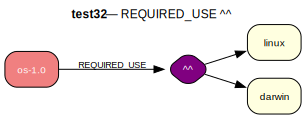

# test32 — ^^ with conditional DEPEND

**Category:** REQUIRED_USE

This test case examines the interplay between REQUIRED_USE and conditional dependencies. The 'os-1.0' package must have exactly one of 'linux' or 'darwin' enabled. The choice of which flag is enabled will then trigger the corresponding dependency.

**Expected:** The prover should satisfy the REQUIRED_USE by making a choice. For example, it might enable the 'linux' flag. This action should then trigger the conditional dependency, pulling 'linux-1.0' into the installation plan. A valid proof will include os-1.0 and either linux-1.0 or darwin-1.0.

**Output:** [emerge -vp](test32-emerge.log) | [portage-ng](test32-portage-ng.log)