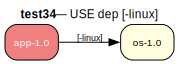

# test34 — Negative [-linux]

**Category:** USE dep

This test case is the inverse of test33. It checks the handling of a negative USE dependency. The 'app-1.0' package requires that 'os-1.0' be built with the 'linux' USE flag disabled.

**Expected:** The prover must ensure the 'linux' flag is disabled for 'os-1.0'. The proof should be valid, showing that 'os-1.0' is built with USE="-linux".



<details>
<summary><b>emerge -vp</b></summary>

```
These are the packages that would be merged, in order:

Calculating dependencies  ... done!
Dependency resolution took 0.82 s (backtrack: 0/20).

[ebuild  N     ] test34/os-1.0::overlay  USE="-darwin -linux" 0 KiB
[ebuild  N     ] test34/app-1.0::overlay  USE="-linux" 0 KiB

Total: 2 packages (2 new), Size of downloads: 0 KiB
```

</details>

<details>
<summary><b>portage-ng</b></summary>

```
>>> Emerging : overlay://test34/app-1.0:run?{[]}

These are the packages that would be merged, in order:

Calculating dependencies... done!

 └─step  1─┤ download  overlay://test34/os-1.0
             │ download  overlay://test34/app-1.0

 └─step  2─┤ install   overlay://test34/os-1.0
             │           └─ conf ─┤ USE = "-darwin -linux"

 └─step  3─┤ install   overlay://test34/app-1.0
             │           └─ conf ─┤ USE = "-linux"

 └─step  4─┤ run     overlay://test34/app-1.0

Total: 5 actions (2 downloads, 2 installs, 1 run), grouped into 4 steps.
       0.00 Kb to be downloaded.
```

</details>