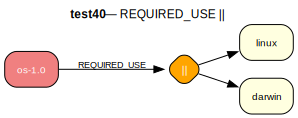

# test40 — || on standalone package

**Category:** REQUIRED_USE

This test case checks the prover's ability to handle a REQUIRED_USE 'any-of' (||) constraint on a standalone package. To install 'os-1.0', the user or the configuration must ensure that at least one of the 'linux' or 'darwin' USE flags is enabled.

**Expected:** - If the prover is run for 'os-1.0' and the configuration provides either USE="linux" or USE="darwin", the proof should be valid.
- If no configuration is provided, the prover should make a choice and enable one of the flags to satisfy the constraint, resulting in a valid proof.
- If the configuration explicitly disables both (e.g., USE="-linux -darwin"), the proof should fail.



<details>
<summary><b>emerge</b></summary>

```
These are the packages that would be merged, in order:

Calculating dependencies  

!!! Problem resolving dependencies for test40/os
... done!
Dependency resolution took 0.47 s (backtrack: 0/20).


!!! The ebuild selected to satisfy "test40/os" has unmet requirements.
- test40/os-1.0::overlay USE="-darwin -linux"

  The following REQUIRED_USE flag constraints are unsatisfied:
    any-of ( linux darwin )
```

</details>

<details>
<summary><b>portage-ng</b></summary>

```

>>> Emerging : overlay://test40/os-1.0:run?{[]}

These are the packages that would be merged, in order:

Calculating dependencies... done!

 └─step  1─┤ useflag overlay://test40/os-1.0 (darwin)

 └─step  2─┤ download  overlay://test40/os-1.0

 └─step  3─┤ install   overlay://test40/os-1.0 (USE modified)
             │           └─ conf ─┤ USE = "darwin -linux"

 └─step  4─┤ run     overlay://test40/os-1.0

Total: 4 actions (1 useflag, 1 download, 1 install, 1 run), grouped into 4 steps.
       0.00 Kb to be downloaded.


>>> Assumptions taken during proving & planning:

  USE flag change (1 package):
  Add to /etc/portage/package.use:
    test40/os darwin


```

</details>