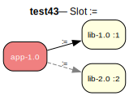

# test43 — Slot equality :=

**Category:** Slot

This test case examines the slot equality operator (:=). 'app-1.0' depends on 'lib' at compile time. The prover will choose the latest version, 'lib-2.0'. The runtime dependency then requires that the same slot ('2') be used.

**Expected:** The prover should first resolve the compile dependency to 'lib-2.0'. Then, when resolving the runtime dependency, it must choose a package from the same slot, which is 'lib-2.0'. The proof should be valid.



<details>
<summary><b>emerge</b></summary>

```
These are the packages that would be merged, in order:

Calculating dependencies  ... done!
Dependency resolution took 0.75 s (backtrack: 0/20).

[ebuild  N     ] test43/lib-2.0:2::overlay  0 KiB
[ebuild  N     ] test43/app-1.0::overlay  0 KiB

Total: 2 packages (2 new), Size of downloads: 0 KiB
```

</details>

<details>
<summary><b>portage-ng</b></summary>

```

>>> Emerging : overlay://test43/app-1.0:run?{[]}

These are the packages that would be merged, in order:

Calculating dependencies... done!

 └─step  1─┤ download  overlay://test43/lib-2.0
             │ download  overlay://test43/app-1.0

 └─step  2─┤ install   overlay://test43/lib-2.0
             │           └─ conf ─┤ SLOT = "2"

 └─step  3─┤ run       overlay://test43/lib-2.0

 └─step  4─┤ install   overlay://test43/app-1.0

 └─step  5─┤ run     overlay://test43/app-1.0

Total: 6 actions (2 downloads, 2 installs, 2 runs), grouped into 5 steps.
       0.00 Kb to be downloaded.


```

</details>