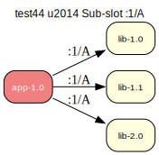

# test44 — Sub-slot :1/A

**Category:** Slot

This test case checks the prover's ability to resolve dependencies based on sub-slots. 'app-1.0' requires a version of 'lib' in slot "1" and sub-slot "A".

**Expected:** The prover should correctly select 'lib-1.0' to satisfy the sub-slot dependency. It should ignore 'lib-1.1' (wrong sub-slot) and 'lib-2.0' (wrong slot). The proof should be valid.



<details>
<summary><b>emerge</b></summary>

```
These are the packages that would be merged, in order:

Calculating dependencies  ... done!
Dependency resolution took 0.75 s (backtrack: 0/20).

[ebuild  N     ] test44/lib-1.0:1/A::overlay  0 KiB
[ebuild  N     ] test44/app-1.0::overlay  0 KiB

Total: 2 packages (2 new), Size of downloads: 0 KiB
```

</details>

<details>
<summary><b>portage-ng</b></summary>

```
>>> Emerging : overlay://test44/app-1.0:run?{[]}

These are the packages that would be merged, in order:

Calculating dependencies... done!

 └─step  1─┤ download  overlay://test44/lib-1.0
             │ download  overlay://test44/app-1.0

 └─step  2─┤ install   overlay://test44/lib-1.0

 └─step  3─┤ run       overlay://test44/lib-1.0

 └─step  4─┤ install   overlay://test44/app-1.0

 └─step  5─┤ run     overlay://test44/app-1.0

Total: 6 actions (2 downloads, 2 installs, 2 runs), grouped into 5 steps.
       0.00 Kb to be downloaded.
```

</details>