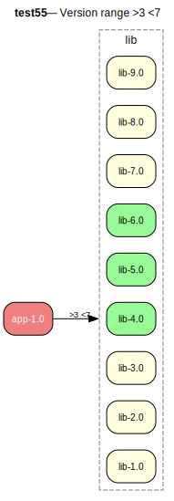

# test55 — Constraint intersection (direct >3 + <6)

**Category:** Version

Multiple requirements should be combined. Only one version should be selected

**Expected:** The constraints on the lib versions should be combined. Only one version should be selected.



<details>
<summary><b>emerge</b></summary>

```
These are the packages that would be merged, in order:

Calculating dependencies  ... done!
Dependency resolution took 0.72 s (backtrack: 0/20).

[ebuild  N     ] test55/lib-6.0::overlay  0 KiB
[ebuild  N     ] test55/app-1.0::overlay  0 KiB

Total: 2 packages (2 new), Size of downloads: 0 KiB
```

</details>

<details>
<summary><b>portage-ng</b></summary>

```

>>> Emerging : overlay://test55/app-1.0:run?{[]}

These are the packages that would be merged, in order:

Calculating dependencies... done!

 └─step  1─┤ download  overlay://test55/lib-6.0
             │ download  overlay://test55/app-1.0

 └─step  2─┤ install   overlay://test55/lib-6.0

 └─step  3─┤ run       overlay://test55/lib-6.0

 └─step  4─┤ install   overlay://test55/app-1.0

 └─step  5─┤ run     overlay://test55/app-1.0

Total: 6 actions (2 downloads, 2 installs, 2 runs), grouped into 5 steps.
       0.00 Kb to be downloaded.
```

</details>