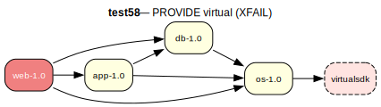

# test58 — PROVIDE-based virtual (XFAIL)

**Category:** Virtual

> **XFAIL** — expected to fail.

This test case checks PROVIDE-based virtual satisfaction. The 'linux-1.0' package
claims to provide 'virtualsdk', which is not available as a standalone ebuild. The
resolver must recognize that 'linux-1.0' satisfies the virtual dependency through
its PROVIDE declaration. This is a deprecated PMS mechanism but still appears in
the wild.

**Expected:** Currently expected to fail (XFAIL) until PROVIDE/provider resolution is
implemented. Eventually, proving web-1.0 should pull in linux-1.0 to satisfy the
test58/virtualsdk dependency.



<details>
<summary><b>emerge -vp</b></summary>

```
These are the packages that would be merged, in order:

Calculating dependencies  ... done!
Dependency resolution took 1.69 s (backtrack: 2/20).


emerge: there are no ebuilds to satisfy "test58/virtualsdk".
(dependency required by "test58/os-1.0::overlay" [ebuild])
(dependency required by "test58/web-1.0::overlay" [ebuild])
(dependency required by "test58/web" [argument])
```

</details>

<details>
<summary><b>portage-ng</b></summary>

```ansi
>>> Emerging : overlay://test58/web-1.0:run?{[]}

These are the packages that would be merged, in order:

Calculating dependencies... done!

 └─step  1─┤ verify  test58/os (unsatisfied constraints, assumed running)
             │ verify  test58/os (unsatisfied constraints, assumed installed)
             │ verify  test58/db (unsatisfied constraints, assumed running)
             │ verify  test58/app (unsatisfied constraints, assumed running)
             │ download  overlay://test58/web-1.0

 └─step  2─┤ install   overlay://test58/web-1.0

 └─step  3─┤ run     overlay://test58/web-1.0

Total: 3 actions (1 download, 1 install, 1 run), grouped into 3 steps.
       0.00 Kb to be downloaded.


Error The proof for your build plan contains domain assumptions. Please verify:


>>> Domain assumptions

- Unsatisfied constraints for run dependency: 
  test58/app

  required by: overlay://test58/web-1.0

- Unsatisfied constraints for run dependency: 
  test58/db

  required by: overlay://test58/web-1.0

- Unsatisfied constraints for install dependency: 
  test58/os

  required by: overlay://test58/web-1.0

- Unsatisfied constraints for run dependency: 
  test58/os

  required by: overlay://test58/web-1.0


>>> Bug report drafts (Gentoo Bugzilla)

---
Summary: overlay://test58/web-1.0: unsatisfied_constraints dependency on test58/app

Affected package: overlay://test58/web-1.0
Dependency: test58/app
Phases: [run]

Unsatisfiable constraint(s):
  test58/app-

Observed:
  portage-ng reports no available candidate satisfies the above constraint(s).
  Available versions in repo set (sample, first 1 of 1): [1.0]

Potential fix (suggestion):
  Review dependency metadata in overlay://test58/web-1.0; constraint set: [constraint(none,,[])].

---
Summary: overlay://test58/web-1.0: unsatisfied_constraints dependency on test58/db

Affected package: overlay://test58/web-1.0
Dependency: test58/db
Phases: [run]

Unsatisfiable constraint(s):
  test58/db-

Observed:
  portage-ng reports no available candidate satisfies the above constraint(s).
  Available versions in repo set (sample, first 1 of 1): [1.0]

Potential fix (suggestion):
  Review dependency metadata in overlay://test58/web-1.0; constraint set: [constraint(none,,[])].

---
Summary: overlay://test58/web-1.0: unsatisfied_constraints dependency on test58/os

Affected package: overlay://test58/web-1.0
Dependency: test58/os
Phases: [install,run]

Unsatisfiable constraint(s):
  test58/os-

Observed:
  portage-ng reports no available candidate satisfies the above constraint(s).
  Available versions in repo set (sample, first 1 of 1): [1.0]

Potential fix (suggestion):
  Review dependency metadata in overlay://test58/web-1.0; constraint set: [constraint(none,,[])].



```

</details>