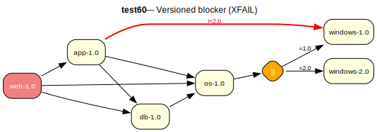

# test60 — Versioned soft blocker !<pkg-ver (XFAIL)

**Category:** Blocker

> **XFAIL** — expected to fail.

This test case checks the handling of versioned soft blockers (!<pkg-version). The
'app-1.0' package blocks any version of 'windows' less than 2.0. The any-of group
on 'os-1.0' offers both windows-1.0 and windows-2.0 as choices. The solver should
avoid windows-1.0 because it falls within the blocker's version range.

**Expected:** Currently expected to fail (XFAIL): the versioned blocker is handled via
assumptions rather than by steering the version choice. When fixed, the solver
should select windows-2.0 and avoid windows-1.0.



<details>
<summary><b>emerge</b></summary>

```
These are the packages that would be merged, in order:

Calculating dependencies  ... done!
Dependency resolution took 0.75 s (backtrack: 0/20).

[ebuild  N     ] test60/windows-2.0::overlay  0 KiB
[ebuild  N     ] test60/os-1.0::overlay  0 KiB
[ebuild  N     ] test60/app-1.0::overlay  0 KiB
[ebuild  N     ] test60/db-1.0::overlay  0 KiB
[ebuild  N     ] test60/web-1.0::overlay  0 KiB

Total: 5 packages (5 new), Size of downloads: 0 KiB
```

</details>

<details>
<summary><b>portage-ng</b></summary>

```
>>> Emerging : overlay://test60/web-1.0:run?{[]}

These are the packages that would be merged, in order:

Calculating dependencies... done!

 └─step  1─┤ download  overlay://test60/windows-1.0
             │ download  overlay://test60/web-1.0
             │ download  overlay://test60/os-1.0
             │ download  overlay://test60/db-1.0
             │ download  overlay://test60/app-1.0

 └─step  2─┤ install   overlay://test60/windows-1.0

 └─step  3─┤ run       overlay://test60/windows-1.0 (blocked: soft by test60/app)

 └─step  4─┤ install   overlay://test60/os-1.0

 └─step  5─┤ run       overlay://test60/os-1.0

 └─step  6─┤ install   overlay://test60/app-1.0
             │ install   overlay://test60/db-1.0

 └─step  7─┤ run       overlay://test60/db-1.0
             │ run       overlay://test60/app-1.0

 └─step  8─┤ install   overlay://test60/web-1.0

 └─step  9─┤ run     overlay://test60/web-1.0

Total: 15 actions (5 downloads, 5 installs, 5 runs), grouped into 9 steps.
       0.00 Kb to be downloaded.


>>> Blockers added during proving & planning:

  [blocks B] !<test60/windows-2.0 (soft blocker, phase: run, required by: overlay://test60/app-1.0)
```

</details>