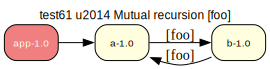

# test61 — Mutual recursion with bracketed USE

**Category:** Cycle

This test case checks termination and cycle handling when bracketed USE
dependencies ([foo]) are present in a mutual recursion. The 'a' and 'b' packages
each require the other with a specific USE flag. The prover must ensure that the
build_with_use context does not grow unbounded as it traverses the cycle.

**Expected:** The solver should terminate quickly, either by cycle breaking or by producing a
finite plan. It must not spin or backtrack indefinitely due to accumulating USE
context.



<details>
<summary><b>emerge</b></summary>

```
These are the packages that would be merged, in order:

Calculating dependencies  .... done!
Dependency resolution took 0.76 s (backtrack: 0/20).


[ebuild  N     ] test61/app-1.0::overlay  0 KiB
[nomerge       ]  test61/a-1.0::overlay  USE="foo" 
[ebuild  N     ]   test61/b-1.0::overlay  USE="foo" 0 KiB
[ebuild  N     ]    test61/a-1.0::overlay  USE="foo" 0 KiB

Total: 3 packages (3 new), Size of downloads: 0 KiB

 * Error: circular dependencies:

(test61/b-1.0:0/0::overlay, ebuild scheduled for merge) depends on
 (test61/a-1.0:0/0::overlay, ebuild scheduled for merge) (buildtime)
  (test61/b-1.0:0/0::overlay, ebuild scheduled for merge) (buildtime)

 * Note that circular dependencies can often be avoided by temporarily
 * disabling USE flags that trigger optional dependencies.

The following USE changes are necessary to proceed:
 (see "package.use" in the portage(5) man page for more details)
# required by test61/a-1.0::overlay
# required by test61/app-1.0::overlay
# required by test61/app (argument)
>=test61/b-1.0 foo
# required by test61/b-1.0::overlay
>=test61/a-1.0 foo

 * In order to avoid wasting time, backtracking has terminated early
 * due to the above autounmask change(s). The --autounmask-backtrack=y
 * option can be used to force further backtracking, but there is no
 * guarantee that it will produce a solution.
```

</details>

<details>
<summary><b>portage-ng</b></summary>

```
>>> Emerging : overlay://test61/app-1.0:run?{[]}

These are the packages that would be merged, in order:

Calculating dependencies... done!

 └─step  1─┤ useflag overlay://test61/a-1.0 (foo)
             │ useflag overlay://test61/b-1.0 (foo)

 └─step  2─┤ verify  overlay://test61/a-1.0 (assumed installed)
             │ verify  overlay://test61/a-1.0 (assumed running) 
             │ verify  overlay://test61/b-1.0 (assumed installed)
             │ verify  test61/a (assumed running) 
             │ verify  test61/b (assumed running) 
             │ download  overlay://test61/b-1.0
             │ download  overlay://test61/app-1.0
             │ download  overlay://test61/a-1.0

 └─step  3─┤ install   overlay://test61/b-1.0 (USE modified)
             │           └─ conf ─┤ USE = "foo"

 └─step  4─┤ run       overlay://test61/b-1.0 (USE modified)

 └─step  5─┤ install   overlay://test61/a-1.0
             │           └─ conf ─┤ USE = "-foo"

 └─step  6─┤ run       overlay://test61/a-1.0 (USE modified)

 └─step  7─┤ install   overlay://test61/app-1.0

 └─step  8─┤ run     overlay://test61/app-1.0

Total: 11 actions (2 useflags, 3 downloads, 3 installs, 3 runs), grouped into 8 steps.
       0.00 Kb to be downloaded.


>>> Assumptions taken during proving & planning:

  USE flag change (2 packages):
  Add to /etc/portage/package.use:
    test61/a foo
    test61/b foo

>>> Cycle breaks (prover)

  grouped_package_dependency(no,test61,a,[package_dependency(run,no,test61,a,none,version_none,[],[use(enable(foo),none)])]):run
  grouped_package_dependency(no,test61,b,[package_dependency(run,no,test61,b,none,version_none,[],[use(enable(foo),none)])]):run
  overlay://test61/a-1.0:install
  overlay://test61/a-1.0:run
  overlay://test61/b-1.0:install
```

</details>