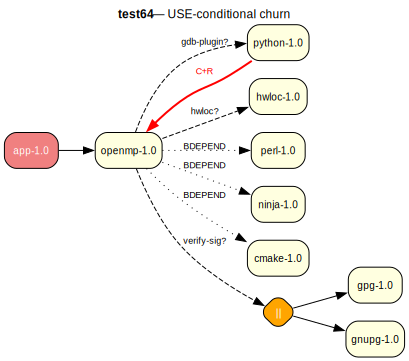

# test64 — USE-conditional churn reproducer (openmp-style)

**Category:** Cycle

This test case reproduces the small backtracking/churn pattern observed for
llvm-runtimes/openmp in a tiny overlay-only setup. The real openmp metadata
includes IUSE flags, USE-gated dependencies, and REQUIRED_USE groups that can
cause excessive proof retries.

**Expected:** The prover should complete without timing out. A valid plan should be produced that
respects all REQUIRED_USE constraints and USE-conditional dependencies.



<details>
<summary><b>emerge</b></summary>

```
These are the packages that would be merged, in order:

Calculating dependencies  ... done!
Dependency resolution took 0.76 s (backtrack: 0/20).

[ebuild  N     ] test64/perl-1.0::overlay  0 KiB
[ebuild  N     ] test64/ninja-1.0::overlay  0 KiB
[ebuild  N     ] test64/cmake-1.0::overlay  0 KiB
[ebuild  N     ] test64/openmp-1.0::overlay  USE="-gdb-plugin -hwloc -test -verify-sig" PYTHON_SINGLE_TARGET="python3_13 -python3_12" 0 KiB
[ebuild  N     ] test64/app-1.0::overlay  0 KiB

Total: 5 packages (5 new), Size of downloads: 0 KiB
```

</details>

<details>
<summary><b>portage-ng</b></summary>

```

>>> Emerging : overlay://test64/app-1.0:run?{[]}

These are the packages that would be merged, in order:

Calculating dependencies... done!

 └─step  1─┤ download  overlay://test64/perl-1.0
             │ download  overlay://test64/openmp-1.0
             │ download  overlay://test64/ninja-1.0
             │ download  overlay://test64/cmake-1.0
             │ download  overlay://test64/app-1.0

 └─step  2─┤ install   overlay://test64/cmake-1.0
             │ install   overlay://test64/ninja-1.0
             │ install   overlay://test64/perl-1.0

 └─step  3─┤ install   overlay://test64/openmp-1.0
             │           └─ conf ─┤ USE = "-gdb-plugin -hwloc -test -verify-sig"
             │                    │ PYTHON_SINGLE_TARGET = "python3_13 -python3_12"

 └─step  4─┤ run       overlay://test64/openmp-1.0

 └─step  5─┤ install   overlay://test64/app-1.0

 └─step  6─┤ run     overlay://test64/app-1.0

Total: 12 actions (5 downloads, 5 installs, 2 runs), grouped into 6 steps.
       0.00 Kb to be downloaded.


```

</details>