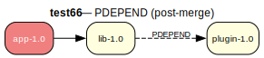

# test66 — Post-merge dependency resolution

**Category:** PDEPEND

This test case checks the prover's handling of PDEPEND (post-merge dependencies).
The 'lib-1.0' package declares 'plugin-1.0' as a PDEPEND, meaning plugin-1.0
should be resolved after lib-1.0's installation, not as a prerequisite.

**Expected:** All three packages should appear in the proof/plan. The plugin-1.0 package should
be ordered after lib-1.0's install step via the PDEPEND proof obligation mechanism.



<details>
<summary><b>emerge</b></summary>

```
These are the packages that would be merged, in order:

Calculating dependencies  ... done!
Dependency resolution took 0.74 s (backtrack: 0/20).

[ebuild  N     ] test66/plugin-1.0::overlay  0 KiB
[ebuild  N     ] test66/lib-1.0::overlay  0 KiB
[ebuild  N     ] test66/app-1.0::overlay  0 KiB

Total: 3 packages (3 new), Size of downloads: 0 KiB
```

</details>

<details>
<summary><b>portage-ng</b></summary>

```

>>> Emerging : overlay://test66/app-1.0:run?{[]}

These are the packages that would be merged, in order:

Calculating dependencies... done!

 └─step  1─┤ download  overlay://test66/plugin-1.0
             │ download  overlay://test66/lib-1.0
             │ download  overlay://test66/app-1.0

 └─step  2─┤ install   overlay://test66/lib-1.0
             │ install   overlay://test66/plugin-1.0

 └─step  3─┤ run       overlay://test66/lib-1.0

 └─step  4─┤ install   overlay://test66/app-1.0

 └─step  5─┤ run     overlay://test66/app-1.0

 └─step  6─┤ run       overlay://test66/plugin-1.0

Total: 9 actions (3 downloads, 3 installs, 3 runs), grouped into 6 steps.
       0.00 Kb to be downloaded.


```

</details>