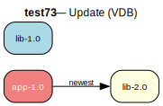

# test73 — Installed old version, newer available (VDB)

**Category:** Update

This test case checks the prover's update path. When lib-1.0 is already installed
and lib-2.0 is available, the prover should detect that an update is possible and
trigger the :update action instead of :install. This requires VDB simulation to
mark lib-1.0 as installed.

**Expected:** The prover should select lib-2.0 as an update replacing the installed lib-1.0. The
plan should show an update action for lib, not a fresh install.



<details>
<summary><b>emerge -vp</b></summary>

```
These are the packages that would be merged, in order:

Calculating dependencies  
!!! 'test73/app' has a category that is not listed in /etc/portage/categories
... done!
Dependency resolution took 0.47 s (backtrack: 0/20).


emerge: there are no ebuilds to satisfy "test73/app".

emerge: searching for similar names...
emerge: Maybe you meant any of these: test57/app, test53/app, test43/app?
```

</details>

<details>
<summary><b>portage-ng</b></summary>

```
warning Package not found: test73/app

--- claude-sonnet-4-5 ------------------------------------------------------------------------------------------------------------------------------------------
The package atom `test73/app` appears to be a non-existent or test package. 

**Issues:**
1. `test73` is not a valid Gentoo category in the standard Portage tree
2. This looks like a placeholder/test atom rather than a real package

**Suggestions:**
- Verify the correct package name and category
- Check if you meant a package from a valid category like `app-*`, `dev-*`, `sys-*`, etc.
- If this is from an overlay, ensure the overlay is properly configured and the metadata cache is generated
- Run `emerge --regen` or `egencache --update` if using a custom overlay

Without more context about what application you're trying to install, I cannot suggest the correct atom. What software were you actually trying to install?

----------------------------------------------------------------------------------------------------------------------------------------------------------------

```

</details>