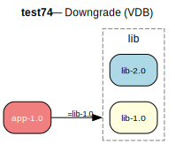

# test74 — Installed newer, constraint forces older (VDB)

**Category:** Downgrade

This test case checks the prover's downgrade path. When lib-2.0 is installed but
app-1.0 requires exactly lib-1.0 (via the = operator), the prover should detect
that a downgrade is needed. The same-slot installed version is newer than the
required version.

**Expected:** The prover should select lib-1.0 as a downgrade replacing the installed lib-2.0.
The plan should show a downgrade action for lib.



<details>
<summary><b>emerge</b></summary>

```
These are the packages that would be merged, in order:

Calculating dependencies  ... done!
Dependency resolution took 0.77 s (backtrack: 0/20).

[ebuild  N     ] test74/lib-1.0::overlay  0 KiB
[ebuild  N     ] test74/app-1.0::overlay  0 KiB

Total: 2 packages (2 new), Size of downloads: 0 KiB
```

</details>

<details>
<summary><b>portage-ng</b></summary>

```
>>> Emerging : overlay://test74/app-1.0:run?{[]}

These are the packages that would be merged, in order:

Calculating dependencies... done!

 └─step  1─┤ download  overlay://test74/lib-1.0
             │ download  overlay://test74/app-1.0

 └─step  2─┤ install   overlay://test74/lib-1.0

 └─step  3─┤ install   overlay://test74/app-1.0

 └─step  4─┤ run     overlay://test74/app-1.0

Total: 5 actions (2 downloads, 2 installs, 1 run), grouped into 4 steps.
       0.00 Kb to be downloaded.
```

</details>