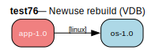

# test76 — Installed with wrong USE, rebuild needed (VDB)

**Category:** Newuse

This test case checks the prover's newuse rebuild behavior. The installed os-1.0
was built without the 'linux' USE flag, but app-1.0 requires os[linux]. The prover
should detect that the installed version does not satisfy the incoming
build_with_use requirement and trigger a rebuild.

**Expected:** The prover should detect that os-1.0 needs to be rebuilt with USE="linux" enabled.
The plan should include a rebuild action for os-1.0.



<details>
<summary><b>emerge -vp</b></summary>

```
These are the packages that would be merged, in order:

Calculating dependencies  
!!! 'test76/app' has a category that is not listed in /etc/portage/categories
... done!
Dependency resolution took 0.49 s (backtrack: 0/20).


emerge: there are no ebuilds to satisfy "test76/app".

emerge: searching for similar names...
emerge: Maybe you meant any of these: test60/app, test57/app, test56/app?
```

</details>

<details>
<summary><b>portage-ng</b></summary>

```
warning Package not found: test76/app

--- claude-sonnet-4-5 ------------------------------------------------------------------------------------------------------------------------------------------
The package `test76/app` appears to be a **non-existent test package**. 

This looks like:
1. A synthetic test case for portage-ng development/testing
2. An incorrectly formatted package atom
3. Or a typo where `test76` is not a valid Gentoo category

**Valid Gentoo categories** don't include `test76`. Standard categories include things like `app-admin`, `dev-libs`, `sys-apps`, etc.

**To resolve:**
- If this is a test: The package simply doesn't exist in the Portage tree
- If looking for a real package: Check the correct category (e.g., `app-misc/app`, `app-admin/app`)
- Verify the package name is correct using `eix` or `emerge --search`

The failure is expected since `test76/app` is not a valid Gentoo package atom in the standard Portage tree.

----------------------------------------------------------------------------------------------------------------------------------------------------------------

```

</details>