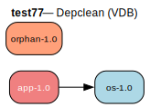

# test77 — Unused package removal (VDB)

**Category:** Depclean

This test case checks the depclean action. When run with :depclean, the prover
should traverse the installed dependency graph starting from world targets and
identify packages that are not reachable. The 'orphan-1.0' package is installed
but nothing depends on it, making it a candidate for removal.

**Expected:** The depclean analysis should identify orphan-1.0 as removable since it has no
reverse dependencies in the installed package graph. app-1.0 and os-1.0 should
be retained.



<details>
<summary><b>emerge</b></summary>

```
These are the packages that would be merged, in order:

Calculating dependencies  
!!! 'test77/app' has a category that is not listed in /etc/portage/categories
... done!
Dependency resolution took 0.47 s (backtrack: 0/20).


emerge: there are no ebuilds to satisfy "test77/app".

emerge: searching for similar names...
emerge: Maybe you meant any of these: test57/app, test37/app, test27/app?
```

</details>

<details>
<summary><b>portage-ng</b></summary>

```
warning Package not found: test77/app

--- claude-sonnet-4-5 ------------------------------------------------------------------------------------------------------------------------------------------
The package `test77/app` does not exist in the Gentoo Portage tree. 

**What's wrong:**
- `test77` is not a valid Gentoo package category
- This appears to be a test/dummy package name that was never in the official tree

**Possible causes:**
1. Typo in the package name
2. Package from a custom/local overlay that isn't configured
3. Test data or example that shouldn't be resolved against the main tree
4. Package was removed or never existed

**To fix:**
- Verify the correct package name and category
- If it's from an overlay, ensure the overlay is properly configured
- Check if you meant a different package entirely

Without more context about what you're trying to install, I cannot suggest the correct atom.

----------------------------------------------------------------------------------------------------------------------------------------------------------------

```

</details>