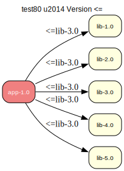

# test80 — Operator <= (less-or-equal)

**Category:** Version

This test case checks the prover's handling of the <= (less-or-equal) version
operator. The 'app-1.0' package requires lib version 3.0 or lower. Versions 4.0
and 5.0 should be excluded; versions 1.0, 2.0, and 3.0 are valid candidates.

**Expected:** The prover should select the latest valid version, lib-3.0, to satisfy the
dependency. Versions 4.0 and 5.0 should not be considered valid candidates.



<details>
<summary><b>emerge -vp</b></summary>

```
These are the packages that would be merged, in order:

Calculating dependencies  
!!! 'test80/app' has a category that is not listed in /etc/portage/categories
... done!
Dependency resolution took 0.50 s (backtrack: 0/20).


emerge: there are no ebuilds to satisfy "test80/app".

emerge: searching for similar names...
emerge: Maybe you meant any of these: test60/app, test58/app, test50/app?
```

</details>

<details>
<summary><b>portage-ng</b></summary>

```
warning Package not found: test80/app

--- claude-sonnet-4-5 ------------------------------------------------------------------------------------------------------------------------------------------
The package `test80/app` doesn't exist in the Gentoo Portage tree. 

This looks like:
1. **A test/dummy package name** - "test80" is not a valid Gentoo category
2. **A typo or placeholder** - possibly meant for testing portage-ng itself
3. **A local overlay package** that's missing from your system

**Valid Gentoo categories** don't include "test80". If you're trying to test portage-ng, you should use a real package like `app-editors/vim` or `sys-apps/portage`.

If this is supposed to be a real package, please provide more context about what you're actually trying to install.

----------------------------------------------------------------------------------------------------------------------------------------------------------------

```

</details>