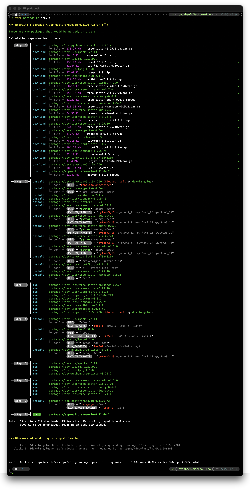
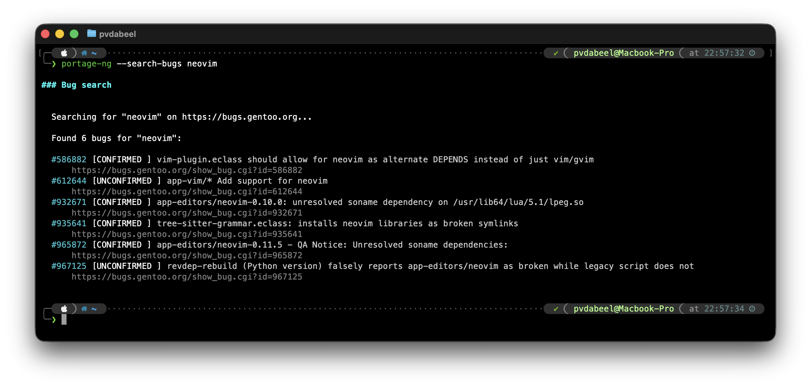
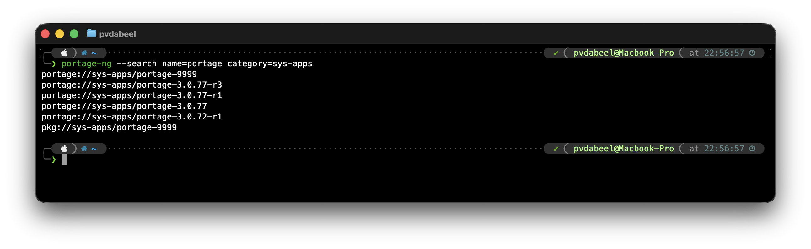
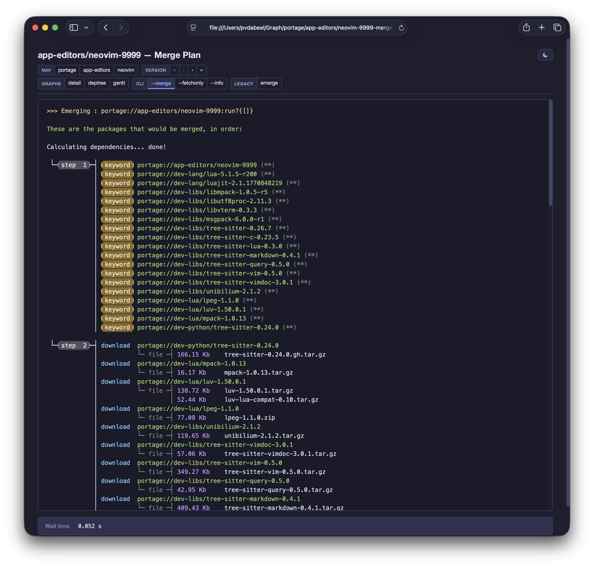
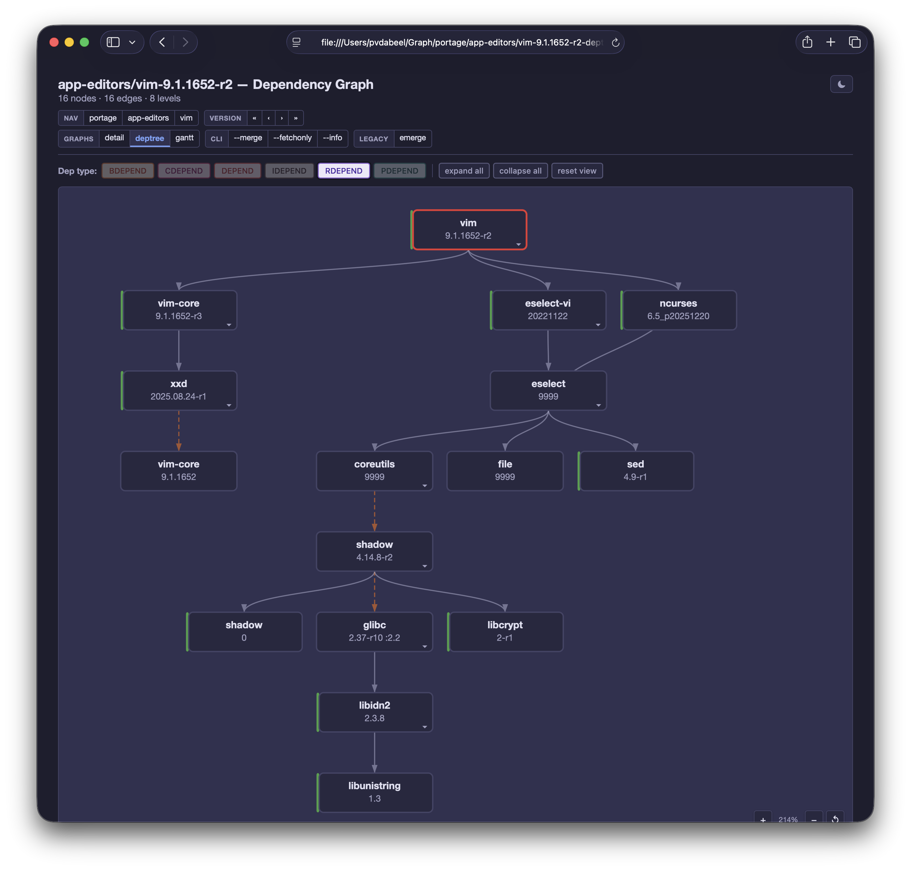
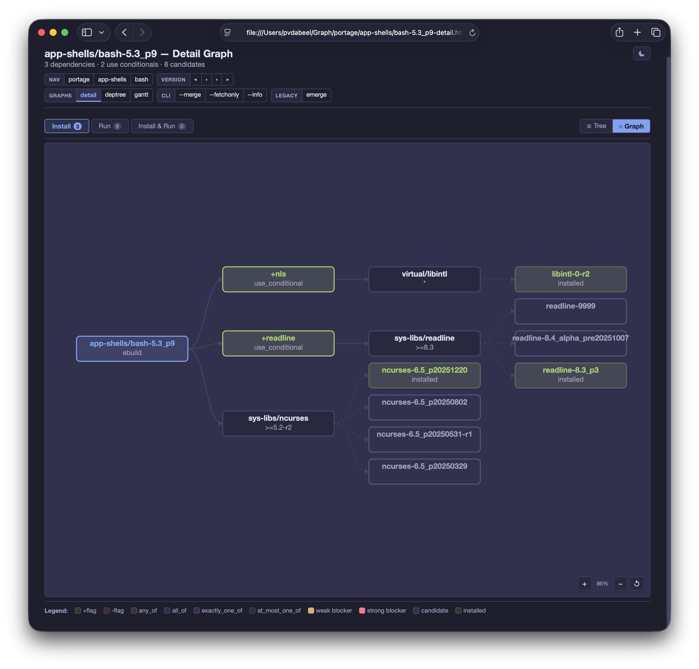
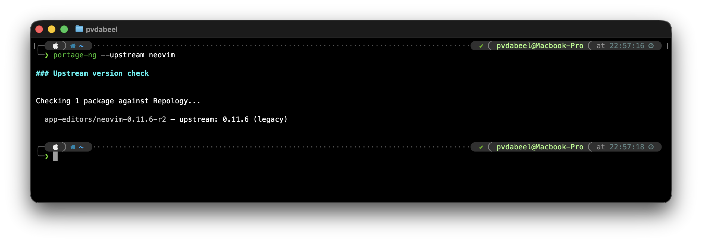

# ::- portage-ng

A declarative reasoning engine for software configuration, applied to Gentoo Linux.

## What is portage-ng?

portage-ng uses **inductive proof search** to reason about package dependencies.
Every build plan it produces is a formal proof -- not a heuristic guess. It fully
implements **PMS 9 / EAPI 9** (USE-conditional dependencies, slot operators,
sub-slots, blockers, PDEPEND) and is written in SWI-Prolog. It reads the same
Portage tree, VDB, profiles, and `/etc/portage` configuration as traditional
Portage.

## The reasoning approach

**Inductive proof search.** Given a target package, the prover constructs a
proof and a model that together guarantee every dependency is satisfied. Unlike
Portage, portage-ng always produces a plan -- even for targets where Portage
gives up. When strict proving fails, it makes explicit assumptions (USE flag
changes, keyword acceptance, unmasking) and produces a proven plan under
assumptions, with actionable suggestions for the user to approve, already
applied within the build plan.

**Prescient proving.** When a literal is re-encountered with a changed context
(e.g. new USE requirements from a different dependency path), the prover merges
contexts via feature-unification and re-expands only the difference. This
shortens proofs because knowledge about requirements imposed later is
incorporated into earlier decisions -- the prover is prescient about constraints
that would otherwise require backtracking.

**Multiple stable models.** Building upon the backtracking functionality built
in to Prolog, the prover can produce different solutions (stable models) of the
USE flag configuration space, taking into account constraints such as
`build_with_use` and `required_use` as defined in PMS. Different valid
configurations of the same target can be explored and compared.

> **Example:** A `REQUIRED_USE="|| ( linux macos )"` constraint yields two
> stable models:
>
> ```
> Model A:  USE="linux -macos"     Model B:  USE="-linux macos"
> ```

**Constraint learning.** Version domains are narrowed incrementally across
reprove retries (inspired by Zeller's feature logic). Learned constraints
persist -- no full restart of the prover needed. Unlike traditional
backtracking, the reprove mechanism is iterative refinement: when a domain
conflict is detected, the prover records the conflict as a no-good, learns a
narrowed domain, and restarts the complete proof with this additional knowledge.
This is closer to CDCL-style learning than to Prolog backtracking.

**Progressive relaxation.** The pipeline tries strict mode first, then
progressively relaxes (keyword acceptance, blockers, unmask). Each tier is a
weaker proof that still carries formal guarantees. Every assumption is tracked
and reported.

**Wave planning with optimal parallelism.** The proven dependency graph is
scheduled using Kahn's algorithm (acyclic portion) with parallelism calculated
from the start -- the build plan shows which packages can be built concurrently.
Cyclic remainders are handled via Kosaraju Strongly Connected Component (SCC)
decomposition, matching PMS semantics.

## What this enables

**Always produces a plan.** portage-ng succeeds 100% of the time, including
targets where Portage fails. Assumptions are explicit and actionable.

**Measured correctness.** Correctness is measured against Portage for every
ebuild in the tree, using an identical Portage tree, VDB, and `/etc/portage`
configuration. Because portage-ng produces valid plans for targets where Portage
fails to find a solution, it can be considered strictly more correct. Detailed
comparison reports are available under [`Reports/`](Reports/).

**Performance.** The entire Portage tree is loaded in-memory as Prolog facts
with sub-second queries. A full prove of all 32,000 ebuilds in the tree takes
less than a minute on a recent multi-core machine.<sup>1</sup> Parallel proving
with `--jobs` enables plan "variants" showing build plan differences when
enabling or disabling USE flags.

**Actionable plans.** portage-ng builds plans incorporating suggested actions
like `package.accept_keywords`, `package.unmask`, or `package.use` --
suggestions are already applied within the plan for the user to review.

**Automatic bug report drafts.** When the prover detects unsatisfiable
dependencies, it generates structured Gentoo Bugzilla bug report drafts with
a summary, affected package, unsatisfiable constraints, observed state, and a
suggested fix.

**Optimal parallelism.** Build plans include concurrent execution groups from
the start. Scheduling operates at the action level -- downloads, installs, and
runs are independent actions, so packages can install while others are still
downloading.

**Best-of-breed CLI.** Compatible flags from emerge, paludis, and pkgcore.

**Portage-compatible execution.** portage-ng focuses on reasoning -- proving,
planning, and scheduling. Actual package building is delegated to Portage's own
ebuild infrastructure, so the full ecosystem of ebuilds, eclasses, and phase
functions works unchanged. portage-ng does ship its own metadata cache
generator (`--regen`), which replaces `egencache`: it regenerates the md5-cache
incrementally (only changed or new ebuilds) and in parallel, making repository
updates significantly faster.

<sup>1</sup> 2019 Mac Pro, 28-core.

## Architecture

```
reader/parser ──> prover ──> planner ──> scheduler ──> printer ──> builder
                  └──────── pipeline ────────┘
```


| Stage               | Description                                                                                                |
| ------------------- | ---------------------------------------------------------------------------------------------------------- |
| **Reader / Parser** | Loads md5-cache into Prolog facts via a DCG grammar (PMS 9 / EAPI 9)                                       |
| **Prover**          | Inductive proof search producing Proof, Model, Constraints, and Triggers                                   |
| **Planner**         | Wave scheduling (Kahn) with parallelism; returns an acyclic plan and a remainder                           |
| **Scheduler**       | Strongly Connected Component (SCC) decomposition (Kosaraju) and merge-set scheduling for cyclic remainders |
| **Printer**         | Renders the plan, assumptions, suggestions, and optional LLM explanation                                   |
| **Builder**         | Executes the plan by delegating ebuild phases to Portage's build infrastructure                            |


The prover, planner, and scheduler are **domain-agnostic** -- they operate on
abstract literals, rules, and dependency graphs with no knowledge of Gentoo
specifics. All domain logic (ebuild parsing, USE flag interpretation, slot
operators, blockers) lives in a separate rules layer. This clean separation
means the same reasoning engine can be applied to different domains by
supplying a different set of rules.

See the full architecture diagram: [`Documentation/Diagrams/architecture.svg`](Documentation/Diagrams/architecture.svg).

## How it compares


|                       | Portage                                       | Paludis                                           | pkgcore                          | portage-ng                                                                  |
| --------------------- | --------------------------------------------- | ------------------------------------------------- | -------------------------------- | --------------------------------------------------------------------------- |
| **Language**          | Python                                        | C++                                               | Python                           | SWI-Prolog                                                                  |
| **Resolver model**    | Greedy graph builder + backtracking           | Constraint accumulator + exception-driven restart | Same imperative model as Portage | Single-pass inductive proof search                                          |
| **Conflict handling** | Up to 20 retries; masks accumulate negatively | Up to 9,000 restarts; fresh resolver each time    | Same as Portage                  | Iterative refinement with learned domains (positive) and rejects (negative) |
| **Completeness**      | Sometimes fails to produce a plan             | May exhaust restarts                              | Same as Portage                  | Always produces a plan (with explicit assumptions when needed)              |
| **Formal guarantees** | None                                          | None                                              | None                             | Every plan is a proof                                                       |


For a deeper comparison of the reasoning models, see
[`Documentation/Handbook/21-doc-resolver-comparison.md`](Documentation/Handbook/21-doc-resolver-comparison.md).

## Unique capabilities

- **Semantic search** -- `--search` accepts natural-language queries (e.g. *text editor with syntax highlighting*) using vector embeddings via Ollama, accelerated on Apple Silicon's GPU/Neural Engine; `--similar` finds related packages from the embedding index
- **Build time estimation** -- `--estimate` predicts build duration per package from VDB sizes and historical emerge.log data
- **Multiple modes** -- standalone, IPC daemon (Unix socket), client/server (TLS), distributed workers
- **mDNS/Bonjour discovery** -- automatic cluster formation for distributed proving
- **LLM integration** -- `--explain` / `--llm` for AI-assisted plan explanation
- **Interactive Prolog shell** -- `--shell` for live querying of the knowledge base
- **Graph generation** -- interactive SVG dependency graphs via Graphviz
- **Contextual logic programming** -- an object-oriented paradigm for Prolog with contexts, classes, and inheritance ([documentation](Documentation/Handbook/19-doc-contextual-logic-programming.md))

## Quick start

**Prerequisites:** SWI-Prolog >= 9.3, a Gentoo Portage tree (or md5-cache snapshot).

```bash
# Build and install
make build && make install

# Pretend (dry-run) a build plan
portage-ng --mode standalone --pretend app-editors/neovim

# Interactive Prolog shell
portage-ng --mode standalone --shell

# Sync the Portage tree
portage-ng --mode standalone --sync
```

### Development

When running from a source checkout, use the dev wrapper instead of the
installed binary:

```bash
./Source/Application/Wrapper/portage-ng-dev --mode standalone --pretend sys-apps/portage
```

### CI mode

Use `--ci` for non-interactive automation. Exit codes indicate plan quality:

| Code | Meaning |
|------|---------|
| 0 | Plan completed with no assumptions |
| 1 | Plan completed with prover cycle-break assumptions only |
| 2 | Plan completed with domain assumptions (e.g. missing deps) |

### Tests

```bash
make test            # PLUnit tests
make test-overlay    # Overlay regression tests
```

For the full command reference, see the
[`portage-ng(1)` manpage](Documentation/Manpage/portage-ng.1.md).

## Screenshots

### Build plan



### Bug search



### Package search



### Merge plan



### Gantt chart


### Dependency graph



### Detail view



### Upstream version check



## Handbook

The portage-ng handbook is available as a [PDF](Documentation/Handbook/portage-ng-handbook.pdf)
and as individual Markdown chapters:

**Part I — Getting Started**

1. [Introduction](Documentation/Handbook/01-doc-introduction.md)
2. [Installation and Quick Start](Documentation/Handbook/02-doc-installation.md)
3. [Configuration](Documentation/Handbook/03-doc-gentoo.md)

**Part II — Architecture and Internals**

4. [Architecture Overview](Documentation/Handbook/04-doc-architecture.md)
5. [Proof Literals](Documentation/Handbook/05-doc-proof-literals.md)
6. [Knowledge Base and Cache](Documentation/Handbook/06-doc-knowledgebase.md)
7. [The EAPI Grammar](Documentation/Handbook/07-doc-eapi-grammar.md)
8. [The Prover](Documentation/Handbook/08-doc-prover.md)
9. [Assumptions and Constraint Learning](Documentation/Handbook/09-doc-prover-assumptions.md)
10. [Version Domains](Documentation/Handbook/10-doc-version-domains.md)
11. [Rules and Domain Logic](Documentation/Handbook/11-doc-rules.md)
12. [Planning and Scheduling](Documentation/Handbook/12-doc-planning.md)
13. [Output and Visualization](Documentation/Handbook/13-doc-building.md)

**Part III — Features**

14. [Command-Line Interface](Documentation/Handbook/14-doc-cli.md)
15. [Building and Execution](Documentation/Handbook/15-doc-output.md)
16. [Semantic Search and LLM Integration](Documentation/Handbook/16-doc-explainer.md)
17. [Distributed Proving](Documentation/Handbook/17-doc-tls-certificates.md)
18. [Upstream and Bug Tracking](Documentation/Handbook/18-doc-upstream-bugs.md)

**Part IV — Foundations**

19. [Contextual Logic Programming](Documentation/Handbook/19-doc-contextual-logic-programming.md)
20. [Context Terms and Feature Unification](Documentation/Handbook/20-doc-context-terms.md)
21. [Resolver Comparison](Documentation/Handbook/21-doc-resolver-comparison.md)
22. [Dependency Ordering](Documentation/Handbook/22-doc-dependency-ordering.md)

**Part V — Development**

23. [Testing and Regression](Documentation/Handbook/23-doc-testing.md)
24. [Performance and Profiling](Documentation/Handbook/24-doc-performance.md)
25. [Contributing](Documentation/Handbook/25-doc-contributing.md)
26. [Closing Thoughts](Documentation/Handbook/26-doc-closing.md)

## License

BSD 2-Clause. See [`LICENSE`](LICENSE).
